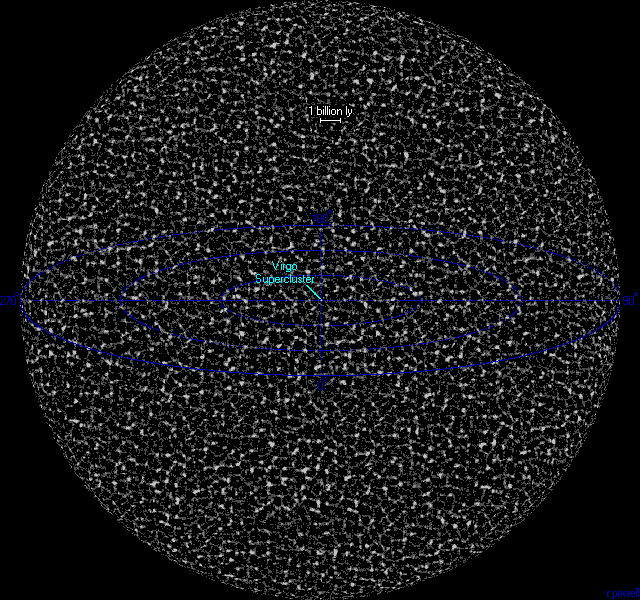
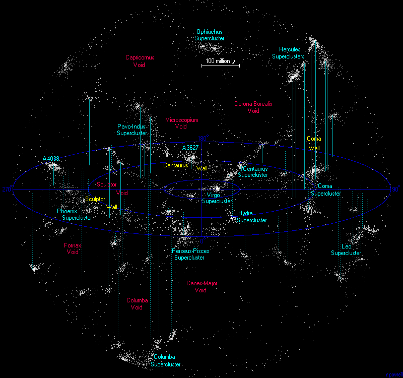

## 引言

### 天文学分支

#### 天体物理

- **理论天体物理**：以广义相对论、等离子体物理、磁流体力学、气体动力学为基础研究恒星结构与演化、 宇宙演化等，按研究对象分为太阳物理学、恒星物理学、恒星天文学、星系天文学、天体演化学、宇宙学等。重在**理论研究**，是**观测-理论-观测**的研究方式（由观测数据构建模型再通过观测验证，是**还原论派**）
- **实测天体物理**：利用望远镜、辐射探测器、高能粒子探测器等接受天体的电磁辐射和微粒流辐射进行多波段的测光、成像和偏振观测研究，利用提纳提光谱仪进行天体的光谱分析，了解天体的化学组成和化学丰富度及视向速度、自转速度、活动性等。实测天体物理已经跨入了**全波段**（ $\gamma$ 射线、$X$ 射线、紫外辐射、光学、红外到射电波段）和**全方位**（地面、空间）观测的时代。重在**观测与数据分析**

#### 天体测量学

精确测定天体的位置和运动以及地球的自转参数和坐标，研究地球动力学、自转和地壳运动也属于在内。重在**如何测量和应用**

#### 天体力学

研究天体运动的动力学问题，包括天体的力学运动和形状，采用定性理论、摄动理论和数值方法确定天体的运动和轨道变化，计算彗星、小行星的轨道、预报日月食、预报太阳系内天体的碰撞事件、对人造天体进行轨道设计和监测，恒星动力学、星系动力学也在其内。重在**由力学构建轨道模型和数值预测**

#### 天文技术与方法

具体研究天文相关的技术，有**望远镜**制造与维护相关的技术，如光谱、射电、机械、通信、自动控制，或是**数据**相关的，如数据处理与分析（天体物理内也会研究）、高性能计算、数据挖掘、虚拟天文台等

### 天文学历史

20世纪天文学最重要的成果：

- 恒星结构与演化理论
- 宇宙起源理论

### 宇宙层次

宇宙大尺度结构（Large Scale Structure）：

$$
\text{The Universe}\begin{cases}
  \text{The Visible/Observable Universe} \\
  \hspace{2em}称为\text{Foam-like Structure}泡沫状结构 \\
  \hspace{2em}或称\text{Cosmic Web}宇宙网结构 \\
  \hspace{2em}再向上就无连续结构 \\
  \hspace{2em}称为\text{ the End of Greatness }(浩瀚界限) \\
  \hspace{2em}\begin{cases}
    \text{Galaxy Filament}星系丝 \\
    \hspace{2em}\text{Great Wall}长城：巨大的星系丝 \\
    \text{Galaxy Sheet}星系片 \\
    \text{Galaxy Void}星系空洞 \\
    \text{Galaxy Node}星系节点 \\
    \text{Supercluster Complex}超星系团复合体 \\
  \end{cases} \\
  \hspace{4em}\text{--- }由以下的不同分布构成： \\
  \hspace{6em}\text{Supercluster}超星系团 \\
  \hspace{6em}\supset\text{Galaxy Cluster}星系团 \\
  \hspace{6em}\supset\text{Galaxy Group}星系群 \\
  \hspace{6em}\supset\text{Galaxy}星系 \\
  不可观测宇宙
\end{cases}
$$

> The word *observable* in this sense does not refer to the capability of modern technology to detect light or other information from an object, or whether there is anything to be detected. It refers to the physical limit created by the speed of light itself. No signal can travel faster than light, hence there is a maximum distance (according to the Cosmic Microwave Background Radiation (CMBR)), called *the particle horizon*, beyond which nothing can be detected, as the signals could not have reached us yet.
> Sometimes astrophysicists distinguish between the observable universe and the *visible* universe. The former includes signals since the end of the inflationary epoch, while the latter includes only signals emitted since recombination. (From <https://en.wikipedia.org/wiki/Observable_universe>)

(From <http://www.atlasoftheuniverse.com/index.html>)

星系内有恒星、变星、致密天体（中子星、白矮星、黑洞）、星云、星际物质、暗物质
再向下为恒星系（或其它致密天体为中心等构成的系统），内有行星、小行星、彗星、流星体、星际物质、暗物质，行星也会有围绕的卫星，甚至较大的卫星也会有围绕的卫星

### 天体(Celestial objects)

- **stars** (恒星)，本是古人对天空中发光体的称呼，后来发现 They are celestial bodies similar to our **Sun**. 现在知道这些 Stars 是通过 fusion action 产生能量并 convert hydrogen to helium and other heavier elements.
- **planets** (行星)，Stars 通常较远，即使 move at enormous speed，在天空中还是 not seem to change even in thousands of years，而除了 Sun 和 Moon，还有 other objects that move respect with stars，以现在的规定，Solar System 内有八大行星，包括 **Earth**.
- Most planets 有自己的 **satellites** and **moons** (卫星)，此处 moons 不止指 **Moon** (月球)
- 绕着太阳的除了行星和各自的卫星之外，还有 **dwarf planets** (矮行星), **asteroids** (小行星), **comets** (彗星) and **meteoroids** (流星体)
- Based on stars' properties, stars can be divided into different categories.
  - A great majority of them is **main-sequence stars** (主序星), the most common type of stars, like our Sun.
  - Some are much bigger, **giants** (巨行星) and **supergiants** (超巨星)
  - Some are much smaller, **white dwarfs** (白矮星).

  以上通常和 different evolutionary stages in the lives of stars 有关
- 最近发现的 **compact stars** (致密星)，包括 **neutron stars** (中子星) and **black holes** (黑洞)，致密形式使其具有非常强的引力场，在描述其物质和周围空间时必须使用广义相对论

### 天文研究对象

- **地球**，几乎所有观测都要通过大气层和磁层，研究地球有助于帮助研究 interplanetary space，也是作为**研究行星**的一种重要比较对象
- **月球**
- **太阳系**内的行星、卫星、星际物质
- 专门研究**太阳**、**恒星**、**星团**、**银河系**、**星系**
- **宇宙**，之前是神学和哲学的研究对象，在20世纪后作为一个在理论物理中的研究对象
- **Spherical astronomy** (球面天文学)，主要研究 the coordinate systems of the celestial sphere (天球坐标系) and apparent position (天体表观位置/天体视运动) and motions of celestial objects. 是一个古老的天文研究方向.
- **celestial mechanics** (天体力学)
- **astrophysics** (天体物理学)，利用 spectra (光谱) 发现天体的物理性质，特别用于太阳、恒星、interstellar matter (星际物质) 的研究
- 天文光学研究也可以通过光的波长分段分成多种分支，如 **optical astronomy** (光学天文学), **infrared astronomy** (红外天文学), **ultraviolet astronomy** (紫外天文学), **radio astronomy** (射电/无线电天文学), **X-ray astronomy** (X射线天文学), **gamma-ray astronomy** (伽马射线天文学)
- 天文也会研究来自**宇宙的粒子**，如 **cosmic rays** (宇宙线/宇宙射线) 和 **neutrinos** (中微子)，最近也有关于 **gravitational wave** (引力波)
- 与天文学相近的有 **space research** (空间研究)，但后者更偏向于研究宇宙中的所有 matters，天文学只是其中的一小部分而已，主要是商业服务目的，如通信、气象观测、导航、遥感和环境控制，以及军事侦察. **Space astronomy** (空间天文学) 是注重于卫星和空间探测器的观察研究的天文学邻域

### 笔记参考及结构

本笔记目前（26/09/2024）参考了三个来源：

- 基础天文学（刘学富，2004）
- Fundamental Astronomy 6th (Hannu Karttunen, 2016)
- 普通天文学（李向东主讲，<https://www.icourse163.org/course/NJU-1001752349?from=searchPage&outVendor=zw_mooc_pcssjg>，<https://www.bilibili.com/video/BV1yb411w7aH/?p=3&spm_id_from=333.880.my_history.page.click>）
- Astronomy Today 8th 今日天文三部曲（恒星、太阳系与地外生命、星系和宇宙）（Eric Chaisson, Steve McMillan, 2016）

#### 基础天文学（刘学富，2004）

1. 第一篇简略讲了**球面天文学**中的**天体视运动**、**天球坐标系**和**时间系统**，以及观测仪器——**天文望远镜**
2. 第二篇讲述了**太阳系**，包括了**地内行星**、**地月系**、**地外行星**、**小天体**、**日月食**
3. 第三篇讲述了**太阳的构造**、**特征**和**恒星观测**，并介绍了**恒星的形成和演化**，其中包括了**致密星**、**超新星**、**变星**，并介绍了**双星系统**
4. 第四篇介绍了**银河系**和**河外星系**，包含了**星系**的分类、特征和形成演化，并介绍了**特别的活动星系**，随后介绍了**星际介质**，向上介绍了**星系群**、**星系团**和**超星系团**
5. 第五篇主讲**宇宙学**

#### Fundamental Astronomy 6th (Hannu Karttunen, 2016)

1. Chapter 2: **Spherical Astronomy** 包含**球面几何**、天文不同的**坐标系统**、**星空地图和星座**、**天文时间系统**
2. Chapter 3-5: **观测仪器**、**光度计的概念和强度**、**辐射机制**（关于**光谱**），这后部分可以归结成**光学观测**的理论依据（实测天体物理的基础）
3. Chapter 6: **Celestial Mechanics 天体力学**，包含运动方程、轨道方程、开普勒方程、确定轨道等
4. Chapter 7-8: **太阳系**及**太阳系内天体**，先是介绍了太阳系内可研究的事物，包括地月系统、日月食、大气层和磁层等，再具体介绍八大行星、小行星、彗星等天体
5. Chapter 9: **Stellar Spectra 恒星光谱**，这章重点讲了如何**观测恒星**中的利用光谱的方式，并介绍了几种特殊光谱，是实测天体物理的基础
6. Chapter 10: **Stellar Binaries 双星系统**，简要介绍了双星系统的理论、天文、光谱、光度
7. Chapter 11-12: **恒星的结构与演化**，是理论天体物理的基础
8. Chapter 13-17: 具体介绍了**太阳**、**变星**、**致密星**、**星际物质**、**星团**，属于**恒星世界**的层次，介绍各种恒星的特征
9. Chapter 18-19: **银河系**、**星系**，属于**星系世界**的层次，
10. Chapter 20: **Cosmology 宇宙学**，是理论天体物理的研究对象，重在研究宇宙的**起源**、**演化**、**结构**与**特性**
11. Chapter 21: **Astrobiology 天体/太空生物学**，科普地外生物存在的可能性等
12. Chapter 22: **Exoplanets 系外行星**，研究太阳系外的行星

#### 普通天文学（李向东主讲）

该课程主要是偏**天体物理**方向的

1. 第一、二单元非常简要介绍了**天体测量的方法**，再根据**恒星光谱和光度**测量分析**恒星的距离**、**温度**、**光度**、**大小**、**质量**，并介绍了**赫罗图**
2. 第三、四单元以**太阳**为例介绍了**恒星的结构与演化**，还涉及**太阳的表面活动**和**超新星**
3. 第五单元再具体讲述了**致密星（白矮星、中子星、黑洞）**和**新星**、**超新星**
4. 第六、七单元具体介绍了**银河系**，并由此再次描述了**恒星的形成**，同时引出了**河外星系**和**星系**，以及**星系的测量（距离、质量）**，在**星系层次**下介绍了**星际空间**和**星际介质**
5. 第八单元将星系向上扩展，给出**星系的分布**、**形成演化**、**相互作用**，是**大尺度结构模型**
6. 第九单元介绍了**活动星系**、**类星体**、**星系的特性**以及**引力透镜现象**
7. 第十、十一单元以**宇宙学**的邻域，讲述了**视超光速运动**、**奥伯斯佯谬**、**大爆炸宇宙学**、**暗能量**、**微波背景辐射**、**宇宙的演化**、**暴涨宇宙**

#### 今日天文

- **恒星**（部分天体测量，实测天体物理方向，部分理论天体物理）
  1. **球面天文学**的位置、视运动、星座，非常浅显
  2. **辐射机制**
  3. **光谱**
  4. **望远镜**
  5. **太阳的结构、表明活动与特性**
  6. **恒星的测量（巨星、矮星、主序星）**
  7. **星际介质**
  8. **恒星的形成、演化、爆发（新星、变星、超新星）**
  9. **致密星（中子星、脉冲星、中子双星、伽马射线暴、黑洞）**
- **太阳系和地外生命**（天体测量、天体力学方向，部分天体物理）
  1. **球面天文学**的位置、视运动、几何测量，非常浅显
  2. **天文历史**、**牛顿、开普勒定律**
  3. **太阳系内行星系统和星际物质**
  4. 随后几章分别介绍了**月球和八大行星**
  5. 太阳系内的**小天体**，如**小行星**、**彗星**、**流星体**、**海王星外带**
  6. **系外行星**
  7. **宇宙学和生命**（非常少的宇宙学，仅仅是**宇宙的演化**）
- **星系和宇宙**（理论天体物理方向）
  1. **银河系**
  2. **星系**和**活动星系**
  3. **星系形成**与**暗物质**、**大尺度结构**
  4. **宇宙学**（包括**宇宙的结构**，**暗物质**，**微波背景**）
  5. **宇宙的形成和演化**
  6. **宇宙生命**

#### 本笔记章节分布

**括号中 'L' 表示刘学富的普通天文学，'K' 表示 Hannu Karttunen 的 Fundamental Astronomy，'LX' 表示李向东的普通天文学，'C123' 表示 Eric Chaisson 的今日天文：恒星、太阳系和地外生命、星系和宇宙*

1. **Spherical Astronomy 球面天文学**，与刘和Karttunen, Chaisson的编排类似. 这属于**天体测量的基础**，且比较独立，包含**球面几何**、**天体视运动**、**星空地图和星座**、**天文坐标系**、**天文时间系统**等（L-CH1, K-CH2, C1-CH1, C2-CH1）
2. **Celestial Mechanics 天体力学基础**，显然这是**天体力学的基础**，主要研究的是天体的运动，大多是研究太阳系内行星和卫星，也有检测人造卫星和探测器的轨道.（K-CH3, C2-CH2）
3. **Celestial Observation 天体观测基础**，这是**天体物理的基础**，由于恒星和星系的观测会涉及到各自的结构与物理性质，具体的测量和分析会对应章节，这里只包含**辐射机制**、**光谱**、**光度计**、**望远镜**，其中望远镜部分先简要介绍原理和结构.（L-CH3, K-CH3-5, LX-CH1, C1-CH2-4）
4. **Stars 恒星世界**，由于恒星的观测相对于行星和小天体都容易，因其自身发光性等，又是星系的基础，所以先从恒星开始；太阳的具体结构等也在该章节，而八大行星等则放在太阳系章节. 该章节是**天体物理的主要研究方向**，包含**恒星测量**(K-CH5, LX-CH1-2, C1-CH6)、**双星系统**(K-CH10)、**恒星的结构与演化**(K-CH11-12, LX-CH3)、**太阳**(K-CH13, LX-CH4, C1-CH5)、**变星**(K-CH14, LX-CH5, C1-CH8)、**致密星**(K-CH15, LX-CH5, C1-CH9). 其中双星系统编排在前，介绍其光谱、光度观测，因为变星和致密星会有不同的双星系统. 星际介质放在星系层级，此章节只是介绍单独的天体个体的系统（L-CH3）
5. **Solar System 太阳系**，身处太阳系下，探索太阳系内的事物似乎变得更加容易和直观，该章节是**天体测量、天体力学的核心研究邻域**，包含**行星系统**、**地月系统**、**日月食**、**大气层和磁层**、**八大行星**、**矮行星**、**小行星**、**彗星**、**流星体**、**星际尘埃和其他粒子**等（L-CH2, K-CH7-8, C2-CH3-5）
6. **Galaxies 星系世界**，这是**天体物理的另一个研究邻域**，包含**银河系**(LX-CH6, C3-CH1)、**河外星系和星系**(LX-CH7, C3-CH2)、**星际介质**(K-CH16-17, KX-CH7, C1-CH7)、**活动星系与类星体**(LX-CH9, C3-CH2)、**星系的形成演化**(LX-CH8, C3-CH3)、**星系团与大尺度结构**(LX-CH8, C3-CH3). （L-CH4, K-CH18-19）
7. **Cosmology and exoplanet lives 宇宙学与地外生命**，该章节偏理论猜想，真实研究较少，包含**宇宙学**、**系外行星**、**宇宙生命**.（L-CH5, K-CH20-22, LX-CH10-11, C2-CH6-7, C3-CH4-6）

## Spherical Astronomy 球面天文学

### 球面几何

### 天体视运动

### 星空地图和星座

### 天文坐标系

### Astronomical Time Systems 天文时间系统

## Celestial Mechanics 天体力学基础

## Celestial Observation 天体观测基础

### Radiation Mechanisms 辐射机制

### Spectroscopy 光谱

### Photometry 光度计

### Astronomical Telescopes 望远镜

## Stars 恒星世界

### 恒星测量

### 双星系统

### 恒星的结构与演化

### 太阳

### 变星

### 致密星

## Solar System 太阳系

## Galaxies 星系世界

### 银河系

### 河外星系和星系

### 星系的形成演化

### 星系团与大尺度结构

## Cosmology and exoplanet lives 宇宙学与地外生命

### 宇宙学

### 系外行星

### 宇宙生命
