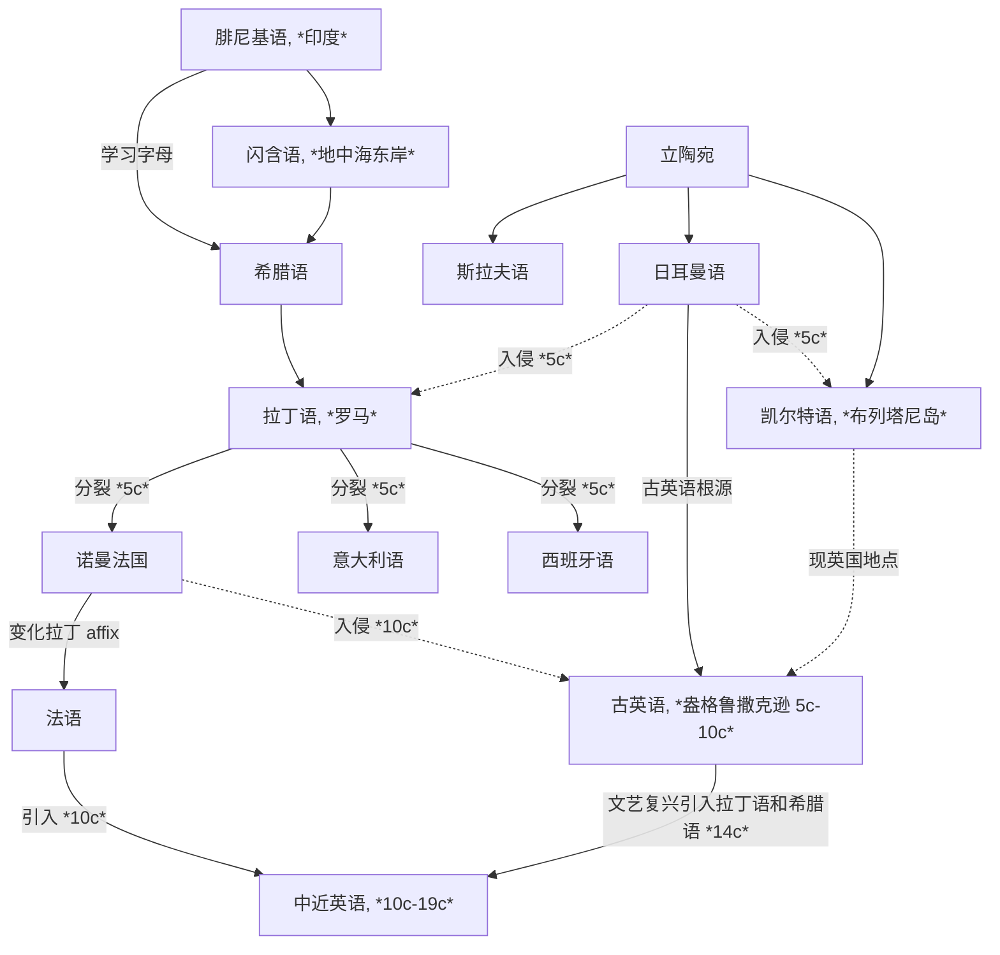

[toc]

## Basic Foundations

### Etymology of Words (Roots and Affixes)

**Indo-European languages (印欧语系)** 有两个起源地：**立陶宛地区**和**地中海东岸的闪含语系地区**——来源于 **Phoenician (腓尼基语)**

西北欧的地区大部分是来源于立陶宛语系，地区交流促成了主要的 **Germanic (日耳曼)**、**Celtic (凯尔特)**、**Slavic (斯拉夫)** 语系（B.C. 9c - A.D. 0c）；现代欧洲语言**文字**的 ancestor 是**腓尼基字母**，希腊人在腓尼基字母的基础上创造出希腊字母，形成了 **Greek (古希腊语)**，之后又被意大利地区古罗马和拉丁人学习形成了 **Latin (拉丁语)**；希腊语和拉丁语不注重语法和介词等，用**词根词缀**即可表示复杂的信息

罗马帝国扩张后，拉丁语逐渐取代古希腊语，欧洲西边大部分讲拉丁语，东边讲希腊语；英国虽处于西边，但并未全部被拉丁语辐射到，仍然是凯尔特人为主（A.D. 0c - 5c）

在罗马帝国末期，日耳曼人入侵凯尔特，凯尔特人被迫逃离，与现代英语几乎无关系，而英语则是属于**日耳曼语族**，与德国、荷兰有相同的起源. 此时被视为英语的起源，盎格鲁撒克逊的**古英语**. 之后英语又被讲另一种日耳曼语的维京人入侵，融合的英语形成了**比较完善的语法结构**，但**失去了日耳曼复合构词的变化**（也就是为什么同是日耳曼语族，英语中的复合构词要比德语和荷兰语少得多）（5c - 10c）；罗马分裂后，拉丁语衍生成多种语言，例如法国、西班牙、意大利等，但 French 追求自己的一套 affix 方法，所以现在的西语和意大利语相比于法语而言更贴近拉丁语. 这些语言被统称为 **Romance Language (罗曼语族/罗马语族/拉丁语族)**. 此时已经很少有地区会讲拉丁语了

中世纪（10c）和近代现代（14c -）时期，英国先后发生了法国入侵和文艺复兴. 法国（诺曼法）入侵带来了大量**法语词汇**（本质是来源于拉丁语，但词缀拓展与拉丁语略有不同），文艺复兴时期都认为**拉丁语是代表着学术文明和高等教育**，而**日耳曼语象征着野蛮和低劣**，所以有大量**学术名词**都是来源于**拉丁语**和**希腊语**，这导致了现代英语的大量词汇会与罗曼语族的语言（如法语、意大利语、西班牙语等）有更多相似之处

### Pronunciation

### Grammar

## Logs

### Listening & Speaking

### Vocabulary

#### 08/01/2025 {V}

**Word of the Day: [dissociate](http://localhost:5500/En/dict/dissociate.html)** | *verb* | dih-SOH-shee-ayt

To *dissociate* is to separate oneself from association or union with someone or something; in contexts relating to psychology, it has to do specifically with mentally detaching from one's physical or emotional experiences. In chemistry, *dissociate* means "to separate a chemical compound into its constituent parts especially through the application of heat or a solvent."

**Quiz:** Rearrange the letters to form a word that refers to "a deep fissure, as in a glacier or the earth": [SRAEEVSC](http://localhost:5500/En/dict/crevasse.html)

#### 08/03/2025 {V}

- jogging dose have [measurable](http://localhost:5500/En/dict/measurable.html#entry1.1-2) benefits on health
- expressions may influence emotions rather than just [the other way around](http://localhost:5500/En/dict/the_other_way_around.html#entry1.1-1)
- [gem](http://localhost:5500/En/dict/gem.html#entry1.1-1)
- writing precise [pseudocode](http://localhost:5500/En/dict/pseudocode.html#entry1.1-1) is a great first step

**Word of the Day: [egregious](http://localhost:5500/En/dict/egregious.html)** | *adjective* | ih-GREE-juss

*Egregious* is a formal word used to describe things that are [conspicuously](http://localhost:5500/En/dict/conspicuously.html#entry1.1-2) bad.

**Quiz:** Rearrange the letters to form a synonym of *egregious*: [RLINGAG](http://localhost:5500/En/dict/glaring.html#entry1.1-3)

#### 08/04/2025 {V}

- Since the [pattern](http://localhost:5500/En/dict/pattern.html#entry1.1-10) repeats, we can use a loop.

**Word of the Day: [tapestry](http://localhost:5500/En/dict/tapestry.html)** | *noun* | TAP-uh-stree

A *tapestry* is a heavy textile characterized by complicated pictorial designs and used for hangings, curtains, and [upholstery](http://localhost:5500/En/dict/upholstery.html#entry1.1-1). In [figurative](http://localhost:5500/En/dict/figurative.html#entry1.1-2b) use, *tapestry* may refer to anything made up of different things, people, colors, etc.

**Quiz:** Rearrange the letters to form a word "for a painting done on freshly [spread](http://localhost:5500/En/dict/spread.html#entry1.1-2c) moist [lime plaster](http://localhost:5500/En/dict/lime_plaster.html#entry1.1-1) with water-based [pigments](http://localhost:5500/En/dict/pigment.html#entry1.1-1)": [SFORCE](http://localhost:5500/En/dict/fresco.html)

#### 08/05/2025 {V}

- The company [provoked](http://localhost:5500/En/dict/provoke.html#entry1.1-1a) [justified](http://localhost:5500/En/dict/justified.html#entry1.1-1) outrage in Vermont last week when it announced it was [reneging](http://localhost:5500/En/dict/renege.html#entry1.1-1) on a [longstanding](http://localhost:5500/En/dict/longstanding.html#entry1.1-1) [commitment](http://localhost:5500/En/dict/commitment.html#entry1.1-1a) to [abide by](http://localhost:5500/En/dict/abide.html#abide_by.1-1) the state's strict nuclear regulations.
- [desperate](http://localhost:5500/En/dict/desperate.html#entry1.1-2b) effort to keep its nuclear power plant running
- The state required that any [extension](http://localhost:5500/En/dict/extension.html#entry1.1-5) of the plant's license be subject to the legislature's approval. Then, too, the company [went along](http://localhost:5500/En/dict/go_along.html#entry1.1-3).
- he never really intended to [live by](http://localhost:5500/En/dict/live_by.html#entry1.1-1) those commitments
- By [entering into](http://localhost:5500/En/dict/enter.html#enter_into.1-1) the 2002 agreement, Entergy intended to get permission to purchase a power plant.
- There are valid concerns about the [patchwork](http://localhost:5500/En/dict/patchwork.html#entry1.1-1) regulations that could [result](http://localhost:5500/En/dict/result.html#entry1.1-1a) if every state sets its own rules.
- But had Entergy [kept its word](http://localhost:5500/En/dict/keep_one's_word.html#entry1.1-1), that debate would be [beside the point](http://localhost:5500/En/dict/point.html#beside_the_point.1-1).
- What's cool is that a `while` loop doesn't need a number of repetitions specified [ahead of time](http://localhost:5500/En/dict/ahead_of_time.html#entry1.1-1).
- Logic makes it possible for a program to be [versatile](http://localhost:5500/En/dict/versatile.html#entry1.1-2) like this.

**Word of the Day: [contentious](http://localhost:5500/En/dict/contentious.html)** | *adjective* | kun-TEN-shuss

*Contentious* describes something that is likely to cause people to argue or disagree or that involves a lot of arguing. When used of a person, *contentious* describes someone likely or willing to argue.

**Quiz:** Rearrange the letters to form a word referring to "a habitually [irritable](http://localhost:5500/En/dict/irritable.html#entry1.1-1a) or complaining person": [OGHCUR](http://localhost:5500/En/dict/grouch.html#entry1.1-2)

#### 08/06/2025 {V}

- objective researchers use the scientific method to [carry out](http://localhost:5500/En/dict/carry_out.html#entry2.1-2) their work
- the [subsequent](http://localhost:5500/En/dict/subsequent.html#entry1.1-1) actions we take
- Opportunities for [misinterpretation](http://localhost:5500/En/dict/misinterpretation.html#entry1.1-1), error, and [self-deception](http://localhost:5500/En/dict/self-deception.html#entry1.1-1) abound.
- discovery claims should be thought of as [proto](http://localhost:5500/En/dict/proto-.html#entry1.1-1b)science
- It takes collective [scrutiny](http://localhost:5500/En/dict/scrutiny.html#entry1.1-1) and acceptance to transform a discovery claim into a mature discover. This is the [credibility](http://localhost:5500/En/dict/credibility.html#entry1.1-1) process.
- a discovery claim [works its way](http://localhost:5500/En/dict/work_one's_way.html#entry1.1-1) through the community
- [prevailing](http://localhost:5500/En/dict/prevail.html#entry1.1-5) knowledge
- [Novelty](http://localhost:5500/En/dict/novelty.html#entry1.1-2) itself provokes disbelief.
- scientific work [calls for](http://localhost:5500/En/dict/call.html#call_for.1-2) a critical mind
- it [comes in handy](http://localhost:5500/En/dict/come_in_handy.html#entry1.1-1) to know when and where to use a loop

**Word of the Day: [largesse](http://localhost:5500/En/dict/largesse.html)** | *noun* | lahr-ZHESS

*Largesse* is a somewhat formal word that refers to the act of giving away money or the generosity of a person who gives away money. It can also refer to the money that is given away.

**Quiz:** Fill in the blanks to complete a word "for a small gift given to a customer by a merchant at the time of purchase": [I␣␣ni␣p␣e](http://localhost:5500/En/dict/lagniappe.html#entry1.1-1)

#### 08/08/2025 {V}

- the [trade unionist](http://localhost:5500/En/dict/trade_unionist.html#entry1.1-1) would probably represent [civil servants](http://localhost:5500/En/dict/civil_servant.html#entry1.1-1).
- They were [in their prime](http://localhost:5500/En/dict/in_one's_prime.html#entry1.1-1) in 1960.
- In 2009 the number of unionists in America's [public sector](http://localhost:5500/En/dict/public_sector.html#entry1.1-1) passed that of their fellow members in the [private sector](http://localhost:5500/En/dict/private_sector.html#entry1.1-1).
- They now dominate [left-of-centre](http://localhost:5500/En/dict/left-of-centre.html#entry1.1-1) politics. Some of their [ties](http://localhost:5500/En/dict/tie.html#entry2.1-2b) [go back a long way](http://localhost:5500/En/dict/go_back_a_long_way.html#entry1.1-1).
- At the state level their influence can be even more [fearsome](http://localhost:5500/En/dict/fearsome.html#entry1.1-1a).
- Much of the state's [budget](http://localhost:5500/En/dict/budget.html#entry1.1-4c) is [patrolled](http://localhost:5500/En/dict/patrol.html#entry2.2-1) by unions.
- Politicians have repeatedly "[backloaded](http://localhost:5500/En/dict/backload.html#entry2.1-1)" public-sector pay deals, keeping the pay increases [modest](http://localhost:5500/En/dict/modest.html#entry1.1-4a) but adding to holidays and especially [pensions](http://localhost:5500/En/dict/pension.html#entry1.1-2) that are already generous.
- [charter schools](http://localhost:5500/En/dict/charter_school.html#entry1.1-1), academies and [merit pay](http://localhost:5500/En/dict/merit_pay.html#entry1.1-1) all faced [drawn-out](http://localhost:5500/En/dict/draw_out.html#entry1.1-2) battles
- As the cost to everyone else has become clearer, politicians have begun to [clamp down](http://localhost:5500/En/dict/clamp_down.html#entry2.1-1).
- the norms of culture in Western [civil services](http://localhost:5500/En/dict/civil_service.html#entry1.1-1) suit those who want to [stay put](http://localhost:5500/En/dict/stay_put.html#entry1.1-1) but is bad for high achievers
- Loop [combo](http://localhost:5500/En/dict/combo.html#entry1.1-2) challenge

**Word of the Day: [winsome](http://localhost:5500/En/dict/winsome.html)** | *adjective* | WIN-sum

*Winsome* describes people and things that are cheerful, pleasant, and appealing.

**Quiz:** What 7-letter synonym of *cheerful* can also be used to mean "[capable of floating](http://localhost:5500/En/dict/buoyant.html)"?

### Reading & Writing

#### 08/03/2025 {RW}

- Those forced to exercise their smiling muscles reacted more enthusiastically to funny cartoons than did those whose mouths were contracted in a [frown](http://localhost:5500/En/dict/frown.html#entry1.1-1).

#### 08/08/2025 {RW}

- More than half of public-sector workers but only about 15% of private-sector ones are unionized.
- So `if` statements are a key part of any programmer's toolbox.

## Exams

### National Postgraduate Entrance Examination (NPEE) English I

#### NPEE-E1-2010

#### NPEE-E1-2011

**Section I.1**: Ancient Greek philosopher Aristotle viewed laughter as "a bodily exercise precious to health." But ____ some claims to the contrary, laughing probably has little influence on physical fitness.

| A. among | B. except | **C. despite** | D. like |
| -------- | --------- | -------------- | ------- |

**Section I.3**: Laughter does produce short-term changes in the function of the heart and its blood vessels, ____ heart rate and oxygen consumption.

| A. stabilizing | **B. boosting** | C. impairing | D. determining |
| -------------- | --------------- | ------------ | -------------- |

**Section I.4-5**: But because [hard](http://localhost:5500/En/dict/hard.html#entry1.1-8e(3)) laughing is difficult to ____, a good laugh is unlikely to have ____ benefits the way, say, walking or jogging does.

| A. transmit | **B. sustain** | C. evaluate | D. observe |
| ----------- | -------------- | ----------- | ---------- |

| **A. [measurable](http://localhost:5500/En/dict/measurable.html#entry1.1-2)** | B. manageable | C. affordable | D. renewable |
| ----------------------------------------------------------------------------- | ------------- | ------------- | ------------ |

**Section I.13**: It was argued at the end of the 19th century that humans do not cry ____ they are sad but they become sad when the tears begin to flow.

| A. unless | B. until | C. if | **D. because** |
| --------- | -------- | ----- | -------------- |

**Section I.16-19**: In an experiment published in 1988, social psychologist Fritz Strack of the University of würzburg in Germany asked volunteers to ____ a pen either with their teeth—thereby creating an artificial smile—or with their lips, which would produce a(an) ____ expression. Those forced to exercise their smiling muscles ____ more enthusiastically to funny cartoons that did those whose mouths were [contracted](http://localhost:5500/En/dict/contract.html#entry2.1-4) in a [frown](http://localhost:5500/En/dict/frown.html#entry2.1-1), ____ that expressions may influence emotions rather than just [the other way around](http://localhost:5500/En/dict/the_other_way_around.html#entry1.1-1).

| A. fetch | B. [bite](http://localhost:5500/En/dict/bite.html#entry1.1-1a) | C. pick | **D. [hold](http://localhost:5500/En/dict/hold.html#entry1.1-4a)** |
| -------- | -------------------------------------------------------------- | ------- | ------------------------------------------------------------------ |

| **A. disappointed** | B. excited | C. joyful | D. [indifferent](http://localhost:5500/En/dict/indifferent.html#entry1.1-1) |
| ------------------- | ---------- | --------- | --------------------------------------------------------------------------- |

| A. adapted | B. catered | C. turned | **D. reacted** |
| ----------- | --------- | --------- | -------------- |

| **A. suggesting** | B. requiring | C. mentioning | D. supposing |
| ----------------- | ------------ | ------------- | ------------ |

#### NPEE-E1-2012

**Section I.1-3**: The ethical judgments of the Supreme Court justices have become an important issue recently. The court cannot ____ its [legitimacy](http://localhost:5500/En/dict/legitimacy.html#entry1.1-1) as guardian of the rule of law ____ justices behave like politicians. Yet, in several instances, justices acted in ways that ____ the court's reputation for being independent and impartial.

| A. emphasize | **B. maintain** | C. modify | D. recognize |
| ------------ | --------------- | --------- | ------------ |

| **A. when** | B. lest | C. before | D. unless |
| ----------- | ------- | --------- | --------- |

| A. restored | **B. weakened** | C. established | D. eliminated |
| ----------- | --------------- | ------------- | -------------- |

**Section I.17**: When the court deals with social policy decisions, the law it shapes is inescapably political—which is why decisions split along ideological lines are so easily ____ as unjust.

| **A. dismissed** | B. released | C. ranked | D. [distorted](http://localhost:5500/En/dict/distort.html#entry1.1-1) |
| ---------------- | ---------- | ---------- | --------------------------------------------------------------------- |

**Section I.19-20**: The justices must address doubts about the court’s legitimacy by making themselves ____ to the code of conduct. That would make rulings more likely to be seen as separate from politics and, ____, convincing as law.

| A. accessible | B. [amiable](http://localhost:5500/En/dict/amiable.html#entry1.1-1a) | C. agreeable | **D. [accountable](http://localhost:5500/En/dict/accountable.html#entry1.1-1)** |
| ------------- | -------------------------------------------------------------------- | ------------ | ------------------ |

| A. [by all means](http://localhost:5500/En/dict/mean.html#by_all_means.1-1) | B. [at all costs](http://localhost:5500/En/dict/cost.html#at_all_costs.1-1) | C. [in a word](http://localhost:5500/En/dict/word.html#in_a_word.1-1) | D. as a result |
| --------------------------------------------------------------------------- | -------------------------------------------------------------------------- | --------------------------------------------------------------------- | -------------- |
