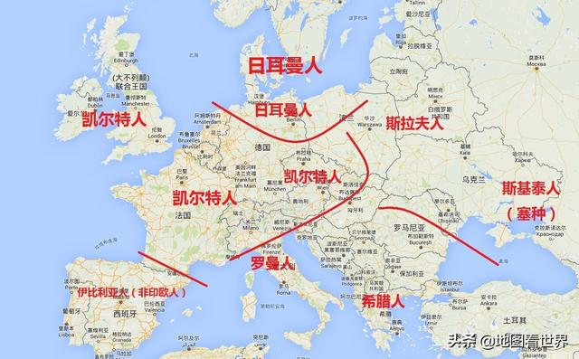
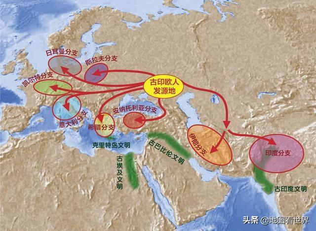
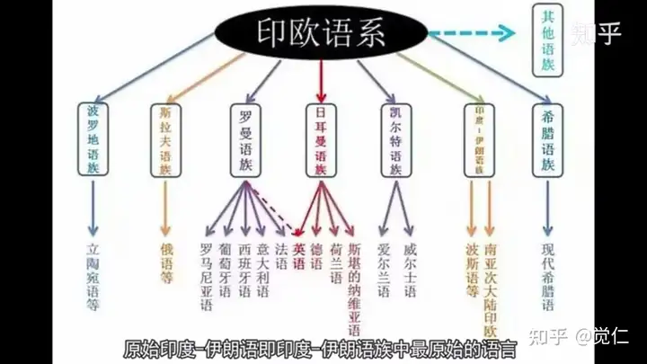
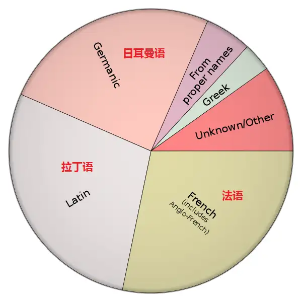
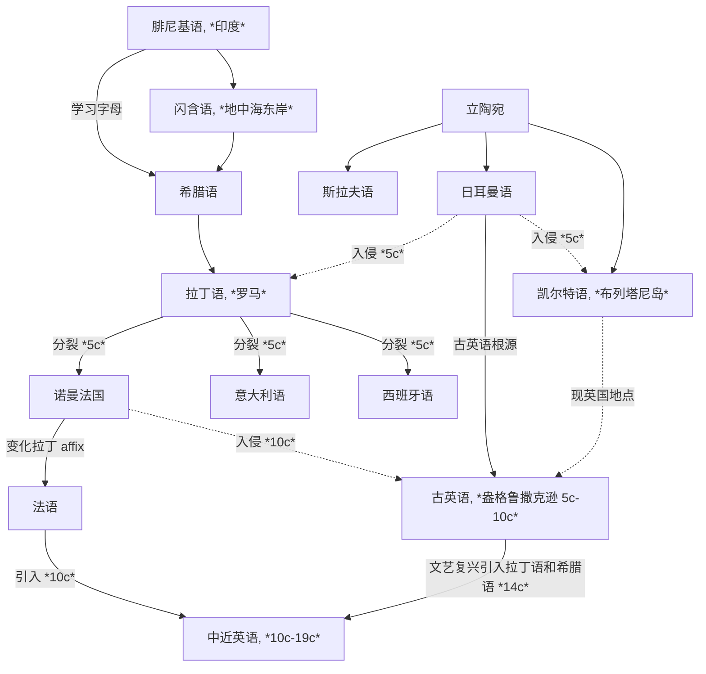
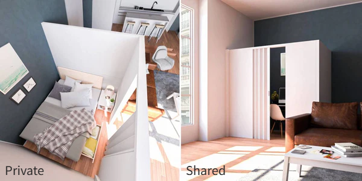
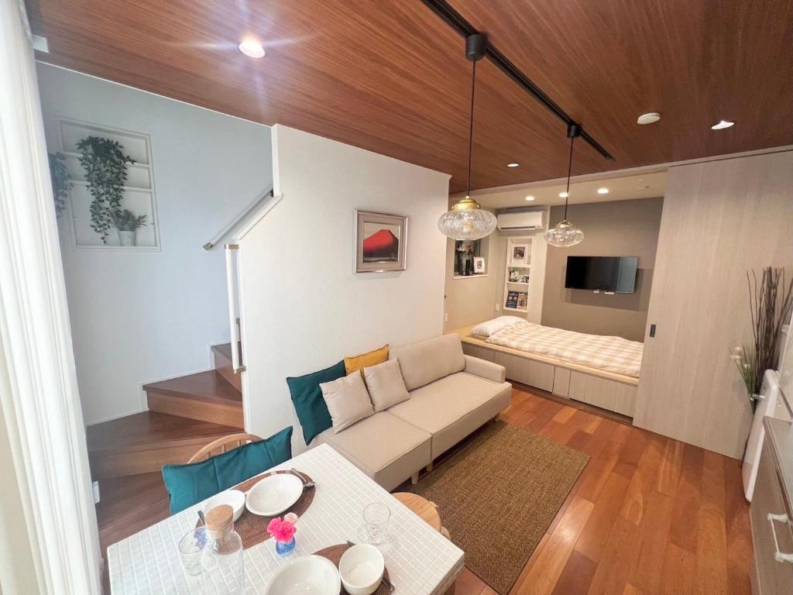
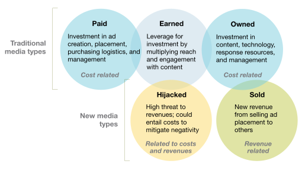

[toc]

## Basic Foundations

### Etymology of Words (Roots and Affixes)

**Indo-European languages (印欧语系)** 有两个起源地：**立陶宛地区**和**地中海东岸的闪含语系地区**——来源于 **Phoenician (腓尼基语)**

西北欧的地区大部分是来源于立陶宛语系，地区交流促成了主要的 **Germanic (日耳曼)**、**Celtic (凯尔特)**、**Slavic (斯拉夫)** 语系（B.C. 9c - A.D. 0c）；现代欧洲语言**文字**的 ancestor 是**腓尼基字母**，希腊人在腓尼基字母的基础上创造出希腊字母，形成了 **Greek (古希腊语)**，之后又被意大利地区古罗马和拉丁人学习形成了 **Latin (拉丁语)**；希腊语和拉丁语不注重语法和介词等，用**词根词缀**即可表示复杂的信息

罗马帝国扩张后，拉丁语逐渐取代古希腊语，欧洲西边大部分讲拉丁语，东边讲希腊语；英国虽处于西边，但并未全部被拉丁语辐射到，仍然是凯尔特人为主（A.D. 0c - 5c）

在罗马帝国末期，日耳曼人入侵凯尔特，凯尔特人被迫逃离，与现代英语几乎无关系，而英语则是属于**日耳曼语族**，与德国、荷兰有相同的起源. 此时被视为英语的起源，盎格鲁撒克逊的**古英语**. 之后英语又被讲另一种日耳曼语的维京人入侵，融合的英语形成了**比较完善的语法结构**，但**失去了日耳曼复合构词的变化**（也就是为什么同是日耳曼语族，英语中的复合构词要比德语和荷兰语少得多）（5c - 10c）；罗马分裂后，拉丁语衍生成多种语言，例如法国、西班牙、意大利等，但 French 追求自己的一套 affix 方法，所以现在的西语和意大利语相比于法语而言更贴近拉丁语. 这些语言被统称为 **Romance Language (罗曼语族/罗马语族/拉丁语族)**. 此时已经很少有地区会讲拉丁语了

中世纪（10c）和近代现代（14c -）时期，英国先后发生了法国入侵和文艺复兴. 法国（诺曼法）入侵带来了大量**法语词汇**（本质是来源于拉丁语，但词缀拓展与拉丁语略有不同），文艺复兴时期都认为**拉丁语是代表着学术文明和高等教育**，而**日耳曼语象征着野蛮和低劣**，所以有大量**学术名词**都是来源于**拉丁语**和**希腊语**，这导致了现代英语的大量词汇会与罗曼语族的语言（如法语、意大利语、西班牙语等）有更多相似之处

### Pronunciation

### Grammar

## Logs

### Listening & Speaking

### Vocabulary

#### 06/22/2025 {V}

- The crude oil's prize affect the coffee's prize, and [vice versa](http://127.0.0.1:5500/En/dict/vice_versa.html#entry1.1-1).

#### 06/23/2025 {V}

- [log scales](http://127.0.0.1:5500/En/dict/log_scale.html#entry1.1-2)

#### 06/24/2025 {V}

- This tables contains coffee consumption in kilograms [per capita](http://127.0.0.1:5500/En/dict/per_capita.html#entry1.1-1) of coffee [import](http://127.0.0.1:5500/En/dict/import.html#entry1.1-1a)[ers](http://127.0.0.1:5500/En/dict/-er.html#entry5.1-2b) over the span of two decades.
- Data tables are often so large that only small [fraction](http://127.0.0.1:5500/En/dict/fraction.html#entry1.1-1b(2)) of rows are displayed.
- Use the [dropdown](http://127.0.0.1:5500/En/dict/dropdown.html#entry1.1-1) to select just the US consumption data.
- We filtered data in tables for specific countries to [produce](http://127.0.0.1:5500/En/dict/produce.html#entry1.1-1) bar charts.
- Set a new filter condition on `Owner` or `Density` that [leads to](http://127.0.0.1:5500/En/dict/lead_to.html#entry1.1-1) the most [common](http://127.0.0.1:5500/En/dict/common.html#entry1.1-3a) opening time being later than 5 AM.
- Connecting two filters with `OR` returns records that [meet](http://127.0.0.1:5500/En/dict/meet.html#entry1.1-4) at least one of the two filter conditions.
- [Crafting](http://127.0.0.1:5500/En/dict/craft.html#entry2.1-1) precise logical expressions and combining them with logical operators lets us [access](http://127.0.0.1:5500/En/dict/access.html#entry2.1-1a) any segment [of interest](http://127.0.0.1:5500/En/dict/of_interest.html#entry1.1-1).

#### 07/18/2025 {V}

- [shop-floor](http://127.0.0.1:5500/En/dict/shop_floor.html#entry1.1-1) [lighting](http://127.0.0.1:5500/En/dict/lighting.html#entry1.1-1a)
- [extract](http://127.0.0.1:5500/En/dict/extract.html)
- [end up](http://127.0.0.1:5500/En/dict/end_up.html#entry1.1-1) vs. [end with](http://127.0.0.1:5500/En/dict/end_with.html#entry1.1-1)
- the behavior of the women in the [plant](http://127.0.0.1:5500/En/dict/plant.html#entry2.1-2b)
- [mischievous](http://127.0.0.1:5500/En/dict/mischievous.html)
- [account](http://127.0.0.1:5500/En/dict/account.html#entry1.1-2) of actions
- [so long as](http://127.0.0.1:5500/En/dict/so_long_as.html#entry1.1) vs. [in case](http://127.0.0.1:5500/En/dict/in_case.html#entry1.1)
- [by itself](http://127.0.0.1:5500/En/dict/by_itself.html#entry1.1-1)
- [contrary to](http://127.0.0.1:5500/En/dict/contrary_to.html)
- [subject to](http://127.0.0.1:5500/En/dict/subject_to.html)
- [peculiar to](http://127.0.0.1:5500/En/dict/peculiar_to.html)
- It [turns out](http://127.0.0.1:5500/En/dict/turn_out.html#entry2.1-2a) that ...
- [in contrast](http://127.0.0.1:5500/En/dict/in_contrast.html)
- [duly](http://127.0.0.1:5500/En/dict/duly.html)
- Workers tended to be [diligent](http://127.0.0.1:5500/En/dict/diligent.html#entry1.1-1) for the first few days of the week in any case.
- This suggests that the [alleged](http://127.0.0.1:5500/En/dict/alleged.html#entry1.1-2) "Hawthorne effect" is hard to [pin down](http://127.0.0.1:5500/En/dict/pin_down.html#entry1.1-2).
- Filter with [inequality](http://127.0.0.1:5500/En/dict/inequality.html#entry1.1-3)

#### 07/19/2025 {V}

- This development is boosting [wholesale](http://127.0.0.1:5500/En/dict/wholesale.html#entry2.1-2) [demand](http://127.0.0.1:5500/En/dict/demand.html#entry1.1-3b) from the food service segment by 4 to 5 percent a year across Europe, compared with growth in [retail](http://127.0.0.1:5500/En/dict/retail.html#entry3.1-1) demand of 1 to 2 percent.

#### 07/23/2025 {V}

- According to [accounts](http://127.0.0.1:5500/En/dict/account.html#entry1.1-7) of the experiment
- Starbucks offers a variety of [discounts](http://127.0.0.1:5500/En/dict/discount.html#entry1.1-1a(1)) and [promotions](http://127.0.0.1:5500/En/dict/promotion.html#entry1.1-2) to help [entice](http://127.0.0.1:5500/En/dict/entice.html#entry1.1-1) customers and boost their business.
- [BOGO](http://127.0.0.1:5500/En/dict/BOGO.html#entry1.1-1) is abbreviated of "buy one, get one".

#### 07/24/2025 {V}

- they [brought the average revenue down](http://127.0.0.1:5500/En/dict/bring_down.html#entry2.1-1)
- They have an [offer](http://127.0.0.1:5500/En/dict/offer.html#entry3.1-1) on beer at the moment.
- The [fridge](http://127.0.0.1:5500/En/dict/fridge.html#entry1.1-1) is in the corner of the room.
- This bird is called a [peacock](http://127.0.0.1:5500/En/dict/peacock.html#entry1.1-1).
- Let's [put the shoes and glasses on](http://127.0.0.1:5500/En/dict/put_on.html#entry3.1-1a).
- We're looking for [machete](http://127.0.0.1:5500/En/dict/machete.html#entry1.1-1) to cut down the forest over there, because it's really thick.
- This is called [weeds](http://127.0.0.1:5500/En/dict/weed.html#entry1.1-1a(1)). It's not grass. Grass is the one that's nicely cut and finished good. And this right here is a [trail](http://127.0.0.1:5500/En/dict/trail.html#entry2.1-1a(2)), a walking trail, or you could call it a hiking trail. But this is [more of](http://127.0.0.1:5500/En/dict/more_of.html#entry1.1-1) a walking trail.
- This is the tea I made that last time. It smells like [licorice](http://127.0.0.1:5500/En/dict/licorice.html#entry1.1-2).
- [Calves](http://127.0.0.1:5500/En/dict/calf.html#entry1.1-1a) are the young, and cows are older. This is a calf.
- Birds [chirping](http://127.0.0.1:5500/En/dict/chirp.html#entry1.1-1).
- This is a [lime](http://127.0.0.1:5500/En/dict/lime.html#entry5.1-2) tree.
- [Watch yourself](http://127.0.0.1:5500/En/dict/watch_oneself.html#entry1.1-1).

#### 07/25/2025 {V}

- We can convert the opening times to [UTC](http://127.0.0.1:5500/En/dict/UTC.html#entry1.1-1) by [subtracting](http://127.0.0.1:5500/En/dict/subtract.html#entry1.1-1) the time difference.
- But first we'll need all the times in the table to be in a [uniform](http://127.0.0.1:5500/En/dict/uniform.html#entry1.1-3) format.
- We've [got rid of](http://127.0.0.1:5500/En/dict/get_rid_of.html#entry1.1-1) the negative times but the times still don't all [fall](http://127.0.0.1:5500/En/dict/fall.html#entry1.1-8) within a single 24 hour period.
- We can use this method to [populate](http://127.0.0.1:5500/En/dict/populate.html#entry1.1-3) a new table where the first column is the time of day in hours.
- What we actually care about is the change in the number that are open --- the [net](http://127.0.0.1:5500/En/dict/net.html#entry3.1-1a) increase.
- Sometimes the information you [want out of](http://127.0.0.1:5500/En/dict/want_out_of.html#entry1.1-1) dataset is there, but it takes several stages of [manipulation](http://127.0.0.1:5500/En/dict/manipulation.html#entry1.1-2a) to [extract](http://127.0.0.1:5500/En/dict/extract.html#entry1.1-1a) it.
- For [much](http://127.0.0.1:5500/En/dict/much.html#entry3.1-1) of the day the "Net Increase" column is negative.

#### 07/28/2025 {V}

- there are a few things a host should know before [investing in](http://127.0.0.1:5500/En/dict/invest_in.html#entry1.1-1) a [property](http://127.0.0.1:5500/En/dict/property.html#entry1.1-2a)
- you'll have data-[backed](http://127.0.0.1:5500/En/dict/back.html#entry4.1-1a) recommendations for anyone looking to start an Airbnb in a major US city.
- With enough properties and bookings, shared rooms could [outperform](http://127.0.0.1:5500/En/dict/outperform.html#entry1.1-1) the other two despite being cheaper.
- you can ignore the days a property [stood](http://127.0.0.1:5500/En/dict/stand.html#entry1.1-3) empty
- On the other hand, higher rents may [turn guests away](http://127.0.0.1:5500/En/dict/turn_away.html#entry1.1-1c).
- a host wants a [clearcut](http://127.0.0.1:5500/En/dict/clearcut.html#entry1.1-2) recommendation
- [impair](http://127.0.0.1:5500/En/dict/impair.html#entry1.1-1)
- [hard](http://127.0.0.1:5500/En/dict/hard.html#entry1.1-8e(3)) laughter is difficult to sustain
- studies [dating back to](http://127.0.0.1:5500/En/dict/date_back_to.html#entry1.1-1) the 1930s
- laughter relaxes muscles, decreasing [muscle tone](http://127.0.0.1:5500/En/dict/muscle_tone.html#entry1.1-1) for up to 45 minutes after the laugh [dies down](http://127.0.0.1:5500/En/dict/die_down.html#entry1.1-1).
- our feeling are partially [rooted in](http://127.0.0.1:5500/En/dict/rooted_in.html#entry1.1-1) physical reactions
- biting with lips would produce an [indifferent](http://127.0.0.1:5500/En/dict/indifferent.html#entry1.1-1) expression
- mouths were [contracted](http://127.0.0.1:5500/En/dict/contract.html#entry2.1-4) in a [frown](http://127.0.0.1:5500/En/dict/frown.html#entry2.1-1)
- the New York [Philharmonic](http://127.0.0.1:5500/En/dict/philharmonic.html#entry1.1-1)
- For the most part, the response has been favorable, [to say the least](http://127.0.0.1:5500/En/dict/to_say_the_least.html#entry1.1-1).
- [Hooray](http://127.0.0.1:5500/En/dict/hooray.html#entry1.1-1)! At last!
- a [sober-sided](http://127.0.0.1:5500/En/dict/sober-sided.html#entry1.1-1) classical-music critic
- an [unpretentious](http://127.0.0.1:5500/En/dict/unpretentious.html#entry1.1-1) musician with no [air](http://127.0.0.1:5500/En/dict/air.html#entry1.1-3c) of the formidable conductor about him
- that seems likely to have [struck](http://127.0.0.1:5500/En/dict/strike.html#entry1.2-15b) at least some *Times* readers as [faint](http://127.0.0.1:5500/En/dict/faint.html#entry1.1-4) praise
- [devoted](http://127.0.0.1:5500/En/dict/devoted.html#entry1.1-1) [concertgoer](http://127.0.0.1:5500/En/dict/concertgoer.html#entry1.1-1)
- a markedly different, more [vibrant](http://127.0.0.1:5500/En/dict/vibrant.html#entry1.1-1a(1)) organization

#### 07/29/2025 {V}

- his explanation was surprisingly [straight up](http://127.0.0.1:5500/En/dict/straight_up.html#entry2.1-2)
- [cloaking](http://127.0.0.1:5500/En/dict/cloak.html#entry2.1-1) his exit in the usual vague excuses
- leaving without a position [lined up](http://127.0.0.1:5500/En/dict/line_up.html#entry2.2-2) gave him time to reflect on what kind of company he wanted to run
- his [aspirations](http://127.0.0.1:5500/En/dict/aspiration.html#entry1.1-1)
- executives were [looking for](http://127.0.0.1:5500/En/dict/look.html#look_for.1-2) a [CEO](http://127.0.0.1:5500/En/dict/CEO.html#entry1.1-1) post
- As boards [scrutinize](http://127.0.0.1:5500/En/dict/scrutinize.html#entry1.1-1) [succession plans](http://127.0.0.1:5500/En/dict/succession_plan.html#entry1.1-1) in response to [shareholder](http://127.0.0.1:5500/En/dict/shareholder.html#entry1.1-1) pressure, executives who don't [get the nod](http://127.0.0.1:5500/En/dict/get_the_nod.html#entry1.1-1) also may wish to [move on](http://127.0.0.1:5500/En/dict/move_on.html#entry1.1-1).
- senior managers cautious of letting vague pronouncements [cloud](http://127.0.0.1:5500/En/dict/cloud.html#entry2.2-3) their reputations
- As the first signs of [recovery](http://127.0.0.1:5500/En/dict/recovery.html#entry1.1-1) begin to [take hold](http://127.0.0.1:5500/En/dict/take_hold.html#entry1.1-2), [deputy](http://127.0.0.1:5500/En/dict/deputy.html#entry1.1-1b) chiefs may be more willing to make the jump without a [net](http://127.0.0.1:5500/En/dict/net.html#entry1.1-1b(4)).
- nervous boards [stuck with](http://127.0.0.1:5500/En/dict/stick_with.html#entry1.1-2) the leaders they had
- As the economy [picks up](http://127.0.0.1:5500/En/dict/pick_up.html#entry3.2-1), opportunities will [abound](http://127.0.0.1:5500/En/dict/abound.html#entry1.1-1) for aspiring leaders.
- For years executives and [headhunters](http://127.0.0.1:5500/En/dict/headhunter.html#entry1.1-1) have [adhered to](http://127.0.0.1:5500/En/dict/adhere_to.html#entry1.1-1) the rule that the most attractive CEO candidates are the ones who must be [poached](http://127.0.0.1:5500/En/dict/poach.html#entry2.2-2c).
- the old [disgrace](http://127.0.0.1:5500/En/dict/disgrace.html#entry2.1-2) is fading for top performers
- [frank](http://127.0.0.1:5500/En/dict/frank.html#entry1.1-1)
- [impulsive](http://127.0.0.1:5500/En/dict/impulsive.html#entry1.1-1b)
- [guard against](http://127.0.0.1:5500/En/dict/guard_against.html#entry1.1-1)
- The [rough](http://127.0.0.1:5500/En/dict/rough.html#entry1.1-4b) guide to marketing success used to be that [you got what you paid for](http://127.0.0.1:5500/En/dict/you_get_what_you_pay_for.html#entry1.1-1).
- a company may [leverage](http://127.0.0.1:5500/En/dict/leverage.html#entry2.1-2) "owned" media by sending e-mail alerts about products and sales to customers registered with its Web site
- marketing's impact [stems from](http://127.0.0.1:5500/En/dict/stem_from.html#entry1.1-1) a broad range of factors beyond conventional paid media
- a [stand-alone](http://127.0.0.1:5500/En/dict/stand-alone.html#entry1.1-1a) media property that promotes complementary and even competitive products
- help expand user [traffic](http://127.0.0.1:5500/En/dict/traffic.html#entry1.1-2) for all companies concerned
- an asset or campaign becomes hostage to consumers, other [stakeholders](http://127.0.0.1:5500/En/dict/stakeholder.html#entry1.1-3), or [activists](http://127.0.0.1:5500/En/dict/activist.html#entry1.1-1) who make negative allegations about a brand or product.
- the learning curve has been [steep](http://127.0.0.1:5500/En/dict/steep.html#entry1.1-3b)
- Toyota Motor [alleviated](http://127.0.0.1:5500/En/dict/alleviate.html#entry1.1-1a) some of the damage from its recall crisis earlier this year with a relatively quick and well-[orchestrated](http://127.0.0.1:5500/En/dict/orchestrate.html#entry1.1-2) social-media response campaign
- [invite](http://127.0.0.1:5500/En/dict/invite.html#entry1.1-2b) constant conflicts
- [take advantage of](http://127.0.0.1:5500/En/dict/take_advantage_of.html#entry1.1-1) hijacked media

#### 07/30/2025 {V}

- [insightful](http://127.0.0.1:5500/En/dict/insightful.html#entry1.1-1), [provocative](http://127.0.0.1:5500/En/dict/provocative.html#entry1.1-1) magazine [cover story](http://127.0.0.1:5500/En/dict/cover_story.html#entry1.1-1)
- [child rearing](http://127.0.0.1:5500/En/dict/child_rearing.html#entry1.1-1) is anything [less than](http://127.0.0.1:5500/En/dict/less.html#less_than.1-1) a completely fulfilling, life-enriching experience
- [moment-to-moment](http://127.0.0.1:5500/En/dict/moment-to-moment.html#entry1.1-1) joy
- Even though the [day-to-day](http://127.0.0.1:5500/En/dict/day-to-day.html#entry1.1-1) experience of raising kids can be [soul-crushingly](http://127.0.0.1:5500/En/dict/soul-crushingly.html#entry1.1-1) hard, Senior writes that "the very things that in the moment [dampen](http://127.0.0.1:5500/En/dict/dampen.html#entry1.1-1) our moods can later be sources of intense [gratification](http://127.0.0.1:5500/En/dict/gratification.html#entry1.1-2) and delight."
- [Madonna](http://127.0.0.1:5500/En/dict/Madonna.html#entry1.1-1)-and-child image on [newsstands](http://127.0.0.1:5500/En/dict/newsstand.html#entry1.1-1)
- In a society that so persistently celebrates [procreation](http://127.0.0.1:5500/En/dict/procreation.html#entry1.2-1)
- [kitten](http://127.0.0.1:5500/En/dict/kitten.html#entry1.1-1)
- raising a kid on their "own" (read: with [round-the-clock](http://127.0.0.1:5500/En/dict/round-the-clock.html#entry1.1-1) help) is [a piece of cake](http://127.0.0.1:5500/En/dict/a_piece_of_cake.html#entry1.1-1)
- in some small, [subconscious](http://127.0.0.1:5500/En/dict/subconscious.html#entry1.1-1) way [contributing](http://127.0.0.1:5500/En/dict/contribute.html#entry1.1-3) to our own dissatisfactions with the actual experience
- happiness [in retrospect](http://127.0.0.1:5500/En/dict/retrospect.html#in_retrospect.1-1)
- [soothing](http://127.0.0.1:5500/En/dict/soothing.html#entry1.1-1)
- something [curious](http://127.0.0.1:5500/En/dict/curious.html#entry1.1-2)
- these are [disciplines](http://127.0.0.1:5500/En/dict/discipline.html#entry1.1-2) that are [going out of style](http://127.0.0.1:5500/En/dict/go_out_of_style.html#entry1.1-1)
- a [grounding](http://127.0.0.1:5500/En/dict/grounding.html#entry1.1-1) in the basic [canon](http://127.0.0.1:5500/En/dict/canon.html#entry1.1-4c) of ideas that every educated person should possess
- They [cut across](http://127.0.0.1:5500/En/dict/cut_across.html#entry1.1-1) the [insistence](http://127.0.0.1:5500/En/dict/insistence.html#entry1.1-1) by top American universities that liberal-arts education and professional education should be kept separate, taught in different schools.
- future doctors and lawyers must study a [nonspecialist](http://127.0.0.1:5500/En/dict/nonspecialist.html#entry1.1-1) liberal-arts degree before embarking on a professional qualification
- federal research [grants](http://127.0.0.1:5500/En/dict/grant.html#entry2.1-2) rose [fourfold](http://127.0.0.1:5500/En/dict/fourfold.html#entry1.1-1) between 1960 and 1990, but [faculty](http://127.0.0.1:5500/En/dict/faculty.html#entry1.1-2a) teaching hours fell by half as research [took its toll](http://127.0.0.1:5500/En/dict/take_its_toll.html#entry1.1-1).
- a [prerequisite](http://127.0.0.1:5500/En/dict/prerequisite.html#entry1.1-1) for a successful academic career
- No disciplines have [seized on](http://127.0.0.1:5500/En/dict/seize_on.html#entry1.1-1) [professionalism](http://127.0.0.1:5500/En/dict/professionalism.html#entry1.1-1) with as much enthusiasm as the [humanities](http://127.0.0.1:5500/En/dict/humanity.html#entry1.1-3).
- up to half of all doctoral students in English [drop out](http://127.0.0.1:5500/En/dict/drop_out.html#entry2.1-1) before getting their degrees
- Academic [inquiry](http://127.0.0.1:5500/En/dict/inquiry.html#entry1.1-3) may need to become less [exclusionary](http://127.0.0.1:5500/En/dict/exclusionary.html#entry1.1-1) and more [holistic](http://127.0.0.1:5500/En/dict/holistic.html#entry1.1-2).
- So [when it comes time to](http://127.0.0.1:5500/En/dict/when_it_comes_time_to.html#entry1.1-1) pick up a location for their new Airbnb, a host needs to know where a property is likely to be [in demand](http://127.0.0.1:5500/En/dict/in_demand.html#entry1.1-1).
- [chart](http://127.0.0.1:5500/En/dict/chart.html#entry2.1-2) occupancy rates throughout the year to [pinpoint](http://127.0.0.1:5500/En/dict/pinpoint.html#entry3.1-2a) [peak](http://127.0.0.1:5500/En/dict/peak_season.html#entry1.1-1) and [off-seasons](http://127.0.0.1:5500/En/dict/off-season.html#entry1.1-1).
- What's a good time to [take a property off](http://127.0.0.1:5500/En/dict/take_off.html#entry2.1-1) the market for [remodeling](http://127.0.0.1:5500/En/dict/remodel.html#entry1.1-1)? When will bookings [drop off](http://127.0.0.1:5500/En/dict/drop_off.html#entry2.1-1), and when will they [spike](http://127.0.0.1:5500/En/dict/spike.html#entry2.2-1)? Questions like these [keep an Airbnb host up](http://127.0.0.1:5500/En/dict/keep_up.html#entry1.1-1) at night.
- The line graph looks very [jagged](http://127.0.0.1:5500/En/dict/jagged.html#entry1.1-1).
- Aggregating the occupancy rates over months instead of days helps [smooth things out](http://127.0.0.1:5500/En/dict/smooth_things_out.html#entry1.1-2)
- If the data captures a real seasonal trend, occupancy peaks in March, June, July, and September but [bottoms out](http://127.0.0.1:5500/En/dict/bottom_out.html#entry1.1-1) in February, May, and November.
- Raising rent when demand peaks could bring in more revenue to [hold a host over](http://127.0.0.1:5500/En/dict/hold_over.html#entry2.2-1b) through the [lean](http://127.0.0.1:5500/En/dict/lean.html#entry3.1-2) times. Raising it during the off-season could [balance out](http://127.0.0.1:5500/En/dict/balance_out.html#entry1.1-1) the smaller number of guests.

#### 07/31/2025 {V}

- The court cannot maintain its [legitimacy](http://127.0.0.1:5500/En/dict/legitimacy.html#entry1.1-1) as guardian of the rule of law when [justices](http://127.0.0.1:5500/En/dict/justice.html#entry1.1-1b) behave like politicians.
- justices acted in ways that are independent and [impartial](http://127.0.0.1:5500/En/dict/impartial.html#entry1.1-1)
- a code of [conduct](http://127.0.0.1:5500/En/dict/conduct.html#entry2.1-1)
- [immune](http://127.0.0.1:5500/En/dict/immune.html#entry1.1-1)
- [resort](http://127.0.0.1:5500/En/dict/resort.html#entry2.1-2) to force
- effectively [evade](http://127.0.0.1:5500/En/dict/evade.html#entry1.2-2b) the flaws of the social cure
- whether there is still a [line](http://127.0.0.1:5500/En/dict/line.html#entry1.1-3e(2)) between the court and politics
- The [framers](http://127.0.0.1:5500/En/dict/framer.html#entry2.1-2b) of the Constitution [envisioned](http://127.0.0.1:5500/En/dict/envision.html#entry1.1-1) law as having authority apart from politics.
- they would be free to [upset](http://127.0.0.1:5500/En/dict/upset.html#entry1.1-2) those in power and have no need to [cultivate](http://127.0.0.1:5500/En/dict/cultivate.html#entry1.1-4b) political support
- [amiable](http://127.0.0.1:5500/En/dict/amiable.html#entry1.1-1a) justices
- [accountable](http://127.0.0.1:5500/En/dict/accountable.html)
- [by all means](http://127.0.0.1:5500/En/dict/mean.html#by_all_means.1-1)
- [at all costs](http://127.0.0.1:5500/En/dict/cost.html#at_all_costs.1-1)
- [in a word](http://127.0.0.1:5500/En/dict/word.html#in_a_word.1-1)
- [Peer pressure](http://127.0.0.1:5500/En/dict/peer_pressure.html#entry1.1-1) can also be a positive force through the [social cure](http://127.0.0.1:5500/En/dict/social_cure.html#entry1.1-1), in which organizations and officials use the power of [group dynamics](http://127.0.0.1:5500/En/dict/group_dynamics.html#entry1.1-1) to help individuals improve their lives and possibly the world.
- Rosenberg offers a [host](http://127.0.0.1:5500/En/dict/host.html#entry4.1-1) of examples of the social cure in action.
- Rosenberg is a [perceptive](http://127.0.0.1:5500/En/dict/perceptive.html#entry1.1-2) observer
- Her [critique](http://127.0.0.1:5500/En/dict/critique.html#entry1.1-1) of the [lameness](http://127.0.0.1:5500/En/dict/lameness.html#entry1.1-2) of many public-health campaigns is [spot-on](http://127.0.0.1:5500/En/dict/spot-on.html#entry1.1-1).
- one [billboard](http://127.0.0.1:5500/En/dict/billboard.html#entry1.1-1) campaign pleads
- public-health advocates ought to [take a page from advertisers](http://127.0.0.1:5500/En/dict/take_a_page_from_someone.html#entry1.1-1), so skilled at applying peer pressure
- the most [glaring](http://127.0.0.1:5500/En/dict/glaring.html#entry1.1-3) flaw
- Far less [certain](http://127.0.0.1:5500/En/dict/certain.html#entry1.1-3b) is how successfully experts and [bureaucrats](http://127.0.0.1:5500/En/dict/bureaucrat.html#entry1.1-1) can select our peer groups and steer their activities in [virtuous](http://127.0.0.1:5500/En/dict/virtuous.html#entry1.1-1b) directions.
- the teacher [breaks up](http://127.0.0.1:5500/En/dict/break_up.html#entry2.2-1) the troublemakers
- The [tactic](http://127.0.0.1:5500/En/dict/tactic.html#entry1.1-1) never really works.
- [When it comes to](http://127.0.0.1:5500/En/dict/when_it_comes_to.html#entry1.1-1) ratings, Airbnb guests have high standards.
- What does this mean for a host's [bottom line](http://127.0.0.1:5500/En/dict/bottom_line.html#entry2.1-2a)?
- With so much [at stake](http://127.0.0.1:5500/En/dict/stake.html#at_stak.1-1), it's important to know how common it is for a San Francisco Airbnb to rate below 4.7 stars [out of](http://127.0.0.1:5500/En/dict/out_of.html#entry1.1-4) 5.
- This result would [land](http://127.0.0.1:5500/En/dict/land.html#entry2.1-2b) better if it came in the form of a pie chart.
- [SF](http://127.0.0.1:5500/En/dict/SF.html#entry2.1-2) Airbnb
- What can a host do to get those [coveted](http://127.0.0.1:5500/En/dict/coveted.html#entry1.1-1) stars?
- Does the value rating [have more or less to do with](http://127.0.0.1:5500/En/dict/have.html#have_to_do_with.1-2) the overall rating than the price?
- you can now [uncover](http://127.0.0.1:5500/En/dict/uncover.html#entry1.1-1) insights from any city's Airbnb data

**Word of the Day: [petulant](http://127.0.0.1:5500/En/dict/petulant.html)** | *adjective* | PET-chuh-lunt

*Petulant* describes a person who is angry and annoyed, or an attitude or behavior showing the emotions of such a person.

**Quiz:** Rearrange the letters to form a word that refers to "a fit of bad temper": [MNUATTR](http://127.0.0.1:5500/En/dict/tantrum.html)

#### 08/01/2025 {V}

**Word of the Day: [dissociate](http://127.0.0.1:5500/En/dict/dissociate.html)** | *verb* | dih-SOH-shee-ayt

To *dissociate* is to separate oneself from association or union with someone or something; in contexts relating to psychology, it has to do specifically with mentally detaching from one's physical or emotional experiences. In chemistry, *dissociate* means "to separate a chemical compound into its constituent parts especially through the application of heat or a solvent."

**Quiz:** Rearrange the letters to form a word that refers to "a deep fissure, as in a glacier or the earth": [SRAEEVSC](http://127.0.0.1:5500/En/dict/crevasse.html)

#### 08/03/2025 {V}

- jogging dose have [measurable](http://127.0.0.1:5500/En/dict/measurable.html#entry1.1-2) benefits on health
- expressions may influence emotions rather than just [the other way around](http://127.0.0.1:5500/En/dict/the_other_way_around.html#entry1.1-1)
- [gem](http://127.0.0.1:5500/En/dict/gem.html#entry1.1-1)
- writing precise [pseudocode](http://127.0.0.1:5500/En/dict/pseudocode.html#entry1.1-1) is a great first step

**Word of the Day: [egregious](http://127.0.0.1:5500/En/dict/egregious.html)** | *adjective* | ih-GREE-juss

*Egregious* is a formal word used to describe things that are [conspicuously](http://127.0.0.1:5500/En/dict/conspicuously.html#entry1.1-2) bad.

**Quiz**: Rearrange the letters to form a synonym of *egregious*: [RLINGAG](http://127.0.0.1:5500/En/dict/glaring.html#entry1.1-3)

### Reading & Writing

#### 06/23/2025 {RW}

- This means that [Malawi](http://127.0.0.1:5500/En/geo/Malawi.html#entry1.1-1) and [Paraguay](http://127.0.0.1:5500/En/geo/Paraguay.html#entry1.1-1) are placed almost [on top of each other](http://127.0.0.1:5500/En/dict/top.html#on_top_of_each_other.1-1), while there's a large empty space between [Thailand](http://127.0.0.1:5500/En/geo/Thailand.html#entry1.1-1) and [Brazil](http://127.0.0.1:5500/En/geo/Brazil.html#entry1.1-1).

#### 06/24/2025 {RW}

- [Finnish](http://127.0.0.1:5500/En/dict/Finnish.html#entry1.1-1) coffee consumption is double [Germany](http://127.0.0.1:5500/En/geo/Germany.html#entry1.1-1)'s [year over year](http://127.0.0.1:5500/En/dict/year-over-year.html#entry1.1-1).
- What year did [Tunisia](http://127.0.0.1:5500/En/geo/Tunisia.html#entry1.1-1)'s coffee consumption [peak](http://127.0.0.1:5500/En/dict/peak.html#entry2.1-1)?
- This dataset can be filtered by factors [other than](http://127.0.0.1:5500/En/dict/other_than.html#entry1.1-1) state — like whether a cafe is in an urban or rural area, or whether it’s a corporate owned (“CO”) or licensed (“LS”) store.
- \- Suppose we applied the filter `State=NY OR Density=Rural`. Do you think this would return cafes in rural New York?
  **A**. \- Yes, but that's it. \- Yes, and other cafes too.
  **B**. \- Yes, and that's it. \- Yes, but other cafes too.

#### 07/17/2025 {RW}

- Two engineer supervised a series of experiments at a telephone-part factory called the [Hawthorne](http://127.0.0.1:5500/En/geo/Hawthorne.html#entry1.1-1) Plant near [Chicago](http://127.0.0.1:5500/En/geo/Chicago.html#entry1.1-1).

#### 07/19/2025 {RW}

- The first and more important is the consumer's growing preference for eating out.

#### 07/23/2025 {RW}

- the same data were [subjected to](http://127.0.0.1:5500/En/dict/subject_to.html#entry1.1-2) econometric analysis

#### 07/24/2025 {RW}

- I think that hedge up there is going to look better than it would with this if it's actually going to grow like the one you said in Loja.

#### 07/28/2025 {RW}

- There're three types of property:

  | Type | Description | Illustration |
  | --- | --- | --- |
  | **shared room** | offers the most budget-friendly option, where you sleep in a space shared with other guests |  |
  | **private room** | provides a personal bedroom, but shared access to common areas |  |
  | **entire residence** | offers complete privacy, with exclusive use of the entire space, including bedrooms, bathrooms, and living areas |  |

- If it were, the histogram wouldn't have such a long tail.

#### 07/29/2025 {RW}

- Digital marketing media types

  
  

#### 07/30/2025 {RW}

- obviously their misery must be a direct result of the [gaping](http://127.0.0.1:5500/En/dict/gaping.html#entry1.1-1) baby-size [holes](http://127.0.0.1:5500/En/dict/hole.html#entry1.1-1b) in their lives.
- most adults understand that a baby is not a [haircut](http://127.0.0.1:5500/En/dict/haircut.html#entry1.1-2)
- The knowledge and skills needed for a particular specialisation are transmissible but not transferable. So disciplines acquire a monopoly not just over the production of knowledge, but over the production of the producers of knowledge.
- Only about half end up with professorships for which they entered [graduate](http://127.0.0.1:5500/En/dict/graduate.html#entry3.1-1) school.
- Otherwise, academics will continue to think dangerously alike, increasingly detached from the societies which they study, investigate and criticise.
- Well, there may be wisdom in following the lead of established Airbnbs.

#### 08/03/2025 {RW}

- Those forced to exercise their smiling muscles reacted more enthusiastically to funny cartoons than did those whose mouths were contracted in a [frown](http://127.0.0.1:5500/En/dict/frown.html#entry1.1-1).

## Exams

### National Postgraduate Entrance Examination (NPEE) English I

#### NPEE-E1-2010

#### NPEE-E1-2011

**Section I.1**: Ancient Greek philosopher Aristotle viewed laughter as "a bodily exercise precious to health." But ____ some claims to the contrary, laughing probably has little influence on physical fitness.

| A. among | B. except | **C. despite** | D. like |
| -------- | --------- | -------------- | ------- |

**Section I.3**: Laughter does produce short-term changes in the function of the heart and its blood vessels, ____ heart rate and oxygen consumption.

| A. stabilizing | **B. boosting** | C. impairing | D. determining |
| -------------- | --------------- | ------------ | -------------- |

**Section I.4-5**: But because [hard](http://127.0.0.1:5500/En/dict/hard.html#entry1.1-8e(3)) laughing is difficult to ____, a good laugh is unlikely to have ____ benefits the way, say, walking or jogging does.

| A. transmit | **B. sustain** | C. evaluate | D. observe |
| ----------- | -------------- | ----------- | ---------- |

| **A. [measurable](http://127.0.0.1:5500/En/dict/measurable.html#entry1.1-2)** | B. manageable | C. affordable | D. renewable |
| ----------------------------------------------------------------------------- | ------------- | ------------- | ------------ |

**Section I.13**: It was argued at the end of the 19th century that humans do not cry ____ they are sad but they become sad when the tears begin to flow.

| A. unless | B. until | C. if | **D. because** |
| --------- | -------- | ----- | -------------- |

**Section I.16-19**: In an experiment published in 1988, social psychologist Fritz Strack of the University of würzburg in Germany asked volunteers to ____ a pen either with their teeth—thereby creating an artificial smile—or with their lips, which would produce a(an) ____ expression. Those forced to exercise their smiling muscles ____ more enthusiastically to funny cartoons that did those whose mouths were [contracted](http://127.0.0.1:5500/En/dict/contract.html#entry2.1-4) in a [frown](http://127.0.0.1:5500/En/dict/frown.html#entry2.1-1), ____ that expressions may influence emotions rather than just [the other way around](http://127.0.0.1:5500/En/dict/the_other_way_around.html#entry1.1-1).

| A. fetch | B. [bite](http://127.0.0.1:5500/En/dict/bite.html#entry1.1-1a) | C. pick | **D. [hold](http://127.0.0.1:5500/En/dict/hold.html#entry1.1-4a)** |
| -------- | -------------------------------------------------------------- | ------- | ------------------------------------------------------------------ |

| **A. disappointed** | B. excited | C. joyful | D. [indifferent](http://127.0.0.1:5500/En/dict/indifferent.html#entry1.1-1) |
| ------------------- | ---------- | --------- | --------------------------------------------------------------------------- |

| A. adapted | B. catered | C. turned | **D. reacted** |
| ----------- | --------- | --------- | -------------- |

| **A. suggesting** | B. requiring | C. mentioning | D. supposing |
| ----------------- | ------------ | ------------- | ------------ |

#### NPEE-E1-2012

**Section I.1-3**: The ethical judgments of the Supreme Court justices have become an important issue recently. The court cannot ____ its [legitimacy](http://127.0.0.1:5500/En/dict/legitimacy.html#entry1.1-1) as guardian of the rule of law ____ justices behave like politicians. Yet, in several instances, justices acted in ways that ____ the court's reputation for being independent and impartial.

| A. emphasize | **B. maintain** | C. modify | D. recognize |
| ------------ | --------------- | --------- | ------------ |

| **A. when** | B. lest | C. before | D. unless |
| ----------- | ------- | --------- | --------- |

| A. restored | **B. weakened** | C. established | D. eliminated |
| ----------- | --------------- | ------------- | -------------- |

**Section I.17**: When the court deals with social policy decisions, the law it shapes is inescapably political—which is why decisions split along ideological lines are so easily ____ as unjust.

| **A. dismissed** | B. released | C. ranked | D. [distorted](http://127.0.0.1:5500/En/dict/distort.html#entry1.1-1) |
| ---------------- | ---------- | ---------- | --------------------------------------------------------------------- |

**Section I.19-20**: The justices must address doubts about the court’s legitimacy by making themselves ____ to the code of conduct. That would make rulings more likely to be seen as separate from politics and, ____, convincing as law.

| A. accessible | B. [amiable](http://127.0.0.1:5500/En/dict/amiable.html#entry1.1-1a) | C. agreeable | **D. [accountable](http://127.0.0.1:5500/En/dict/accountable.html#entry1.1-1)** |
| ------------- | -------------------------------------------------------------------- | ------------ | ------------------ |

| A. [by all means](http://127.0.0.1:5500/En/dict/mean.html#by_all_means.1-1) | B. [at all costs](http://127.0.0.1:5500/En/dict/cost.html#at_all_costs.1-1) | C. [in a word](http://127.0.0.1:5500/En/dict/word.html#in_a_word.1-1) | D. as a result |
| --------------------------------------------------------------------------- | -------------------------------------------------------------------------- | --------------------------------------------------------------------- | -------------- |
