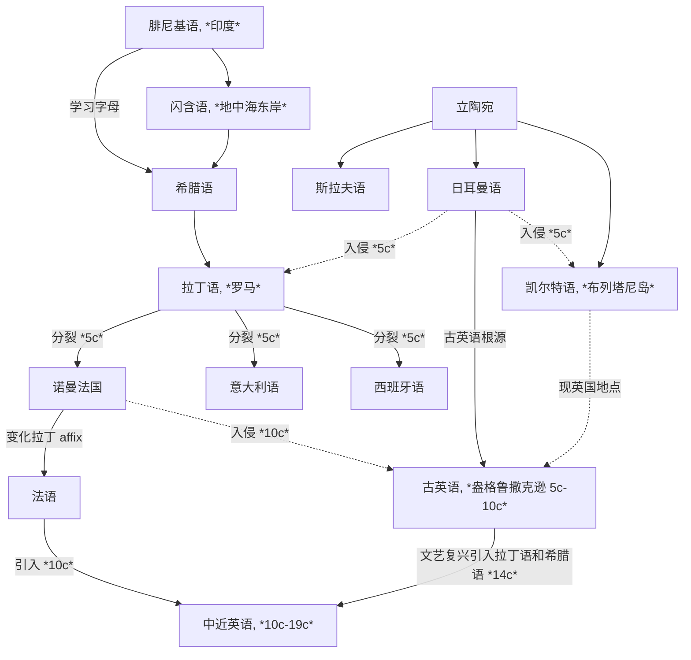
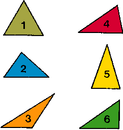

[toc]

## Basic Foundations

### Entries

An [entry](http://localhost:5500/En/dict/entry.html#entry1.1-4b(5)) is a single word or phrase, along with its definition, pronunciation, and example sentences. 或称词条 / 词目

Entries include:

- A **main entry or entry word** 主条目 / 主词条 refers to letters or a combination of such letters including [punctuation mark](http://localhost:5500/En/dict/punctuation_mark.html#entry1.1-1) and [diacritics](http://localhost:5500/En/dict/diacritic.html#entry1.1-1) where needed. In a dictionary it is usually in boldface [type](http://localhost:5500/En/dict/type.html#entry1.1-2c) and set [flush](http://localhost:5500/En/dict/flush.html#entry5.1-4b(1)) with the left-hand margin of each column of [type](http://localhost:5500/En/dict/type.html#entry1.1-2d).
- **Variants in the styling of compound words** 变种复合词 in English is frequent and widespread. It is often completely acceptable to choose freely among:
  - **[Open compounds](http://localhost:5500/En/dict/open_compound.html#entry1.1-1)**, such as *life style*
  - **[Hyphenated compounds](http://localhost:5500/En/dict/hyphenated_compound.html#entry1.1-1)**, such as *life-style*
  - **[Closed](http://localhost:5500/En/dict/closed_compound.html#entry1.1-1)/[Solid compounds](http://localhost:5500/En/dict/solid_compound.html#entry1.1-1)**, such as *lifestyle*
- **Homographs** 同形异义词 are words that are spelled the same but have different meanings and/or different pronunciations. In a dictionary, they are often distinguished by [superscript](http://localhost:5500/En/dict/superscript.html#entry1.1-1) numerals preceding each word. Homographs are created in three ways:
  - Homographs are derived from **the same root**, such as [*melt* entry 1](http://localhost:5500/En/dict/melt.html#entry2.1-1) and [*melt* entry 2](http://localhost:5500/En/dict/melt.html#entry2.1-1).
  - Homographs are **unrelated** beyond the accident of spelling, such as [*pine* entry 1](http://localhost:5500/En/dict/pine.html#entry1.1-1) and [*pine* entry 2](http://localhost:5500/En/dict/pine.html#entry2.1-1)
  - Homographs are derived from **an earlier homograph** by [**functional shift**](http://localhost:5500/En/dict/functional_shift.html#entry1.1-1), such as [noun usage of *superscript*](http://localhost:5500/En/dict/superscript.html#entry1.1-1) and [adjective usage of *superscript*](http://localhost:5500/En/dict/superscript.html#entry1.1-1).
- **The centered dots** 间隔符 within entry words indicate division points at which a hyphen may be put at the end of a line of printing or writing. Centered dots are not shown after a single initial letter or before a single terminal letter because printers [seldom](http://localhost:5500/En/dict/seldom.html#entry1.1-1) cut off a single letter. A double hyphen at the end of a line stands for a hyphen that [belongs](http://localhost:5500/En/dict/belong.html#entry1.1-3) at that point in a hyphenated word and that is retained when the word is written as a unit on one line.
- **[Run-on](http://localhost:5500/En/dict/run-on.html#entry2.1-1) entries** 续写词条 following the defined senses of a main entry, could be:
  - One or more **derivatives** or a **homograph** with a different functional label, such as *[slay](http://localhost:5500/En/dict/slay.html) — [slayer](http://localhost:5500/En/dict/slayer.html)*. They are not defined since their meanings are readily derivable from the meaning of the root word.
  - One or more **phrases** containing the entry word or an inflected form of it, such as *[hole](http://localhost:5500/En/dict/hole.html) — [in the hole](http://localhost:5500/En/dict/hole.html#in_the_hole)*. They are defined since their meanings are more than the sum of the meanings of their elements.
- **Pronunciation** 发音 is indicated between a pair of reversed virgules `\ \` following the entry word
- **Functional labels** 功能标签 indicate **parts of speech** (such as *noun*, *intransitive verb*, etc.) or some other **functional classification** (such as *abbreviation*, *combining form*, etc.). Labeling a verb as transitive, however, does not preclude occasional intransitive use (as in absolute constructions, such as "Weather permitting")
- **Inflected forms** 屈折变化
  - **Noun**
  - **Verbs**
  - **Adjectives & Adverbs**
- **Capitalization** 大写
- **Attributive nouns** 定语名词
- **Usage labels** 用法标签
  - **Temporal labels**
    - **[obsolete](http://localhost:5500/En/dict/obsolete.html#entry1.1-1a)** means that there is no evidence of use since 1755.
    - **[archaic](http://localhost:5500/En/dict/archaic.html#entry1.1-1)** means that a word or sense once in common use is found today only [sporadically](http://localhost:5500/En/dict/sporadically.html#entry1.1-1) or in special contexts
  - **Regional labels**
  - **[Stylistic](http://localhost:5500/En/dict/stylistic.html#entry1.1-1) labels**
    - **[slang](http://localhost:5500/En/dict/slang.html#entry1.1-2)**
    - **nonstandard**
    - **[disparaging](http://localhost:5500/En/dict/disparaging.html#entry1.1-1)**, **offensive**, **obscene**, **vulgar**
  - **Subject labels**
- **Illustrations of usage** 用法示例和插图
- **Definitions** 定义
  - **Usage notes** introduced by a right arrow `→` give supplementary information about such matters as idiom, syntax, semantic relationship, and status.
    - **used ...**
    - **called also** calls attention to one or more terms with the same denotation as the main entry.
  - **Division of senses** reflects something of their semantic relationship, but it does not evaluate senses or set up a [hierarchy](http://localhost:5500/En/dict/hierarchy.html#entry1.1-5) of importance among them. The order of senses is historical.
    - **such as** indicates that the following subsenses are typical or significant examples, while its absence indicates that the following subsenses which follow are [exhaustive](http://localhost:5500/En/dict/exhaustive.html#entry1.1-1).
    - **especially** is used to introduce the most common meaning [subsumed](http://localhost:5500/En/dict/subsume.html#entry1.1-1) in the more general preceding definition.
    - **specifically** is used to introduce a common but highly restricted meaning subsumed in the more general preceding definition.
    - **also** is used to introduce a meaning that is closely related to but may be considered less important than the preceding sense.
    - **broadly** is used to introduce an extended or wider meaning of the preceding definition.
  - **Self-explanatory** definitions are not repeated. Such as the entry *[picked](http://localhost:5500/En/dict/picked.html)* has no definition in such contexts as "picked apples", which is defined as "to gather by plucking" in [*pick* entry 1 sense 3a](http://localhost:5500/En/dict/pick.html#entry1.1-3a).
- **Cross-Reference** 交叉引用 has four different kinds used in the dictionary.
  - **directional** cross-reference that follows a right arrow `→` begins with *see* or *compare*.
    - ***compare*** cross-reference is regularly appended to a definition.
    - ***see*** cross-reference may stand alone.
  - **synonymous** cross-reference  that follows a boldface colon may stand alone as the only definitional matter for an entry or for a sense or subsense of an entry.
  - **[cognate](http://localhost:5500/En/dict/cognate.html#entry1.1-3b)** cross-reference follows an italic ***spelling of***
  - **inflectional** cross-reference follows an italic label that identifies an entry as an inflected form of the original entry.

### Etymology of Words (Roots and Affixes)

**Indo-European languages (印欧语系)** 有两个起源地：**立陶宛地区**和**地中海东岸的闪含语系地区**——来源于 **Phoenician (腓尼基语)**

西北欧的地区大部分是来源于立陶宛语系，地区交流促成了主要的 **Germanic (日耳曼)**、**Celtic (凯尔特)**、**Slavic (斯拉夫)** 语系（B.C. 9c - A.D. 0c）；现代欧洲语言**文字**的 ancestor 是**腓尼基字母**，希腊人在腓尼基字母的基础上创造出希腊字母，形成了 **Greek (古希腊语)**，之后又被意大利地区古罗马和拉丁人学习形成了 **Latin (拉丁语)**；希腊语和拉丁语不注重语法和介词等，用**词根词缀**即可表示复杂的信息

罗马帝国扩张后，拉丁语逐渐取代古希腊语，欧洲西边大部分讲拉丁语，东边讲希腊语；英国虽处于西边，但并未全部被拉丁语辐射到，仍然是凯尔特人为主（A.D. 0c - 5c）

在罗马帝国末期，日耳曼人入侵凯尔特，凯尔特人被迫逃离，与现代英语几乎无关系，而英语则是属于**日耳曼语族**，与德国、荷兰有相同的起源. 此时被视为英语的起源，盎格鲁撒克逊的**古英语**. 之后英语又被讲另一种日耳曼语的维京人入侵，融合的英语形成了**比较完善的语法结构**，但**失去了日耳曼复合构词的变化**（也就是为什么同是日耳曼语族，英语中的复合构词要比德语和荷兰语少得多）（5c - 10c）；罗马分裂后，拉丁语衍生成多种语言，例如法国、西班牙、意大利等，但 French 追求自己的一套 affix 方法，所以现在的西语和意大利语相比于法语而言更贴近拉丁语. 这些语言被统称为 **Romance Language (罗曼语族/罗马语族/拉丁语族)**. 此时已经很少有地区会讲拉丁语了

中世纪（10c）和近代现代（14c -）时期，英国先后发生了法国入侵和文艺复兴. 法国（诺曼法）入侵带来了大量**法语词汇**（本质是来源于拉丁语，但词缀拓展与拉丁语略有不同），文艺复兴时期都认为**拉丁语是代表着学术文明和高等教育**，而**日耳曼语象征着野蛮和低劣**，所以有大量**学术名词**都是来源于**拉丁语**和**希腊语**，这导致了现代英语的大量词汇会与罗曼语族的语言（如法语、意大利语、西班牙语等）有更多相似之处

### Phonology

### Grammar

## Logs

### Listening & Speaking

### Vocabulary

#### 08/01/2025 {V}

**Word of the Day: [dissociate](http://localhost:5500/En/dict/dissociate.html)** | *verb* | dih-SOH-shee-ayt

To *dissociate* is to separate oneself from association or union with someone or something; in contexts relating to psychology, it has to do specifically with mentally detaching from one's physical or emotional experiences. In chemistry, *dissociate* means "to separate a chemical compound into its constituent parts especially through the application of heat or a solvent."

**Quiz:** Rearrange the letters to form a word that refers to "a deep fissure, as in a glacier or the earth": [SRAEEVSC](http://localhost:5500/En/dict/crevasse.html)

#### 08/03/2025 {V}

- jogging does have [measurable](http://localhost:5500/En/dict/measurable.html#entry1.1-2) benefits on health
- expressions may influence emotions rather than just [the other way around](http://localhost:5500/En/dict/the_other_way_around.html#entry1.1-1)
- [gem](http://localhost:5500/En/dict/gem.html#entry1.1-1)
- writing precise [pseudocode](http://localhost:5500/En/dict/pseudocode.html#entry1.1-1) is a great first step

**Word of the Day: [egregious](http://localhost:5500/En/dict/egregious.html)** | *adjective* | ih-GREE-juss

*Egregious* is a formal word used to describe things that are [conspicuously](http://localhost:5500/En/dict/conspicuously.html#entry1.1-2) bad.

**Quiz:** Rearrange the letters to form a synonym of *egregious*: [RLINGAG](http://localhost:5500/En/dict/glaring.html#entry1.1-3)

#### 08/04/2025 {V}

- Since the [pattern](http://localhost:5500/En/dict/pattern.html#entry1.1-10) repeats, we can use a loop.

**Word of the Day: [tapestry](http://localhost:5500/En/dict/tapestry.html)** | *noun* | TAP-uh-stree

A *tapestry* is a heavy textile characterized by complicated pictorial designs and used for hangings, curtains, and [upholstery](http://localhost:5500/En/dict/upholstery.html#entry1.1-1). In [figurative](http://localhost:5500/En/dict/figurative.html#entry1.1-2b) use, *tapestry* may refer to anything made up of different things, people, colors, etc.

**Quiz:** Rearrange the letters to form a word "for a painting done on freshly [spread](http://localhost:5500/En/dict/spread.html#entry1.1-2c) moist [lime plaster](http://localhost:5500/En/dict/lime_plaster.html#entry1.1-1) with water-based [pigments](http://localhost:5500/En/dict/pigment.html#entry1.1-1)": [SFORCE](http://localhost:5500/En/dict/fresco.html)

#### 08/05/2025 {V}

- The company [provoked](http://localhost:5500/En/dict/provoke.html#entry1.1-1a) [justified](http://localhost:5500/En/dict/justified.html#entry1.1-1) outrage in Vermont last week when it announced it was [reneging](http://localhost:5500/En/dict/renege.html#entry1.1-1) on a [longstanding](http://localhost:5500/En/dict/longstanding.html#entry1.1-1) [commitment](http://localhost:5500/En/dict/commitment.html#entry1.1-1a) to [abide by](http://localhost:5500/En/dict/abide.html#abide_by.1-1) the state's strict nuclear regulations.
- [desperate](http://localhost:5500/En/dict/desperate.html#entry1.1-2b) effort to keep its nuclear power plant running
- The state required that any [extension](http://localhost:5500/En/dict/extension.html#entry1.1-5) of the plant's license be subject to the legislature's approval. Then, too, the company [went along](http://localhost:5500/En/dict/go_along.html#entry1.1-3).
- he never really intended to [live by](http://localhost:5500/En/dict/live_by.html#entry1.1-1) those commitments
- By [entering into](http://localhost:5500/En/dict/enter.html#enter_into.1-1) the 2002 agreement, Entergy intended to get permission to purchase a power plant.
- There are valid concerns about the [patchwork](http://localhost:5500/En/dict/patchwork.html#entry1.1-1) regulations that could [result](http://localhost:5500/En/dict/result.html#entry1.1-1a) if every state sets its own rules.
- But had Entergy [kept its word](http://localhost:5500/En/dict/keep_one's_word.html#entry1.1-1), that debate would be [beside the point](http://localhost:5500/En/dict/point.html#beside_the_point.1-1).
- What's cool is that a `while` loop doesn't need a number of repetitions specified [ahead of time](http://localhost:5500/En/dict/ahead_of_time.html#entry1.1-1).
- Logic makes it possible for a program to be [versatile](http://localhost:5500/En/dict/versatile.html#entry1.1-2) like this.

**Word of the Day: [contentious](http://localhost:5500/En/dict/contentious.html)** | *adjective* | kun-TEN-shuss

*Contentious* describes something that is likely to cause people to argue or disagree or that involves a lot of arguing. When used of a person, *contentious* describes someone likely or willing to argue.

**Quiz:** Rearrange the letters to form a word referring to "a habitually [irritable](http://localhost:5500/En/dict/irritable.html#entry1.1-1a) or complaining person": [OGHCUR](http://localhost:5500/En/dict/grouch.html#entry1.1-2)

#### 08/06/2025 {V}

- objective researchers use the scientific method to [carry out](http://localhost:5500/En/dict/carry_out.html#entry2.1-2) their work
- the [subsequent](http://localhost:5500/En/dict/subsequent.html#entry1.1-1) actions we take
- Opportunities for [misinterpretation](http://localhost:5500/En/dict/misinterpretation.html#entry1.1-1), error, and [self-deception](http://localhost:5500/En/dict/self-deception.html#entry1.1-1) abound.
- discovery claims should be thought of as [proto](http://localhost:5500/En/dict/proto-.html#entry1.1-1b)science
- It takes collective [scrutiny](http://localhost:5500/En/dict/scrutiny.html#entry1.1-1) and acceptance to transform a discovery claim into a mature discover. This is the [credibility](http://localhost:5500/En/dict/credibility.html#entry1.1-1) process.
- a discovery claim [works its way](http://localhost:5500/En/dict/work_one's_way.html#entry1.1-1) through the community
- [prevailing](http://localhost:5500/En/dict/prevail.html#entry1.1-5) knowledge
- [Novelty](http://localhost:5500/En/dict/novelty.html#entry1.1-2) itself provokes disbelief.
- scientific work [calls for](http://localhost:5500/En/dict/call.html#call_for.1-2) a critical mind
- it [comes in handy](http://localhost:5500/En/dict/come_in_handy.html#entry1.1-1) to know when and where to use a loop

**Word of the Day: [largesse](http://localhost:5500/En/dict/largesse.html)** | *noun* | lahr-ZHESS

*Largesse* is a somewhat formal word that refers to the act of giving away money or the generosity of a person who gives away money. It can also refer to the money that is given away.

**Quiz:** Fill in the blanks to complete a word "for a small gift given to a customer by a merchant at the time of purchase": [I␣␣ni␣p␣e](http://localhost:5500/En/dict/lagniappe.html#entry1.1-1)

#### 08/08/2025 {V}

- the [trade unionist](http://localhost:5500/En/dict/trade_unionist.html#entry1.1-1) would probably represent [civil servants](http://localhost:5500/En/dict/civil_servant.html#entry1.1-1).
- They were [in their prime](http://localhost:5500/En/dict/in_one's_prime.html#entry1.1-1) in 1960.
- In 2009 the number of unionists in America's [public sector](http://localhost:5500/En/dict/public_sector.html#entry1.1-1) passed that of their fellow members in the [private sector](http://localhost:5500/En/dict/private_sector.html#entry1.1-1).
- They now dominate [left-of-centre](http://localhost:5500/En/dict/left-of-centre.html#entry1.1-1) politics. Some of their [ties](http://localhost:5500/En/dict/tie.html#entry2.1-2b) [go back a long way](http://localhost:5500/En/dict/go_back_a_long_way.html#entry1.1-1).
- At the state level their influence can be even more [fearsome](http://localhost:5500/En/dict/fearsome.html#entry1.1-1a).
- Much of the state's [budget](http://localhost:5500/En/dict/budget.html#entry1.1-4c) is [patrolled](http://localhost:5500/En/dict/patrol.html#entry2.2-1) by unions.
- Politicians have repeatedly "[backloaded](http://localhost:5500/En/dict/backload.html#entry2.1-1)" public-sector pay deals, keeping the pay increases [modest](http://localhost:5500/En/dict/modest.html#entry1.1-4a) but adding to holidays and especially [pensions](http://localhost:5500/En/dict/pension.html#entry1.1-2) that are already generous.
- [charter schools](http://localhost:5500/En/dict/charter_school.html#entry1.1-1), academies and [merit pay](http://localhost:5500/En/dict/merit_pay.html#entry1.1-1) all faced [drawn-out](http://localhost:5500/En/dict/draw_out.html#entry1.1-2) battles
- As the cost to everyone else has become clearer, politicians have begun to [clamp down](http://localhost:5500/En/dict/clamp_down.html#entry2.1-1).
- the norms of culture in Western [civil services](http://localhost:5500/En/dict/civil_service.html#entry1.1-1) suit those who want to [stay put](http://localhost:5500/En/dict/stay_put.html#entry1.1-1) but is bad for high achievers
- Loop [combo](http://localhost:5500/En/dict/combo.html#entry1.1-2) challenge

**Word of the Day: [winsome](http://localhost:5500/En/dict/winsome.html)** | *adjective* | WIN-sum

*Winsome* describes people and things that are cheerful, pleasant, and appealing.

**Quiz:** What 7-letter synonym of *cheerful* can also be used to mean "[capable of floating](http://localhost:5500/En/dict/buoyant.html)"?

#### 08/09/2025 {V}

- those [fleeting](http://localhost:5500/En/dict/fleeting.html#entry1.1-1) moments
- [brown-paper](http://localhost:5500/En/dict/brown-paper.html#entry1.1-1) envelope
- Take [a moment or two](http://localhost:5500/En/dict/a_(something)_or_two.html#entry1.1-1) to wonder at those marvels. You are the lucky inheritor of a [dream come true](http://localhost:5500/En/dict/dream_come_true.html#entry1.1-1).
- [visionaries](http://localhost:5500/En/dict/visionary.html#entry2.1-1) labor create a [fabulous](http://localhost:5500/En/dict/fabulous.html#entry1.1-1b) machine
- by the [turn](http://localhost:5500/En/dict/turn.html#entry2.1-5c) of the [millennium](http://localhost:5500/En/dict/millennium.html#entry1.1-2a)
- there are strong commercial [agendas](http://localhost:5500/En/dict/agenda.html#entry1.1-2) [at work](http://localhost:5500/En/dict/work.html#at_work.1-2)
- failing to move beyond downloading is to [strip](http://localhost:5500/En/dict/strip.html#entry1.1-1b) oneself of a defining constituent of humanity
- Even after the [advent](http://localhost:5500/En/dict/advent.html#entry1.1-3) of of widespread social media, a [pyramid](http://localhost:5500/En/dict/pyramid.html#entry1.1-5) of production remains, with a small number of people uploading material, a slightly larger group commenting on or modifying that content, and a huge percentage remaining content to just consume.
- Television is a [one-way](http://localhost:5500/En/dict/one-way.html#entry1.1-1) [tap](http://localhost:5500/En/dict/tap.html#entry3.1-1b) flowing into our homes.
- "stickiness"—creations and experiences to which others [adhere](http://localhost:5500/En/dict/adhere.html#entry1.1-2)

**Word of the Day: [behemoth](http://localhost:5500/En/dict/behemoth.html)** | *noun* | bih-HEE-muth

A *behemoth* is something of monstrous size, power, or appearance. *Behemoth* (usually capitalized) is also the name of a mighty animal described in the biblical book of Job.

**Quiz:** Fill in the blanks to complete a synonym of *behemoth*: [m␣m␣␣t␣](http://localhost:5500/En/dict/mammoth.html#entry1.1-2)

#### 08/10/2025 {V}

**Word of the Day: [hidebound](http://localhost:5500/En/dict/hidebound.html)** | *adjective* | HYDE-bound

Someone or something described as *hidebound* is inflexible and unwilling to accept new or different ideas.

**Quiz:** Rearrange the letters to form an adjective meaning "formal" or "stiff" that can also describe foods such as bread or pasta: [RHSYTAC](http://localhost:5500/En/dict/starchy.html)

#### 08/11/2025 {V}

- Let's learn to [wield](http://localhost:5500/En/dict/wield.html#entry1.1-2) an `if-else` statement in more complex ways.

**Word of the Day: [stipulate](http://localhost:5500/En/dict/stipulate.html#entry1.2-1)** | *verb* | STIP-yuh-layt

To *stipulate* is to demand or require something as part of an agreement.

**Quiz:** Fill in the blanks to complete a noun that refers to "an agreement or covenant between two or more parties": [c␣␣p␣c␣](http://localhost:5500/En/dict/compact.html#entry4.1-1)

#### 08/12/2025 {V}

- [on the whole](http://localhost:5500/En/dict/whole.html#on_the_whole.1)
- But he speculated that an inability to consider [the big picture](http://localhost:5500/En/dict/the_big_picture.html#entry1.1-1) was leading decision-makers to be biased by the daily samples of information they were working with.
- [In principle](http://localhost:5500/En/dict/principle.html#in_principle.1-1)
- He theorized that a judge fearful of appearing too soft on crime might be more likely to send someone to prison if he had already [sentenced](http://localhost:5500/En/dict/sentence.html#entry2.1-1) five or six other [defendants](http://localhost:5500/En/dict/defendant.html#entry1.1-1) only to forced [community service](http://localhost:5500/En/dict/community_service.html#entry1.1-1) on that day.
- This scale [took numerous factors into consideration](http://localhost:5500/En/dict/take_(something)_into_consideration.html#entry1.1-1).
- The scores were then used [in conjunction with](http://localhost:5500/En/dict/in_conjunction_with.html#entry1.1-1) an applicant's score on the Graduate Management Admission Test, or GMAT, a standardized exam which is [marked](http://localhost:5500/En/dict/marked.html#entry2.1-2b(4)) [out of](http://localhost:5500/En/dict/out_of.html#entry1.1-4) 800 points, to make a decision on whether to accept him or her.
- [fluctuate](http://localhost:5500/En/dict/fluctuate.html#entry1.1-1)
- [disregard](http://localhost:5500/En/dict/disregard.html#entry1.1-1)
- This might sound small, but to [undo](http://localhost:5500/En/dict/undo.html#entry1.1-2) the effects of such a decrease a candidate would need 30 more GMAT points than would otherwise have been necessary.
- [More often than not](http://localhost:5500/En/dict/more_often_than_not.html#entry1.1-1), it's an iterative process.
- Programmers tend to build good programs [one update at a time](http://localhost:5500/En/dict/at_a_time.html#entry1.1-1).

**Word of the Day: [ramshackle](http://localhost:5500/En/dict/ramshackle.html)** | *adjective* | RAM-shak-ul

*Ramshackle* describes things that are in a very bad condition and need to be repaired, or that are carelessly or loosely constructed.

**Quiz:** Fill in the blanks to complete a word meaning "decayed, deteriorated, or fallen into partial ruin": [d␣␣a␣␣d␣t␣d](http://localhost:5500/En/dict/dilapidated.html#entry1.1-1)

#### 08/15/2025 {V}

- Miranda Priestly [scolds](http://localhost:5500/En/dict/scold.html#entry1.1-1) her unattractive assistant for [imagining](http://localhost:5500/En/dict/imagine.html#entry1.1-2) that high fashion doesn't affect her.
- This [top-down](http://localhost:5500/En/dict/top-down.html#entry1.1-1) conception of the fashion business couldn't be more out of date and [at odds with](http://localhost:5500/En/dict/at_odds_with.html#entry1.1-1) the [feverish](http://localhost:5500/En/dict/feverish.html#entry1.1-2) world described in *Overdressed*, Elizabeth Cline's three-year [indictment](http://localhost:5500/En/dict/indictment.html#entry1.1-3) of "[fast fashion](http://localhost:5500/En/dict/fast_fashion.html#entry1.1-1)".
- In the last decade [or so](http://localhost:5500/En/dict/or_so.html#entry1.1-1), advances in technology have allowed [mass-market](http://localhost:5500/En/dict/mass-market.html#entry1.1-2) [labels](http://localhost:5500/En/dict/label.html#entry1.1-2b) to react to trends more quickly and anticipate demand more precisely.
- Quicker [turnarounds](http://localhost:5500/En/dict/turnaround.html#entry1.1-1a) mean less wasted [inventory](http://localhost:5500/En/dict/inventory.html#entry1.1-2), more frequent releases, and more profit.
- These labels encourage style-conscious consumers to see clothes as [disposable](http://localhost:5500/En/dict/disposable.html#entry1.1-2).
- By offering on-trend items at [dirt-cheap](http://localhost:5500/En/dict/dirt-cheap.html#entry1.1-1) prices, these brands have hijacked fashion cycles, shaking an industry long [accustomed](http://localhost:5500/En/dict/accustomed.html#entry1.1-2) to a seasonal pace.
- it must rely on low-wage overseas labor, order in [volumes](http://localhost:5500/En/dict/volume.html#entry1.1-3a(2)) that [strain](http://localhost:5500/En/dict/strain.html#entry2.1-5) natural resources, and use massive amounts of harmful chemicals.
- no matter how much they [give away](http://localhost:5500/En/dict/give_away.html#entry2.1-1), this excess leads to waste
- Towards the end of *Overdressed*, Cline introduced her [ideal](http://localhost:5500/En/dict/ideal.html#entry2.1-2), a Brooklyn woman.
- But as Cline is the first to note, it took Beaumont decades to perfect her craft; her example can't be [knocked off](http://localhost:5500/En/dict/knock_off.html#entry2.1-6).
- Several companies have made efforts to [curb](http://localhost:5500/En/dict/curb.html#entry2.1-2) their impact on labor and the environment.
- [Vanity](http://localhost:5500/En/dict/vanity.html#entry1.1-1) is a constant.
- [Satire](http://localhost:5500/En/dict/satire.html#entry1.1-1) on an extravagant lifestyle is the subject of the text.
- A business with a nice website can [outshine](http://localhost:5500/En/dict/outshine.html#entry1.1-2) the [competition](http://localhost:5500/En/dict/competition.html#entry1.1-2).
- Modern websites need to look [sleek](http://localhost:5500/En/dict/sleek.html#entry1.1-3c) on any user's device.

**Word of the Day: [meander](http://localhost:5500/En/dict/meander.html#entry2.1)** | *verb* | mee-AN-der

To *meander* is to follow a winding or intricate course—that is, one with a lot of turns and curves—or to walk slowly without a specific goal, purpose, or direction.

**Quiz:** Fill in the blanks to complete a verb meaning "to walk or travel about without apparent plan": [t␣␣i␣s␣](http://localhost:5500/En/dict/traipse.html)

#### 08/16/2025 {V}

- companies can [aim](http://localhost:5500/En/dict/aim.html#entry1.2-1b) "behavioral" ads at those most likely to buy.
- such [fine-grained](http://localhost:5500/En/dict/fine-grained.html#entry1.1-1) information
- the industry would [get cracking](http://localhost:5500/En/dict/get.html#get_cracking.1-1) on responding to DNT requests.
- On May 31st Microsoft [set off](http://localhost:5500/En/dict/set_off.html#entry2.1-3a) the [row](http://localhost:5500/En/dict/row.html#entry5.1-1).
- consumers will be [worse off](http://localhost:5500/En/dict/worse_off.html#entry1.1-2)
- some may ignore a DNT signal and [press on](http://localhost:5500/En/dict/press_on.html#entry1.1-2) anyway.
- Also unclear is why Microsoft has [gone it alone](http://localhost:5500/En/dict/go_it_alone.html#entry1.1-1).
- setting DNT as a default may cut the number of [junk](http://localhost:5500/En/dict/junk.html#entry1.1-1b) ads.
- DNT may not serve its [intended](http://localhost:5500/En/dict/intended.html#entry1.1-1) purpose.
- Posts [tailored](http://localhost:5500/En/dict/tailored.html#entry1.1-2) to each platform.
- share every post the business has [approved](http://localhost:5500/En/dict/approve.html#entry1.1-2a).
- Loops and conditionals can help add popular features to an app, making it easier to gain an [edge](http://localhost:5500/En/dict/edge.html#entry1.1-2d) on the competition.

**Word of the Day: [tempestuous](http://localhost:5500/En/dict/tempestuous.html)** | *adjective* | tem-PESS-chuh-wus

*Tempestuous* is used to describe something that is related to or resembles a violent storm. In its literal (and often literary) use *tempestuous* is synonymous with [*turbulent*](http://localhost:5500/En/dict/turbulent.html) and [*stormy*](http://localhost:5500/En/dict/stormy.html). Figuratively, *tempestuous* describes something or someone full of strong emotions, such as anger or excitement.

**Quiz:** Rearrange the letters to form a word that refers to "an extremely large, powerful, and destructive storm with very high winds that turn around an area of low pressure": [OYCENLC](http://localhost:5500/En/dict/cyclone.html#entry1.1-1)

#### 08/17/2025 {V}

**Word of the Day: [glitch](http://localhost:5500/En/dict/glitch.html)** | *noun* | GLITCH

*Glitch* is an informal word referring to an unexpected and usually minor problem. It is used especially for a minor problem with a machine or device, such as a computer.

**Quiz:** Fill in the blanks to complete a word for "a cause of error or equipment malfunction conceived of as a small mischievous gnome": [␣␣em␣i␣](http://localhost:5500/En/dict/gremlin.html#entry1.1-1)

#### 08/21/2025 {V}

- [Up until](http://localhost:5500/En/dict/up_until.html#entry1.1-1) a few decades ago, our visions of the future were largely—though [by no means](http://localhost:5500/En/dict/mean.html#by_no_means.1-1) uniformly—glowingly positive.
- Now [utopia](http://localhost:5500/En/dict/utopia.html#entry1.1-1) has grown unfashionable, as we have gained a deeper [appreciation](http://localhost:5500/En/dict/appreciation.html#entry1.1-1c) of the range of threats facing us, from [asteroid](http://localhost:5500/En/dict/asteroid.html#entry1.1-1) strike to epidemic [flu](http://localhost:5500/En/dict/flu.html#entry1.1-1) and to climate change.
- You might even be [tempted](http://localhost:5500/En/dict/tempt.html#entry1.1-2b) to assume that humanity has little future to look forward to.
- But such gloominess is [misplaced](http://localhost:5500/En/dict/misplace.html#entry1.1-2).
- The fossil record shows that many species have [endured](http://localhost:5500/En/dict/endure.html#entry1.1-1) for millions of years.
- it has as its [flagship](http://localhost:5500/En/dict/flagship.html#entry1.1-2) project a mechanical clock
- the situations in which our [descendants](http://localhost:5500/En/dict/descendant.html#entry2.1-1) will find themselves
- This long perspective makes the pessimistic view of our prospects seem more likely to be a passing [fad](http://localhost:5500/En/dict/fad.html#entry1.1-1). To be sure, the future is not all [rosy](http://localhost:5500/En/dict/rosy.html#entry1.1-2).
- to reduce the risks that threatened the existence of earlier humans, and to improve the [lot](http://localhost:5500/En/dict/lot.html#entry1.1-3b) of those to come
- [draw](http://localhost:5500/En/dict/draw.html#entry1.1-5c) on our experience from the past
- the Supreme Court [knocked out](http://localhost:5500/En/dict/knock_out.html#entry3.1-2b) much of immigration law
- the majority overturned three of the four [contested](http://localhost:5500/En/dict/contest.html#entry1.2-1) [provisions](http://localhost:5500/En/dict/provision.html#entry1.1-3) of the plan
- The only major objection came from a justice, who offered an even more [robust](http://localhost:5500/En/dict/robust.html#entry1.1-1b) defense of state privileges [going back to](http://localhost:5500/En/dict/go_back_to.html#entry1.1-1) the Alien and [Sedition](http://localhost:5500/En/dict/sedition.html#entry1.1-1) [Acts](http://localhost:5500/En/dict/act.html#entry1.1-3a).
- [In effect](http://localhost:5500/En/dict/effect.html#in_effect.1-1), the White House claimed that it could invalidate any otherwise legitimate state law that it disagrees with.
- they [overstepped](http://localhost:5500/En/dict/overstep.html#entry1.1-1) the authority of federal immigration law
- the Justices agree on Congress's [intervention](http://localhost:5500/En/dict/intervention.html#entry1.1-1a) in immigration enforcement
- the Acts [violated](http://localhost:5500/En/dict/violate.html#entry1.1-1) the Constitution and [undermined](http://localhost:5500/En/dict/undermine.html#entry1.1-1) the states' [interests](http://localhost:5500/En/dict/interest.html#entry1.1-2)

**Word of the Day: [validate](http://localhost:5500/En/dict/validate.html)** | *verb* | VAL-uh-dayt

To *validate* something is to show that it is real or correct. *Validate* an also mean "to state or show that something is legal or official," "to put a mark on something to show that it has been checked and is official or accepted," and "to show that someone's feelings, opinions, etc., are fair and reasonable."

**Quiz:** Rearrange the letters to reveal a verb meaning "to approve and sanction (something, such as a treaty) formally": [IYRTAF](http://localhost:5500/En/dict/ratify.html#entry1.1-1)

#### 08/22/2025 {V}

- The number of social-science students worldwide has [swollen](http://localhost:5500/En/dict/swell.html#entry1.1-1a) by about 11% every year since 2000.
- [argo-](http://localhost:5500/En/dict/argo-.html#entry1.1-1)technological
- To [paraphrase](http://localhost:5500/En/dict/paraphrase.html#entry2.2-1) the great social scientist Joseph Schumpeter: there is no radical innovation without creative destruction.
- Social scientists who complain about a lack of funding should not expect more in today's economic [climate](http://localhost:5500/En/dict/climate.html#entry1.1-3).
- many social scientists seem [reluctant](http://localhost:5500/En/dict/reluctant.html#entry1.1-1) to tackle such problems
- Some are [up in arms](http://localhost:5500/En/dict/arm.html#up_in_arms.1-1) over a proposal to drop a specific funding category for social-science research and to integrate it within [cross-cutting](http://localhost:5500/En/dict/cross-cut.html#entry1.1-1) topics of sustainable development.
- [senior moment](http://localhost:5500/En/dict/senior_moment.html#entry1.1-1)
- [roundabout](http://localhost:5500/En/dict/roundabout.html#entry2.1-1)
- To **figure out** means to think of a solution for something or to understand something. "I just can't *figure* this *out*." "I *figured out* the problem."
  To **find out** means to look into something or investigate. "Can you *find out* for me?" "I'll *find out* for you."
  To **turn out** is like a result. "Everything *turned out* okay." "The project *turned out* to be a bust (awful)."
- It turns out that the right mental workouts can significantly improve our basic [cognitive](http://localhost:5500/En/dict/cognitive.html#entry1.1-1) functions.
- the university's [criterion](http://localhost:5500/En/dict/criterion.html#entry1.1-1) for admission
- [To a certain extent](http://localhost:5500/En/dict/to_a_certain_extent.html#entry1.1-1), our ability to [excel](http://localhost:5500/En/dict/excel.html#entry1.2-1) in making connections that drive intelligence is inherited.
- [carry on](http://localhost:5500/En/dict/carry_on.html#entry3.1-1) research
- [took on](http://localhost:5500/En/dict/take_on.html#entry1.1-1b) the neighborhood bully
- [put on](http://localhost:5500/En/dict/put_on.html#entry3.1-3a) weight
- an [idle](http://localhost:5500/En/dict/idle.html#entry1.1-1a) worker

**Word of the Day: [apathy](http://localhost:5500/En/dict/apathy.html)** | *noun* | AP-uh-thee

*Apathy* refers either to a lack of feeling or emotion, or to a lack of interest or concern.

**Quiz:** Rearrange the letters to form an adjective that can mean both "absurd or laughable" and "having a capacity to move one to either compassionate or contemptuous pity": [HICTPAET](http://localhost:5500/En/dict/pathetic.html)

#### 08/23/2025 {V}

- [Chancellor of the Exchequer](http://localhost:5500/En/dict/chancellor_of_the_exchequer.html#entry1.1-1)
- [upfront](http://localhost:5500/En/dict/upfront.html#entry1.1-1) work search
- Only if the jobless arrive at the job center with a [CV](http://localhost:5500/En/dict/cv.html#entry2.1-3) will they be [eligible](http://localhost:5500/En/dict/eligible.html#entry1.1-1a) for [benefit](http://localhost:5500/En/dict/benefit.html#entry1.1-2a)—and then they should report weekly rather than [fortnightly](http://localhost:5500/En/dict/fortnightly.html#entry2.1-1).
- There will now be a seven-day wait for the job seeker's [allowance](http://localhost:5500/En/dict/allowance.html#entry1.1-1a).
- they help people [stay off](http://localhost:5500/En/dict/stay_off.html#entry1.1-1) benefits
- an obviously indulgent system that demands too little effort from the newly unemployed to find work, and [subsidises](http://localhost:5500/En/dict/subsidise.html#entry1.1-1b) laziness
- his [zeal](http://localhost:5500/En/dict/zeal.html#entry1.1-1) for "fundamental fairness"
- only the most deserving [claimant](http://localhost:5500/En/dict/claimant.html#entry1.1-1) received their benefits
- Your first [instinct](http://localhost:5500/En/dict/instinct.html#entry1.1-2b) is to fall into dependency supported by a state [only too](http://localhost:5500/En/dict/only_too.html#entry1.1-1) ready to indulge your [falsehood](http://localhost:5500/En/dict/falsehood.html#entry1.1-2).
- The best lawyers made [skyscrapers](http://localhost:5500/En/dict/skyscraper.html#entry1.1-1)-full of money, tempting ever more students to [pile](http://localhost:5500/En/dict/pile.html#entry3.2-2) into law schools.
- Many of them become the kind of nuisance-lawsuit [filer](http://localhost:5500/En/dict/filer.html#entry4.1-3) that makes the [tort](http://localhost:5500/En/dict/tort.html#entry1.1-1) system a costly nightmare.
- an expensive preparation for the [bar exam](http://localhost:5500/En/dict/bar_exam.html#entry1.1-1).
- This leaves today's average law-school graduate with $100,000 of debt [on top of](http://localhost:5500/En/dict/top.html#on_top_of.1-3) undergraduate debts.
- let students [sit](http://localhost:5500/En/dict/sit.html#entry1.1-11) for the [bar](http://localhost:5500/En/dict/bar.html#entry1.1-3b(4))
- the [restrictive](http://localhost:5500/En/dict/restrictive.html#entry1.1-1b) guild-like ownership structure of the business
- in the [District](http://localhost:5500/En/dict/district.html#entry1.1-1a) of Columbia
- [Hindrance](http://localhost:5500/En/dict/Hindrance.html#entry1.1-2) to the reform of the legal system originates from the [rigid](http://localhost:5500/En/dict/rigid.html#entry1.1-2a) bodies governing the profession.
- It prevents lawyers from gaining [due](http://localhost:5500/En/dict/due.html#entry1.1-3a) profits.

**Word of the Day: [flagrant](http://localhost:5500/En/dict/flagrant.html#entry1.1-1)** | *adjective* | FLAY-grunt

Something may be described as *flagrant* if it is conspicuously bad—that is, too bad to be ignored.

**Quiz:** Fill in the blanks to complete a synonym of *flagrant*: [␣␣r␣g␣o␣s](http://localhost:5500/En/dict/egregious.html#entry1.1-1)

#### 08/24/2025 {V}

- [**triangle**](http://localhost:5500/En/dict/triangle.html#entry1.1-1)
  
- a numerical representation in the form of $\dfrac{3}{4}$ is called [fraction](http://localhost:5500/En/dict/fraction.html#entry1.1-1a)

**Word of the Day: [cloister](http://localhost:5500/En/dict/cloister.html)** | *verb* | KLOY-ster

To *cloister* someone or something is to [shut the person or thing away](http://localhost:5500/En/dict/shut_away.html#entry1.1-1) from the world.

**Quiz:** Rearrange the letters to form a noun that refers to "a specific type of [monastery](http://localhost:5500/En/dict/monastery.html#entry1.1-1)": [BYABE](http://localhost:5500/En/dict/abbey.html#entry1.1-1a)

### Reading & Writing

#### 08/03/2025 {RW}

- Those forced to exercise their smiling muscles reacted more enthusiastically to funny cartoons than did those whose mouths were contracted in a [frown](http://localhost:5500/En/dict/frown.html#entry1.1-1).

#### 08/08/2025 {RW}

- More than half of public-sector workers but only about 15% of private-sector ones are unionized.
- So `if` statements are a key part of any programmer's toolbox.

#### 08/12/2025 {RW}

- This might sound small, but to undo the effects of such a decrease a candidate would need 30 more GMAT points than would otherwise have been necessary.

#### 08/15/2025 {RW}

- She exhibits the idealism common to many advocates of sustainability, be it in food or in energy.

#### 08/16/2025 {RW}

- The firm has compared some of its other products favorably with Google's on that count before.

#### 08/21/2025 {RW}

- It becomes clear that we have an excellent chance of surviving for tens, if not hundreds, of thousands of years.
- As so often, the past holds the key to the future.

#### 08/22/2025 {RW}

- [Stemming](http://localhost:5500/En/dict/stem.html#entry2.1-2) climate change, for example, is as much about changing consumption patterns and promoting tax acceptance as it is about developing clean energy.

#### 08/23/2025 {RW}

- There is pressure for change from within the profession, but opponents of change among the regulators insist that keeping outsiders out of a law firm [isolates](http://localhost:5500/En/dict/isolate.html#entry1.1-1) lawyers from the pressure to make money rather than serve clients ethically.

## Exams

### National Postgraduate Entrance Examination (NPEE) English I

#### NPEE-E1-2010

#### NPEE-E1-2011

**Section I&emsp;Use of English**:

**T.1**: Ancient Greek philosopher Aristotle viewed laughter as "a bodily exercise precious to health." But ____ some claims to the contrary, laughing probably has little influence on physical fitness.

| A. among | B. except | C. despite | D. like |
| -------- | --------- | :--------: | ------- |

**T.3**: Laughter does produce short-term changes in the function of the heart and its blood vessels, ____ heart rate and oxygen consumption.

| A. stabilizing | B. boosting | C. impairing | D. determining |
| -------------- | :---------: | ------------ | -------------- |

**T.4-5**: But because [hard](http://localhost:5500/En/dict/hard.html#entry1.1-8e(3)) laughing is difficult to ____, a good laugh is unlikely to have ____ benefits the way, say, walking or jogging does.

| A. transmit | B. sustain | C. evaluate | D. observe |
| ----------- | :--------: | ----------- | ---------- |

| A. [measurable](http://localhost:5500/En/dict/measurable.html#entry1.1-2) | B. manageable | C. affordable | D. renewable |
| :-----------------------------------------------------------------------: | ------------- | ------------- | ------------ |

**T.13**: It was argued at the end of the 19th century that humans do not cry ____ they are sad but they become sad when the tears begin to flow.

| A. unless | B. until | C. if | D. because |
| --------- | -------- | ----- | :--------: |

**T.16-19**: In an experiment published in 1988, social psychologist Fritz Strack of the University of würzburg in Germany asked volunteers to ____ a pen either with their teeth—thereby creating an artificial smile—or with their lips, which would produce a(an) ____ expression. Those forced to exercise their smiling muscles ____ more enthusiastically to funny cartoons that did those whose mouths were [contracted](http://localhost:5500/En/dict/contract.html#entry2.1-4) in a [frown](http://localhost:5500/En/dict/frown.html#entry2.1-1), ____ that expressions may influence emotions rather than just [the other way around](http://localhost:5500/En/dict/the_other_way_around.html#entry1.1-1).

| A. fetch | B. [bite](http://localhost:5500/En/dict/bite.html#entry1.1-1a) | C. pick | D. [hold](http://localhost:5500/En/dict/hold.html#entry1.1-4a) |
| -------- | -------------------------------------------------------------- | ------- | :------------------------------------------------------------: |

| A. disappointed | B. excited | C. joyful | D. [indifferent](http://localhost:5500/En/dict/indifferent.html#entry1.1-1) |
| :-------------: | ---------- | --------- | --------------------------------------------------------------------------- |

| A. adapted | B. catered | C. turned | D. reacted |
| ----------- | --------- | --------- | :--------: |

| A. suggesting | B. requiring | C. mentioning | D. supposing |
| :-----------: | ------------ | ------------- | ------------ |

#### NPEE-E1-2012

**Section I&emsp;Use of English**:

**T.1-3**: The ethical judgments of the Supreme Court justices have become an important issue recently. The court cannot ____ its [legitimacy](http://localhost:5500/En/dict/legitimacy.html#entry1.1-1) as guardian of the rule of law ____ justices behave like politicians. Yet, in several instances, justices acted in ways that ____ the court's reputation for being independent and impartial.

| A. emphasize | B. maintain | C. modify | D. recognize |
| ------------ | :---------: | --------- | ------------ |

| A. when | B. lest | C. before | D. unless |
| :-----: | ------- | --------- | --------- |

| A. restored | B. weakened | C. established | D. eliminated |
| ----------- | :---------: | ------------- | -------------- |

**T.17**: When the court deals with social policy decisions, the law it shapes is inescapably political—which is why decisions split along ideological lines are so easily ____ as unjust.

| A. dismissed | B. released | C. ranked | D. [distorted](http://localhost:5500/En/dict/distort.html#entry1.1-1) |
| :----------: | ---------- | ---------- | --------------------------------------------------------------------- |

**T.19-20**: The justices must address doubts about the court’s legitimacy by making themselves ____ to the code of conduct. That would make rulings more likely to be seen as separate from politics and, ____, convincing as law.

| A. accessible | B. [amiable](http://localhost:5500/En/dict/amiable.html#entry1.1-1a) | C. agreeable | D. [accountable](http://localhost:5500/En/dict/accountable.html#entry1.1-1) |
| ------------- | -------------------------------------------------------------------- | ------------ | :-------------------------------------------------------------------------: |

| A. [by all means](http://localhost:5500/En/dict/mean.html#by_all_means.1-1) | B. [at all costs](http://localhost:5500/En/dict/cost.html#at_all_costs.1-1) | C. [in a word](http://localhost:5500/En/dict/word.html#in_a_word.1-1) | D. as a result |
| --------------------------------------------------------------------------- | -------------------------------------------------------------------------- | --------------------------------------------------------------------- | :------------: |

**Section II&emsp;Reading Comprehension**:

**Part A**:

**Text 3**:

> **Para.2**&emsp;Consequently, discovery claims should be thought of as protoscience. Similar to newly staked mining claims, they are full of potential. But it takes collective [scrutiny](http://localhost:5500/En/dict/scrutiny.html#entry1.1-1) and acceptance to transform a discovery claim into a mature discovery. This is the [credibility](http://localhost:5500/En/dict/credibility.html#entry1.1-1) process, through which the individual researcher's *me*, *here, *now* becomes the community's *anyone*, *anywhere*, *anytime*. Objective knowledge is the goal, not the starting point.
> **Para.3**&emsp;Once a discovery claim becomes public, the discoverer receives intellectual credit. But, unlike with mining claims, the community takes control of hat happens next. Within the complex social structure off the scientific community, researchers make discoveries; editors and reviewers act as gatekeepers by controlling the publication process; other scientists use the new finding to suit their own purposes; and finally, the public (including other scientists) receives the new discovery and possibly accompanying technology. As a discovery claim [works its way](http://localhost:5500/En/dict/work_one's_way.html#entry1.1-1) through the community, the interaction and confrontation between shared and competing beliefs about the science and the technology involved transforms an individual's discovery claim into the community's credible discovery.

**T.32**: It can be inferred from Paragraph 2 that the credibility process requires

| A. strict inspection.         |
| :---------------------------- |
| **B. shared efforts.** |
| **C. individual wisdom.**     |
| **D. persistent innovation.** |

**T.33**: Paragraph 3 shows that a discovery claim becomes credible after it

| A. has attracted the attention of the general public.       |
| :---------------------------------------------------------- |
| **B. has been examined by the scientific community.** |
| **C. has received recognition from editors and reviewers.** |
| **D. has been frequently quoted by peer scientists.**       |

#### NPEE-E1-2013

**Section II&emsp;Reading Comprehension**:

**Part B**:

> **Para.2**&emsp;Yet this enormous resource is not contributing enough to today's global challenges, including climate change, security, sustainable development and health. These issues all have root causes in human behavior: all require behavioral change and social innovations, as well as technological development. Stemming climate change, for example, is as much about changing consumption patterns and promoting tax acceptance as it is about developing clean energy. Humanity has the necessary agro-technological tools to eradicate hunger, from genetically engineered crops to artificial fertilizers. Here, too, the problems are social: the organization and distribution of food, heath, and prosperity..
> **Para.3**&emsp;**(T.42)**____ This is a shame—the community should be grasping the opportunity to raise its influence in the real word. To paraphrase the great social scientist Joseph Schumpeter: there is no radical innovation without creative destruction.

| A. It could be that we are evolving too communities of social scientists: one that is discipline-oriented and publishing in highly specialized journals, and one that is problem-oriented and publishing elsewhere, such as policy briefs. |
| :-- |
| **D. The solution is to change the mindset of the academic community, and what it considers to be its main goal. Global challenges and social innovation ought to receive much more attention from scientists, especially the young ones.** |
| **F. Despite these factors, many social scientists seem [reluctant](http://localhost:5500/En/dict/reluctant.html#entry1.1-1) to tackle such problems. And in Europe, some are [up in arms](http://localhost:5500/En/dict/arm.html#up_in_arms.1-1) over a proposal to drop a specific funding category for social-science research and to integrate it within [cross-cutting](http://localhost:5500/En/dict/cross-cut.html#entry1.1-1) topics of sustainable development.**      |

#### NPEE-E1-2014

**Section I&emsp;Use of English**:

**T.9**: Thinking is a ____ of making connections in the brain.

| A. channel | B. process | C. sequence | D. condition |
| ---------- | :--------: | ----------- | ------------ |

**T.17-19**: The Web-based program allows you to systematically improve your memory and attention skills. The program keeps track of your progress and provides detailed feedback ____ your performance and improvement Most importantly, it ____ modifies and enhances the games you play to ____ on the strengths you are developing—much like a(n) effective exercise routine requires you to increase resistance and vary your muscle use.

| A. to | B. on | C. for | D. with |
| ----- | :---: | ------ | ------- |

| A. constantly | B. habitually | C. irregularly | D. unusually |
| :-----------: | ------------- | -------------- | ------------ |

| A. [carry](http://localhost:5500/En/dict/carry_on.html#entry1.1-1) | B. [put](http://localhost:5500/En/dict/put_on.html#entry3.1) | C. [build](http://localhost:5500/En/dict/build.html#entry1.1-4) | D. take |
| ------------------------------------------------------------------ | -------------------------------------------------------------- | :-------------------------------------------------------------: | ------- |
