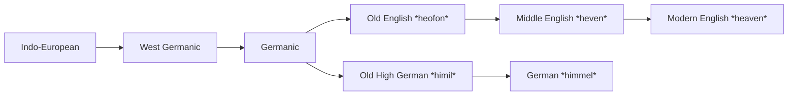
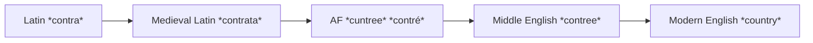
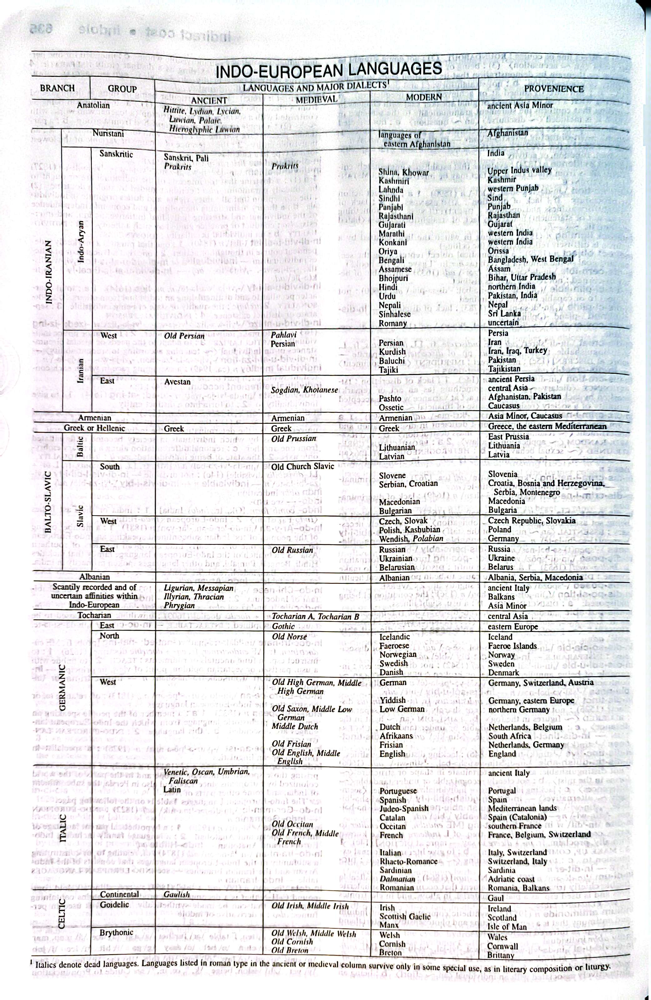
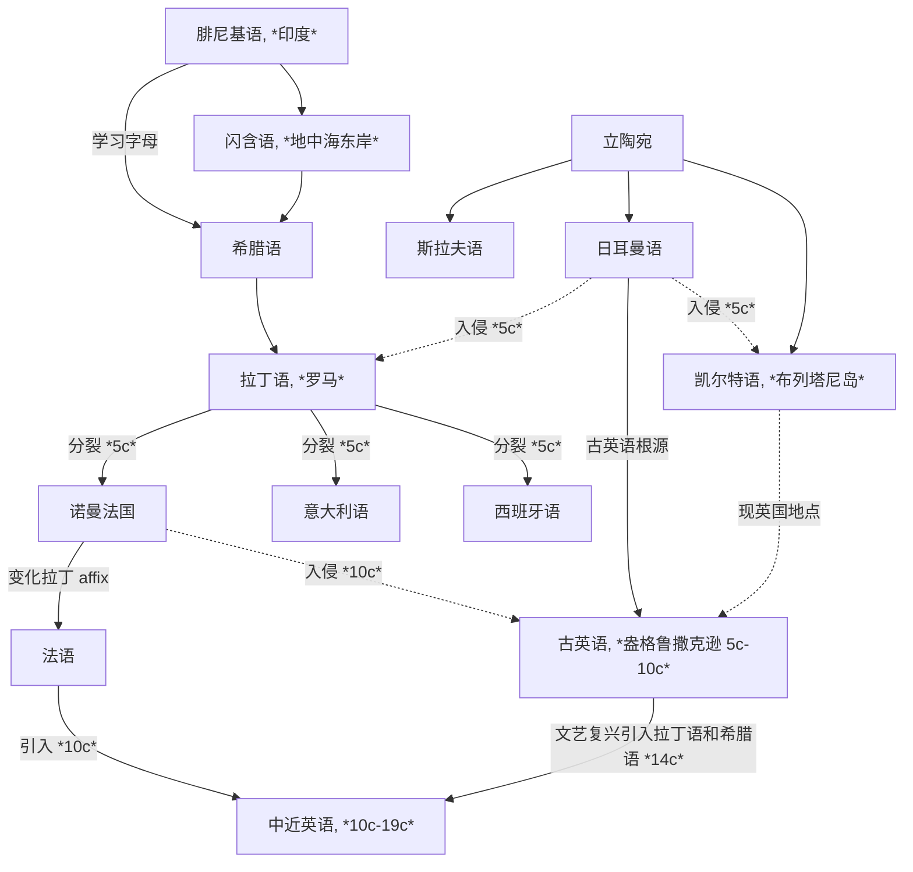

[toc]

## The English Language

Language, studied academically through linguistics, is recognized as a uniquely human activity characterized by [arbitrary](http://localhost:5500/En/dict/arbitrary.html#entry1.1-1b) relationships between sounds and meanings, as well as a systematic nature that enables effective communication. Despite the complexity of language systems, children can quickly learn the essentials, suggesting underlying similarities across languages.

语言学是一门学术学科，被认为是人类独有的活动，其语音和语义之间存在着任意的关系，并具有系统性，从而能够实现有效的沟通. 尽管语言系统错综复杂，但儿童能够快速掌握其基本知识，这表明不同语言之间存在着潜在的相似性.

The major systems that make up the broad comprehensive system of language itself are four in number: lexicon, grammar, semantics, and phonology.

语言本身广泛而全面的系统由四个主要系统组成：词汇、语法、语义和音系.

- **Lexicon** or the vocabulary is the collection of words and word elements which we put together in various ways to form larger units of discourse: phrases, clauses, sentences, paragraphs, and so forth. 词汇就是单词和词素集合，我们将其组合在一起形成更大话语单位：短语、从句、句子、段落等.
- **Grammar** governs the way in which words are put together to form the larger units of discourse mentioned earlier. 语法决定了如何将单词组合成前面提到的更大话语单位.
- **Semantics** has to do with meanings and thus with the relationship between the conventionalized symbols that constitute language and the external reality about which we need to communicate through language. 语义与意义有关，因此与构成语言的规范化符号与通过语言传达的外部现实之间的关系有关.
- **Phonology** is what allows a speaker of that language to transform a grammatical unit embodying a meaning into a flow of uttered sounds that can be heard and interpreted (accurately, if all goes well) by another speaker of the language. 音系是允许语言使用者将包含意义的语法单位转换成另一个语言使用者能够听到并解释（如果一切顺利，准确无误）的发音流.

The largest part of this note is concerned with the systems of English that we have cursorily surveyed in their [synchronic](http://localhost:5500/En/dict/synchronic.html#entry1.1-2b) and [diachronic](http://localhost:5500/En/dict/diachronic.html#entry1.1-1) aspects. In fact, information related to lexicon is given at entries in the dictionary, as well as information related to what could reasonably be considered a fifth system of English and many other (though not all) languages—writing, which provides an alternative to speech that permits long-distance transmission and visual reception of a communication and also enables a record to be kept for much longer than human memory can keep it.

这篇笔记的大部分内容都关注我们粗略概括的英语系统，涵盖了其共时和历时方面. 事实上，词典中的条目不仅提供了与词汇相关的信息，还提供了与可以合理地被视为英语和许多其他（但并非所有）语言的第五大系统——书写系统——相关的信息. 书写系统提供了与语音不同的另一种方式，允许长距离传输和视觉接收通信，并使记录能够比人类记忆保持得更久.

A dictionary is necessarily and obviously concerned with the lexicon above all, and the information it can convey about the language systems is confined to the level of the word or short phrase so the majority of the lexicon, phonology, and grammar systems at rest will be explored in the following sections (see sections on [The History of English](#the-history-of-english), [Phonology](#phonology), and [Grammar](#grammar)).

词典必然且显然关注词汇，它可以传达关于语言系统的信息仅限于单词或短语的水平，因此词汇、音系和语法系统剩余的大部分内容将在以下部分中探讨（见小节 [The History of English](#the-history-of-english)，[Phonology](#phonology)，以及 [Grammar](#grammar)）.

### Explanatory Notes

An [entry](http://localhost:5500/En/dict/entry.html#entry1.1-4b(5)) is a single word or phrase, along with its definition, pronunciation, and example sentences. 或称词条 / 词目

Entries include:

- A **main entry or entry word** 主条目 / 主词条 refers to letters or a combination of such letters including [punctuation mark](http://localhost:5500/En/dict/punctuation_mark.html#entry1.1-1) and [diacritics](http://localhost:5500/En/dict/diacritic.html#entry1.1-1) where needed. In a dictionary it is usually in boldface [type](http://localhost:5500/En/dict/type.html#entry1.1-2c) and set [flush](http://localhost:5500/En/dict/flush.html#entry5.1-4b(1)) with the left-hand margin of each column of [type](http://localhost:5500/En/dict/type.html#entry1.1-2d).
- **Variants in the styling of compound words** 变种复合词 in English is frequent and widespread. It is often completely acceptable to choose freely among:
  - **[Open compounds](http://localhost:5500/En/dict/open_compound.html#entry1.1-1)**, such as *life style*
  - **[Hyphenated compounds](http://localhost:5500/En/dict/hyphenated_compound.html#entry1.1-1)**, such as *life-style*
  - **[Closed](http://localhost:5500/En/dict/closed_compound.html#entry1.1-1)/[Solid compounds](http://localhost:5500/En/dict/solid_compound.html#entry1.1-1)**, such as *lifestyle*
- **Homographs** 同形异义词 are words that are spelled the same but have different meanings and/or different pronunciations. In a dictionary, they are often distinguished by [superscript](http://localhost:5500/En/dict/superscript.html#entry1.1-1) numerals preceding each word. Homographs are created in three ways:
  - Homographs are derived from **the same root**, such as [*melt* entry 1](http://localhost:5500/En/dict/melt.html#entry2.1-1) and [*melt* entry 2](http://localhost:5500/En/dict/melt.html#entry2.1-1).
  - Homographs are **unrelated** beyond the accident of spelling, such as [*pine* entry 1](http://localhost:5500/En/dict/pine.html#entry1.1-1) and [*pine* entry 2](http://localhost:5500/En/dict/pine.html#entry2.1-1)
  - Homographs are derived from **an earlier homograph** by [**functional shift**](http://localhost:5500/En/dict/functional_shift.html#entry1.1-1), such as [noun usage of *superscript*](http://localhost:5500/En/dict/superscript.html#entry1.1-1) and [adjective usage of *superscript*](http://localhost:5500/En/dict/superscript.html#entry1.1-1).
- **The centered dots** 间隔符 within entry words indicate division points at which a hyphen may be put at the end of a line of printing or writing. Centered dots are not shown after a single initial letter or before a single terminal letter because printers [seldom](http://localhost:5500/En/dict/seldom.html#entry1.1-1) cut off a single letter. A double hyphen at the end of a line stands for a hyphen that [belongs](http://localhost:5500/En/dict/belong.html#entry1.1-3) at that point in a hyphenated word and that is retained when the word is written as a unit on one line.
- **[Run-on](http://localhost:5500/En/dict/run-on.html#entry2.1-1) entries** 续写词条 following the defined senses of a main entry, could be:
  - One or more **derivatives** or a **homograph** with a different functional label, such as *[slay](http://localhost:5500/En/dict/slay.html) — [slayer](http://localhost:5500/En/dict/slayer.html)*. They are not defined since their meanings are readily derivable from the meaning of the root word.
  - One or more **phrases** containing the entry word or an inflected form of it, such as *[hole](http://localhost:5500/En/dict/hole.html) — [in the hole](http://localhost:5500/En/dict/hole.html#in_the_hole)*. They are defined since their meanings are more than the sum of the meanings of their elements.
- **Pronunciation** 发音 is indicated between a pair of reversed virgules `\ \` following the entry word
- **Functional labels** 功能标签 indicate **parts of speech** (such as *noun*, *intransitive verb*, etc.) or some other **functional classification** (such as *abbreviation*, *combining form*, etc.). Labeling a verb as transitive, however, does not preclude occasional intransitive use (as in absolute constructions, such as "Weather permitting")
- **Inflected forms** 屈折变化
  - **Noun**
  - **Verbs**
  - **Adjectives & Adverbs**
- **Capitalization** 大写
- **Attributive nouns** 定语名词
- **Usage labels** 用法标签
  - **Temporal labels**
    - **[obsolete](http://localhost:5500/En/dict/obsolete.html#entry1.1-1a)** means that there is no evidence of use since 1755.
    - **[archaic](http://localhost:5500/En/dict/archaic.html#entry1.1-1)** means that a word or sense once in common use is found today only [sporadically](http://localhost:5500/En/dict/sporadically.html#entry1.1-1) or in special contexts
  - **Regional labels**
  - **[Stylistic](http://localhost:5500/En/dict/stylistic.html#entry1.1-1) labels**
    - **[slang](http://localhost:5500/En/dict/slang.html#entry1.1-2)**
    - **nonstandard**
    - **[disparaging](http://localhost:5500/En/dict/disparaging.html#entry1.1-1)**, **offensive**, **obscene**, **vulgar**
  - **Subject labels**
- **Illustrations of usage** 用法示例和插图
- **Definitions** 定义
  - **Usage notes** introduced by a right arrow `→` give supplementary information about such matters as idiom, syntax, semantic relationship, and status.
    - **used ...**
    - **called also** calls attention to one or more terms with the same denotation as the main entry.
  - **Division of senses** reflects something of their semantic relationship, but it does not evaluate senses or set up a [hierarchy](http://localhost:5500/En/dict/hierarchy.html#entry1.1-5) of importance among them. The order of senses is historical.
    - **such as** indicates that the following subsenses are typical or significant examples, while its absence indicates that the following subsenses which follow are [exhaustive](http://localhost:5500/En/dict/exhaustive.html#entry1.1-1).
    - **especially** is used to introduce the most common meaning [subsumed](http://localhost:5500/En/dict/subsume.html#entry1.1-1) in the more general preceding definition.
    - **specifically** is used to introduce a common but highly restricted meaning subsumed in the more general preceding definition.
    - **also** is used to introduce a meaning that is closely related to but may be considered less important than the preceding sense.
    - **broadly** is used to introduce an extended or wider meaning of the preceding definition.
  - **Self-explanatory** definitions are not repeated. Such as the entry *[picked](http://localhost:5500/En/dict/picked.html)* has no definition in such contexts as "picked apples", which is defined as "to gather by plucking" in [*pick* entry 1 sense 3a](http://localhost:5500/En/dict/pick.html#entry1.1-3a).
- **Cross-Reference** 交叉引用 has four different kinds used in the dictionary.
  - **directional** cross-reference that follows a right arrow `→` begins with *see* or *compare*.
    - ***compare*** cross-reference is regularly appended to a definition.
    - ***see*** cross-reference may stand alone.
  - **synonymous** cross-reference  that follows a boldface colon may stand alone as the only definitional matter for an entry or for a sense or subsense of an entry.
  - **[cognate](http://localhost:5500/En/dict/cognate.html#entry1.1-3b)** cross-reference follows an italic ***spelling of***
  - **inflectional** cross-reference follows an italic label that identifies an entry as an inflected form of the original entry.

### The History of English

The history of English is conventionally divided into three periods usually called Old English (or Anglo-Saxon), Middle English, and Modern English.

英语历史通常被划分为三个时期，通常称为古英语（或称盎格鲁-撒克逊语）、中英语和现代英语.

All languages did not simply spring into existence, they have evolved from earlier languages. German, Dutch, Low German, and Frisian share with certain systematic similarities but do not share with, say, Danish, thus philologists know that the ancestors of these languages must have been a common language, called West Germanic, or dialects of it. However, they have had somehow to reconstruct what that language was like in its lexicon, phonology, grammar, and semantics as best they can through sophisticated techniques of comparison. Similarly, because ancient and modern languages like Old Norse and Gothic or Icelandic and Norwegian have points in common with Old English and Old High German or Dutch and English that they do not share with French or Russian, it is clear that there was an earlier unrecorded language that can called simply Germanic and that must be reconstructed in the same way. Still earlier, Germanic was just a dialect (the ancestors of Greek, Latin, and Sanskrit were three other such dialects) of a language conventionally designated Indo-European and thus English is just one relatively young member of an ancient family of languages whose descendants cover a fair portion of the globe.

所有语言都并非凭空而来，而是从更早的语言演变而来. 德语、荷兰语、低地德语和弗里斯兰语具有某些系统上的相似性，但与丹麦语等语言却截然不同. 因此，语言学家知道这些语言的祖先必定是一种名为西日耳曼语的通用语言，或其方言. 然而，他们必须通过复杂的比较技术，尽可能地重建该语言的词汇、音系、语法和语义. 同样，由于古代和现代语言，例如古挪威语和哥特语、冰岛语和挪威语，与古英语和古高地德语、荷兰语和英语存在共同点，而与法语或俄语则有所不同，因此，显然存在一种更早的、未被记录的语言，可以简单地称为日耳曼语，并且必须以同样的方式重建. 再往更早走，日耳曼语只是通常被认定为印欧语系的一种方言（希腊语、拉丁语和梵语的祖先是另外三种方言），因此英语只是一个古老语言家族中相对年轻的成员，该语言的后代覆盖了全球相当一部分地区.

单词可能是本身 created in English（日耳曼语、OE 古英语、ME 中世纪英语），或是 borrowed into English（1066 诺曼征服 Anglo-French 盎格鲁-法语、French 法语、Latin 拉丁语，或是 14c-16c 文艺复兴 Latin 拉丁语、Greek 希腊语，甚至其他世界各国的语言），以下两单词为例子：

*heaven*: Middle English *heven*, from Old English *heofon*; akin to Old High German *himil* heaven

*country*: Middle English *contree*, from Anglo-French *cuntree*, *contré*, from Medieval Latin *contrata*, from Latin *contra* (against, on the opposite side)

只有 Latin *contra* 有定义 against, on the opposite side，是因为其他词与现代英语含义相同所以不再填入

the relationships of sound and meaning and their changes over time that underlie the reconstruction of the Indo-European family 支撑印欧语族重建的音与义之间的关系及其随时间的变化也是词源研究中的重要内容

lexicon and semantic change 词汇和词义演化过程中有很多变化方式，重要的有：

- 外源变化
  - borrowing 借词，直接从其他语言中借入，例如来自日本的 *ninja*
  - folk etymology 民间词源学，由相似名词产生的语义变化，例如 *Jerusalem artichoke* (意为耶路撒冷艺术花，实际上并非来自耶路撒冷，而是来自意大利 *girasole*)
  - myth, legend, and fable 神话、传说和寓言，例如 *behemoth* (意为庞然大物或霸主，源自圣经中的一个巨兽 *Behemoth*)
  - eponymy, transfer of personal or place names 以人名或地名命名，例如 *silhouette* (意为剪纸或黑影，因法国财政管理因为爱好剪纸得名) 或是 *denim* (意为牛仔布，因法国纺织名城得名)
  - imitation of sounds 拟声，例如 *whiz* (意为像风一样呼啸的声音)
  - reanalysis 重分析，词汇的读音或词形可能被误解或重新分析，例如 *apron* (意为围裙，源于 *a napron* 的读音而被误解为 *an apron* 的连读，从而在 17 世界 *napron* 被 *apron* 取代)
  - taboo or swear word replacement, avoidance of obscenity, euphemism  禁忌或脏话替换，回避不雅词汇，委婉语，例如 *heck* (是 *hell* 的委婉语)
- 词形构造
  - ellipsis, shortening or clipping 缩写，例如 *prom* (意为舞会，缩写自 *promenade*)
  - acronyms, combination of initial letters 首字母缩写，例如 *radar* (意为雷达，缩写自 *{++ra++}dio {++d++}etection {++a++}nd {++r++}anging*)
  - formation, blending of two words 复合词，例如 *motel* (意为汽车旅馆，复合自 *motor* 和 *hotel*)
  - back-formation 逆构，例如 grid (意为网格，是 *gridiron* 烤架的逆构词，也就是 *gridiron* 使用要比 *grid* 更早)
  - Affixation, combination of roots, prefixes, and suffixes (Some from French, but the most directly from Latin or Greek) 词缀法造词，例如 *unhappy* (意为不快乐的，复合自 *un-* from French 和 *happy* from Latin)
- 语义演变
  - functional shift 功能转变，词性转变，例如 noun *commute* from the verb *commute*
  - broadening/generalization 扩展义/泛指，例如 *holiday* (原指宗教节日，后被泛指为任何假日)
  - narrowing/specialization 缩小义/狭义，例如 *meat* (原指任何非饮用的食物，后被狭义为肉)
  - metaphor 隐喻，基于相似性 (similarity)，例如 *mouse* (原指老鼠，由于鼠标形状相似，从而也用来指鼠标)
  - metonymy 转喻/换喻，基于相关性 (contiguity)，例如 *horn* (原指动物角，因有由动物角制成的号角，从而也用来指乐器号角、喇叭)
  - synecdoche 提喻，一种基于部分与整体关系的转喻，例如 *hand* in *all hands on deck* (原指手，在这里用局部代表整体，本体是 *body* 指身体，可以翻译成: 所有人都在甲板上)
  - amelioration/elevation 改进/提拔，例如 *knight* (原指男孩、仆人，后指骑士、爵士)
  - degeneration/pejoration 衰退/贬低，例如 *knave* (原指男孩，后指男仆、恶棍)
  - hyperbole 夸张，加重含义，例如 *hundreds* (原指整数 100-999，后夸张到表示很多)
  - meiosis 弱化，减轻含义，例如 *silly* (原指愚蠢，后弱化到无聊、微不足道)
  - antiphrasis/irony 反义/反语，例如 *perfect lady* (在某些语境下可能指 "prostitute" 妓女)，*bad* (在俚语里会用于 *good* 好的)

Latin 动词、名词、形容词等词性可能都存在相同部分或基本单元，称为词根 (root)，由词根在不同词性下加入第一词缀形成的基本形态称为词干 (stem)，两者可能在形态上相同，但定位不同，后者是基于同一单词同一词性下不同屈折变化 (inflection) 的形态，例如：

Latin root ***fac*** (意为做、做某事)，有

- Verb ***facere*** (first-person singular present active indicative *faciō*; passive infinitive *facī*) (意为做、制造)

  Latin 动词分为四种主要形态，*faciō* (present active 进行时词干)、*facere* (infinitive 不定式)、*fēcī* (perfect active 完成时词干)、*factus* (perfect passive 过去分词)，其变位法 (conjugation) 非常复杂，大部分规则的动词以其不定式 (infinitive) 结尾区分变位法:

  - 1c: -āre
  - 2c: -ēre
  - 3c: -ere
  - 4c: -īre

  *facere* 是 third conjugation -iō stem 第三变位 i-词干 (并不完全正确，可见 [wiki](https://en.wiktionary.org/wiki/facio)):

  ||||||||||||||||
  | :-: | :-: | :-: | :-: | :-: | :-: | :-: | :-: | :-: | :-: | :-: | :-: | :-: | :-: | :-: |
  | **mood 语气** | **person 人称** | **aspect 体 →** | **imperfect 未完成时** |||||| **perfect 完成时** ||||||
  | ^ | ^ | **voice 语态 →** | **active 主动** ||| **passive 被动** ||| **active** ||| **passive** |||
  | ^ | ^ | **tense 时态 →** | **present** | **past** | **future** | **present** | **past** | **future** | **present** | **past** | **future** | **present** | **past** | **future** |
  | **indicative 陈述** | **1st-person 第一人称** | **singular 单数** |  ***faciō*** | *faciēbam* | *faciam* | *facior* | *faciēbar* | *faciar* | ***fēcī*** | *fēceram* | *fēcerō* | ***factus/-a/-um sum*** | *factus/-a/-um **eram*** | *factus/-a/-um **erō*** |
  | ^ | ^ | **plural 复数** | *facimus* | *faciēbāmus* | *faciēmus* | *facimur* | *faciēbāmur* | *faciēmur* | *fēcimus* | *fēcerāmus* | *fēcerimus* | *factī/-ae/-a **sumus*** | *factī/-ae/-a **erāmus*** | *factī/-ae/-a **erimus*** |
  | ^ | **2nd-person 第二人称** | **singular 单数** | *facis* | *faciēbās* | *faciēs* | *faceris* | *faciēbāris* | *faciēris* | *fēcistī* | *fēcerās* | *fēceris* | *factus/-a/-um **es*** | *factus/-a/-um **erās*** | *factus/-a/-um **eris*** |
  | ^ | ^ | **plural 复数** | *facitis* | *faciēbātis* | *faciētis* | *faciminī* | *faciēbāminī* | *faciēminī* | *fēcistis* | *fēcerātis* | *fēceritis* | *factī/-ae/-a **estis*** | *factī/-ae/-a **erātis*** | *factī/-ae/-a **eritis*** |
  | ^ | **3rd-person 第三人称** | **singular 单数** | *facit* | *faciēbat* | *faciet* | *facitur* | *faciēbātur* | *faciētur* | *fēcit* | *fēcerat* | *fēcerit* | *factus/-a/-um **est*** | *factus/-a/-um **erat*** | *factus/-a/-um **erit*** |
  | ^ | ^ | **plural 复数** | *facunt* | *faciēbant* | *facient* | *facuntur* | *faciēbantur* | *facientur* | *fēcērunt* | *fēcerant* | *fēcerint* | *factī/-ae/-a **sunt*** | *factī/-ae/-a **erant*** | *factī/-ae/-a **erunt*** |
  | **subjunctive 虚拟** | **1st-person 第一人称** | **singular 单数** | *faciam* | *facērem* | - | *faciar* | *facērer* | - | *fēcerim* | *fēcissem* | - | *factus/-a/-um **sim*** | *factus/-a/-um **essem*** | - |
  | ^ | ^ | **plural 复数** | *faciāmus* | *facēremus* | ^ | *faciāmur* | *facērēmur* | ^ | *fēcerimus* | *fēcissēmus* | ^ | *factī/-ae/-a **sīmus*** | *factī/-ae/-a **essēmus*** | ^ |
  | ^ | **2nd-person 第二人称** | **singular 单数** | *faciās* | *facērēs* | ^ | *faciāris* | *facērēris* | ^ | *fēceris* | *fēcissēs* | ^ | *factus/-a/-um **sīs*** | *factus/-a/-um **essēs*** | ^ |
  | ^ | ^ | **plural 复数** | *faciātis* | *facērētis* | ^ | *faciāminī* | *facērēminī* | ^ | *fēceritis* | *fēcissētis* | ^ | *factī/-ae/-a **sītis*** | *factī/-ae/-a **essētis*** | ^ |
  | ^ | **3rd-person 第三人称** | **singular 单数** | *faciat* | *facēret* | ^ | *faciātur* | *facērētur* | ^ | *fēcerit* | *fēcisset* | ^ | *factus/-a/-um **sit*** | *factus/-a/-um **esset*** | ^ |
  | ^ | ^ | **plural 复数** | *faciant* | *facērent* | ^ | *faciantur* | *facērentur* | ^ | *fēcerint* | *fēcissent* | ^ | *factī/-ae/-a **sint*** | *factī/-ae/-a **essent*** | ^ |
  | **imperative 命令** | **2nd-person 第二人称** | **singular 单数** | *face* | - | *facitō* | - | - | - | - ||||||
  | ^ | ^ | **plural 复数** | *facite* | ^ | *facitōte* | ^ | ^ | ^ | ^ ||||||
  | ^ | **3rd-person 第三人称** | **singular 单数** | - | ^ | *facitō* | ^ | ^ | ^ | ^ ||||||
  | ^ | ^ | **plural 复数** | ^ | ^ | *facitōte* | ^ | ^ | ^ | ^ ||||||

  Latin 动词分词 (participles) 是由动词构成的形容词或名词有四种:

  - present active participle 现在主动分词: 将词尾的 -re 改成 -ns 作为名词主格，3c i-stem 第三变位法 i-词干要额外加 -i-，4c 第四变位法要额外加 -e-；例如 *fac{++i++}{++ēns++}*
  - perfect passive participle 完成被动分词 (也称 past participle 过去分词): 与动词第四形态一致，在作 supine 宾格动名词时，需使用 -um 结尾；例如 *fact**us/-a/-um***
  - future active participle 将来主动分词: 在过去分词词尾前加 -ūr-，在作 supine 宾格动名词时，需使用 -um 结尾；例如 *fact{++ūr++}**us/-a/-um***
  - future passive participle 将来被动分词 (也称 gerundive 动形词): 与现在主动分词类似，不过将 -ns 换成 -nd，再加入过去分词的词尾，在作 supine 宾格动名词时，需使用 -um 结尾；例如 *fac{++i++}{++end++}**us/-a/-um**

  Latin 动词不定式有七种:

  - present active infinitive 现在主动不定式: 最主要的动词不定式，不受语态和时态影响；例如 *facere* "to do"
  - present passive infinitive 现在被动不定式: 将现在主动不定式的词尾改为 -rī，但第三变位法将 -ere 改为 -ī；例如 *facī* "to be done"
  - perfect active infinitive 完成主动不定式: 在动词第三形态的词干上加 -isse；例如 *fēcisse* "to have done"
  - perfect passive infinitive 完成被动不定式: 动词完成被动分词/过去分词和助动词 esse 共同构成；例如 *factus/-a/-um esse* "to have been done"
  - future active infinitive 将来主动不定式: 动词将来主动分词和助动词 esse 共同构成；例如 *factūrus/-a/-um esse* "to be going to do"
  - future passive infinitive 将来被动不定式: 动词完成被动分词/过去分词作 supine 宾格动名词，与助动词 īrī 共同构成；例如 *factum īrī* "to be going to be done"
  - potential infinitive 潜在不定式: 动词将来主动分词和助动词 fuisse 共同构成；例如 *factūrus/-a/-um fuisse* "would do" or "would have done"

- Noun ***factum*** (genitive *factī*) (意为事实、行为);
  
  Latin 名词有六个格和五种变格法 (declension)，大部分规则的名词可以通过单数属格 (genitive singular) 的词尾区分变格法:

  - 1d: 以 a 为主要字母，-ae
  - 2d: 以 o 为主要字母，-ī
  - 3d: 以 i 为主要字母，-is
  - 4d: 以 u 为主要字母，-ūs
  - 5d: 以 e 为主要字母，-ēī/-eī

  *factum* 是 second declension 第二变格:

  | declension 变格 | singular | plural |
  | --------------- | -------- | ------ |
  | nominative 主格 | *factum* | *facta* |
  | genitive 属格 | *factī* | *factōrum* |
  | dative 与格 | *factō* | *factīs* |
  | accusative 宾格 | *factum* | *facta* |
  | ablative 夺格 | *factō* | *factīs* |
  | vocative 呼格 | *factum* | *facta* |

- Adjective ***factīcius*** (意为人造的、人为的)

  Latin 形容词变格方式与名词几乎一致，可分为两类:

  - 1d-2d: 区分阴阳中性，变格法与名词十分类似，多数以 -us/-a/um 结尾
  - 3d: 不对名词词性做太大区分，使用第三变格法，都是 i-stem 词干形容词，变格时需要适当加 -i-
  
  *factīcius* 是前者:

  ||||||||
  | :-----------------: | :-: | :-: | :-: | :-: | :-: | :-: |
  | **declension 变格** | **singular**  ||| **plural**    |||
  | ^ | **masculine 阳性** | **feminine 阴性** | **neuter 中性** | **masculine** | **feminine** | **neuter** |
  | nominative 主格 | *factīcius* | *factīcia* | *factīcium* | *factīciī* | *factīciae* | *factīcia* |
  | genitive 属格 | *factīciī* | *factīciae* | *factīciī* | *factīciōrum* | *factīciārum* | *factīciōrum* |
  | dative 与格 | *factīciō* | *factīciae* | *factīciō* | *factīciīs* |||
  | accusative 宾格 | *factīcium* | *factīciam* | *factīcium* | *factīciōs* | *factīciās* | *factīcia* |
  | ablative 夺格 | *factīciō* | *factīciā* | *factīciō* | *factīciīs* |||
  | vocative 呼格 | *factīcie* | *factīcia* | *factīcium* | *factīciī* | *factīciae* | *factīcia* |

#### Prehistory of English

**Indo-European languages (印欧语系)** 有两个起源地：**立陶宛地区**和**地中海东岸的闪含语系地区**——来源于 **Phoenician (腓尼基语)**

西北欧的地区大部分是来源于立陶宛语系，地区交流促成了主要的 **Germanic (日耳曼)**、**Celtic (凯尔特)**、**Slavic (斯拉夫)** 语系（B.C. 9c - A.D. 0c）；现代欧洲语言**文字**的 ancestor 是**腓尼基字母**，希腊人在腓尼基字母的基础上创造出希腊字母，形成了 **Greek (古希腊语)**，之后又被意大利地区古罗马和拉丁人学习形成了 **Latin (拉丁语)**；希腊语和拉丁语不注重语法和介词等，用**词根词缀**即可表示复杂的信息

罗马帝国扩张后，拉丁语逐渐取代古希腊语，欧洲西边大部分讲拉丁语，东边讲希腊语；英国虽处于西边，但并未全部被拉丁语辐射到，仍然是凯尔特人为主（A.D. 0c - 5c）

#### Old English

在罗马帝国末期，日耳曼人入侵凯尔特，凯尔特人被迫逃离，与现代英语几乎无关系，而英语则是属于**日耳曼语族**，与德国、荷兰有相同的起源. 此时被视为英语的起源，盎格鲁撒克逊的**古英语**. 之后英语又被讲另一种日耳曼语的维京人入侵，融合的英语形成了**比较完善的语法结构**，但**失去了日耳曼复合构词的变化**（也就是为什么同是日耳曼语族，英语中的复合构词要比德语和荷兰语少得多）（5c - 10c）；罗马分裂后，拉丁语衍生成多种语言，例如法国、西班牙、意大利等，但 French 追求自己的一套 affix 方法，所以现在的西语和意大利语相比于法语而言更贴近拉丁语. 这些语言被统称为 **Romance Language (罗曼语族/罗马语族/拉丁语族)**. 此时已经很少有地区会讲拉丁语了

the migration of certain Germanic tribes from the Continent to Britain in the 5c, though no records of their language survive from before 7c.

在5世纪，某些日耳曼部落从大陆迁移到英国，但他们的语言在7世纪之前没有留下任何记录.

the end of 11c, Latin, Old Norse (the language of the Viking invaders), and especially the Anglo-French of the dominant class after the Norman Conquest in 1066 had begun to have a substantial impact on the lexicon and the well-developed inflectional system that typifies the grammar of Old English had begun to break down.

11世纪末，拉丁语、诺曼语（维京入侵者的语言）以及特别是1066年诺曼征服后主导阶级的盎格鲁-法语，已经开始对词汇和典型于古英语的完善屈折系统产生重大影响，古英语的屈折系统已经开始崩溃.

#### Middle English

中世纪（10c）和近代现代（14c -）时期，英国先后发生了法国入侵和文艺复兴. 法国（诺曼法）入侵带来了大量**法语词汇**（本质是来源于拉丁语，但词缀拓展与拉丁语略有不同），文艺复兴时期都认为**拉丁语是代表着学术文明和高等教育**，而**日耳曼语象征着野蛮和低劣**，所以有大量**学术名词**都是来源于**拉丁语**和**希腊语**，这导致了现代英语的大量词汇会与罗曼语族的语言（如法语、意大利语、西班牙语等）有更多相似之处

extends roughly from 12c through 15c, the influence of French (and Latin, often by way of French) upon the lexicon continued.

大约从12世纪到15世纪，法语（以及拉丁语，通常通过法语）对词汇的影响继续存在. 长达两个世纪的征服时期，法语作为统治阶级的官方语言.

the loss of some inflections and the reduction of others (often to a final unstressed vowel spelled *-e*) accelerated, and many changes took place within the phonological and grammatical systems of the language.

一些屈折的丧失和其它屈折的减少（通常减少到末尾的未强调元音，拼写为 *-e*）加速了，语言音系和语法系统中的许多变化发生了.

1300 年左右，英语又重新成为英格兰的 "官方语言".

#### Modern English

extends from the 16c to our own day.

从16世纪到我们今天为止.

The early part of this period saw the completion of a revolution in the phonology of English that had begun in late Middle English and that effective redistributed the occurrence of the vowel phonemes to something approximating their present pattern.

这一时期的早期见证了英语音系中一场革命的完成，这场革命始于中世纪晚期，有效地重新分配了元音音素的出现，使其接近现在的模式.

Other important early developments include the stabilizing effect on spelling of the printing press and the beginning of the direct influence of Latin and, to a lesser extent, Greek on the lexicon.

其他重要的早期发展包括印刷机对拼写的影响的稳定，以及拉丁语和在一定程度上希腊语对词汇的直接影响开始出现.

1476 年 William Caxtond 在英国引进使用印刷机，标志着中世纪英语转入现代英语阶段.

文艺复兴时期，更多的拉丁和希腊词汇加入英语. 文艺复兴时期的作家们，用外借和造字等方法成套地扩大了英语词汇. 16 世纪末，英语拼写逐渐规范，拉丁语，法语，意大利语，希腊语，日耳曼语，阿拉伯语，印度语，西班牙语等源源不断地注入英语之河流，一些外来语词汇保留了其拼写与发音. 这就造成了英语词汇的 "多样性" 与 "复杂性".

Later, as English came into contact with other cultures around the world and distinctive dialects of English developed in the many areas which Britain had colonized, numerous other languages made small but interesting contribution to word-stock.

后来，随着英语与世界各地的其他文化接触，以及英国在许多地区殖民而形成的英语方言，许多其他语言对词汇库做出了小但有趣的小贡献.

18 世纪，随着"日不落帝国"的全球扩张，英国统治阶层感受到 "英文的混乱" 阻碍制约着大英帝国的全球殖民与贸易进程，由政府倡议学界组织的对 "英语" 进行统一编纂整理的"军团"成立，大批的贵族参与到英文的改革完善队伍中来，改良完善内容包括：语法、发音与拼写. 从而使得 "现代英语" 语法繁多而严谨，词汇丰富而规范. 例如：在现代英语中，"月亮moon" 这个单词可以被溯源到来自中世纪的古英语单词——"mōna".

### Phonology

### Grammar

## Logs

### Listening & Speaking

### Vocabulary

<!--  -->

<!--  -->

<!--  -->

### Reading & Writing

<!--  -->

<!--  -->

<!--  -->

## Exams

### National Postgraduate Entrance Examination (NPEE) English I

<!--  -->

<!--  -->

<!--  -->

<!--  -->

<!--  -->