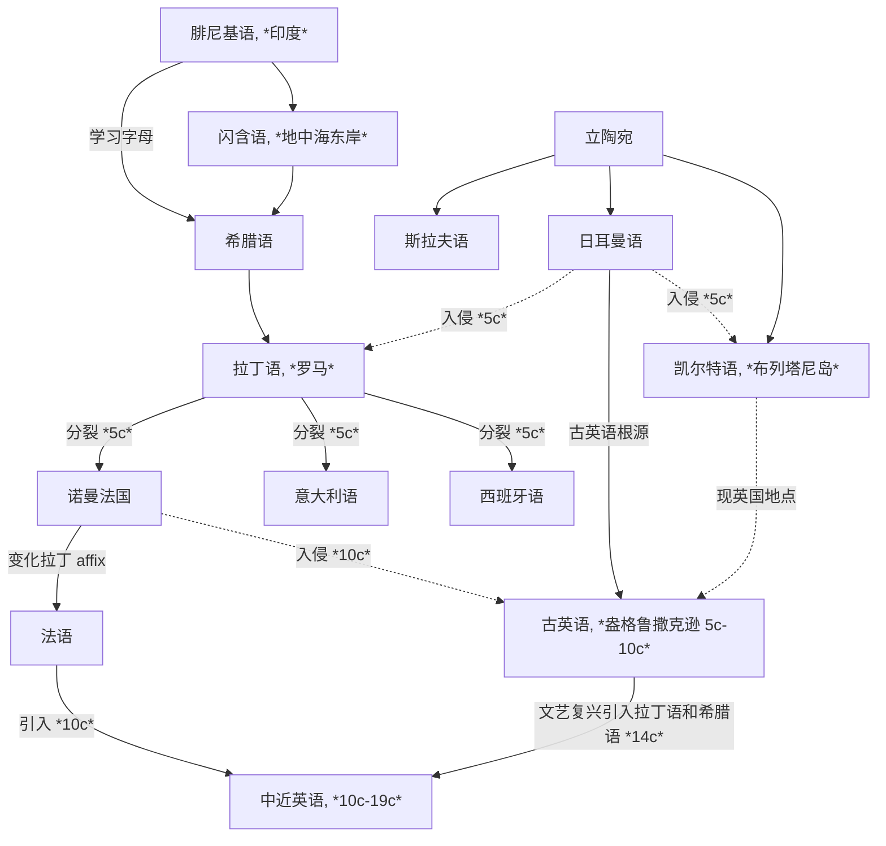

[toc]

## The English Language

Language, studied academically through linguistics, is recognized as a uniquely human activity characterized by [arbitrary](http://localhost:5500/En/dict/arbitrary.html#entry1.1-1b) relationships between sounds and meanings, as well as a systematic nature that enables effective communication. Despite the complexity of language systems, children can quickly learn the essentials, suggesting underlying similarities across languages.

语言学是一门学术学科，被认为是人类独有的活动，其语音和语义之间存在着任意的关系，并具有系统性，从而能够实现有效的沟通. 尽管语言系统错综复杂，但儿童能够快速掌握其基本知识，这表明不同语言之间存在着潜在的相似性.

The major systems that make up the broad comprehensive system of language itself are four in number: lexicon, grammar, semantics, and phonology.

语言本身广泛而全面的系统由四个主要系统组成：词汇、语法、语义和音系.

- **Lexicon** or the vocabulary is the collection of words and word elements which we put together in various ways to form larger units of discourse: phrases, clauses, sentences, paragraphs, and so forth. 词汇就是单词和词素集合，我们将其组合在一起形成更大话语单位：短语、从句、句子、段落等.
- **Grammar** governs the way in which words are put together to form the larger units of discourse mentioned earlier. 语法决定了如何将单词组合成前面提到的更大话语单位.
- **Semantics** has to do with meanings and thus with the relationship between the conventionalized symbols that constitute language and the external reality about which we need to communicate through language. 语义与意义有关，因此与构成语言的规范化符号与通过语言传达的外部现实之间的关系有关.
- **Phonology** is what allows a speaker of that language to transform a grammatical unit embodying a meaning into a flow of uttered sounds that can be heard and interpreted (accurately, if all goes well) by another speaker of the language. 音系是允许语言使用者将包含意义的语法单位转换成另一个语言使用者能够听到并解释（如果一切顺利，准确无误）的发音流.

The largest part of this note is concerned with the systems of English that we have cursorily surveyed in their [synchronic](http://localhost:5500/En/dict/synchronic.html#entry1.1-2b) and [diachronic](http://localhost:5500/En/dict/diachronic.html#entry1.1-1) aspects. In fact, information related to lexicon is given at entries in the dictionary, as well as information related to what could reasonably be considered a fifth system of English and many other (though not all) languages—writing, which provides an alternative to speech that permits long-distance transmission and visual reception of a communication and also enables a record to be kept for much longer than human memory can keep it.

这篇笔记的大部分内容都关注我们粗略概括的英语系统，涵盖了其共时和历时方面. 事实上，词典中的条目不仅提供了与词汇相关的信息，还提供了与可以合理地被视为英语和许多其他（但并非所有）语言的第五大系统——书写系统——相关的信息. 书写系统提供了与语音不同的另一种方式，允许长距离传输和视觉接收通信，并使记录能够比人类记忆保持得更久.

A dictionary is necessarily and obviously concerned with the lexicon above all, and the information it can convey about the language systems is confined to the level of the word or short phrase so the majority of the lexicon, phonology, and grammar systems at rest will be explored in the following sections (see sections on [The History of English](#the-history-of-english), [Phonology](#phonology), and [Grammar](#grammar)).

词典必然且显然关注词汇，它可以传达关于语言系统的信息仅限于单词或短语的水平，因此词汇、音系和语法系统剩余的大部分内容将在以下部分中探讨（见小节 [The History of English](#the-history-of-english)，[Phonology](#phonology)，以及 [Grammar](#grammar)）.

### Explanatory Notes

An [entry](http://localhost:5500/En/dict/entry.html#entry1.1-4b(5)) is a single word or phrase, along with its definition, pronunciation, and example sentences. 或称词条 / 词目

Entries include:

- A **main entry or entry word** 主条目 / 主词条 refers to letters or a combination of such letters including [punctuation mark](http://localhost:5500/En/dict/punctuation_mark.html#entry1.1-1) and [diacritics](http://localhost:5500/En/dict/diacritic.html#entry1.1-1) where needed. In a dictionary it is usually in boldface [type](http://localhost:5500/En/dict/type.html#entry1.1-2c) and set [flush](http://localhost:5500/En/dict/flush.html#entry5.1-4b(1)) with the left-hand margin of each column of [type](http://localhost:5500/En/dict/type.html#entry1.1-2d).
- **Variants in the styling of compound words** 变种复合词 in English is frequent and widespread. It is often completely acceptable to choose freely among:
  - **[Open compounds](http://localhost:5500/En/dict/open_compound.html#entry1.1-1)**, such as *life style*
  - **[Hyphenated compounds](http://localhost:5500/En/dict/hyphenated_compound.html#entry1.1-1)**, such as *life-style*
  - **[Closed](http://localhost:5500/En/dict/closed_compound.html#entry1.1-1)/[Solid compounds](http://localhost:5500/En/dict/solid_compound.html#entry1.1-1)**, such as *lifestyle*
- **Homographs** 同形异义词 are words that are spelled the same but have different meanings and/or different pronunciations. In a dictionary, they are often distinguished by [superscript](http://localhost:5500/En/dict/superscript.html#entry1.1-1) numerals preceding each word. Homographs are created in three ways:
  - Homographs are derived from **the same root**, such as [*melt* entry 1](http://localhost:5500/En/dict/melt.html#entry2.1-1) and [*melt* entry 2](http://localhost:5500/En/dict/melt.html#entry2.1-1).
  - Homographs are **unrelated** beyond the accident of spelling, such as [*pine* entry 1](http://localhost:5500/En/dict/pine.html#entry1.1-1) and [*pine* entry 2](http://localhost:5500/En/dict/pine.html#entry2.1-1)
  - Homographs are derived from **an earlier homograph** by [**functional shift**](http://localhost:5500/En/dict/functional_shift.html#entry1.1-1), such as [noun usage of *superscript*](http://localhost:5500/En/dict/superscript.html#entry1.1-1) and [adjective usage of *superscript*](http://localhost:5500/En/dict/superscript.html#entry1.1-1).
- **The centered dots** 间隔符 within entry words indicate division points at which a hyphen may be put at the end of a line of printing or writing. Centered dots are not shown after a single initial letter or before a single terminal letter because printers [seldom](http://localhost:5500/En/dict/seldom.html#entry1.1-1) cut off a single letter. A double hyphen at the end of a line stands for a hyphen that [belongs](http://localhost:5500/En/dict/belong.html#entry1.1-3) at that point in a hyphenated word and that is retained when the word is written as a unit on one line.
- **[Run-on](http://localhost:5500/En/dict/run-on.html#entry2.1-1) entries** 续写词条 following the defined senses of a main entry, could be:
  - One or more **derivatives** or a **homograph** with a different functional label, such as *[slay](http://localhost:5500/En/dict/slay.html) — [slayer](http://localhost:5500/En/dict/slayer.html)*. They are not defined since their meanings are readily derivable from the meaning of the root word.
  - One or more **phrases** containing the entry word or an inflected form of it, such as *[hole](http://localhost:5500/En/dict/hole.html) — [in the hole](http://localhost:5500/En/dict/hole.html#in_the_hole)*. They are defined since their meanings are more than the sum of the meanings of their elements.
- **Pronunciation** 发音 is indicated between a pair of reversed virgules `\ \` following the entry word
- **Functional labels** 功能标签 indicate **parts of speech** (such as *noun*, *intransitive verb*, etc.) or some other **functional classification** (such as *abbreviation*, *combining form*, etc.). Labeling a verb as transitive, however, does not preclude occasional intransitive use (as in absolute constructions, such as "Weather permitting")
- **Inflected forms** 屈折变化
  - **Noun**
  - **Verbs**
  - **Adjectives & Adverbs**
- **Capitalization** 大写
- **Attributive nouns** 定语名词
- **Usage labels** 用法标签
  - **Temporal labels**
    - **[obsolete](http://localhost:5500/En/dict/obsolete.html#entry1.1-1a)** means that there is no evidence of use since 1755.
    - **[archaic](http://localhost:5500/En/dict/archaic.html#entry1.1-1)** means that a word or sense once in common use is found today only [sporadically](http://localhost:5500/En/dict/sporadically.html#entry1.1-1) or in special contexts
  - **Regional labels**
  - **[Stylistic](http://localhost:5500/En/dict/stylistic.html#entry1.1-1) labels**
    - **[slang](http://localhost:5500/En/dict/slang.html#entry1.1-2)**
    - **nonstandard**
    - **[disparaging](http://localhost:5500/En/dict/disparaging.html#entry1.1-1)**, **offensive**, **obscene**, **vulgar**
  - **Subject labels**
- **Illustrations of usage** 用法示例和插图
- **Definitions** 定义
  - **Usage notes** introduced by a right arrow `→` give supplementary information about such matters as idiom, syntax, semantic relationship, and status.
    - **used ...**
    - **called also** calls attention to one or more terms with the same denotation as the main entry.
  - **Division of senses** reflects something of their semantic relationship, but it does not evaluate senses or set up a [hierarchy](http://localhost:5500/En/dict/hierarchy.html#entry1.1-5) of importance among them. The order of senses is historical.
    - **such as** indicates that the following subsenses are typical or significant examples, while its absence indicates that the following subsenses which follow are [exhaustive](http://localhost:5500/En/dict/exhaustive.html#entry1.1-1).
    - **especially** is used to introduce the most common meaning [subsumed](http://localhost:5500/En/dict/subsume.html#entry1.1-1) in the more general preceding definition.
    - **specifically** is used to introduce a common but highly restricted meaning subsumed in the more general preceding definition.
    - **also** is used to introduce a meaning that is closely related to but may be considered less important than the preceding sense.
    - **broadly** is used to introduce an extended or wider meaning of the preceding definition.
  - **Self-explanatory** definitions are not repeated. Such as the entry *[picked](http://localhost:5500/En/dict/picked.html)* has no definition in such contexts as "picked apples", which is defined as "to gather by plucking" in [*pick* entry 1 sense 3a](http://localhost:5500/En/dict/pick.html#entry1.1-3a).
- **Cross-Reference** 交叉引用 has four different kinds used in the dictionary.
  - **directional** cross-reference that follows a right arrow `→` begins with *see* or *compare*.
    - ***compare*** cross-reference is regularly appended to a definition.
    - ***see*** cross-reference may stand alone.
  - **synonymous** cross-reference  that follows a boldface colon may stand alone as the only definitional matter for an entry or for a sense or subsense of an entry.
  - **[cognate](http://localhost:5500/En/dict/cognate.html#entry1.1-3b)** cross-reference follows an italic ***spelling of***
  - **inflectional** cross-reference follows an italic label that identifies an entry as an inflected form of the original entry.

### The History of English

**Indo-European languages (印欧语系)** 有两个起源地：**立陶宛地区**和**地中海东岸的闪含语系地区**——来源于 **Phoenician (腓尼基语)**

西北欧的地区大部分是来源于立陶宛语系，地区交流促成了主要的 **Germanic (日耳曼)**、**Celtic (凯尔特)**、**Slavic (斯拉夫)** 语系（B.C. 9c - A.D. 0c）；现代欧洲语言**文字**的 ancestor 是**腓尼基字母**，希腊人在腓尼基字母的基础上创造出希腊字母，形成了 **Greek (古希腊语)**，之后又被意大利地区古罗马和拉丁人学习形成了 **Latin (拉丁语)**；希腊语和拉丁语不注重语法和介词等，用**词根词缀**即可表示复杂的信息

罗马帝国扩张后，拉丁语逐渐取代古希腊语，欧洲西边大部分讲拉丁语，东边讲希腊语；英国虽处于西边，但并未全部被拉丁语辐射到，仍然是凯尔特人为主（A.D. 0c - 5c）

在罗马帝国末期，日耳曼人入侵凯尔特，凯尔特人被迫逃离，与现代英语几乎无关系，而英语则是属于**日耳曼语族**，与德国、荷兰有相同的起源. 此时被视为英语的起源，盎格鲁撒克逊的**古英语**. 之后英语又被讲另一种日耳曼语的维京人入侵，融合的英语形成了**比较完善的语法结构**，但**失去了日耳曼复合构词的变化**（也就是为什么同是日耳曼语族，英语中的复合构词要比德语和荷兰语少得多）（5c - 10c）；罗马分裂后，拉丁语衍生成多种语言，例如法国、西班牙、意大利等，但 French 追求自己的一套 affix 方法，所以现在的西语和意大利语相比于法语而言更贴近拉丁语. 这些语言被统称为 **Romance Language (罗曼语族/罗马语族/拉丁语族)**. 此时已经很少有地区会讲拉丁语了

中世纪（10c）和近代现代（14c -）时期，英国先后发生了法国入侵和文艺复兴. 法国（诺曼法）入侵带来了大量**法语词汇**（本质是来源于拉丁语，但词缀拓展与拉丁语略有不同），文艺复兴时期都认为**拉丁语是代表着学术文明和高等教育**，而**日耳曼语象征着野蛮和低劣**，所以有大量**学术名词**都是来源于**拉丁语**和**希腊语**，这导致了现代英语的大量词汇会与罗曼语族的语言（如法语、意大利语、西班牙语等）有更多相似之处

### Phonology

### Grammar

## Logs

### Listening & Speaking

### Vocabulary

<!--  -->

<!--  -->

<!--  -->

### Reading & Writing

<!--  -->

<!--  -->

<!--  -->

## Exams

### National Postgraduate Entrance Examination (NPEE) English I

<!--  -->

<!--  -->

<!--  -->

<!--  -->
