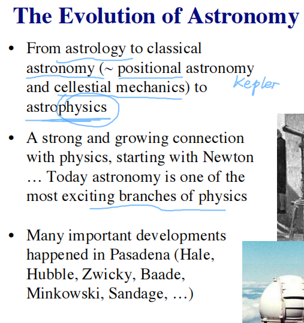
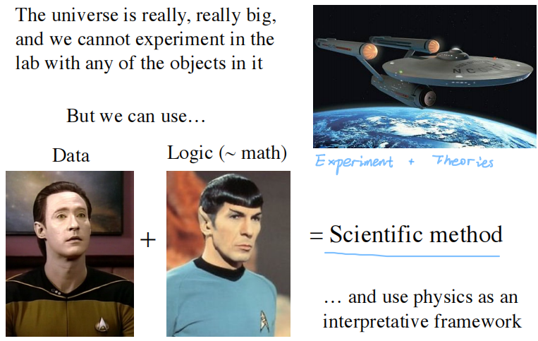
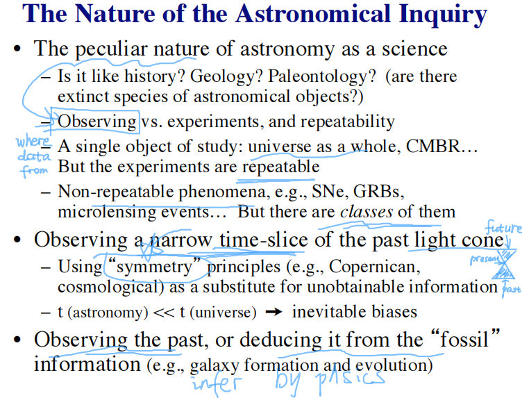
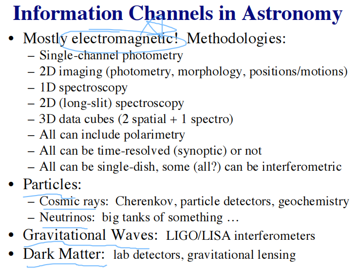

Learning Materials:

- *The Evolving Universe* Lecture from Coursera[^lec-ay1]
  [^lec-ay1]: [*The Evolving Universe* Lecture from Coursera](https://www.coursera.org/learn/evolvinguniverse/)
- *The Evolving Universe* Course from Caltech's astro-sites[^co-ay1]
  [^co-ay1]: [*The Evolving Universe* Course from Caltech's astro-sites](https://sites.astro.caltech.edu/ay1/Ay1_main.html)
- *The Evolving Universe* Sides[^sides-ay1]
  [^sides-ay1]: [*The Evolving Universe* Sides](slides/)

Contents:

[toc]

---

## Week 1

### 1&emsp;Astronomy as a Science

This chapter includes:

- Introduction and logistics
- The oldest science
- Astronomy as a science
- Messengers from the universe

Notes:

- The oldest science:
  - An early 30-m telescope
  - Ancient greece: Ptolemaic system
  - Mayans - astrology
  - Copernicus: proposes that the Sun and not the Earth is in the center of the system
  - Tycho Brache: in his observatory called Uraniborg, did most precise measurements at that time, the really first observational astronomer
  - Kepler: probably the first modern astronomic method: Kepler's laws, the planets orbiting on ellipses around the Sun
  - Galileo: heard about the telescope from sailors, the first man to use the telescope to observe the sky: the phases of Venus, mountains on the moon
- Astronomy as a science
  
  
  how can you possibly infer general things about the universal things?
  
  - Astronomy as a branch of physics
  - Fundamental limits to measurements and selection effects
- Messengers from the universe: what we measure
  

### 2&emsp;Starting the Exploration

This chapter includes:

- Distances and scales
- Kepler's laws, newton's laws, and dynamics of the solar system
- Celestial coordinate systems, time systems, and the earth's rotation

---

## Week 2

### 3&emsp;Telescopes and Detectors

### 4&emsp;Electromagnetic Radiation and its Interaction with Matter

---

## Week 3

### 5&emsp;Interstellar Medium, the Birth of Stars and Planets

### 6&emsp;Our Solar System

---

## Week 4

### 7&emsp;Planets beyond the Solar System

### 8&emsp;Stellar Structure and the Sun

---

## Week 5

### 9&emsp;Stellar Evolution

### 10&emsp;End States of Stellar Evolution

---

## Week 6

### 11&emsp;Neutron Stars, Pulsars, and Black Holes

### 12&emsp;Our Galaxy, the Milky Way

---

## Week 7

### 13&emsp;Galaxies: Morphology, Classification, and Basic Properties

### 14&emsp;Galaxy Formation and Evolution

---

## Week 8

### 15&emsp;Large Scale Structure, Its Formation and Evolution

### 16&emsp;Quasars and Active Galactic Nuclei

---

## Week 9

### 17&emsp;The Expanding Universe: Introduction to Cosmology

### 18&emsp;The Early Universe and the Cosmic Microwave Background

---

## Week 10

### 19&emsp;Measuring the Universe: Cosmological Distance Scale and Cosmological Tests

### 20&emsp;Dark Matter, Dark Energy, and the Concordance Cosmology
