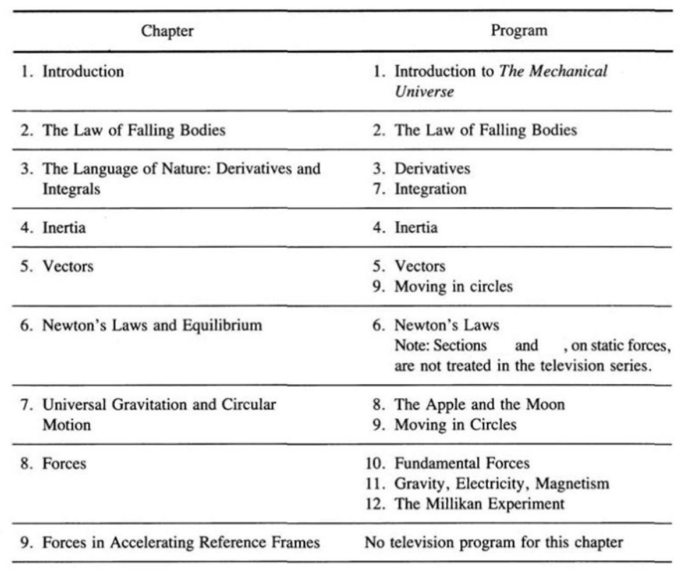
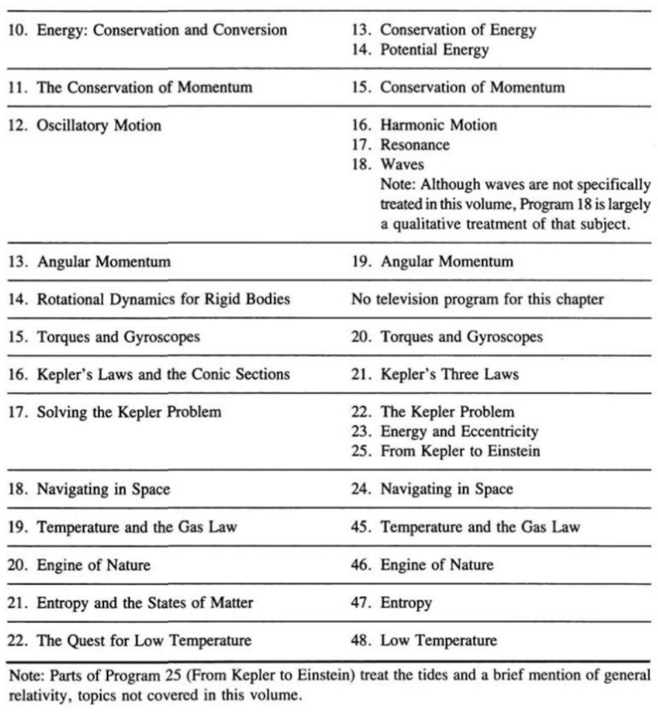

Learning Materials:

- *The Mechanical Universe: Mechanics and Heat* Textbook[^book-mech]
  [^book-mech]: [*The Mechanical Universe: Mechanics and Heat* Textbook](the_mechanical_universe.pdf)
- *The Mechanical Universe* Television Programs on Youtube[^lec-mech]
  [^lec-mech]: [*The Mechanical Universe* Television Programs on Youtube](https://www.youtube.com/watch?v=XtMmeAjQTXc&list=PL8_xPU5epJddRABXqJ5h5G0dk-XGtA5cZ)

Contents:

[toc]

---

## Preface

How *The Mechanical Universe* came to be? (Preface I General introduction[^book-mech])

Many chapters of this book corresponds to programs in the television series *The Mechanical Universe*. This book combined benefits of a rigorous training in physics and the less demanding pleasures of the television programs 这本书许多章节都和同名电视节目相符合. 这本书结合了严格的物理训练和电视节目的轻松乐趣. (Preface II Preface for students, para. 1[^book-mech])

No simply watching television, working out problems at the end of each chapter. The backbone of this book is a series of events that began in 1543 with a book published by Copernicus and culminated a century and a half later with a view of the universe that has formed the basis of virtually all human intellectual activity since then. 不要只看课程，要解决每章最后的问题. 这本书的骨干是 1543 年哥白尼出版的书以及半个多世纪后的宇宙观，是自人类所有智力活动以来几乎所有活动的基础. (Preface II Preface for students, para. 2-3[^book-mech])

There are a number of topics, treated as sections within chapters or as entire chapters, which are not covered at all in the television series. Moreover, the order in which subjects are presented in this book does not always correspond to the order of programs intended for broadcast television. 本书中有许多主题，被划分为章节中的部分或整章都是，但电视节目中并未完全覆盖这些内容. 并且，本书中的主题的呈现顺序并不总是和电视节目的播出顺序一致. (Preface III Preface for instructors and administrators, para. 3, line 4-7[^book-mech])

The chapter 3 on calculus topics is for those students who have some knowledge of elementary calculus or take a separate calculus course concurrently with their physics course or need a review of calculus. The chapters on thermal physics, 19-22, have been placed at the end of the book to aid in flexibility of course design, which might not include these chapters. 第 3 章的微积分主题是为那些已经掌握基础微积分或者和物理课程同时学习微积分或者需要复习微积分的学生准备的. 热物理已经被放置在书本的末尾 19-22 章节，为了使那些可能不包含这些章节的课程计划得更灵活. (Preface III Preface for instructors and administrators, para. 5-7[^book-mech])

---

### 1&emsp;Introduction to the Mechanical Universe

力学宇宙简介

### 2&emsp;The Law of Falling Bodies

自由落体定律

### 3&emsp;The Language of Nature: Derivatives and Integrals

自然语言: 导数和积分

### 4&emsp;Inertia

惯性

### 5&emsp;Vectors

向量/矢量

### 6&emsp;Newton's Laws and Equilibrium

牛顿定律和平衡

### 7&emsp;Universal Gravitation and Circular Motion

万有引力和圆周运动

### 8&emsp;Forces

力

### 9&emsp;Forces in Accelerating Reference Frames

加速参考系中的力

### 10&emsp;Energy: Conservation and Conversion

能量: 守恒和转换

### 11&emsp;The Conservation of Momentum

动量守恒

### 12&emsp;Oscillatory Motion

振动运动

### 13&emsp;Angular Momentum

角动量

### 14&emsp;Rotational Dynamics for Rigid Bodies

刚体旋转动力学

### 15&emsp;Torques and Gyroscopes

扭矩和陀螺仪

### 16&emsp;Kepler's Laws and the Conic Sections

开普勒定律和圆锥曲线

### 17&emsp;Solving the Kepler Problem

解决开普勒问题

### 18&emsp;Navigating in Space

太空导航

### 19&emsp;Temperature and the Gas Law

温度和气体定律

### 20&emsp;Engine of Nature

自然发动机

### 21&emsp;Entropy and the States of Matter

熵和物质状态

### 22&emsp;The Quest for Low Temperature

低温探索
