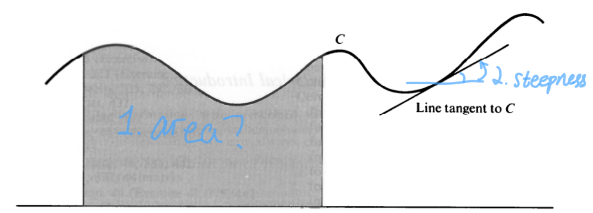
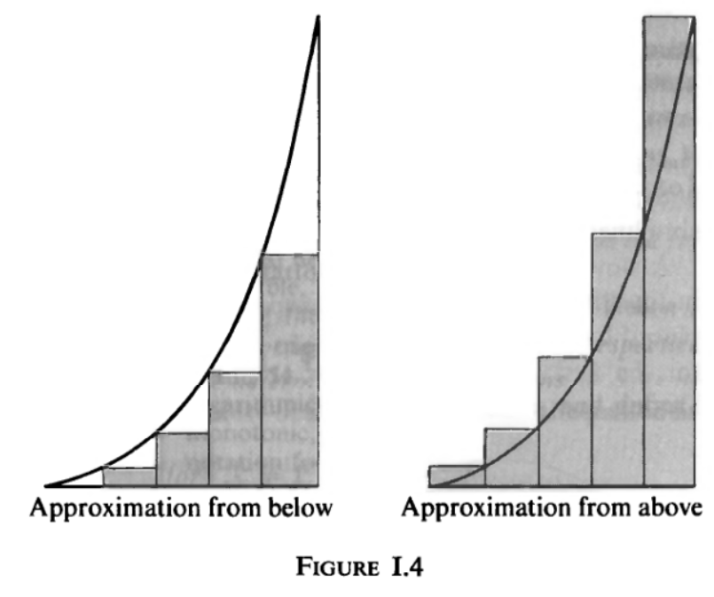
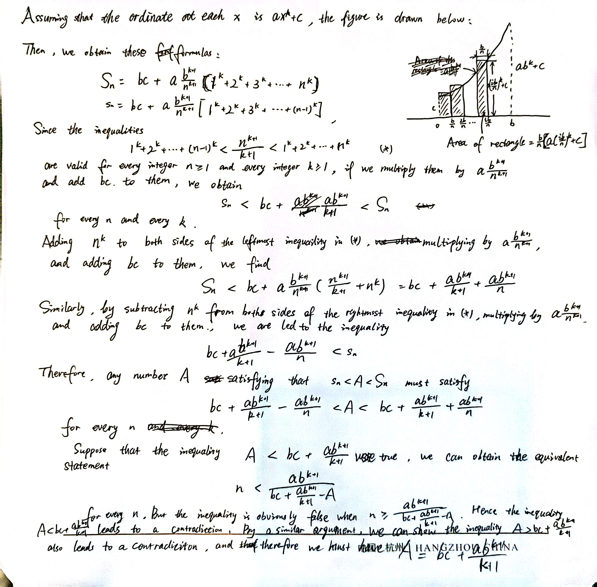
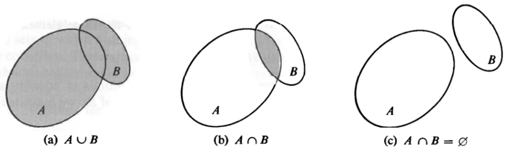
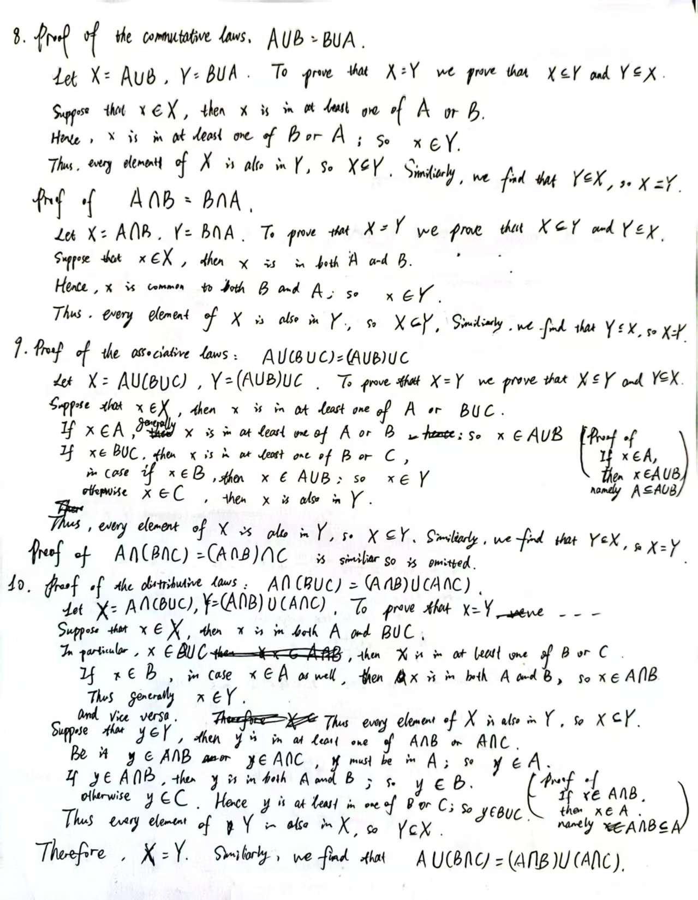
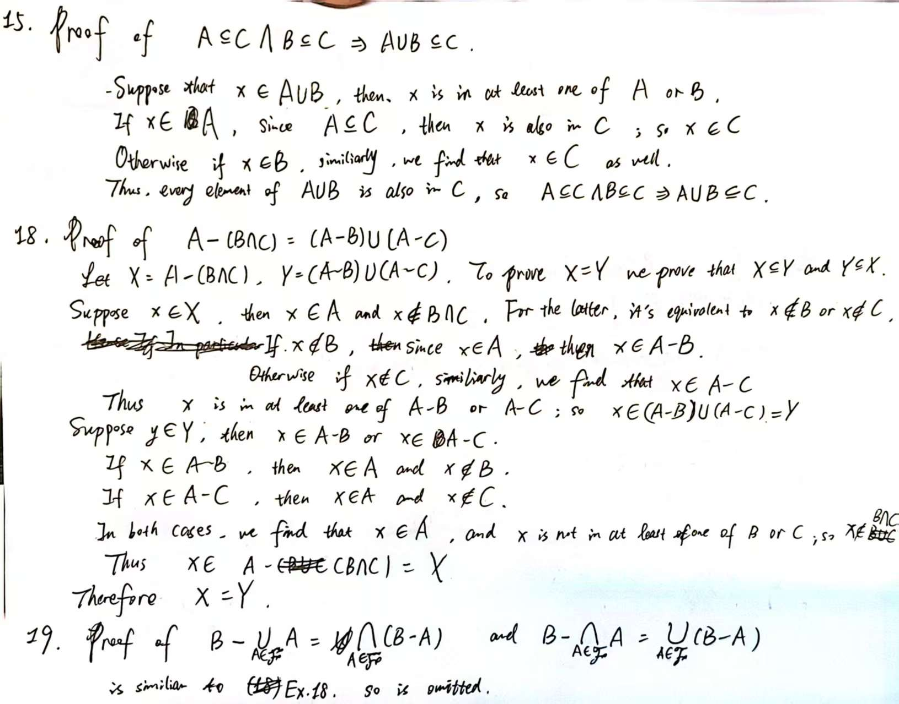

Learning Materials:

- *Calculus Vol. I*[^cal_i]
  [^cal_i]: [*Calculus Vol. I*](calculus_i(2nd).pdf)
- *Calculus Vol. II*[^cal_ii]
  [^cal_ii]: [*Calculus Vol. II*](calculus_ii(2nd).pdf)

Contents:

[toc]

---

## Preface and Introduction 前言与简介

There are two main points of view that what should constitute a first course in calculus and analytic geometry. Some people insist the way starting off with a logical, rigorous and theoretical development of the subject, while others argue that the course should stress applications of the calculus for engineers and physicists. This book represents an attempt to strike a sensible balance between the two. 对于微积分和解析几何的第一门课，有两种主要观点. 有些人认为，应该从逻辑、严谨和理论的发展开始，而另一些人则认为，微积分作为工程师和物理学家的一种工具，其课程应该强调微积分的应用. 这本书试图在这两者之间找到一个合理的平衡. (Page vii, para. 1, line 1-13[^cal_i])

Proofs of theorems are preceded by a geometric or intuitive discussion. The latter gives the student some insight into why they take a particular form and satisfies readers who are not interested in detailed proofs, while the complete proofs are also included for those who prefer a more rigorous presentation. 在定理或命题的证明之前，会有一个几何或直观的讨论. 后者使学生能够了解为什么定理或命题会以这样特定的形式出现，并满足那些对详细证明不感兴趣的读者，而完整的证明过程也在文中给出，以满足那些喜欢更严谨的表述的读者. (Page vii, para. 1, line 14-18[^cal_i])

The approach in this book has been suggested by the historical and philosophical development of calculus and analytic geometry, seeming unusual compared with other books. But it is definitely historically correct, pedagogically sound, and meaningful. 这本书中的处理方式是按照微积分和解析几何的历史和哲学发展来的，与其他书籍相比，似乎有些不寻常. 但它绝对在历史上是正确的，在教学中是有效的，并且是有意义的. (Page vii, para. 2[^cal_i])

The first two thirds of Volume I deals with the calculus of functions of one variable, including infinite series and an introduction to differential equations. The last third of Volume I introduces linear algebra with applications to geometry and analysis. It blends algebra and analysis and helps the transition from one-variable calculus to multi-variable calculus, discussed in the part 2 of Volume II. 卷 I 前三分之二讨论了一元函数的微积分，包括无穷级数和微分方程的介绍，后三分之一讨论了线性代数，包括几何和解析中的应用. 它将代数和解析有机地结合起来，有助于从一元微积分过渡到多元微积分，后者在卷 II 的第二部分讨论. (Page viii, para. 3[^cal_i])

Volume II is divided into three parts, entitled *Linear Analysis*, *Nonlinear Analysis*, and *Special Topics*. Part 1 contains an introduction to linear algebra. Part 2 discusses the calculus of functions of several variables. The special topics treated in Part 3 are *Probability* and *Numerical Analysis*. More details are given in the book. (Page vii, para. 2-5[^cal_ii])

### 1&emsp;Historical Introduction 历史介绍

The study of *calculus* is based on the two basic questions: How to measures the area of a arbitrary region? And how to measure the steepness of a tangent line? For the former question, Archimedes used the method of exhaustion (steps: slice, add up, simplify, use inequalities, prove by contradiction) to find the area of a parabolic segment, which, along with the development of algebra and the strengthening of mathematical basis, gave a way to define the *integral* of calculus.

#### 1.1&emsp;The two basic concepts of calculus 微积分学的两个基本概念

- Calculus has a wade range of applications in various fields 微积分在各个领域有着广泛的应用
- Two fundamental specialized problems of a geometric nature 两个基本的几何性质问题
  
  - To assign a number which measures the area of this shaded region 指定一个数值来测量阴影部分面积
    is dealt with by *integral calculus* in [Part I Chapter 1](#1the-concepts-of-integral-calculus-积分学的概念) 在积分学中处理
  - To assign a number which measures the steepness of this tangent line 指定一个数值来测量切线的斜率
    is dealt with by *differential calculus* in [Part I Chapter 4](#4differential-calculus-微分学) 在微分学中处理

#### 1.2&emsp;Historical background 历史背景

- The birth of integral calculus (2000yrs ago, the *method of exhaustion*, used successfully by Archimedes, without elementary algebra until nearly 18 centuries later 阿基米德使用穷竭法)
- The development in mathematics and the method of exhaustion (using Arabic characters and the decimal notation as a new way of expressing calculations in 16c. 阿拉伯字符和十进制表示法)
- Biggest impetus (Isaac Newton and Gottfried Leibniz in 17c.)
- A Firm mathematical basis (Augustin-Louis Cauchy and Bernhard Riemann in 19c.)
- Still being carried out in contemporary mathematics ...

#### 1.3&emsp;The method of exhaustion for the area of a parabolic segment 抛物线段面积的穷竭法

- Slice into a number of strips (the inner one from below and the outer one from above) by using sets of rectangles (n-equal parts, $x=kb/n; k=0,1,2,\cdots,n$)
    
- Calculate the area of each strip and add them up to obtain a formula for the sum $s_n$ (inner) and $S_n$ (outer)
- Use the identity (恒等式) to simplifies the sum of the squares (proved by taking $k=1,2,\cdots,n-1$ and adding all the formulas, all the terms canceling (相消) except two, and sum up the terms in an arithmetic progression (等差数列))
- Deduce inequalities $s_n < \dfrac{b^3}{3} < S_n$ by induction (归纳法)(a proof by induction is given in [{~~Section I 4.1.~>Section 4.1 of this part~~}](#4mathematical-induction-summation-notation-and-related-topics-数学归纳法求和符号以及相关主题))
- Prove that $\dfrac{b^3}{3}$ is the only number which lies between $s_n$ and $S_n$ for every positive integer $n$

#### *Exercises 0.1-1*

the ordinate (纵坐标) is $x^2 \rightarrow ax^2+c \rightarrow x^3 \rightarrow ax^3+c \rightarrow ax^k+c$\

#### 1.4&emsp;A critical analysis of Archimedes' method 阿基米德方法的批判性分析

- Deductive systems (演绎系统)(axioms (公理) or postulates (假设)) - e.g. Euclidean theory of elementary geometry
- Renaissance (the advent of algebra in 16c. and the following 300 years) - conspicuously absent was the logically precise reasoning of the deductive method with its use of axioms, definitions, and theorems 缺乏使用公理、定义和定理的演绎法的逻辑精确推理 - blend of deductive reasoning combined with intuition, pure guesswork, and mysticism 结合演绎推理与直觉、纯粹猜测和神秘主义
- New and more critical period (early 19c.) - put the new mathematics on a firm foundation (logical purity and abstraction) - theorems or properties of those concepts cannot be accepted until the axioms are satisfactorily defined first 定理或那些概念的性质直到公理得到满意的定义之后才能被接受
- Archimedes used the properties (now as axioms) about area which is an undefined concept at that time. But he suggests a way to define the concepts of area (面积) and integral (积分) - the symbol $\int$ is introduced by Leibniz in 1675 (integral sign (积分符号)(the process of adding) + limits of integration (积分限)(the range of base) -> integration (积分)) - today the integral is defined in terms of the notion of real number (实数概念) without using ideas like "infinitesimally small quantities (无穷小量)"
  $\int\limits_0^b{x^2}\,dx = \dfrac{b^3}{3}$ is read "the integral of $x^2$ from 0 to $b$ is $\dfrac{b^3}{3}$"

#### 1.5&emsp;The approach to calculus to be used in this book 本书中使用的微积分方法

- A complete treatment of calculus depends on the real number system (实数系统)(whose axioms and the simplest theorems are discussed in [{~~Part 3 of this chapter~>Chapter 3 of this Part~~}](#3a-set-of-axioms-for-the-real-number-system-实数系统的一组公理))
- A few properties stem from the least-upper-bound axiom (最小上界公理)(also known as the completeness axiom (完备性公理) or continuity axiom (连续性公理))
- A list of the various "methods of proof" (证明方法) for the purpose of deducing theorems from the axioms - all introduced in a convenient way and rigorously prove
- About starred sections (some of the proofs and some of the topics related to calculus)

### 2&emsp;Some Basic Concepts of the Theory of Sets 集合理论的基本概念

This chapter introduces the fundamental concepts of set theory, which serves as a foundational language for modern mathematics. The chapter explores the concept of *sets*, *elements*, relations between them both, *the roster notation*, *equality* of sets, *subsets*, *proper subsets*, and special sets such as the *empty set*, the *universal set*, *one-element sets* and *classes*, defines fundamental operations on sets including *union*, *intersection*, and *complement*, along with their algebraic properties. *Venn diagrams* are introduced as a visual tool for understanding set relationships.

#### 2.1&emsp;Introduction to set theory 集合论简介

Applications of set theory, how set theory comes to light, and some basic concepts of set theory.

- Useful in discussing any branches of mathematics (analysis, algebra, geometry)(分析、代数、几何)
- An agreement about the precise terminology that applies to more or less familiar ideas rather than a new theory
- Concepts:
  - *set* (集合), *elements* (元素)(or *members* (成员)) of the set;
  - elements *belong to* (属于)(or *contained in* (包含于)) the set;
  - the set *contain* (包含)(or *composed of* (由 ... 组成)) its elements.
- Abstract sets (抽象集合) - sets in which nothing special is assumed about the nature of the elements (对元素的性质没有特殊假设的集合)

#### 2.2&emsp;Notations for designating sets 表示集合的符号

Notations include sets, elements, elements belong to the set, the roster notation, and equality of sets.

- Sets - capital letters: $A, B, C, \cdots, X, Y, Z$;
- Elements - lower-case letters: $a, b, c, \cdots, x, y, z$;
- "$x$ belongs to $S$" - $x \in S$;
- $x \not \in S$;
- *The roster notation* (列举法) - listing the elements in braces: $\{2, 4, 6, \cdots\}$;
- Definition of set *equality* (集合相等) - "two sets are *equal* (or *identical*)": $A = B$; "two sets are *unequal*": $A \ne B$.
  Theorem:
  - the order in which the elements appear is irrelevant: $\set{2, 4, 6, 8} = \set{2, 8, 6, 4}$
  - the elements listed in the roster notation can be not distinct: $\set{2, 4, 6, 8} = \set{2, 2, 4, 4, 6, 8}$

#### 2.3&emsp;Subsets 子集

Definition of subsets, proper subsets, the universal set, the empty set, one-element sets, and Venn diagrams.

- Definition of a *subset* (子集) - "a set $A$ is *a subset of* a set $B$ (or $A$ is *contained in* $B$ or $B$ *contains* $A$)": $A \subseteq B$;
  Theorem:
  - $A = B \qquad \textit{if and only if} \quad A \subseteq B \text{ and } B \subseteq A$
- Definition of a *proper subset* (真子集) - "a set $A$ is *a proper subset of* a set $B$": $A \subseteq B$ but $A \ne B$: $A \subset B$;
- Definition of the *universal set* (全集) - concerned only with subsets of this given set - "the set of all $x$ such that $x$ satisfies $P$": $A = \set{x \mid x \in S \quad \text{and} \quad x \text{ satisfies } P_A}$ or $A = \set{x \mid x \text{ satisfies } P_A}$ when $S$ is understood
- Definition of the *empty set* (or the *void set*)(空集): $\varnothing$
  Theorem:
  - $\varnothing$ is a subset of every set
- *one-element sets* (单元素集合)
- *Venn diagrams* (韦恩图) - sets <-> regions; elements <-> points

#### 2.4&emsp;Unions, intersections, complements 并集，交集，补集

Definition of union, intersection, and complement; the commutative and associative laws of set operations; definition of class and its operations.

- Definition of a *union* (并集) - "$A$ union $B$": $A \cup B$;
- Definition of a *intersection* (交集) - "$A$ intersection $B$": $A \cap B$; two sets $A$ and $B$ are *disjoint* (不相交的): $A \cap B = \varnothing$;
- Definition of a *complement* (补集) - "the *complement* of $B$ *relative to* $A$": the *difference* $A-B$;
- The operations of union and intersection <-> ordinary addition and multiplication of real number
  - *commutative* (可交换)
  - *associative* (可结合)
- Definition of a *class* (类) - a collection of sets (集合簇) - capital script letters: $\mathscr{A}, \mathscr{B}, \mathscr{C}, \cdots, \mathscr{X}, \mathscr{Y}, \mathscr{Z}$;
  - $\bigcup\limits_{A \in \mathscr{F}}{A} = \bigcup\limits_{k=1}^{n}{A_k}$
  - $\bigcap\limits_{A \in \mathscr{F}}{A} = \bigcap\limits_{k=1}^{n}{A_k}$

#### *Exercises 0.2-1*

  
  

### 3&emsp;A Set of Axioms for the Real-Number System 实数系统的一组公理

#### 3.1&emsp;Introduction 简介

Introduce how the real number system is constructed and the axioms of the real number system, which could divided into three groups: the *field axioms*, the *order axioms*, and the *least-upper-bound axiom* (also called the *axiom of continuity* or the *completeness axiom*).

- One popular method to introduce the real-number system: positive integers -> positive *rational* numbers -> positive *irrational* numbers -> negative real numbers and zero
- Irrational numbers were first introduced in the 19c. which may be found in a book *Foundations of Analysis* (by E. Landau), beginning with the Peano postulates and using the method of Dedekind
- Here we take the real numbers as undefined objects in the set $\bold{R}$ satisfying certain *nonconstructive* properties (as axioms), from which all properties can be deduced (when defined by a *constructive* process, the properties as axioms must be proved as theorems)

  !!! note *nonconstructive* (非构造性) vs *constructive* (构造性)
      *nonconstructive* vs *constructive* proof can be found in philosophy of mathematics and logic. Basically, *constructive* proof is a proof that provides a method to construct the object to be proved, while *nonconstructive* proof only shows that the object exists without providing an example.
- lower-case letters - real numbers
  three groups of the axioms: the *field axioms* (域的公理), the *order axioms* (序的公理), and the *least-upper-bound axiom* (最小上界公理)(also called the *axiom of continuity* (连续性公理) or the *completeness axiom* (完备性公理))

#### 3.2&emsp;The field axioms 域的公理

Basic on two operations (*addition* and *multiplication*), there lists six axioms, three fundamental laws (*commutative laws*, *associative laws*, *distributive law*) and three properties of existence (*an identity element*, *negatives*, *reciprocals*), and some theorems deduced by the above axioms, which introduce to the concepts of *subtraction*, *division*, and the *quotient*.

- Assume two operations in the set $\bold{R}$
  - *addition* (加) - "*sum* (和) of the $x$ and $y$": $x + y$
  - *multiplication* (乘) - "*product* (积) of the $x$ and $y$": $xy$ or $x \cdot y$
- The sum $x + y$ and the product $xy$ are *uniquely determined* (唯一确定) by $x$ and $y$
- Six axioms:
  - AXIOM 1. *Commutative laws* (交换律)
  - AXIOM 2. *Associative laws* (结合律)
  - AXIOM 3. *Distributive law* (分配律)
  - AXIOM 4. *Existence of an identity element* (存在单位元)
  - AXIOM 5. *Existence of negatives* (存在负数)
  - AXIOM 6. *Existence of reciprocals* (存在倒数)
- Theorems deduced by the above axioms, includes (Page 18 and Exercises I 3.3[^cal_i])
  - THEOREM I.2. *subtraction* (减法) - "the *negative* (负数) of $a$": $-a$
  - THEOREM I.8. *division* (除法) - "the *quotient* (商) of $a$ and $b$": $a/b$ or $\dfrac{a}{b}$ - "the *reciprocal* (倒数) of $a$": $1/a$ or $a^{-1}$

#### 3.3&emsp;The order axioms 序的公理

- Assume a certain subset $\bold{R^+} \subset \bold{R}$ called "the set of *positive* (正) numbers"
- Three axioms:
  - AXIOM 7. *If $x$ and $y$ are in $\bold{R^+}$, so are $x + y$ and $xy$*.

    !!! note *Closure* (封闭性) in Group theory

  - AXIOM 8. *Fore every real $x \not ={0}$, either $x \in \bold{R^+}$ or $-x \in \bold{R^+}$, but not both*.

    !!! note *Law of Excluded Middle* (排中律)

  - AXIOM 9. *$0 \not \in \bold{R^+}$*.
- Concepts of *positiveness* (正性) and ordering
  - "less than" $<$, "greater than" $>$, "less than or equal to" $\leq$, "greater than or equal to" $\geq$
  - *positive* (正), *negative* (负), *nonnegative* (非负), *nonpositive* (非正)
- Theorems deduced by the above axioms, includes (Page 20 and Exercises I 3.5[^cal_i])
  - THEOREM I.16. *Trichotomy law* (三分律)
  - THEOREM I.17. *Transitive law* (传递律)

#### 3.4&emsp;Integers and rational numbers 整数和有理数

#### 3.5&emsp;Geometric interpretation of real numbers as points on a line 将实数从几何角度解释为直线上的点

#### 3.6&emsp;Upper bound of a set, maximum element, least upper bound (supremum) 集合的上界，最大元素，最小上界 (上确界)

#### 3.7&emsp;The least-upper-bound axiom (completeness axiom) 最小上界公理 (完备性公理)

#### 3.8&emsp;The Archimedean property of the real-number system 实数系统的阿基米德性质

#### 3.9&emsp;Fundamental properties of the supremum and infimum 上确界和下确界的根本性质

#### 3.10&emsp;*Existence of square roots of nonnegative real numbers 非负实数的平方根的存在性*

#### 3.11&emsp;*Roots of higher order. Rational powers 高阶根. 有理次幂*

#### 3.12&emsp;*Representation of real numbers by decimals 实数的小数表示*

### 4&emsp;Mathematical Induction, Summation Notation, and Related Topics 数学归纳法，求和符号，以及相关主题

#### 4.1&emsp;An example of a proof by mathematical induction 用数学归纳法的一个例子

#### 4.2&emsp;The principle of mathematical induction 数学归纳法原理

#### 4.3&emsp;*The well-ordering principle 良序原理*

#### 4.4&emsp;*Proof of the well-ordering principle 良序原理的证明*

#### 4.5&emsp;The summation notation 求和符号

#### 4.6&emsp;Absolute values and the triangle inequality 绝对值与三角不等式

---

## Part I&emsp;Fundamental Calculus 基本微积分

### 1&emsp;The Concepts of Integral Calculus 积分学的概念

#### 1.1&emsp;The basic ideas of Cartesian geometry 卡式几何的基本概念

#### 1.2&emsp;Functions. Informal description and examples 函数. 非正式描述与例子

#### 1.3&emsp;*Functions. Formal definition as a set of ordered pairs 函数. 作为有序对集合的正式定义*

#### 1.4&emsp;More examples of real functions 实函数的更多例子

#### 1.5&emsp;The concept of area as a set function 将面积作为集合函数的概念

#### 1.6&emsp;Intervals and ordinate sets 区间和坐标集

#### 1.7&emsp;Partitions and step functions 划分和阶梯函数

#### 1.8&emsp;Sum and product of step functions 阶梯函数的和与积

#### 1.9&emsp;The definition of the integral for step functions 阶梯函数的积分定义

#### 1.10&emsp;Properties of the integral of a step function 阶梯函数积分的性质

#### 1.11&emsp;Other notations for integrals 积分的其他表示法

#### 1.12&emsp;The integral of more general functions 更一般的函数的积分

#### 1.13&emsp;Upper and lower integrals 上积分与下积分

#### 1.14&emsp;The area of an ordinate set expressed as an integral 将坐标集面积表示为积分

#### 1.15&emsp;Informal remarks on the theory and technique of integration 积分理论和方法的不正式评论

#### 1.16&emsp;Monotonic and piecewise monotonic functions. Definition and examples 单调函数和分段单调函数. 定义与例子

#### 1.17&emsp;Integrability of bounded monotonic functions 有界单调函数的可积性

#### 1.18&emsp;Calculation of the integral of a bounded monotonic function 有界单调函数的积分计算

#### 1.19&emsp;Calculation of the integral $\int_a^bx^pdx$ when $p$ is a positive integer 当 $p$ 是正整数时，$\int_a^bx^pdx$ 的积分计算

#### 1.20&emsp;The basic properties of the integral 积分的基本性质

#### 1.21&emsp;Integration of polynomials 多项式的积分

#### 1.22&emsp;Proofs of the basic properties of the integral 积分基本性质的证明

### 2&emsp;Some Applications of Integration 积分的一些应用

#### 2.1&emsp;Introduction 简介

#### 2.2&emsp;The area of a region between two graphs expressed as an integral 两个曲线之间的区域面积积分

#### 2.3&emsp;Worked examples 求解例子

#### 2.4&emsp;The trigonometric functions 三角函数

#### 2.5&emsp;Integration formulas for the sine and cosine 正弦和余弦的积分公式

#### 2.6&emsp;A geometric description of the sine and cosine functions 正弦和余弦函数的几何描述

#### 2.7&emsp;Polar coordinates 极坐标

#### 2.8&emsp;The integral for area in polar coordinates 极坐标下的面积积分

#### 2.9&emsp;Application of integration to the calculation of volume 积分在体积计算中的应用

#### 2.10&emsp;Application of integration to the concept of work 积分在做功概念中的应用

#### 2.11&emsp;Average value of a function 函数的平均值

#### 2.12&emsp;The integral as a function of the upper limit. Indefinite integrals 积分上限的函数. 不定积分

### 3&emsp;Continuous Functions 连续函数

#### 3.1&emsp;Informal description of continuity 连续性的非正式描述

#### 3.2&emsp;The definition of the limit of a function 函数极限的定义

#### 3.3&emsp;The definition of continuity of a function 函数连续性的定义

#### 3.4&emsp;The basic limit theorems. More examples of continuous functions 基本极限定理. 更多的连续函数例子

#### 3.5&emsp;Proofs of the basic limit theorems 基本极限定理的证明

#### 3.6&emsp;Composite functions and continuity 复合函数和连续性

#### 3.7&emsp;Bolzano's theorem for continuous functions 连续函数的波尔查诺定理

#### 3.8&emsp;The intermediate-value theorem for continuous functions 连续函数的介质定理

#### 3.9&emsp;The process of inversion (函数的) 反转过程

#### 3.10&emsp;Properties of functions preserved by inversion 反转过程中保持的函数性质

#### 3.11&emsp;Inverses of piecewise monotonic functions 分段单调函数的反函数

#### 3.12&emsp;The extreme-value theorem for continuous functions 连续函数的极值定理

#### 3.13&emsp;The small-span theorem for continuous functions (uniform continuity) 连续函数的局部定理 (一致连续性)

#### 3.14&emsp;The integrability theorem for continuous functions 连续函数的可积性定理

#### 3.15&emsp;Mean-value theorems for integrals of continuous functions 连续函数积分的中值定理

### 4&emsp;Differential Calculus 微分学

#### 4.1&emsp;Historical introduction 历史介绍

#### 4.2&emsp;A problem involving velocity 涉及速度的问题

#### 4.3&emsp;The derivative of a function 函数的导数

#### 4.4&emsp;Examples of derivatives 导数的例子

#### 4.5&emsp;The algebra of derivatives 导数的代数

#### 4.6&emsp;Geometric interpretation of the derivative as a slope 导数作为斜率的几何解释

#### 4.7&emsp;Other notations for derivatives 导数的其他表示法

#### 4.8&emsp;The chain rule for differentiating composite functions 复合函数求导的链式法则

#### 4.9&emsp;Applications of the chain rule. Related rates and implicit differentiation 链式法则的应用. 相关速率和隐函数求导

#### 4.10&emsp;Applications of differentiation to extreme values of functions 函数极值求导的应用

#### 4.11&emsp;The mean-value theorem for derivatives 导数的中值定理

#### 4.12&emsp;Applications of the mean-value theorem to geometric properties of functions 中值定理在函数几何性质中的应用

#### 4.13&emsp;Second-derivative test for extrema 极值的二阶导数判别法

#### 4.14&emsp;Curve sketching 曲线作图

#### 4.15&emsp;Worked examples of extremum problems 极值问题的求解例子

#### 4.16&emsp;*Partial derivatives* 偏导数

### 5&emsp;The Relation between Integration and Differentiation 积分与微分的关系

#### 5.1&emsp;The derivative of an indefinite integral. The first fundamental theorem of calculus 不定积分的导数. 微积分第一基本定理

#### 5.2&emsp;The zero-derivative theorem 零导数定理

#### 5.3&emsp;Primitive functions and the second fundamental theorem of calculus 原函数和微积分第二基本定理

#### 5.4&emsp;Properties of a function deduced from properties of its derivative 从函数的导数性质推导出的函数性质

#### 5.5&emsp;The Leibniz notation for primitives 原函数的莱布尼兹记号

#### 5.6&emsp;Integration by substitution 换元积分法

#### 5.7&emsp;Integration by parts 分部积分法

---

## Part II&emsp;Advanced Calculus and Applications 高等微积分和应用

### 6&emsp;The Logarithm, the Exponential, and the Inverse Trigonometric Functions 对数、指数和反三角函数

### 7&emsp;Polynomial Approximations to Functions 函数的多项式逼近

### 8&emsp;Introduction to Differential Equations 微分方程的介绍

### 9&emsp;Complex Numbers 复数

### 10&emsp;Sequences, Infinite Series, Improper Integrals 序列、无穷级数和瑕积分

### 11&emsp;Sequences and Series of Functions 函数的序列和级数

---

## Part III&emsp;Calculus in Analytic Geometry 解析几何微积分

### 12&emsp;Vector Algebra 向量代数

### 13&emsp;Applications of Vector Algebra to Analytic Geometry 向量代数在解析几何中的应用

### 14&emsp;Calculus of Vector-Valued Functions 向量值函数的微积分

---

## Part IV&emsp;Linear Analysis 线性分析

### 15&emsp;Linear Spaces 线性空间

### 16&emsp;Linear Transformations and Matrices 线性变换和矩阵

### 17&emsp;Determinants 行列式

### 18&emsp;Elgenvalues and Eigenvectors 特征值和特征向量

### 19&emsp;Elgenvalues of Operators Acting on Euclidean Spaces 欧几里得空间上算子的特征值

### 20&emsp;Linear Differential Equations 线性微分方程

### 21&emsp;Systems of Differential Equations 微分方程组

---

## Part V&emsp;Nonlinear Analysis 非线性分析

### 22&emsp;Differential Calculus of Scalar and Vector Fields 标量和向量场的一阶微分学

### 23&emsp;Applications of the Differential Calculus 微分学的应用

### 24&emsp;Line Integrals 线积分

### 25&emsp;Multiple Integrals 多重积分

### 26&emsp;Surface Integrals 曲面积分

---

## Part VI&emsp;Special Topics 特殊主题

### 27&emsp;Set Functions and Elementary Probability 集合函数和基本概率

### 28&emsp;Calculus of Probabilities 概率的微积分

### 29&emsp;Introduction to Numerical Analysis 数值分析的介绍
