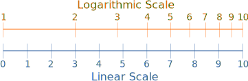

<!-- @import "../theme/text.less" -->

## {entry1}

**logarithmic scale** noun

### {entry1-g1}

: a scale on which the actual distance of a point from the scale's zero is proportional to the logarithm of the corresponding scale number rather than to the number itself

