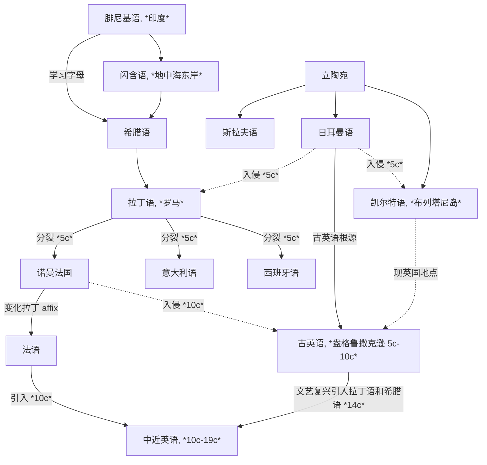
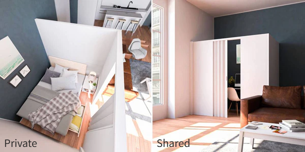
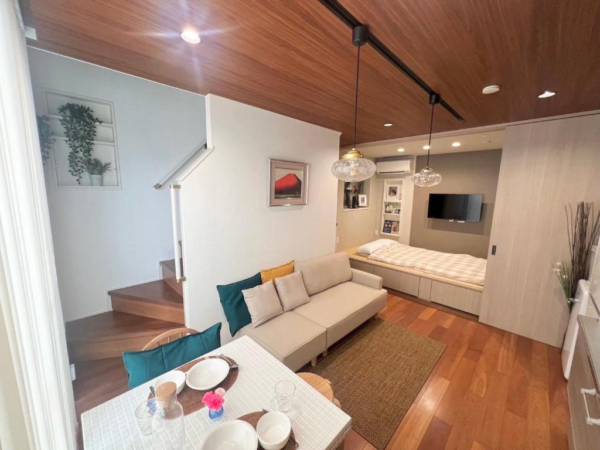
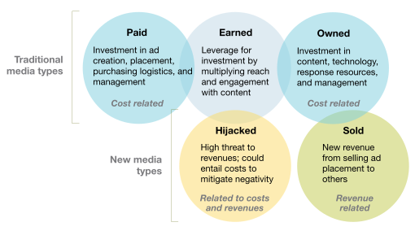

[toc]

## Basic Foundations

### Etymology of Words (Roots and Affixes)

**Indo-European languages (印欧语系)** 有两个起源地：**立陶宛地区**和**地中海东岸的闪含语系地区**——来源于 **Phoenician (腓尼基语)**

西北欧的地区大部分是来源于立陶宛语系，地区交流促成了主要的 **Germanic (日耳曼)**、**Celtic (凯尔特)**、**Slavic (斯拉夫)** 语系（B.C. 9c - A.D. 0c）；现代欧洲语言**文字**的 ancestor 是**腓尼基字母**，希腊人在腓尼基字母的基础上创造出希腊字母，形成了 **Greek (古希腊语)**，之后又被意大利地区古罗马和拉丁人学习形成了 **Latin (拉丁语)**；希腊语和拉丁语不注重语法和介词等，用**词根词缀**即可表示复杂的信息

罗马帝国扩张后，拉丁语逐渐取代古希腊语，欧洲西边大部分讲拉丁语，东边讲希腊语；英国虽处于西边，但并未全部被拉丁语辐射到，仍然是凯尔特人为主（A.D. 0c - 5c）

在罗马帝国末期，日耳曼人入侵凯尔特，凯尔特人被迫逃离，与现代英语几乎无关系，而英语则是属于**日耳曼语族**，与德国、荷兰有相同的起源. 此时被视为英语的起源，盎格鲁撒克逊的**古英语**. 之后英语又被讲另一种日耳曼语的维京人入侵，融合的英语形成了**比较完善的语法结构**，但**失去了日耳曼复合构词的变化**（也就是为什么同是日耳曼语族，英语中的复合构词要比德语和荷兰语少得多）（5c - 10c）；罗马分裂后，拉丁语衍生成多种语言，例如法国、西班牙、意大利等，但 French 追求自己的一套 affix 方法，所以现在的西语和意大利语相比于法语而言更贴近拉丁语. 这些语言被统称为 **Romance Language (罗曼语族/罗马语族/拉丁语族)**. 此时已经很少有地区会讲拉丁语了

中世纪（10c）和近代现代（14c -）时期，英国先后发生了法国入侵和文艺复兴. 法国（诺曼法）入侵带来了大量**法语词汇**（本质是来源于拉丁语，但词缀拓展与拉丁语略有不同），文艺复兴时期都认为**拉丁语是代表着学术文明和高等教育**，而**日耳曼语象征着野蛮和低劣**，所以有大量**学术名词**都是来源于**拉丁语**和**希腊语**，这导致了现代英语的大量词汇会与罗曼语族的语言（如法语、意大利语、西班牙语等）有更多相似之处

### Pronunciation

### Grammar

## Logs

### Listening & Speaking

### Vocabulary

#### 06/22/2025 {V}

- The crude oil's prize affect the coffee's prize, and [vice versa](http://127.0.0.1:5500/english/dict/vice_versa.html#entry1.1-1).

#### 06/23/2025 {V}

- [log scales](http://127.0.0.1:5500/english/dict/log_scale.html#entry1.1-2)

#### 06/24/2025 {V}

- This tables contains coffee consumption in kilograms [per capita](http://127.0.0.1:5500/english/dict/per_capita.html#entry1.1-1) of coffee [import](http://127.0.0.1:5500/english/dict/import.html#entry1.1-1a)[ers](http://127.0.0.1:5500/english/dict/er.html#entry5.1-2b) over the span of two decades.
- Data tables are often so large that only small [fraction](http://127.0.0.1:5500/english/dict/fraction.html#entry1.1-1b(2)) of rows are displayed.
- Use the [dropdown](http://127.0.0.1:5500/english/dict/drop-down.html#entry1.1-1) to select just the US consumption data.
- We filtered data in tables for specific countries to [produce](http://127.0.0.1:5500/english/dict/produce.html#entry1.1-1) bar charts.
- Set a new filter condition on `Owner` or `Density` that [leads to](http://127.0.0.1:5500/english/dict/lead_to.html#entry1.1-1) the most [common](http://127.0.0.1:5500/english/dict/common.html#entry1.1-3a) opening time being later than 5 AM.
- Connecting two filters with `OR` returns records that [meet](http://127.0.0.1:5500/english/dict/meet.html#entry1.1-4) at least one of the two filter conditions.
- [Crafting](http://127.0.0.1:5500/english/dict/craft.html#entry2.1-1) precise logical expressions and combining them with logical operators lets us [access](http://127.0.0.1:5500/english/dict/access.html#entry2.1-1a) any segment [of interest](http://127.0.0.1:5500/english/dict/of_interest.html#entry1.1-1).

#### 07/18/2025 {V}

- [shop-floor](http://127.0.0.1:5500/english/dict/shop_floor.html#entry1.1-1) [lighting](http://127.0.0.1:5500/english/dict/lighting.html#entry1.1-1a)
- [extract](http://127.0.0.1:5500/english/dict/extract.html)
- [end up](http://127.0.0.1:5500/english/dict/end_up.html#entry1.1-1) vs. [end with](http://127.0.0.1:5500/english/dict/end_with.html#entry1.1-1)
- the behavior of the women in the [plant](http://127.0.0.1:5500/english/dict/plant.html#entry2.1-2b)
- [mischievous](http://127.0.0.1:5500/english/dict/mischievous.html)
- [account](http://127.0.0.1:5500/english/dict/account.html#entry1.1-2) of actions
- [so long as](http://127.0.0.1:5500/english/dict/so_long_as.html#entry1.1) vs. [in case](http://127.0.0.1:5500/english/dict/in_case.html#entry1.1)
- [by itself](http://127.0.0.1:5500/english/dict/by_itself.html#entry1.1-1)
- [contrary to](http://127.0.0.1:5500/english/dict/contrary_to.html)
- [subject to](http://127.0.0.1:5500/english/dict/subject_to.html)
- [peculiar to](http://127.0.0.1:5500/english/dict/peculiar_to.html)
- It [turns out](http://127.0.0.1:5500/english/dict/turnout.html#entry2.1-2a) that ...
- [in contrast](http://127.0.0.1:5500/english/dict/in_contrast.html)
- [duly](http://127.0.0.1:5500/english/dict/duly.html)
- Workers tended to be [diligent](http://127.0.0.1:5500/english/dict/diligent.html#entry1.1-1) for the first few days of the week in any case.
- This suggests that the [alleged](http://127.0.0.1:5500/english/dict/alleged.html#entry1.1-2) "Hawthorne effect" is hard to [pin down](http://127.0.0.1:5500/english/dict/pin_down.html#entry1.1-2).
- Filter with [inequality](http://127.0.0.1:5500/english/dict/inequality.html#entry1.1-3)

#### 07/19/2025 {V}

- This development is boosting [wholesale](http://127.0.0.1:5500/english/dict/wholesale.html#entry2.1-2) [demand](http://127.0.0.1:5500/english/dict/demand.html#entry1.1-3b) from the food service segment by 4 to 5 percent a year across Europe, compared with growth in [retail](http://127.0.0.1:5500/english/dict/retail.html#entry3.1-1) demand of 1 to 2 percent.

#### 07/23/2025 {V}

- According to [accounts](http://127.0.0.1:5500/english/dict/account.html#entry1.1-7) of the experiment
- Starbucks offers a variety of [discounts](http://127.0.0.1:5500/english/dict/discount.html#entry1.1-1a(1)) and [promotions](http://127.0.0.1:5500/english/dict/promotion.html#entry1.1-2) to help [entice](http://127.0.0.1:5500/english/dict/entice.html#entry1.1-1) customers and boost their business.
- [BOGO](http://127.0.0.1:5500/english/dict/BOGO.html#entry1.1-1) is abbreviated of "buy one, get one".

#### 07/24/2025 {V}

- they [brought the average revenue down](http://127.0.0.1:5500/english/dict/bring_down.html#entry2.1-1)
- They have an [offer](http://127.0.0.1:5500/english/dict/offer.html#entry3.1-1) on beer at the moment.
- The [fridge](http://127.0.0.1:5500/english/dict/fridge.html#entry1.1-1) is in the corner of the room.
- This bird is called a [peacock](http://127.0.0.1:5500/english/dict/peacock.html#entry1.1-1).
- Let's [put the shoes and glasses on](http://127.0.0.1:5500/english/dict/put_on.html#entry3.1-1a).
- We're looking for [machete](http://127.0.0.1:5500/english/dict/machete.html#entry1.1-1) to cut down the forest over there, because it's really thick.
- This is called [weeds](http://127.0.0.1:5500/english/dict/weed.html#entry1.1-1a(1)). It's not grass. Grass is the one that's nicely cut and finished good. And this right here is a [trail](http://127.0.0.1:5500/english/dict/trail.html#entry2.1-1a(2)), a walking trail, or you could call it a hiking trail. But this is [more of](http://127.0.0.1:5500/english/dict/more_of.html#entry1.1-1) a walking trail.
- This is the tea I made that last time. It smells like [licorice](http://127.0.0.1:5500/english/dict/licorice.html#entry1.1-2).
- [Calves](http://127.0.0.1:5500/english/dict/calf.html#entry1.1-1a) are the young, and cows are older. This is a calf.
- Birds [chirping](http://127.0.0.1:5500/english/dict/chirp.html#entry1.1-1).
- This is a [lime](http://127.0.0.1:5500/english/dict/lime.html#entry5.1-2) tree.
- [Watch yourself](http://127.0.0.1:5500/english/dict/watch_oneself.html#entry1.1-1).

#### 07/25/2025 {V}

- We can convert the opening times to [UTC](http://127.0.0.1:5500/english/dict/UTC.html#entry1.1-1) by [subtracting](http://127.0.0.1:5500/english/dict/subtract.html#entry1.1-1) the time difference.
- But first we'll need all the times in the table to be in a [uniform](http://127.0.0.1:5500/english/dict/uniform.html#entry1.1-3) format.
- We've [got rid of](http://127.0.0.1:5500/english/dict/get_rid_of.html#entry1.1-1) the negative times but the times still don't all [fall](http://127.0.0.1:5500/english/dict/fall.html#entry1.1-8) within a single 24 hour period.
- We can use this method to [populate](http://127.0.0.1:5500/english/dict/populate.html#entry1.1-3) a new table where the first column is the time of day in hours.
- What we actually care about is the change in the number that are open --- the [net](http://127.0.0.1:5500/english/dict/net.html#entry3.1-1a) increase.
- Sometimes the information you [want out of](http://127.0.0.1:5500/english/dict/want_out_of.html#entry1.1-1) dataset is there, but it takes several stages of [manipulation](http://127.0.0.1:5500/english/dict/manipulation.html#entry1.1-2a) to [extract](http://127.0.0.1:5500/english/dict/extract.html#entry1.1-1a) it.
- For [much](http://127.0.0.1:5500/english/dict/much.html#entry3.1-1) of the day the "Net Increase" column is negative.

#### 07/28/2025 {V}

- there are a few things a host should know before [investing in](http://127.0.0.1:5500/english/dict/invest_in.html#entry1.1-1) a [property](http://127.0.0.1:5500/english/dict/property.html#entry1.1-2a)
- you'll have data-[backed](http://127.0.0.1:5500/english/dict/back.html#entry4.1-1a) recommendations for anyone looking to start an Airbnb in a major US city.
- With enough properties and bookings, shared rooms could [outperform](http://127.0.0.1:5500/english/dict/outperform.html#entry1.1-1) the other two despite being cheaper.
- you can ignore the days a property [stood](http://127.0.0.1:5500/english/dict/stand.html#entry1.1-3) empty
- On the other hand, higher rents may [turn guests away](http://127.0.0.1:5500/english/dict/turn_away.html#entry1.1-1c).
- a host wants a [clearcut](http://127.0.0.1:5500/english/dict/clearcut.html#entry1.1-2) recommendation
- [impair](http://127.0.0.1:5500/english/dict/impair.html#entry1.1-1)
- [hard](http://127.0.0.1:5500/english/dict/hard.html#entry1.1-8e(3)) laughter is difficult to sustain
- studies [dating back to](http://127.0.0.1:5500/english/dict/date_back_to.html#entry1.1-1) the 1930s
- laughter relaxes muscles, decreasing [muscle tone](http://127.0.0.1:5500/english/dict/muscle_tone.html#entry1.1-1) for up to 45 minutes after the laugh [dies down](http://127.0.0.1:5500/english/dict/die_down.html#entry1.1-1).
- our feeling are partially [rooted in](http://127.0.0.1:5500/english/dict/rooted_in.html#entry1.1-1) physical reactions
- biting with lips would produce an [indifferent](http://127.0.0.1:5500/english/dict/indifferent.html#entry1.1-1) expression
- mouths were [contracted](http://127.0.0.1:5500/english/dict/contract.html#entry2.1-4) in a [frown](http://127.0.0.1:5500/english/dict/frown.html#entry2.1-1)
- the New York [Philharmonic](http://127.0.0.1:5500/english/dict/philharmonic.html#entry1.1-1)
- For the most part, the response has been favorable, [to say the least](http://127.0.0.1:5500/english/dict/to_say_the_least.html#entry1.1-1).
- [Hooray](http://127.0.0.1:5500/english/dict/hooray.html#entry1.1-1)! At last!
- a [sober-sided](http://127.0.0.1:5500/english/dict/sober-sided.html#entry1.1-1) classical-music critic
- an [unpretentious](http://127.0.0.1:5500/english/dict/unpretentious.html#entry1.1-1) musician with no [air](http://127.0.0.1:5500/english/dict/air.html#entry1.1-3c) of the formidable conductor about him
- that seems likely to have [struck](http://127.0.0.1:5500/english/dict/strike.html#entry1.2-15b) at least some *Times* readers as [faint](http://127.0.0.1:5500/english/dict/faint.html#entry1.1-4) praise
- [devoted](http://127.0.0.1:5500/english/dict/devoted.html#entry1.1-1) [concertgoer](http://127.0.0.1:5500/english/dict/concertgoer.html#entry1.1-1)
- a markedly different, more [vibrant](http://127.0.0.1:5500/english/dict/vibrant.html#entry1.1-1a(1)) organization

#### 07/29/2025 {V}

- his explanation was surprisingly [straight up](http://127.0.0.1:5500/english/dict/straight_up.html#entry2.1-2)
- [cloaking](http://127.0.0.1:5500/english/dict/cloak.html#entry2.1-1) his exit in the usual vague excuses
- leaving without a position [lined up](http://127.0.0.1:5500/english/dict/line_up.html#entry2.2-2) gave him time to reflect on what kind of company he wanted to run
- his [aspirations](http://127.0.0.1:5500/english/dict/aspiration.html#entry1.1-1)
- executives were [looking for](http://127.0.0.1:5500/english/dict/look.html#look_for.1-2) a [CEO](http://127.0.0.1:5500/english/dict/CEO.html#entry1.1-1) post
- As boards [scrutinize](http://127.0.0.1:5500/english/dict/scrutinize.html#entry1.1-1) [succession plans](http://127.0.0.1:5500/english/dict/succesion_plan.html#entry1.1-1) in response to [shareholder](http://127.0.0.1:5500/english/dict/shareholder.html#entry1.1-1) pressure, executives who don't [get the nod](http://127.0.0.1:5500/english/dict/get_the_nod.html#entry1.1-1) also may wish to [move on](http://127.0.0.1:5500/english/dict/move_on.html#entry1.1-1).
- senior managers cautious of letting vague pronouncements [cloud](http://127.0.0.1:5500/english/dict/cloud.html#entry2.2-3) their reputations
- As the first signs of [recovery](http://127.0.0.1:5500/english/dict/recovery.html#entry1.1-1) begin to [take hold](http://127.0.0.1:5500/english/dict/take_hold.html#entry1.1-2), [deputy](http://127.0.0.1:5500/english/dict/deputy.html#entry1.1-1b) chiefs may be more willing to make the jump without a [net](http://127.0.0.1:5500/english/dict/net.html#entry1.1-1b(4)).
- nervous boards [stuck with](http://127.0.0.1:5500/english/dict/stick_with.html#entry1.1-2) the leaders they had
- As the economy [picks up](http://127.0.0.1:5500/english/dict/pick_up.html#entry3.2-1), opportunities will [abound](http://127.0.0.1:5500/english/dict/abound.html#entry1.1-1) for aspiring leaders.
- For years executives and [headhunters](http://127.0.0.1:5500/english/dict/headhunter.html#entry1.1-1) have [adhered to](http://127.0.0.1:5500/english/dict/adhere_to.html#entry1.1-1) the rule that the most attractive CEO candidates are the ones who must be [poached](http://127.0.0.1:5500/english/dict/poach.html#entry2.2-2c).
- the old [disgrace](http://127.0.0.1:5500/english/dict/disgrace.html#entry2.1-2) is fading for top performers
- [frank](http://127.0.0.1:5500/english/dict/frank.html#entry1.1-1)
- [impulsive](http://127.0.0.1:5500/english/dict/impulsive.html#entry1.1-1b)
- [guard against](http://127.0.0.1:5500/english/dict/guard_against.html#entry1.1-1)
- The [rough](http://127.0.0.1:5500/english/dict/rough.html#entry1.1-4b) guide to marketing success used to be that [you got what you paid for](http://127.0.0.1:5500/english/dict/you_get_what_you_pay_for.html#entry1.1-1).
- a company may [leverage](http://127.0.0.1:5500/english/dict/leverage.html#entry2.1-2) "owned" media by sending e-mail alerts about products and sales to customers registered with its Web site
- marketing's impact [stems from](http://127.0.0.1:5500/english/dict/stem_from.html#entry1.1-1) a broad range of factors beyond conventional paid media
- a [stand-alone](http://127.0.0.1:5500/english/dict/stand-alone.html#entry1.1-1a) media property that promotes complementary and even competitive products
- help expand user [traffic](http://127.0.0.1:5500/english/dict/traffic.html#entry1.1-2) for all companies concerned
- an asset or campaign becomes hostage to consumers, other [stakeholders](http://127.0.0.1:5500/english/dict/stakeholder.html#entry1.1-3), or [activists](http://127.0.0.1:5500/english/dict/activist.html#entry1.1-1) who make negative allegations about a brand or product.
- the learning curve has been [steep](http://127.0.0.1:5500/english/dict/steep.html#entry1.1-3b)
- Toyota Motor [alleviated](http://127.0.0.1:5500/english/dict/alleviate.html#entry1.1-1a) some of the damage from its recall crisis earlier this year with a relatively quick and well-[orchestrated](http://127.0.0.1:5500/english/dict/orchestrate.html#entry1.1-2) social-media response campaign
- [invite](http://127.0.0.1:5500/english/dict/invite.html#entry1.1-2b) constant conflicts
- [take advantage of](http://127.0.0.1:5500/english/dict/take_advantage_of.html#entry1.1-1) hijacked media

### Reading & Writing

#### 06/23/2025 {RW}

- This means that [Malawi](http://127.0.0.1:5500/english/geo/Malawi.html#entry1.1-1) and [Paraguay](http://127.0.0.1:5500/english/geo/Paraguay.html#entry1.1-1) are placed almost [on top of each other](http://127.0.0.1:5500/english/dict/top.html#on_top_of_each_other.1-1), while there's a large empty space between [Thailand](http://127.0.0.1:5500/english/geo/Thailand.html#entry1.1-1) and [Brazil](http://127.0.0.1:5500/english/geo/Brazil.html#entry1.1-1).

#### 06/24/2025 {RW}

- [Finnish](http://127.0.0.1:5500/english/dict/Finnish.html#entry1.1-1) coffee consumption is double [Germany](http://127.0.0.1:5500/english/geo/Germany.html#entry1.1-1)'s [year over year](http://127.0.0.1:5500/english/dict/year-over-year.html#entry1.1-1).
- What year did [Tunisia](http://127.0.0.1:5500/english/geo/Tunisia.html#entry1.1-1)'s coffee consumption [peak](http://127.0.0.1:5500/english/dict/peak.html#entry2.1-1)?
- This dataset can be filtered by factors [other than](http://127.0.0.1:5500/english/dict/other_than.html#entry1.1-1) state — like whether a cafe is in an urban or rural area, or whether it’s a corporate owned (“CO”) or licensed (“LS”) store.
- \- Suppose we applied the filter `State=NY OR Density=Rural`. Do you think this would return cafes in rural New York?
  **A**. \- Yes, but that's it. \- Yes, and other cafes too.
  **B**. \- Yes, and that's it. \- Yes, but other cafes too.

#### 07/17/2025 {RW}

- Two engineer supervised a series of experiments at a telephone-part factory called the [Hawthorne](http://127.0.0.1:5500/english/geo/Hawthorne.html#entry1.1-1) Plant near [Chicago](http://127.0.0.1:5500/english/geo/Chicago.html#entry1.1-1).

#### 07/19/2025 {RW}

- The first and more important is the consumer's growing preference for eating out.

#### 07/23/2025 {RW}

- the same data were [subjected to](http://127.0.0.1:5500/english/dict/subject_to.html#entry1.1-2) econometric analysis

#### 07/24/2025 {RW}

- I think that hedge up there is going to look better than it would with this if it's actually going to grow like the one you said in Loja.

#### 07/28/2025 {RW}

- There're three types of property:

  | Type | Description | Illustration |
  | --- | --- | --- |
  | **shared room** | offers the most budget-friendly option, where you sleep in a space shared with other guests |  |
  | **private room** | provides a personal bedroom, but shared access to common areas |  |
  | **entire residence** | offers complete privacy, with exclusive use of the entire space, including bedrooms, bathrooms, and living areas |  |

- If it were, the histogram wouldn't have such a long tail.

#### 07/30/2025 {RW}

- Digital marketing media types

  
  

## Exams

### National Postgraduate Entrance Examination (NPEE) English I

#### NPEE-E1-2010
