学习链接：

- 斯坦福大学并行计算 CS149[^cs149]
  [^cs149]: [斯坦福大学并行计算 CS149](<https://www.bilibili.com/video/BV1du17YfE5G/?spm_id_from=333.337.search-card.all.click&vd_source=8801f3e4d0f4778e3d5e4110b67c5842>)
- 斯坦福大学并行计算 CS149 2023Fall 课程[^cs149-2023Fall]
  [^cs149-2023Fall]: [斯坦福大学并行计算 CS149 2023Fall 课程](<https://gfxcourses.stanford.edu/cs149/fall23>)
- CMU15-148 并行计算架构和编程[^cmu15-418]
  [^cmu15-418]: [CMU15-418 并行计算架构和编程](<https://www.bilibili.com/video/BV1Xz4y1p7ZN/?vd_source=8801f3e4d0f4778e3d5e4110b67c5842>)
- CMU15-418 并行计算架构和编程学习笔记[^cmu15-418note]
  [^cmu15-418note]: [CMU15-418 并行计算架构和编程学习笔记](<https://blog.mizuki.fun/posts/a237868c.html>)

目录：

[toc]

---

### Lecture 1&emsp;Why Parallelism? Why Efficiency?

为什么并行计算？为什么优化效率？

1. 并行优化效率：多核同时计算但是沟通时会消耗效率，可以在计算时就预备和同时沟通（0:12:27-0:13:26[^cs149]）
2. 加速比 Speedup 式子（0:13:39[^cs149]），降低沟通是最难的部分
    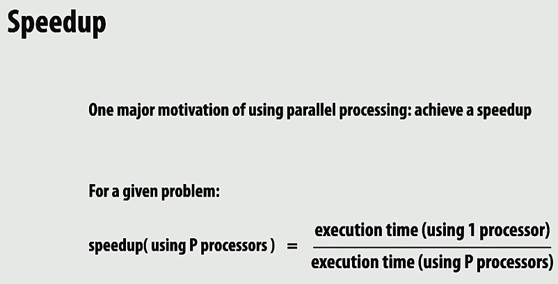
3. 课程主题：
    1. 设计和编写并行程序
        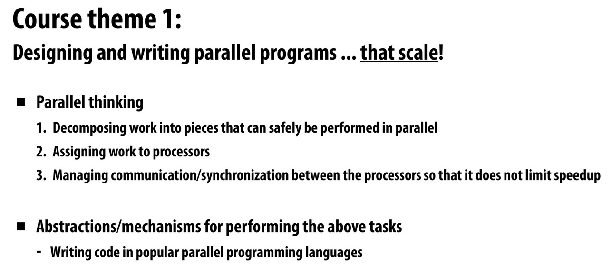
    2. 理解并行计算机硬件是如何工作和实现的
        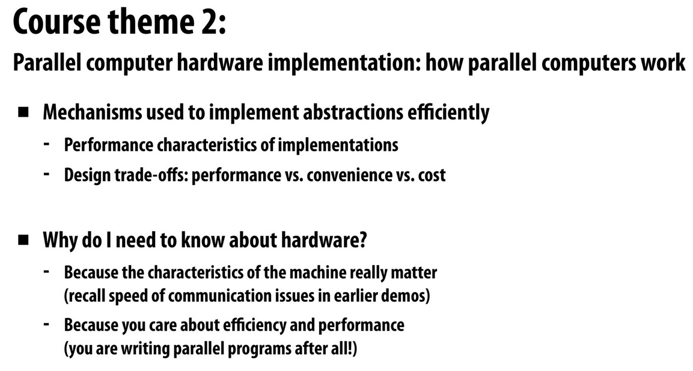
    3. 关注效率. 要注意 FAST != EFFICIENT!
        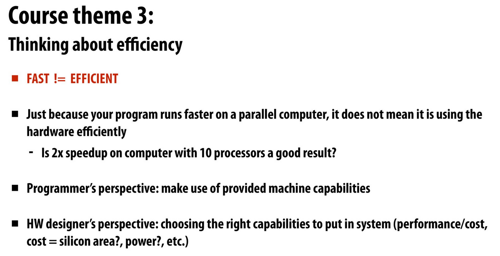

        !!! question 为什么 FAST != EFFICIENT？快但效率低的例子是什么？这里的 “快” 是指什么对象？

4. 什么是程序、处理器？处理器、程序、指令之间的关系？现代处理器的结构：控制单元 Fetch/Decode、运算单元 ALU (Execution Unit)、运行上下文 Execution Context.
5. 并行要对应程序的顺序：指令周期、并行计算，Instruction Level Parallelism (ILP) 例子：依赖图（0:50:17-0:54:10[^cs149]）
    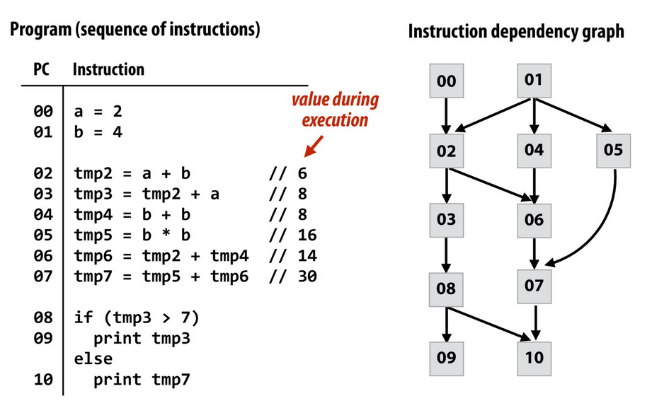
    超标量执行 Superscalar execution

    !!! note 什么是超标量执行？？为什么引入超标量执行？
        表明只执行一条指令，但实际上却提前执行了后几条指令.
        因为程序可以并行化，上下相邻的几条命令可能是相互独立的，此时可以同时获取和执行，但如果有依赖，则无法发挥出超标量执行的效果.

6. 比起增加时钟频率，更好的优化效率方式是多核并行计算
7. 高效率处理通常归结于访问数据效率：术语 Terminology：内存传输延迟 Memory access latency、缓存 Cache、最近最少使用替换策略 Least Recently Used (LRU) replacement policy

    !!! todo 替换策略合集

!!! todo 术语解释
    1. 程序 Program
    2. 指令 Instruction
    3. 处理器 Processor
    4. 指令周期
    5. 并行计算 Parallel programming
    6. 超标量执行 Superscalar execution
    7. 粒度 Granularity
    8. 内存传输延迟 Memory access latency
    9. 缓存 Cache

---

### Lecture 2&emsp;A Modern Multi-Core Processor

现代多核处理器

1. 回顾：程序、处理器、内存：缓存 cache：
    - 击中 hit、冷未击中 cold miss、容量未击中 capacity miss、冲突未击中 conflict miss；
    - two forms of "data locality": 空间局部性 Spatial locality (预加载 preloads 同一行 lines 的**不同地址**的数据，即映射方式的不同会效果不同) and 时间局部性 Temporal locality (重复访问**相同地址**).
    - 三级缓存与绕过缓存（事实上只是为了避免污染中间的缓存而非能减少延迟）
2. 主要内容：
    1. 从软件工程师的角度理解计算机架构
    2. 现代处理器架构如何达到高吞吐量（并行计算的三个主要思想）：
        - 俩个关键并行执行（多核 multi-core、SIMD parallel execution）
        - 对内存访问延迟挑战的解决（多线程 multi-threading）
    3. 理解和优化并行程序的执行、获得对能从高速并行机器中得到什么收益的直觉
3. 如何逐步增加处理器的处理能力：对 $\sin x$ 求值例子的逐步并行化（0:27:54[^cs149]）
    - 简单处理器 very simple processor (0:30:39[^cs149])
      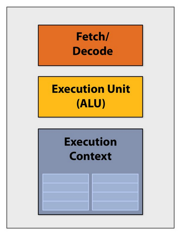
    - 超标量处理器 superscalar processor (0:31:44[^cs149])
      
    - 前多核期处理器 pre multi-core era processor (0:33:11[^cs149])
      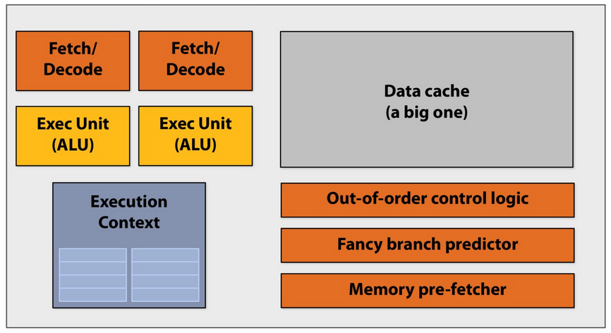
    - 多核期处理器 Multi-core era processor
      - (Idea #1: multi-core: 添加更多核心 add more cores. 0:33:58[^cs149])
        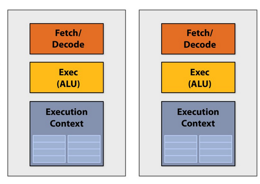
      - (Idea #2: SIMD: 单指令流多数据流处理器 (xmm 寄存器) Simgle instruction, multiple data processor. 0:46:41-0:52:22[^cs149])：同一核心内的 ALUs 只能同时运行同一条指令，条件下会等待 / 屏蔽 mask off（0:55:15[^cs149]），连贯执行 coherent execution 和发散执行 divergent execution
        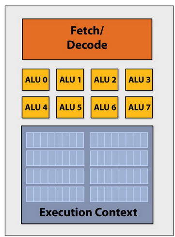

        !!! question `immintric.h` 库以及 **AVX 内在宏 intrinsic macro** 是什么？

    - 混合处理器 Mixed-core processor（1:05:06[^cs149]）：搭配使用超标量、SIMD、多核
      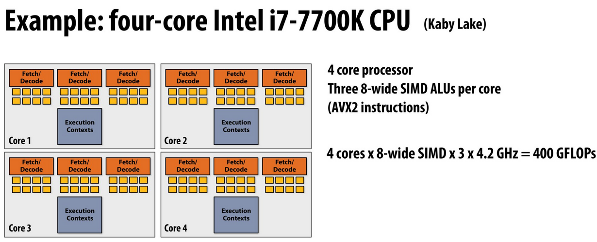
    - 多核处理器架构下的内存访问 (Idea #3: multi-threading: 更多小的或大的上下文以达到高或低减停滞能力 more small or large contexts (high or low latency hiding ability))
      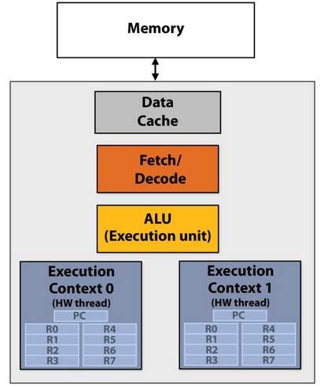
      内存内除了有缓存还有预取 prefetch 的方式来减少停滞 reduce stalls (hides latency)（1:09:24[^cs149]），并行处理下如果缓存内无数据且不好预测时，多处理器会在内存访问等待上花费很长时间，由此用同核心多线程交错处理 interleave processing of multi-threads on the same core 来减缓停滞（即同一核心在某一线程阻塞时去工作另一线程任务）（处理器利用率 100%，同一线程延迟会更长. 1:15:25[^cs149]）

      !!! question 同核心多线程交错处理和操作系统内的线程状态切换是同一内容吗？
          似乎不是

---

### Lecture 3&emsp;Multi-core Arch Part II + ISPC Programming Abstractions

多核架构部分 II (延迟/带宽 latency/bandwidth 问题) + ISPC 编程抽象

1. 回顾多核架构：提高硬件计算吞吐量 throughput computing hardware 的三个方法
    - 多核执行 Multi-core execution（多个核心）
    - 单指令流多数据流执行 SIMD execution（单核内有多个 ALUs 对应执行单元有向量寄存器）
    - 硬件多线程 Hardware multi-threading（多个执行单元以保存线程资源）

    例子与利用率（0:06:40-0:07:26, 0:08:49-0:14:54[^cs149]）

    结论 takeaway：

    1. 当一条线程必须等待内存访问延迟操作完成时，多硬件线程处理器可以通过其他线程执行指令来避免停滞 avoid stalls.
        不过要注意，多硬件线程处理器并不会改变内存访问的延迟，只是让处理器的利用率不再减低而已
    2. 多线程处理器能通过执行其他线程的算法来隐藏内存访问延迟.
        需要更多算术运算的程序每次内存访问需要更少的线程来隐藏内存停顿

    !!! question 超标量处理（多个 Fetch/Decode 单元和对应 ALUs）不算是提高硬件计算吞吐量的方式吗？还是说这是因为比较早就出现了，是那个访问内存延迟的问题之前就出现了？

    !!! question 这是超线程吗？（0:06:56[^cs149]）

2. 一些架构例子：
    - Kayvon's fictitious multi-core chip
      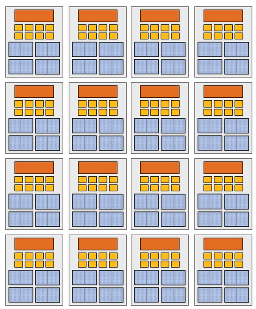
      虽然最多可以 128 个并行任务，但由于同核心可以有 4 个线程上下文，所以分配 512 个任务可以达到更高利用率以及隐藏停滞的效果（0:18:01-0:18:15[^cs149]）
    - Intel Skylake/Kaby Lake core
      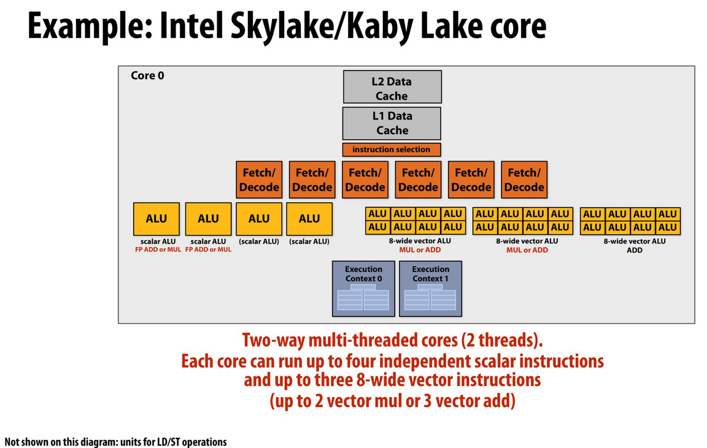
      是一个两路双线程核心 Two-way multi-thread cores (2 threads)，使用了超标量 6 个 Fetch/Decode 单元，2 个执行单元对应 2 个线程，因特尔称其为**超线程 hyper thread**，每个执行单元至多执行 4 个标量指令以及至多执行 3 个 8-wide 向量指令（至多 2 个向量乘或 3 个向量加）

      !!! question 如何解释 Intel Skylake/Kaby Lake core 内部结构？以及为什么这里超标量执行是 6 个取指单元和 7 个运行单元（个数不对等）（0:19:14-0:27:02[^cs149]）

    - GPUs (极度针对吞吐量的处理器) NVIDIA V100 流式多处理器基本单元 streaming multi-processor (SM) unit 结构
      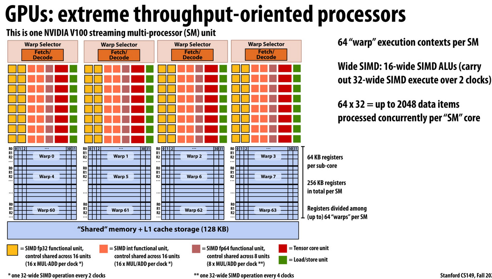
      如果程序工作量不大，可能无法完全利用到 GPU 的计算能力，所以一些小型神经网络在大型 GPU 上运行时效果并不是很好
3. 如何将四种优化方法结合？（0:28:41-0:33:29[^cs149]）（AMD 芯片没有向量执行指令，但是通过判断程序是否在相同程序计数器下来同时执行向量执行等效的指令）

    !!! note OS 是决定线程在哪个执行上下文执行的角色. 当线程数少于核心数时，OS 会优先将线程调度到不同核内的执行上下文而非同一核内的不同执行上下文单元. 除非要求资源共享.

4. 理解延迟和带宽 latency vs. bandwidth：从大数组以元素级别相加是否适合应用于大型 GPU 的问题出发（虽然具有绝佳并行性、向量性，但是糟糕的并行程序. Why? 原因在于：执行并行但内存访问不并行，访问带宽不足以提供及时响应执行指令）

    !!! note 带宽 bandwidth 和吞吐量 throughput 的区别？
        带宽是吞吐量在内存下的度量方式，是指内存传给处理器数据的比率

    延迟和带宽是解耦 decouple 的（相互独立）
    用洗衣机流水线 pipeline 来理解程序执行流水线，每个管道 pipe 需要提高带宽才能跟上指令的执行（0:49:51-0:53:01, 0:53:31-01:01:16[^cs149]）
    现代计算机架构师会先考虑有多大带宽，再考虑能放下多少硬件单元来优化

---

### Lecture 4&emsp;Parallel Programming Basics

---

### Lecture 5&emsp;Performance Optimization I: Work Distribution Scheduling

---

### Lecture 6&emsp;Performance Optimization II: Locality, Communication and Content

---

### Lecture 7&emsp;GPU Architecture and CUDA Programming

---

### Lecture 8&emsp;Data-Parallel Thinking

---

### Lecture 9&emsp;Distributed Data-Parallel Computing Using Spark

---

### Lecture 10&emsp;Efficiently Evaluating DNNS on GPUs

---

### Lecture 11&emsp;Cache Coherence

---

### Lecture 12&emsp;Memory Consistency

---

### Lecture 13&emsp;Fine-Grained Synchronization and Lock-Free Programming

---

### Lecture 14&emsp;Midterm Review

---

### Lecture 15&emsp;Domain Specific Programming Languages

---

### Lecture 16&emsp;Transactional Memory 1

---

### Lecture 17&emsp;Transaction Memory 2

---

### Lecture 18&emsp;Hardware Specialization

---

### Lecture 19&emsp;Accessing Memory + Course Wrap Up -->
