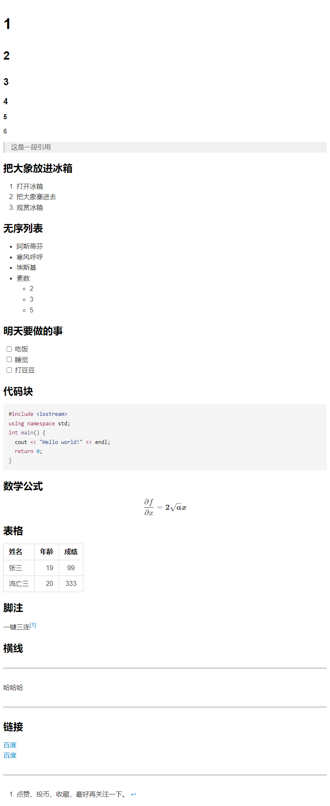

# 文章标题 {ignore = true}

## 目录 {ignore = true}

[toc]

&nbsp; <!-- 空行 -->
&emsp; <!-- 空格 -->

## 正文 {ignore = true}

### 章节

#### 小节

##### 5

###### 6

### 把大象放进冰箱

> 这是一段引用

1. 打开冰箱
2. 把大象塞进去
3. 观赏冰箱

### 无序列表

- 阿斯蒂芬
- 寒风呼呼
- 埃斯基
- 素数
  - 2
  - 3
  - 5

- 素数
  - 素数

- ss
  - 1
    - 22

### 明天要做的事

- [ ] 吃饭
- [ ] 睡觉
- [ ] 打豆豆

### 代码块

```cpp
#include <iostream>
using namespace std;
int main() {
  cout << "Hello world!" << endl;
  return 0;
}
```

### 数学公式

$$
\frac{\partial f}{\partial x} = \bm{2\sqrt{a}x}
$$

### 表格

|姓名|年龄|成绩|
|:---|---:|:---:|
|张三|19|99|
|流亡三|20|333|

### 脚注

一键三连[^三连]

### 横线

---

哈哈哈

---

### 链接

[百度](www.baidu.com "一个搜索引擎")
[百度][id]

[id]: http://www.baidu.com/ "一个搜索引擎"
[^三连]: 点赞、投币、收藏，最好再关注一下。

### 图片



### 字体及特殊符号

*斜体* **加粗** ***斜体加粗*** ^上标^ ~下标~ ~~删除线~~ `main()` ==文本高亮== :smile:
