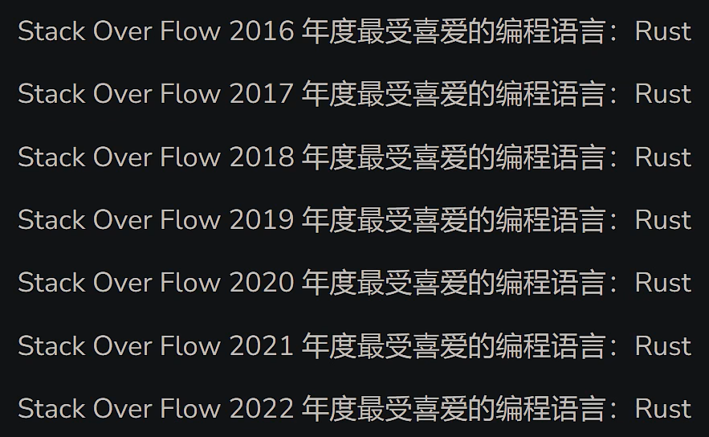
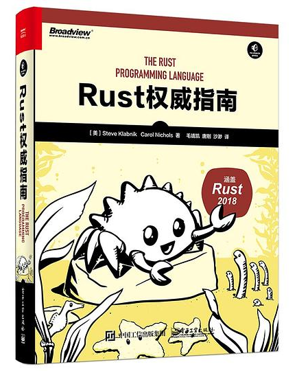
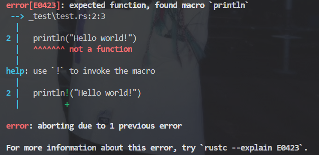

<!-- _class: cover_e -->
<!-- _paginate: "" -->
<!-- _footer:  -->
<!-- _header:  -->

# <!-- fit -->Rust：内存安全版本的 C/C++

###### “A language empowering everyone to build reliable and efficient software.”

@吴玉灿
班级：计科 2201

## 目 录

<!-- _class: cols2_ol_ci fglass toc_a  -->
<!-- _footer: "" -->
<!-- _header: "CONTENTS" -->
<!-- _paginate: "" -->

- [关于 Rust](#第一部分关于-rust)
- [Rust 基本词法](#第二部分rust-基本词法)
- [Rust 基本语法](#第三部分rust-基本语法)
- [Rust 内存管理](#第四部分rust-内存管理)
- [包管理器 Cargo](#第五部分包管理器-cargo)
- [对比 C/C++](#第六部分对比-cc)

## 第一部分——关于 Rust

<!-- _class: trans -->
<!-- _footer: "" -->
<!-- _paginate: "" -->

---

<!-- _header: \ ***Rust 介绍*** **[关于 Rust](#第一部分关于-rust)** *[基本词法](#第二部分rust-基本词法)* *[基本语法](#第三部分rust-基本语法)* *[内存管理](#第四部分rust-内存管理)* *[包管理器](#第五部分包管理器-cargo)* *[对比 C/C++](#第六部分对比-cc)*-->
<!-- _class: navbar fixedtitleA largetext cols-2-->

### 1. WHY Rust？

- Rust 是系统级编程语言，虽然 C/C++ 发展了半个世纪，对于性能方面已经发展到极致，但内存安全始终是 C/C++ 被人诟病的一个点. 而 Rust 的出现就是为了在不影响性能的同时保证内存安全.
- Rust 就如同宣传口号一般，能让每个人编写可靠且高效的软件，一位软件开发者 Mark Rendle 在 NDC Oslo 2021 会议上说道：
  > Rust is very close to being the perfect language.

<div class=rimg>

- Rust 连续 7 年在 StackOverflow 上评为最受喜爱的编程语言


</div>

---

<!-- _header: \ ***Rust 介绍*** **[关于 Rust](#第一部分关于-rust)** *[基本词法](#第二部分rust-基本词法)* *[基本语法](#第三部分rust-基本语法)* *[内存管理](#第四部分rust-内存管理)* *[包管理器](#第五部分包管理器-cargo)* *[对比 C/C++](#第六部分对比-cc)*-->
<!-- _class: navbar fixedtitleA largetext-->

### 2. Rust 的优势

- :hourglass: 运行时的速度快
- :safety_pin: 不使用 GC 保证内存安全
- :rocket: 内存管理、线程并发等方面的处理更“现代”
- :thinking: 易于维护、调试，代码编写高效

### 3. 适合领域

- 高性能 Web Service
- WebAssembly
- 命令行工具
- 网络编程
- 嵌入式设备
- 系统编程

---

### 4. By the way

<!-- _header: \ ***Rust 介绍*** **[关于 Rust](#第一部分关于-rust)** *[基本词法](#第二部分rust-基本词法)* *[基本语法](#第三部分rust-基本语法)* *[内存管理](#第四部分rust-内存管理)* *[包管理器](#第五部分包管理器-cargo)* *[对比 C/C++](#第六部分对比-cc)*-->
<!-- _class: navbar fixedtitleA largetext pin-3-->

<div class=tdiv>

- 对于简中 rust 圈...
  > 你说得对，但是 **Rust** 是由 **Mozilla** 自主研发的一款全新的编译期格斗游戏。编译将发生在一个被称作 **「Cargo」** 的构建系统中。在这里，被引用的指针将被授予 **「生命周期」** 之力，导引对象安全。你将扮演一位名为 **「Rustacean」** 的神秘角色, 在与 **「Rustc」** 的搏斗中邂逅各种骨骼惊奇的傲娇报错。征服她们、通过编译同时，逐步发掘 **「C++」** 程序崩溃的真相.
- 是否难学？适用的人群？
- 编译链：(暂) 使用 C 编译链的链接器 linker，编译器是自设计的 rustc.

</div>

<div class=ldiv>

<br>

- 下载链接与学习途径
  - [编译器 rustup](https://rustup.rs/)
  - [vscode 插件 rust-analyzer](https://marketplace.visualstudio.com/items?itemName=rust-lang.rust-analyzer)
  - [rust 程序设计语言在线文档（中文版）](https://rustwiki.org/zh-CN/book/)
  - [rust 程序设计语言在线文档（英文版）](https://rustwiki.org/zh-CN/book/)

</div>

<div class=rimg>

  

</div>

---

<!-- _header: \ ***Rust 介绍*** **[关于 Rust](#第一部分关于-rust)** *[基本词法](#第二部分rust-基本词法)* *[基本语法](#第三部分rust-基本语法)* *[内存管理](#第四部分rust-内存管理)* *[包管理器](#第五部分包管理器-cargo)* *[对比 C/C++](#第六部分对比-cc)*-->
<!-- _class: navbar fixedtitleA largetext cols-2-46-->

### 5. Hello world!

<div class=ldiv>

```rust {.line-numbers}
fn main() {
  println!("Hello world!")
}
// Hello world!
```

```rust
fn main() {
  println("Hello world!") // error
}
```

</div>

<div class=rimg>



</div>

## 第二部分——Rust 基本词法

<!-- _class: trans -->
<!-- _footer: "" -->
<!-- _paginate: "" -->

---

<!-- _header: \ ***Rust 介绍*** *[关于 Rust](#第一部分关于-rust)* **[基本词法](#第二部分rust-基本词法)** *[基本语法](#第三部分rust-基本语法)* *[内存管理](#第四部分rust-内存管理)* *[包管理器](#第五部分包管理器-cargo)* *[对比 C/C++](#第六部分对比-cc)*-->
<!-- _class: navbar fixedtitleA -->

### 1. 关键词

## 第三部分——Rust 基本语法

<!-- _class: trans -->
<!-- _footer: "" -->
<!-- _paginate: "" -->

---

<!-- _header: \ ***Rust 介绍*** *[关于 Rust](#第一部分关于-rust)* *[基本词法](#第二部分rust-基本词法)* **[基本语法](#第三部分rust-基本语法)** *[内存管理](#第四部分rust-内存管理)* *[包管理器](#第五部分包管理器-cargo)* *[对比 C/C++](#第六部分对比-cc)*-->
<!-- _class: navbar fixedtitleA -->

### 1. Rust 基本语法

## 第四部分——Rust 内存管理

<!-- _class: trans -->
<!-- _footer: "" -->
<!-- _paginate: "" -->

---

<!-- _header: \ ***Rust 介绍*** *[关于 Rust](#第一部分关于-rust)* *[基本词法](#第二部分rust-基本词法)* *[基本语法](#第三部分rust-基本语法)* **[内存管理](#第四部分rust-内存管理)** *[包管理器](#第五部分包管理器-cargo)* *[对比 C/C++](#第六部分对比-cc)*-->
<!-- _class: navbar fixedtitleA -->

### 1. Rust 内存管理

## 第五部分——包管理器 Cargo

<!-- _class: trans -->
<!-- _footer: "" -->
<!-- _paginate: "" -->

---

<!-- _header: \ ***Rust 介绍*** *[关于 Rust](#第一部分关于-rust)* *[基本词法](#第二部分rust-基本词法)* *[基本语法](#第三部分rust-基本语法)* *[内存管理](#第四部分rust-内存管理)* **[包管理器](#第五部分包管理器-cargo)** *[对比 C/C++](#第六部分对比-cc)*-->
<!-- _class: navbar fixedtitleA -->

### 1. 包管理器 Cargo

## 第六部分——对比 C/C++

<!-- _class: trans -->
<!-- _footer: "" -->
<!-- _paginate: "" -->

---

<!-- _header: \ ***Rust 介绍*** *[关于 Rust](#第一部分关于-rust)* *[基本词法](#第二部分rust-基本词法)* [基本语法](#第三部分rust-基本语法)* *[内存管理](#第四部分rust-内存管理)* *[包管理器](#第五部分包管理器-cargo)* **[对比 C/C++](#第六部分对比-cc)**-->
<!-- _class: navbar fixedtitleA -->

### 1. 词法上

---

###### 谢谢听讲！

<!-- _class: lastpage -->
<!-- _footer: "" -->
