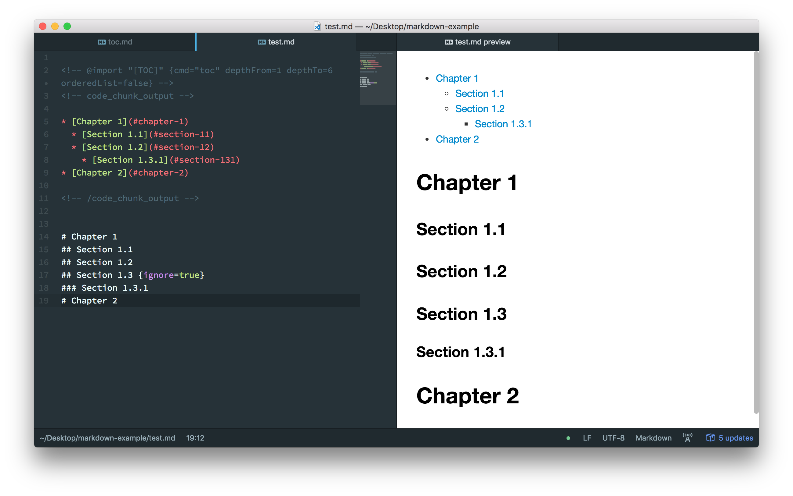

学习链接：

- Markdown 官方教程[^md-official]
  [^md-official]: [Markdown 官方教程](https://markdown.com.cn/)
- Markdown Preview Enhanced 文档[^MPE-doc]
  [^MPE-doc]: [Markdown Preview Enhanced 文档](https://shd101wyy.github.io/markdown-preview-enhanced/#/zh-cn/)

目录：

[toc]

---

## Part I&emsp;Markdown 教程[^md-official]

### 1&emsp;Markdown 入门基础

#### 1.1&emsp;Markdown 是什么？

Markdown 是一种标记性 Markup 语言，本身就是对 html 的封装，可以理解成通过**符号指令而非 GUI 点击**生成**格式化**内容，而适用于浏览器的 Word. **文件后缀用 `.md` 表示，写在 `.txt` 内是没有用的.** 但通过 txt 文本文件编写也没有关系，因为本身 Markdown 就是一种纯文本的标记语言，是通过简单的符号代表格式化，所以即使无法实时预览渲染后的内容，Markdown 的阅读也是清晰的，根据开发者 Gruber 本人的说法：

> Markdown 语法的首要设计目标是尽可能易读。Markdown 的语法被设计为可读性强且不显眼，因此即使 Markdown 文件中的文本未经过渲染也易于阅读。

#### 1.2&emsp;为什么要使用 Markdown？

- Markdown 无处不在：感谢 Markdown 的存在使网络上的知乎、blog 或是 github 这种社区交流能够轻松显示出标题、代码、公式等内容.

  *你也不想我写在 Microsoft Word 里，发送文件到网上，别人需要打开 Word 才能看到内容；或是需要打一堆复杂的 HTML/Tex 语法才能看到标题、代码、公式等非文本格式内容吧*
- Markdown 是纯文本可移植的，可以使用任何程序打开包含 Markdown 格式的文本文件，instead of specified format for Microsoft Word
- Markdown 是独立于平台的
- Markdown 弹性十足，能适应未来的变化

#### 1.3&emsp;Markdown 工具

Markdown 除了只通过文本文件本身编写以外，还可以用 Markdown 应用程序编写并用 Markdown 解析器/处理器预览渲染后的内容，如 Typora 等.
但不同平台可能会采用不同的 Markdown 解析引擎，或是同一引擎的不同版本，这导致不同平台上使用 Markdown 写作的体验不一致，但对于一些大家公认的标准语法，每个平台都是支持的.

#### 1.4&emsp;Markdown 的工作原理


简而言之就是，`.md` 或是 `.markdown` 文件通过处理器解析为 HTML 格式，并通过浏览器引擎或是其他 HTML 渲染引擎显示.

### 2&emsp;Markdown 基本语法

基础语法是所有 Markdown 应用都一定支持的语法.

#### 2.1&emsp;标题

在标题前加入井号（`#`）以表示，其数量代表标题级别

| Markdown 语法 | HTML | 预览效果 | 备注 |       |
| :------------ | :--- | :------ | :--- | :--- |
| `# H1 一级标题` | `<h1>H1 一级标题</h1>` | <h1>H1 一级标题</h1> | 相当于一个报告或论文的大标题，一个 md 文件只能有一个 # 标题，但通常会用 YAML 语法填充当作大标题，如本文档 | |
| `## H2 二级标题` | `<h2>H2 二级标题</h2>` | <h2>H2 二级标题</h2> | 对于长报告或是长论文，H2 对应章标题，H3 和 H4 对应节和小节 | &emsp; |
| `### H3 三级标题` | `<h3>H3 三级标题</h3>` | <h3>H3 三级标题</h3> | ^ | 对于短报告或是期刊论文，通常是用三至五级标题来表示三段章节结构 |
| `#### H4 四级标题` | `<h4>H4 四级标题</h4>` | <h4>H4 四级标题</h4> | ^ | ^ |
| `##### H5 五级标题` | `<h5>H5 五级标题</h5>` | <h5>H5 五级标题</h5> | &emsp; | ^ |
| `###### H6 六级标题` | `<h6>H6 六级标题</h6>` | <h6>H6 六级标题</h6> | Markdown 最高支持六级标题，但通常不建议使用 | |

也能通过在标题后一行添加不少于 3 个的 `=` / `-` 表示一级标题和二级标题，但不推荐使用.

```md
H1
======
H2
------
```

#### 2.2&emsp;段落和换行

Markdown 使用空白行分割段落，在行结尾加入两个或更多个空格实现换行，也支持使用 `<br>` 换行

值得注意的是一次换行在 Markdown 内实质上只是一个空格，Markdown 内会把多个空格识别成一个空格，多次换行识别成一个段落换行.

| Markdown 语法 | HTML | 预览效果 |
| :------------ | :--- | :------ |
| <p>`paragraph 1 line 1`<br>`line 2`</p><p>`paragraph 2 line 1 <br>`<br>`line 2`</p> | `<p>paragraph 1 line 1 <br> line 2</p>` <br> `<p>paragraph 2 line 1 <br> line 2</p>` | <p>paragraph 1 line 1 <br> line 2</p> <p>paragraph 2 line 1 <br> line 2</p> |

#### 2.3&emsp;强调

通过将文本设置为粗体或斜体来强调其重要性.

| Markdown 语法 | HTML | 预览效果 |
|---|---|---|
| `**粗体**` | `<b>粗体</b>` | <b>粗体</b> |
| `*斜体*` | `<i>斜体</i>` | <i>斜体</i> |
| ``使用 ***星号*** (`*`) 而不推荐使用 ___下划线___ (`_`) 包围 __粗体__ 和 _斜体_`` | `使用 <b><i>星号</i></b> (<code>*</code>) 而不推荐使用 <b><i>下划线</i></b> (<code>_</code>) 包围 <b>粗体</b> 和 <i>斜体</i>` | 使用 ***星号*** (`*`) 而不推荐使用 ***下划线*** (`_`) 包围 **粗体** 和 *斜体* |

#### 2.4&emsp;链接

```md
[超链接显示名](超链接地址 "超链接title")
<网络链接地址>

[超链接显示名]: 超链接地址 "超链接title"
```

**名字**是为了找不到链接地址时，能知道这个链接是描述什么的；**标题 title**是鼠标悬浮时会显示的，描述这个链接；对于网络地址最好都加上尖括号 `<>`，如：

使用 `[name]: def` 定义的会隐藏，需要使用时直接使用 `[name]` 引用即可，如下：

```md
[github 官网](https://github.com "远程仓库")
<https://github.com>

[本文]: . "README"

转至[本文]
```

渲染如下：

[github 官网](https://github.com "远程仓库")
<https://github.com>

[本文]: . "README"

转至[本文]

当要链接到 Markdown 的标题时：

- 在同一 Markdown 文件内可以把标题作为链接（`#` + 标题名），如 [下一节](#129图片)；
- 也能跳转到其它的 Markdown 文件内的标题，如 [wyc 的回答](docs/etc.md/#1124-回答-wyc)；

#### 2.5&emsp;列表

支持无序枚举列表、有序列表：

**无序列表**：

用 `-` (或用 `+` / `*`) 缩进表示，若想在一个层次内换行输入，见下实例：

- 一个
  - 啥

    适当缩进可以实现在同一级别

  - 东西

  这时级别同 `一个`.

- 另一个
  - 列表
  - 可以
    - 分层

**有序列表**：

将 `-` 改为数字即可，可以相互 nest 嵌套，且不必按数学顺序排列，但列表应当从数字 1 开始.

!!! Tip 有序列表用 4 空格缩进
    有序列表比较特别的是缩进是 *至少* 3 个空格，这是因为 `1.␣` 占三个位置，要与序列文字同级别则需要对齐其开头位置，不过缩进3个空格既不符合通常的缩进空格个数，又不满足十位数如 `10.␣` 的序列缩进（需要 4 个空格），所以有序列表用 4 空格缩进
    1. 打开冰箱
    2. 把大象装进去
        - 可以用缩小枪缩小大象
        - 可以用放大枪放大冰箱
    3. 关闭冰箱

#### 2.6&emsp;图片

使用 `!` 添加，如下：

```md

```


#### 2.7&emsp;代码

| Markdown 语法 | HTML | 预览效果 |
|---|---|---|
|  ``代码使用 `code` `` | `代码使用 <code>code</code>` | 代码使用 `code` |
| ```转义反引号用双反引号 ``Use `code`.`` ``` | ```<code>转义反引号用双反引号 ``Use `code`.``</code>``` | 转义反引号用双反引号 ``Use `code`.`` |

要创建代码块，需要将代码块每一行缩进至少 4 空格

```md
    <html>
      <head>
      </head>
    </html>
```

渲染如下：

    <html>
      <head>
      </head>
    </html>

但更推荐使用围栏式代码块：

````md
```lang
<html>
  <head>
  </head>
</html>
```

or but not recommended:

~~~lang
<html>
  <head>
  </head>
</html>
~~~
````

渲染如下：

```md
<html>
  <head>
  </head>
</html>
```

#### 2.8&emsp;引用

创建引用块只需在段落前添加一个 `>` 符号

```md
> Dorothy followed her through many of the beautiful rooms in her castle.
```

渲染如下：

> Dorothy followed her through many of the beautiful rooms in her castle.

块引用也可以包含其他元素，包括其自身以实现嵌套

```md
> #### The quarterly results look great
>
> - Revenue was off the chart.
> - Profits were higher than ever.
>
> > Look at that.
>
> *Everything* is going according to **plan**.
```

渲染如下：

> #### The quarterly results look great {ignore}
>
> - Revenue was off the chart.
> - Profits were higher than ever.
>
> > Look at that.
>
> *Everything* is going according to **plan**.

#### 2.9&emsp;分割线

要创建分割线，在单独行上使用三个或多个星号（`***`）、**破折号**（`---`）（**最推荐**）或下划线（`___`），并且上下空行

---

### 3&emsp;扩展语法

扩展语法有可能存在 Markdown 解析器不兼容的情况，但绝大部分都遵从以下语法.

#### 3.1&emsp;标题编号

许多 Markdown 处理器支持标题的自定义 ID，并且可以通过该 ID 链接到标题

| Markdown 语法 | HTML | 预览效果 |
|---|---|---|
| `### H3 {#custom-id}` | `<h3 id="custom-id">My Great Heading</h3>` | <h3 id="custom-id">My Great Heading</h3> |
| `[H3](#custom-id)` | `<a href="#custom-id">H3</a>` | <a href="#custom-id">H3</a> |

#### 3.2&emsp;删除线

通过在单词前后添加两个波浪号（`~~`）创建删除线

| Markdown 语法 | HTML | 预览效果 |
|---|---|---|
| `~~删除~~` | `<del>删除</del>` | ~~删除~~ |

#### 3.3&emsp;自动网址链接

许多 Markdown 处理器会自动将 URL 转换为链接，这意味着输入 http://www.example.com 时即使未使用方括号，也会自动创建链接，可以通过用代码形式来禁止链接，例如 `http://www.example.com`

#### 3.4&emsp;脚注

使用方括号并在其内添加插入符号和标识符（`[^1]`）创建脚注参考，在另一个括号内使用相同的标识符，并用冒号和文本添加脚注，不必在文档末尾添加，可以放置在任意位置.

````md
Here's a simple footnote,[^1] and here's a longer one.[^bignote]

[^1]: This is the first footnote.

[^bignote]: Here's one with multiple paragraphs and code.

```md
Indent paragraphs to include them in the footnote.

`{ my code }`

Add as many paragraphs as you like.
```
````

渲染如下：

Here's a simple footnote,[^1] and here's a longer one.[^bignote]

[^1]: This is the first footnote.

[^bignote]: Here's one with multiple paragraphs and code.

```md
Indent paragraphs to include them in the footnote.

`{ my code }`

Add as many paragraphs as you like.
```

#### 3.5&emsp;定义列表

一些 Markdown 处理器支持创建术语及其对应定义的*定义列表*，使用冒号和空格来分隔术语和定义

```md
First Term
: This is the definition of the first term.

Second Term
: This is one definition of the second term.
: This is another definition of the second term.
```

相当于 HTML：

```html
<dl>
  <dt>First Term</dt>
  <dd>This is the definition of the first term.</dd>
  <dt>Second Term</dt>
  <dd>This is one definition of the second term. </dd>
  <dd>This is another definition of the second term.</dd>
</dl>
```

渲染如下：

First Term
: This is the definition of the first term.

Second Term
: This is one definition of the second term.
: This is another definition of the second term.

#### 3.6&emsp;任务列表

部分 Markdown 处理器可以使你创建带有复选框的项目列表，通过使用破折号 `-` 和方括号 `[ ]` 创建一个待办事项，通过在方括号内添加 `x` 来勾选待办事项

```md
- [x] Write the press release
- [ ] Update the website
- [ ] Contact the media
```

渲染如下：

- [x] Write the press release
- [ ] Update the website
- [ ] Contact the media

#### 3.7&emsp;表格

语法如下：

```md
| 表头1 | 表头2 | 表头3 | 表头4 |
| :---- | :---: | ----: | ---- |
| 左对齐 | 居中 | 右对齐 | 默认是左对齐 |
| 内容1 | 内容 | 想要在表格内打出竖线只能用转义字符 \|，啥都不写是空 | |
```

效果如下：

| 表头1 | 表头2 | 表头3 | 表头4 |
| :---- | :---: | ----: | ---- |
| 左对齐 | 居中 | 右对齐 | 默认是左对齐 |
| 内容1 | 内容 | 想要在表格内打出竖线只能用转义字符 \|，啥都不写是空 | |

!!! Tip 快速构建 Markdown 表格
    直接使用连字符和管道创建表可能很麻烦，可以使用 [Markdown Tables Generator](https://www.tablesgenerator.com/markdown_tables) 图形化界面构建表，再将生成的 Markdown 格式复制到文件中

#### 3.8&emsp;使用 Emoji 表情

大部分情况下，可以简单地从 [Emojipedia](https://emojipedia.org/) 中复制并粘贴表情符号代码.

一些 Markdown 应用程序也允许通过表情符号短代码来插入表情符号，指由冒号包围的表情符号名称

```md
去露营了！ :tent: 很快回来。

真好笑！ :joy:
```

渲染如下：

去露营了！ :tent: 很快回来。

真好笑！ :joy:

!!! note 更多表情可以参考[表情符号简码列表](https://gist.github.com/rxaviers/7360908)

#### 3.9&emsp;数学公式

有行内和行间的数学公式，内部公式的语法是使用 Tex 语法的，具体请参考 [latex 数学公式语法](<https://www.overleaf.com/learn/latex/Mathematical_expressions>)，不过会稍微有点区别，这里篇幅过大而且本文用不到就不讲了.

行内公式使用 `$` 包围，行间公式使用 `$$` 包围.

## Part II&emsp;Markdown in VSCode

VSCode 原生支持 Markdown 基础语法，也有许多 Markdown 拓展插件.

### 1&emsp;Markdown Preview Enhanced[^MPE-doc]

**Markdown Preview Enhanced** 是一款为 **Visual Studio Code** 编辑器编写的**超级强大**的 Markdown 插件. 这款插件意在让你拥有飘逸的 Markdown 写作体验.

#### 1.1&emsp;编写 Markdown

##### 1.1.1&emsp;Markdown 基本要素

除了 Markdown 的基本语法以外，MPE 还支持：

- **标题** `id` 与 `class`：通过在标题最后添加形如 `{#id .class1 .class2}`
- **文字样式标记**：例如
  - `~~删除线~~`：~~删除~~
  - `^上标^`：30^th^
  - `~下标~`：H~2~O
  - `==标记==`：==marked==
  - **CriticMarkup**：缺省禁用，可以通过设置 `markdown-preview-enhanced.enableCriticMarkupSyntax` 为 `true` 启用，包含基本语法：
    - `{++插入++}`：{++插入++}
    - `{--删除--}`：{--删除--}
    - `{~~替焕~>替换~~}`：{~~替焕~>替换~~}
    - `{>>注释<<}`：{>>注释<<}
    - `{==高亮==}`：{==高亮==}
- [**自动网址链接**](#33自动网址链接)和[**脚注**](#34脚注)
- **缩略**：使用 `*[abbreviation]: complete definition` 创建缩略词，之后全文中的缩略词光标悬浮时会显示完整定义，例如：

  ```md
  *[HTML]: Hyper Text Markup Language
  *[W3C]: World Wide Web Consortium
  The HTML specification
  is maintained by the W3C.
  ```

  *[HTML]: Hyper Text Markup Language
  *[W3C]: World Wide Web Consortium
  The HTML specification
  is maintained by the W3C.

- [**定义列表**](#35定义列表)和[**任务列表**](#36任务列表)
- **表格**：除了常见扩展语法的[表格](#37表格)之外，还可以通过设置 `markdown-preview-enhanced.enableExtendedTableSyntax` 为 `true` 启动合并单元格语法，例如：
  - colspan `>` or `empty cell`：

    ```md
    | a | b |
    |---|---|
    | > | 1 |
    | 2 |   |
    ```

    渲染如下：

    | a | b |
    |---|---|
    | > | 1 |
    | 2 |   |

  - rowspan `^`：

    ```md
    | a | b |
    |---|---|
    | 1 | 2 |
    | ^ | 4 |
    ```

    渲染如下：

    | a | b |
    |---|---|
    | 1 | 2 |
    | ^ | 4 |

- **代码块** `class`：可以给代码块设置 `class`，也可以使用预设的 `.line-numbers` (显示行号), `hide` (隐藏代码块)

  ```javascript {.line-numbers}
  function add(x, y) {
    return x + y
  }

  function minus(x, y) {
    return x - y
  }
  ```

- **Admonition**：可以在 [admonitions](https://squidfunk.github.io/mkdocs-material/reference/admonitions/) 内查看更多信息.

  ```md
  !!! note This is the admonition title
      This is the admonition body
  ```

  渲染如下：

  !!! note This is the admonition title
      This is the admonition title

- [**Emoji**](#38使用-emoji-表情)
- **数学公式**：使用 [KaTeX](https://github.com/KaTeX/KaTeX) 或 [MathJax](https://github.com/mathjax/MathJax) 渲染
  - `$...$` 或者 `\(...\)` 中的数学表达式会在行内显示
  - `$$...$$` 或者 `\[...\]` 或者 ` ```math ` 中的数学表达式会在块内显示

##### 1.1.2&emsp;Table Of Contents (TOC)

MPE 支持在 md 文件中生成 `TOC`，可以通过命令面板中的 `Markdown Preview Enhanced: Create Toc` 创建 `TOC`. 若想排除标题，只需在标题**后**添加 `{ignore=true}` 即可.



除了使用 `cmd=toc` 命令创建，可以直接在文件中输入 `[TOC]` 生成 `TOC`. 不过这种方法的 `TOC` 只会在预览中显示，而不会修改源文件.

`TOC` 有以下设置：

- `orderedList`：是否使用有序列表
- `depthFrom`, `depthTo`（可取 `1~6`）：包含的标题级别
- `ignoreLink` 如果设置为 `true`，那么 `TOC` 将不会被超链接

##### 1.1.3&emsp;图像

MPE 内部支持 `flow charts`, `sequence diagrams`, `mermaid`, `PlantUML`, `WaveDrom`, `GraphViz`, `Vega & Vega-Lite`, `Ditaa` 图像渲染，也可以通过 [`Code Chunk`](#114code-chunk) 渲染 `TikZ`, `Python Matplotlib`, `Plotly` 等图像.

!!! note 有些图像渲染在使用 PDF, pandoc 等导出时可能无法正常显示

- [**Mermaid**](TODO)
- [**PlantUML**](TODO)
- [**WaveDrom**](TODO)
- [**GraphViz**](TODO)
- [**Vega**](TODO)和[**Vega-Lite**](TODO)
- [**Kroki**](TODO)

##### 1.1.4&emsp;Code Chunk

TODO

##### 1.1.5&emsp;导入文件

仅仅使用 `@import "your_file"` 即可，也支持 `<!-- @import "your_file" -->` 的写法.
或者使用

```md
- image like syntax
  
- wikilink like syntax
  ![[ file/path/to/your_file ]]
  ![[ my_file ]]
```


**支持的文件类型有**：

- `.jpeg(.jpg)`, `.gif`, `.png`, `.apng`, `.svg`, `.bmp` 文件将会直接被当作 Markdown 图片被引用
- `.csv` 文件将会被转换为 Markdown 表格
- `.mermaid` 文件将会被 `mermaid` 渲染
- `.dot` 文件将会被 `viz.js (GraphViz)` 渲染
- `.plantuml(.puml)` 文件将会被 `PlantUML` 渲染
- `.html` 将会直接被引入
- `.js` 将会被引用为 `<script src="your_file.js"></script>`。
- `.less` 和 `.css` 将会被引用为 style。目前 `less` 只支持本地文件，`.css` 文件将会被引用为 `<link rel="stylesheet" href="your_file.css">`
- .`pdf` 文件将会被 `pdf2svg` 转换为 `svg` 然后被引用
- `.markdown(.md)` 将会被分析处理然后被引用
- 其他所有的文件都将被视为代码块。

**导入文件设置**：通过在导入语法结尾加入 `{settings}` 来设置导入文件的方式.

- **特定行数**：使用 `line-begin` 和 `line-end` 来设定导入的文件中的特定行数
- **图片**：如同 HTML 一般设置 `width`, `height`, `title` 等来设定图片的大小、标题等属性
- **PDF**：需要事先安装好 `pdf2svg`，可以设置：
  - `page_no`：显示第 `nth` 页，例如 `{page_no=1}` 将只显示 PDF 文件的第 1 页.
  - `page_begin, page_end`：显示一定范围内的 PDF 页，例如 `{page_begin=1, page_end=3}` 将只显示 PDF 文件的第 1, 2, 3 页.
- **代码块**：
  - `code_block`：为 `true` 时强制渲染为代码块
  - `class`：设置代码块的渲染 `class` 属性，例如 `{class="line-numbers"}`
  - `as`：以某种方式渲染，例如使用 `mermaid` 渲染 `.md` 文件，`{as="mermaid"}`
  - `cmd`：作为 Code Chunk 渲染代码块

```md
{code_block=true class="line-numbers" line_end=11}
```

渲染如下：

{code_block=true class="line-numbers" line_end=11}

##### 1.1.5&emsp;幻灯片

MPE 使用 [reveal.js](TODO) 渲染幻灯片.

#### 1.2&emsp;文档导出

TODO

#### 1.3&emsp;定制 & 扩展

TODO
