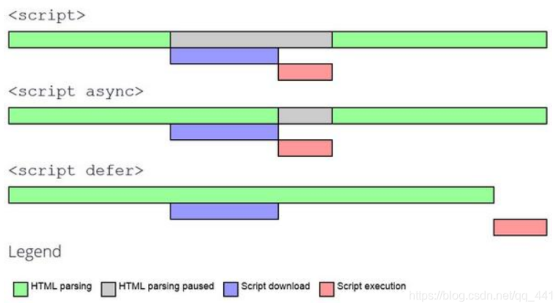

# Learning Note

[toc]

## Ch1: Hello world

```bash
cd microblog/
python -m venv .venv
.venv\Scripts\activate
pip install -r requirements.txt # flask, flask-wtf ...
```

创建以下项目结构

```tree
microblog/
│
├─.venv/
│
└─apps/
   │  __init__.py
   └─ views.py
```

在 `apps/__init__.py` 内导入 `Flask` 和创建 `app` 实例，在 `apps/views.py` 内创建页面展示的路由，会导入 `from apps import app`.

通过这种结构可以在终端输入

```bash
(.venv) microblog> flask --app app run --debug
```

开启 flask 的 debug 模式，在浏览器内输入 `http://127.0.0.1:5000/` 就可以看到页面了.

其中 `flask` 命令有选项 `--app` 指定开始进入的 app 入口，可以指定**整个应用模块 `apps`**，或是添加以下文件：

```python
# wsgi.py
from apps import app

if __name__ = "__main__":
  app.run(debug=True, ...) # other args
```

!!! tip 使用 `livereload.Server` 在开发环境下自动刷新页面
    需要 `pip install livereload`，通过
    ```python
    if __name__ == '__main__':
      from livereload import Server
      server = Server(app.wsgi_app)
      server.watch("apps/**/*)
      server.serve(port=5000)
    ```
    结合 `python wsgi.py` 命令来进入开发环境.

再通过 `wsgi.py` 作为入口进入，此方法可以通过只写第一行加，环境变量 `FLASK_APP` 指定，再输入以下命令：

```bash
(.venv) microblog> set FLASK_APP=wsgi.py
(.venv) microblog> flask run --debug
```

可以在**当前终端进程/子进程**下实现默认寻找 wsgi.py 作为应用的入口.

`run` 是 `flask` 的一个子命令，有选项：
`--debug` / `--no-debug`: 默认不开启调试模式，会通过环境变量 `FLASK_DEBUG=1/0` / `FLASK_ENV=DEVELOPMENT/PRODUCTION` 设置;
`--reload` / `--no-reload`: 默认开启自动重载;
`-h, --host`: 指定主机, 默认 localhost
`-p, --port`: 指定端口，默认 5000.

在安装了 `python-dotenv` 之后 python 命令可以通过环境变量导入参数，在以下项目结构里

```tree
microblog/
│  .flaskenv
│  .env
│  wsgi.py
│
├─.venv/
│
└─apps/
   │  __init__.py
   └─ views.py
```

- `.flaskenv` 写入应用开发环境的配置信息，如 `FLASK_APP=wsgi.py`, `FLASK_DEBUG=1`;
- `.env` 写入应用的配置私密信息，如 `MAIL_USERNAME`, `MAIL_PASSWORD` 等

此时在终端输入 `(.venv) microblog> flask run` 就会自动开启开发模式，并且能找到 app 位置.

不过要进入生产模式则需要修改 `.flaskenv` 内的 `FLASK_DEBUG=0`.

!!! tip `load_dotenv` 导入环境变量以
    环境变量文件需要使用 `dotenv` 库的 `load_dotenv(dotenv_path=None)` 方法导入.
    但 `Flash.run`/`Flask CLI` 命令有参数 `load_dotenv`，默认是 `True`，此时会自动寻找和导入 `.env` 和 `.flaskenv` 文件，并将工作目录切换至 `.env` 文件所在目录. 所以在开发环境下无需再手动导入环境变量文件.

## Ch2: Templates

在 `microblog` 下创建 `templates` 文件夹，里面是放所有的**模板文件.html**，模板就是在 HTML 设定的基础内容下能够根据后端传入的数据动态修改指定位置的内容.

```tree
microblog/
│  .flaskenv
│  .env
│  wsgi.py
│
├─.venv/
│
└─apps/
   │  __init__.py
   │  views.py
   │
   └─templates/
      │  base.html
      └─ index.html
```

创建第一个模板 `index.html`，这是浏览器需要搜索内容时会指定的 HTML 文件名，通常这个 `index` 可以作为游客可访问的**首页**. `base.html` 是基础子模版. 见[总结 S2](Conclusion.md#s2-jinja2-模板)

## Ch3: Web Forms

### 初始

`pip install flask-WTF` 下载 `flask-WTF` 包, 做了以下事情：

1. 通过 `SECRET_KEY` 密钥生成 signatures 签名或 tokens 令牌，免受 CSRF 攻击；
2. 面向对象抽象化表单，通过表单类 `FlaskForm` 继承的各种内容创建表单，封装了 HTML 内的 `form` 表格，由其类属性构成 HTML 标签
3. 在表单类内可以定义好字段验证，通过 `validator` 定义类验证方法，集成了字段验证和 POST 发送为 `validate_on_submit` 的方法，无需繁琐验证.

所以需要为应用配置密钥，在 `microblog` 目录下创建 `config.py` 的 `Config` 类，包含 `SECRET_KEY` 类属性，这种**私密的属性都需要用环境变量的方式获取**，也给了没有环境变量情况下的值.

```python
# config.py
class Config:
  SECRET_KEY = os.environ.get("SECRET_KEY") or token_hex()
```

!!! note 要为应用配置有两种方法：
    1. `app.secret_key = SECRET_KEY` / `app.config['SECRET_KEY'] = SECRET_KEY` 在应用实例上直接硬设置，但这样会暴露密钥，不推荐；
    2. `app.config.from_object(config.Config)` 通过 `from_object` 方法把 `config.Config` 类的属性导入到应用实例上，这样密钥就不会暴露了（给开发人员以外，如果是开发人员仍能通过查看 `config.py` 得知，所以用环境变量的方式可以使得只有自己主机的使用者可以知道）.
    >
    其中使用 `app.config.from_xxx()` 方式还有很多，不止可以使用 python 文件配置，见 [flask API](Conclusion.md#s3-flask-api).
    ```python
    # apps/__init__.py
    from flask import Flask
    from config import Config
    app = Flask(__name__)
    app.config.from_object(Config)
    from app import views
    ```

### 创建表单

对于表单的建立，基本有以下导入

- `flask_wtf` 内导入 `FlaskForm` 基类，用于继承于 flask 应用
- `wtforms` 内可以导入字段标签类型（`StringField`, `PasswordField`, `XXXField`, ...）
- `wtforms.validators` 内导入内置的字段验证器（`DataRequired`, `EqualTo`, `Email`, ...）
- 如果要自定义字段验证器，只需要在对应的表单类内用 `validate_<field_name>(self, field_name)` 定义方法，则 WTForm 会在常规时间内去自动运行该方法验证.

使用以下方式建立表单：

```python
# apps/forms.py
class MyForm(FlaskForm):
  field_name1 = XXXField('<field_label1>', validators=[<validator>, ...])
  ...

  def validate_field_name1(self, field_name1):
    if not condition:
      raise ValidationError('<error_message>')
```

在视图路由器中加入以下片段以构建联系：

```python
# apps/views.py
@app.route('/')
def route_name():
  form = MyForm()
  ... # some operations to form
  # if return the template to render
  return render_template('template_name.html', form=form)
```

在模板中加入以下代码段以显示表格：

```jinja2
{# apps/templates/template_name.html #}
<form action="" method="POST">
  {{ form.hidden_tag() }} {# 包含 CSRF 字段 #}
  <p>
    {{ form.field_name1.label }}
    {# 下面是 input 标签的图形, 可以通过 key=value 如 size=32 的方式设定 input 样式 #}
    {{ form.field_name1(input.attr_name=value) }}
  </p>
  ... {# other fields #}
  <p>{{ form.submit() }}</p>
</form>
```

### 接收表单数据

先在 `base.html` 模板中为 Home 和 Login 提供超链接，在 `/login` 路由器下确定是否 POST 且验证成功

```python
# apps/views.py

# ...
@app.route('login', methods=['GET', 'POST'])
def login():
  form = LoginForm()
  if form.validate_on_submit():
    # do something when validate on submit
    return redirect(url_for('index'))
  # do something when not validate on submit or not submit
  return render_template('login.html', title='Sign In', form=form)
```

### 表单 api

表单提供了几个 api 接口分别用于得知是否 POST 及验证成功、取得 form 字段本身、数据、标签

```python
form.field_name(input.attr_name=value) # 获取表单某字段本身并设置属性值
form.field_name.label # 获取表单某字段的标签
form.field_name.data # 获取表单某字段的数据
form.field_name.errors # 获取表单某字段的错误信息（列表类型）
form.validate_on_submit() # 是否 POST 且验证成功
```

!!! note flask 前后端直接信息传输
    - 后端直接输出信息给前端的 api：`flash` / `get_flashed_messages`，用于在页面显示信息，如 `flash('message')`;
    - 在模板中 `get_flashed_messages()` 获取信息并显示.

!!! note flask redirect 与 url_for
    `redirect('/<url>')` 可以直接重定向到某一 url，若用 `redirect(url_for('<route_name>'))` 的方式则定位到某一视图路由器对应的 url

## Ch4: Database

`pip install flask-sqlalchemy` 下载 flask-sqlalchemy 包，用于连接数据库，并提供了 ORM 对象关系映射，使得 python 对象可以映射到数据库表，使得 python 对象可以像操作数据库表一样操作对象.

`pip install flask-migrate` 下载 `flask-migrate` 包，用于数据库迁移，相当于数据库版的 git，能够控制每个版本的数据库对应的脚本

在配置 `config.py` 中写入 `SQLALCHEMY_DATABASE_URI` 的配置，这是 `flask-SQLAlchemy` 配置数据库 URI 的标准名称，不能更改，如果使用 `DATABASE` 作为配置名，则无法使用到 `sqlalchemy`. 同样也有 `SQLALCHEMY_ENGINE_OPTIONS`.

```python
# config.py
# ...
basedir = os.path.dirname(__file__)
class Config:
  # ...
  SQLALCHEMY_DATABASE_URI = os.environ.get("DATABASE_URL") or \
                            "sqlite:///" + os.path.join(basedir, "app.sqlite")
  SQLALCHEMY_ENGINE_OPTIONS = {
    'echo': True  # 使得 SQLAlchemy 在控制台打印 SQL 语句
  }

# apps/__init__.py
# ...
app = Flask(__name__)
app.config.from_object(Config)
db = SQLAlchemy(app)
migrate = Migrate(app, db)

from apps import views, models
```

通过导入 `models` 模块，使用 `flask db migrate -m "message"` 时会自动从 `models` 模块中寻找 `db.Model` 的子类，并在 `microblog/migration` 下生成迁移脚本，所以导入这步很重要.

`db` 将会在之后的模块中经常出现，这是与数据库连接之后的对象，如同 flask 官方教程里的 `g.db`，不过这里是 `SQLAlchemy` 对象.

对于 `models.py`，这是用于**创建表格、封装增删改查等操作**的 python 代码文件. 具体的操作见 [SQLAlchemy 使用](Conclusion.md#s4-flask-sqlalchemy-migrate-数据库与数据模式及迁移).

此时项目结构如下：

```tree
microblog/
│  .flaskenv
│  .env
│  app.sqlite
│  config.py
│  wsgi.py
│
├─.venv/
│
├─migration/
│
└─apps/
   │  __init__.py
   │  views.py
   │  forms.py
   │  models.py
   │
   └─templates/
      │  base.html
      |  index.html
      └─ login.html
```

在该文件下创建 `User` 和 `Post`.

!!! tip Shell 上下文
    在入口文件 `wsgi.py` 中通过添加
    ```python
    @app.shell_context_processor
    def make_shell_context():
      return {'key': value}  # 具体推入应用上下文的内容
    ```
    可以使得 `flask shell` 时自动推入应用上下文.
    >
    例如:
    ```python
    # wsgi.py
    import sqlalchemy as sa
    import sqlalchemy.orm as so
    from apps import app
    @app.shell_context_processor
    def make_shell_context():
      return {
        'sa': sa,
        'so': so
      }
    ```

## Ch5: User Logins

### hash 密码

使用 `werkzeug.security.generate_password_hash(password)` 可以生成密码的一种 hash 值，将其保存在 `User.password_hash` 字段中，通过 `werkzeug.security.check_password_hash(hash, password)` 可以验证密码是否正确.

在 `User` 类中添加：

```python
# ...
class User(CommonMixin, db.Model):
  # ...

  def set_password(self, password: str) -> None:
    self.password_hash = generate_password_hash(password)

  def check_password(self, password: str) -> bool:
    return check_password_hash(self.password_hash, password)

# ...
```

### Flask-Login

`pip install flask-login` 下载 `flask-login` 包，用于用户登入登出，并提供了 `current_user` 对象，用于获取当前用户对象.

```python
# apps/__init__.py
# ...
from flask_login import LoginManager

# ...
login = LoginManager(app)

# ...
```

在 `UserMixin` 中会提供

- `is_authenticated`: 是否具有有效凭证
- `is_active`: 是否活跃
- `is_anonymous`: 是否匿名
- `get_id()`: 获取用户 id

这是非常通用的四项必须物品，所以对于 `User` 类需要继承 `UserMixin`.

由于 flask-login 需要得知用户的 id，所以需要提供独一的数据库用户加载函数

```python
# apps/models.py
# ...
from apps import login

# ...

@login.user_loader
def load_user(id):
  return db.session.get(User, int(id))
```

### user logging in & out

用户登陆界面逻辑和登出逻辑应该是：

```python
# apps/views.py
# ...

@app.route('/login', methods=['GET', 'POST'])
def login():
  # IF current_user.is_authenticated THEN redirect(index_page)
  if current_user.is_authenticated:
    return redirect(url_for('index'))
  form = LoginForm()
  if form.validate_on_submit():
    # user = User.find_one(username, password)
    # IF user THEN login_user(user, remember_me), redirect(index_page)
    # ELSE Error("Invalid username or password"), redirect(login_page)
    user = db.session.scalar(
      sa.select(User).where(User.username == form.username.data)
    )
    if user is None or not user.check_password(form.password.data):
      flash('Invalid username or password')
      return redirect(url_for('login'))
    login_user(user, remember=form.remember_me.data)
    return redirect(url_for('index'))
  return render_template('login.html', title='Sign In', form=form)

@app.route('/logout')
def logout():
  logout_user()
  return redirect(url_for('index'))
```

对于用户未登陆时有些页面无法访问的，flask-login 提供了 `login_required` 装饰器，用于装饰需要登陆才能访问的页面. 在 `login` 注册的位置通过 `login.login_view = 'login'` 指定未登陆时跳转的路由器. 此时完整的重定向 URL 是 `/login?next=<required_page_url>`，因此应用程序可以利用它在登陆后重定向回来.

```python
# apps/views.py
# ...
from urllib.parse import urlsplit

@app.route('/')
@app.route('/index')
@login_required
def index():
  # ...

  if form.validate_on_submit():
    # ...
    next_page = request.args.get('next')
    if not next_page or urlsplit(next_page).netloc != '':
      next_page = url_for('index')
    return redirect(next_page)

  # ...
```

### 用户注册

最后需要为未注册的用户提供注册通道，这里创建注册表使用 `Email` validator 需要额外的包 `email-validator`.

对表单字段验证使用 `def validate_<field_name>(self, <field_name>)` 的方式定义.
例如

```python
class RegistrationForm(FlaskForm):
  username = StringField('Username', validators=[DataRequired()])
  email = StringField('Email', validators=[DataRequired(), Email()])
  password = PasswordField('Password', validators=[DataRequired()])
  re_password = PasswordField(
    'Repeat Password', validators=[DataRequired(), EqualTo('password')]
  )
  submit = SubmitField('Register') 

  def validate_username(self, username):
    user = User.find_one(_username=username.data)
    if user is not None:
      raise ValidationError('Please use a different username.')
    
  def validate_email(self, email):
    user = User.find_one(_email=email.data)
    if user is not None:
      raise ValidationError('Please use a different email.')
```

之后同样更改 `base.html` 与 `register.html` 以及视图 `views.py`.

## Ch6: Profile page and Avatars

### 用户资料页面

在视图内添加 `/user/<username>` 的路由，并创建 `profile.html` 模板文件，用于显示用户资料页面.

```python
# apps/views.py
# ...

@app.route('/user/<username>')
@login_required
def user(username):
  user = User.find_one_or_404(_username=username)
  return render_template('user.html', title='Profile', user=user)
```

```jinja2
{# apps/templates/base.html #}
{# .. #}
<div>
  Microblog:
  <a href="{{ url_for('index') }}">Home</a>
  
  <a href="{{ url_for('login') }}">Login</a>
  
  <a href="{{ url_for('user', username=current_user.username) }}">Profile</a>
  <a href="{{ url_for('logout') }}">Logout</a>
  
</div>
{# ... #}
```

这里通过 `url_for('user', username=current_user.username)` 的方式动态提供 URL(`/user/<current_user.username>`).

!!! note 对于 `url_for`
    提供参数 `**values` 都会作为路由器的参数或是查询，这里 `username` 是路由器的参数.
    如果传入 `name='user1'`，则转化的 URL 为 `/user?name=user1`

并为模板提供用户资料的链接.

### 头像

这里使用网络存储代理 `www.gravatar.com/avatar` 的方式显示头像，例如 github等都是用这个网络代理

```python
from hashlib import md5
'https://www.gravatar.com/avatar/' + md5(b'wycdkl025704@gmail.com').hexdigest()
# 这种可以返回头像存储的地址
# https://www.gravatar.com/avatar/7bf347bb83b16d44c64101958d2ba4c0
```

!!! tip gravatar 地址查询后缀
    - `s|size=<int>`: 返回图片大小
    - `d|default=<default_t>`: 未注册 gravatar 时默认返回图片类型.
      - 不填写时就是 Gravatar Logo
      - `404` 不加载图片而是返回 HTTP 404
      - `blank` 返回空白图片，透明的 png 图片
        
      - `mp` 不变的神秘人
        
      - `identicon` 生成多边形集合图案
        
      - `monsterid` 生成具有不同颜色、面孔等的怪物图片
        
      - `wavatar` 生成不同特征和背景的面孔
        
      - `retro` 生成 8 位街机风格像素化面孔
        
      - `robohash` 生成具有不同颜色、面孔等的机器人图片
        
    - `f|forcedefault=y`: 强制始终加载默认图像
    - `r|rating=[rating_t]`: 设置可以显示的头像的级别，如果头像没有符合级别则会显示默认图像
      - `g`：默认情况，适合在任何受众类型的所有网站上展示。
      - `pg`：可能包含粗鲁的手势、穿着暴露的个人、较轻的脏话或轻微的暴力。
      - `r`：可能包含粗俗的言语、激烈的暴力、裸体或吸毒等内容。
      - `x`：可能包含性爱画面或令人极度不安的暴力内容。

将获取地址方式封装在 `User` 类内：

```python
# ...
def avatar(self, size):
  digest = md5(self.email.lower().encode('utf-8')).hexdigest()
  return f'https://www.gravatar.com/avatar/{digest}?d=identicon&s={size}'

# ...
```

再通过该方法在用户资料和首页显示头像.

现在可以在 `User` 表和 `user.html` 内添加更多个人资料信息，包括 `about_me`, `last_seen`.

### 记录用户访问时间

flask 提供了 `@app.before_request` 来定义用户发送 HTTP 请求前需要做的事情.

```python
# apps/views.py
# ...
@app.before_request
def before_request():
  if current_user.is_authenticated:
    current_user.seen_now()

# apps/models.py
# ...
class User(CommonMixin, UserMixin, db.Model):
  # ...

  def seen_now(self):
    self.last_seen = datetime.now(timezone.utc)
    db.session.commit()
```

### 修改个人资料

修改个人资料需要创建一个表单：

```python
# apps/forms.py
# ...

class EditProfileForm(FlaskForm):
  username = StringField('Username', validators=[DataRequired()])
  about_me = TextAreaField('About me', validators=[Length(min=0, max=140)])
  submit = SubmitField('Submit')
```

对应放在 `edit_profile.html` 模板和路由器 `/edit_profile` 内.

```python
# apps/views.py
# ...

@app.route('/edit_profile', methods=['GET', 'POST'])
@login_required
def edit_profile():
  form = EditProfileForm()
  if form.validate_on_submit():
    # update(username, about_me)
    current_user.username = form.username.data
    current_user.about_me = form.about_me.data
    User.commit()
    flash('Your changes have been saved.')
    return redirect(url_for('edit_profile'))
  elif request.method == 'GET':
    # show(username, about_me)
    form.username.data = current_user.username
    form.about_me.data = current_user.about_me
  return render_template('edit_profile.html', title='Edit Profile', form=form)
```

在 `user.html` 内假如编辑个人资料的链接，要注意只有是在 `current_user` 所在的页面才能编辑.

!!! tip 使用 `hybrid_property`
    为了更好封装映射表模式，最好将所有列项都用 `_<attr_name>` 的方式命名，用 `@sqlalchemy.ext.hybrid.hybrid_property` 装饰器包装列项，这使得可以自定义列项是否可以直接获取，通过 `@<attr_name>.setter` 装饰器配置直接改变列项的过程或不可以改变 (不使用该装饰器)，如下例：
    ```python
    class CommonMixin:
      id: so.Mapped[int] = so.mapped_column(primary_key=True)
      created_at: so.Mapped[_created_timestamp]
      updated_at: so.Mapped[_updated_timestamp]
      # 为所有继承类都可以使用 db.session.commit()
      @classmethod
      def commit(cls):
        db.session.commit()
    #
    class User(CommonMixin, UserMixin, db.Model):
      _username: so.Mapped[str] = so.mapped_column(sa.String(64), index=True,
                                                  unique=True)
      _email: so.Mapped[str] = so.mapped_column(sa.String(120), index=True,
                                                unique=True)
      _password: so.Mapped[str] = so.mapped_column(sa.String(256))
      _about_me: so.Mapped[Optional[str]] = so.mapped_column(sa.String(140))
      _last_seen: so.Mapped[_created_timestamp]
      # 可以直接获取
      @hybrid_property
      def username(self) -> str:
        return self._username
      # 可以直接设置
      @username.setter
      def username(self, username: str) -> None:
        self._username = username
      # 可以直接获取
      # 不可以直接设置
      @hybrid_property
      def email(self) -> str:
        return self._email
      # 不可以直接获取
      # 不可以直接设置
      @hybrid_property
      def password(self) -> AttributeError:
        raise AttributeError('password is not a readable attribute')
      # 可以直接获取
      @hybrid_property
      def about_me(self) -> Optional[str]:
        return self._about_me
      # 可以直接设置
      @about_me.setter
      def about_me(self, about_me: str) -> None:
        self._about_me = about_me
      # 可以直接获取
      # 不可以直接设置
      @hybrid_property
      def last_seen(self) -> datetime:
        return self._last_seen
      # 间接设置 password 方法
      def set_password(self, password: str) -> None:
        self._password = generate_password_hash(password)
      # 检查 password 方法
      def check_password(self, password: str) -> bool:
        return check_password_hash(self._password, password)
      # 间接设置 last_seen 方法
      def seen_now(self):
        self._last_seen = datetime.now(timezone.utc)
        db.session.commit()
    ```

## Ch7: Error Handling

### 自定义错误页面

只需用 `@app.errorhandler(error_code)` 装饰器包裹即可

```python
# apps/error.py
from flask import render_template
from apps import app, db

@app.errorhandler(404)
def not_found_error(error):
  return render_template('404.html'), 404

@app.errorhandler(500)
def internal_error(error):
  db.session.rollback()
  return render_template('500.html'), 500
```

其中返回值除了模板渲染还有错误码，这是因为之前的路由器默认返回状态码都是 200 (成功响应) 无需更改，而这里的状态码是错误页面的，所以通过该状态码来反映.

其中 500 状态码一般是服务器断电、用户误操作等造成的，经常是在一个事务中间出错的，所以需要使用 `rollback()` 回滚事务.

最后加入对应模板以及在 `__init__.py` 结尾导入 `errors`

### 通过电子邮件发送错误

flask 的默认错误处理是打印到终端，但当服务器部署到生产环境下是无法通过终端查看信息输出的，因此需要一种方法，例如将错误信息发送到电子邮箱.

先在 `config.py` 内配置：

```python
# config.py
# ...

class Config:
  # ...
  MAIL_SERVER = os.environ.get("MAIL_SERVER")
  MAIL_PORT = int(os.environ.get("MAIL_PORT") or 25)
  MAIL_USE_TLS = os.environ.get("MAIL_USE_TLS") is not None
  MAIL_USERNAME = os.environ.get("MAIL_USERNAME")
  MAIL_PASSWORD = os.environ.get("MAIL_PASSWORD")
  ADMINS = ["991129019@qq.com"]
```

部分信息需要由环境变量给出，所以在 `.env` 内配置好 `MAIL_SERVER`, `MAIL_PORT`, `MAIL_USE_TLS`, `MAIL_USERNAME`, `MAIL_PASSWORD`.

- `MAIL_SERVER` 是转发邮件的代理服务器，例如使用 google gmail 电子邮件发送就需要配置为 `smtp.googleemail.com`
- `MAIL_USE_TLS` 是是否使用 TLS 加密.
- `MAIL_USERNAME`, `MAIL_PASSWORD` 是发送邮件的账户和密码 (有部分邮件代理是授权码).
- `ADMINS` 配置变量是将接收错误报告的电子邮件地址列表，因此自己的电子邮件地址应该在该列表中

当使用 google gmail 作为服务器时可能无法直接使用，这是因为 Gmail 账户的安全中一般默认会阻止“安全性较低的应用”访问 Gmail 账号，详见 [这里](<https://support.google.com/accounts/answer/6010255?hl=en>).

需要将 `python/Lib/email/policy.py` 中 Line 201 的代码改为 `charset = 'utf8`.

### 记录

flask 使用 python logging 来编写日志. 通过 `app.logger.addHandler` 来配置日志，可以来自 `logging,handlers` 的类.

```python
# apps/__init__.py
import logging
from logging.handlers import STMPHandler, RotatingFileHandler
import os

# ...

if not app.debug:
  if app.config["MAIL_SERVER"]:
    auth = None
    if app.config["MAIL_USERNAME"] or app.config["MAIL_PASSWORD"]:
      auth = (app.config["MAIL_USERNAME"], app.config["MAIL_PASSWORD"])
    secure = None
    if app.config["MAIL_USE_TLS"]:
      secure = ()
    mail_handler = SMTPHandler(
      mailhost=(app.config["MAIL_SERVER"], app.config["MAIL_PORT"]),
      fromaddr=app.config['MAIL_USERNAME'], 
      toaddrs=app.config["ADMINS"],
      subject="Microblog Failure",
      credentials=auth,
      secure=secure
    )
    mail_handler.setLevel(logging.ERROR)
    app.logger.addHandler(mail_handler)
  
  if not os.path.exists("logs"):
    os.mkdir("logs")
  file_handler = RotatingFileHandler(
    "logs/microblog.log",
    maxBytes=10240,
    backupCount=10
  )
  file_handler.setFormatter(logging.Formatter(
    "%(asctime)s %(levelname)s: %(message)s [in %(pathname)s:%(lineno)d]"
  ))
  file_handler.setLevel(logging.INFO)
  app.logger.addHandler(file_handler)

  app.logger.setLevel(logging.INFO)
  app.logger.info("Microblog startup")

# ...
```

### 修改用户名重复问题

对于编辑个人资料表单上，如果用户保持用户名不变，则验证应该允许，如果用户名更改且与现有用户名重复，则应该引发错误.

```python
# apps/forms.py
# ...

class EditProfileForm(FlaskForm):
  username = StringField('Username', validators=[DataRequired()])
  about_me = TextAreaField('About me', validators=[Length(min=0, max=140)])
  submit = SubmitField('Submit')

  def __init__(self, original_username, *args, **kwargs):
    super().__init__(*args, **kwargs)
    self.original_username = original_username

  def validate_username(self, username):
    if username.data != self.original_username:
      user = User.find_one_or_none(_username_=username.data)
      if user is not None:
        raise ValidationError('Please use a different username.')
```

其中表单重载了构造函数，使得可以传递初始参数 `current_user.username` 作为实例创建的参数：

```python
# apps/views.py
# ...

@app.route('/edit_profile', methods=['GET', 'POST'])
@login_required
def edit_profile():
  form = EditProfileForm(current_user.username)
  # ...
```

## Ch8: Follow

这里要创建多对多关系，具体内容在 SQLAlchemy 的介绍中已经详细给出.

```python
# apps/models.py
# ...

follow = sa.Table(
  'follow',
  db.metadata,
  sa.Column('follower_id', sa.Integer, sa.ForeignKey('user.id'),
            primary_key=True),
  sa.Column('followed_id', sa.Integer, sa.ForeignKey('user.id'),
            primary_key=True)
)

class User(CommonMixin["User"], UserMixin, db.Model):
  # ...
  following: so.WriteOnlyMapped["User"] = so.relationship(
    secondary=follow, primaryjoin=(follow.c.follower_id == id),
    secondaryjoin=(follow.c.followed_id == id),
    back_populates='followers'
  )
  followers: so.WriteOnlyMapped["User"] = so.relationship(
    secondary=follow, primaryjoin=(follow.c.followed_id == id),
    secondaryjoin=(follow.c.follower_id == id),
    back_populates='following'
  )

  def is_following(self, user: "User") -> bool:
    query = self.following.select().where(User.id == user.id)
    return db.session.scalar(query) is not None

  def follow(self, user: "User") -> None:
    if not self.is_following(user):
      self.following.add(user)

  def unfollow(self, user: "User") -> None:
    if self.is_following(user):
      self.following.remove(user)

  def followers_count(self) -> int:
    query = sa.select(sa.func.count()).select_from(
      self.followers.select().subquery()
    )
    return db.session.scalar(query)
  
  def following_count(self) -> int:
    query = sa.select(sa.func.count()).select_from(
      self.following.select().subquery()
    )
    return db.session.scalar(query)
  
  # 希望返回关注的所有人以及自己的帖子
  def following_posts(self) -> List["Post"]:
    Author = so.aliased(User)
    Follower = so.aliased(User)
    return db.session.scalars(
      sa.select(Post)
        .join(Post.author.of_type(Author))
        .join(Author.followers.of_type(Follower), isouter=True)
        .where(sa.or_(
          Follower.id == self.id,
          Author.id == self.id
        ))
        .group_by(Post)
        .order_by(Post.created_at.desc())
    ).all()
  
  def find_following(self) -> List["User"]:
    return db.session.scalars(self.following.select()).all()

  def find_followers(self) -> List["User"]:
    return db.session.scalars(self.followers.select()).all()
```

### 用户模型的单元测试

在 `microblog` 根目录 (`apps` 同级别目录) 下创建 `tests.py` 用于单元测试. 使用 python 的 **`unittest` 包**编写和执行单元测试.

`unittest` 包通过创建 `unittest.TestCase` 的子类来定义测试，并使用 `test_` 开头的函数来定义测试方法. 其中比较特殊的 `setUp` 和 `tearDown` 方法用于在测试开始前和结束后执行一些操作.

### 关注系统

虽然这里使用 GET 请求也可以实现关注功能，但是 GET 请求容易被 CSRF 攻击利用，所以利用空表单和 POST 请求来实现关注功能，而 GET 请求一个只用于不引入状态更改的操作.

```python
# apps/form.py
# ,,,

class EmptyForm(FlaskForm):
  submit = SubmitField('Submit')
```

```python
# apps/views.py
# ...

@app.route('/follow/<username>', method=['POST'])
@login_required
def follow(username):
  form = EmptyForm()
  if form.validate_on_submit:
    user = User.find_one_or_none(_username_=username)
    if user is None:
      flash(f'User {username} not found.')
      return redirect(url_for('index'))
    if user == current_user:
      flash('You cannot follow yourself.')
      return redirect(url_for('user', username=username))
    current_user.follow(user)
    User.commit()
    flash(f'You are following {username}.')
    return redirect(url_for('user', username=username))
  else:
    return redirect(url_for('index'))
  
@app.route('/unfollow/<username>', method=['POST'])
@login_required
def unfollow(username):
  form = EmptyForm()
  if form.validate_on_submit:
    user = User.find_one_or_none(_username_=username)
    if user is None:
      flash(f'User {username} not found.')
      return redirect(url_for('index'))
    if user == current_user:
      flash('You cannot unfollow yourself.')
      return redirect(url_for('user', username=username))
    current_user.unfollow(user)
    User.commit()
    flash(f'You are not following {username}.')
    return redirect(url_for('user', username=username))
  else:
    return redirect(url_for('index'))
```

另外，应该在 `user` 界面添加关注和取消的按键，所以需要修改 `user` 路由器以及其模板

```jinja2
{# ... #}
<h1>User: {{ user.username }}</h1>

<p>{{ user.about_me }}</p>


<p>Last seen on: {{ user.last_seen }}</p>

<p>{{ user.followers_count() }} followers, {{ user.following_count() }} following.</p>

<p><a href="{{ url_for('edit_profile') }}">Edit your profile</a></p>

<p>
  <form action="{{ url_for('follow', username=user.username) }}" method="post">  
    {{ form.hidden_tag() }}
    {{ form.submit(value='Follow') }}
  </form>
</p>

<p>
  <form action="{{ url_for('unfollow', username=user.username) }}" method="post">
    {{ form.hidden_tag() }}
    {{ form.submit(value='Unfollow') }}
  </form>
</p>

{# ... #}
```

## Ch9: Pagination

### 提交博客文章

需要一个表单

```python
# apps/form.py
# ...
class PostForm(FlaskForm):
  post = TextAreaField('Say something', validators=[DataRequired(), Length(min=1, max=140)])
  submit = SubmitField('Submit')
```

之后加入到 `index.html` 模板内.

!!! tip `Post/Redirect/Get`
    对于某些提交表单并不跳转到其他页面的 POST 请求，通常也会通过 `redirect` 方法通过 GET 请求重新访问该页面，这是为了防止用户刷新页面导致重复提交同一表单.

### 访问用户

通过 `/explore` 页面显示所有用户的帖子.

```python
# apps/views.py
# ...

@app.route('/explore')
@login_required
def explore():
  posts = Post.find_all()
  return render_template('index.html', title='Explore', posts=posts)

# ...
```

这里重用了 `index.html` 模板，唯一区别在于这里没有表单，所以需要在模板内通过 `if` 语句区分. 最后在 `base.html` 模板内添加一个链接，将 `_post` 添加头像和用户链接.

### 博客分页

flask-sqlalchemy 原生提供了分页 `db.paginate`，类似于 `db.session.scalars` 但内置了分页功能，主要参数有

- `page` 页码，从 1 开始
- `per_page` 每页显示的条目数
- `error_out` 如果页码超出范围是否抛出异常，默认为 `True`，表示 404 错误，否则返回空列表.

`db.paginate()` 是一个 `Pagination` 对象，其属性 `items` 包含所有的项目列表.

对于分页项目由 `POSTS_PER_PAGE` 配置. 分页的实现可以结合 URL 查询 `/index?page=3` 之类的. 另外还需要属性 `has_next` 和 `has_prev`, `next_num` 和 `prev_num` 来指定前后页面链接.

```python
# apps/views.py
# ...
def index():
  # ...
  page = request.args.get('page', 1, type=int)
  posts = current_user.following_posts_per_page(
    page=page,
    per_page=app.config['POSTS_PER_PAGE']
  )
  next_url = url_for('index', page=posts.next_num) \
    if posts.has_next else None
  prev_url = url_for('index', page=posts.prev_num) \
    if posts.has_prev else None
  return render_template('index.html', title='Home', form=form,
                         posts=posts.items, next_url=next_url,
                         prev_url=prev_url)

# ...
def explore():
  page = request.args.get('page', 1, type=int)
  posts = Post.find_all_per_page(
    page=page,
    per_page=app.config['POSTS_PER_PAGE']
  )
  next_url = url_for('explire', page=posts.next_num) \
    if posts.has_next else None
  prev_url = url_for('explore', page=posts.prev_num) \
    if posts.has_prev else None
  return render_template('index.html', title='Explore', posts=posts.items,
                         next_url=next_url, prev_url=prev_url)
```

最后将以上同样应用在 `user` 中即可.

## Ch10: Email Support

### flask-mail

- 这是用于实际发送电子邮件的包，需要通过 `pip install flask-mail` 下载.
- 另外对于密码重置还需要用**安全令牌**，为了生成令牌，使用 `pyjwt` 包.

```python
# apps/__init__.py
# ...
from flask_mail import Mail， Message

app = Flask(__name__)
# ...
mail = Mail(app)

msg = Message('test subject', sender=app.config['MAIL_USERNAME'],
              recipients=app.config['ADMINS'])
msg.body = 'testing body'
msg.html = '<h1>HTML body</h1>'
mail.send(msg)

# ...
```

通过以上方式结合 `config.py` 配置文件，可以方便地配置邮件服务器.

### 简单的电子邮件框架

创建文件 `apps/email.py`，并定义一个 `send_email` 函数，用于发送邮件.

```python
from flask_mail import Message
from apps import mail

def send_email(subject, subject, recipients, text_body, html_body):
  msg = Message(subject, sender=sender, recipients=recipients)
  msg.body = text_body
  msg.html = html_body
  mail.send(msg)
```

### 请求重置密码

用户希望可以重置密码，但这需要通过电子邮件生成令牌发送给用户以验证是否是使用者.

在 `login.html` 内创建忘记密码的链接，并用新路由器 `reset_password_request` 处理请求，这需要一个表单.

```python
# apps/forms.py
# ...
class ResetPasswordRequestForm(FlaskForm):
  email = StringField('Email', validators=[DataRequired(), Email()])
  submit = SubmitField('Request Password Reset')

# apps/views.py
from apps.email import send_password_reset_email
# ...

@app.route('/reset_password_request', methods=['GET', 'POST'])
def reset_password_request():
  if current_user.is_authenticated:
    return redirect(url_for('index'))
  form = ResetPasswordRequestForm()
  if form.validate_on_submit():
    user = User.find_one_or_none(_email_=form.email.data)
    if user:
      send_password_reset_email(user)
    flash('Check your email for the instructions to reset your password')
    return redirect(url_for('login'))
  return render_template('reset_password_request.html',
                         title='Reset Password', form=form)
```

当然还需要一个模板 `reset_password_request.html`，以上留了个 `apps.email.send_password_reset_email` 函数，这需要定义.

### 密码重置令牌

在实现之前，还需要生成密码请求链接使用户可以重置密码，这需要生成令牌，在允许更改密码之前先验证该令牌，以证明用户是真实的. 非常流行的是 JOIN WEB Token (JWT)，优点在于 JWT 是自包含的，即发送令牌给用户，点击链接也可以自行验证.

```python
import jwt
token = jwt.encode({'a': 'b'}, 'my-secret', algorithm='HS256')
# 'eyJ0eXAiOiJKV1QiLCJhbGciOiJIUzI1NiJ9.eyJhIjoiYiJ9.dvOo58OBDHiuSHD4uW88nfJik_sfUHq1mDi4G0'
jwt.decode(token, 'my-secret', algorithms=['HS256'])
# {'a': 'b'}
```

其中密钥可以从 `app.config['SECRET_KEY']` 获取，`HS256` 是最广泛使用的算法.

!!! note 令牌的作用
    令牌并不是加密的，任何人都可以得知负载内容时什么，但重点在于令牌一旦改动一点，产生的负载会差别很大，且无法验证，这是为了防止有人试图伪造负载使用户点击不安全链接.

用于密码重置的令牌使用格式：

```python
{
  'reset_password': user_id,
  'exp': token_expiration  # JWT 标准字段, 表示令牌到期时间
}
```

由于令牌属于用户，所以令牌生成和验证函数写为模型 `User` 中的方法：

```python
# apps/models.py
# ...
class User(CommonMixin["User"], UserMixin, db.Model):
  # ...

  def get_reset_password_token(self, expires_in: float = 600) -> str:
    return jwt.encode(
      {'reset_password': self.id, 'exp': time() + expires_in},
      app.config['SECRET_KEY'], algorithm='HS256'
    )

  @staticmethod
  def verify_reset_password_token(token: str) -> Optional["User"]:
    try:
      id = jwt.decode(token, app.config['SECRET_KEY'],
                      algorithms=['HS256'])['reset_password']
    except:
      return None
    return db.session.get(User, id)
```

### 发送密码重置电子邮件

正式编写 `send_password_reset_email` 函数:

```python
# apps/email.py
# ...

def send_password_reset_email(user: User) -> None:
  token = user.get_reset_password_token()
  send_email('[Microblog] Reset Your Password',
             sender=app.config['MAIL_USERNAME'],
             recipients=[user.email],
             text_body=render_template('email/reset_password.txt',
                                       user=user, token=token),
             html_body=render_template('email/reset_password.html',
                                       user=user, token=token))
```

为了区分电子邮件模板和常规模板，在 `templates/` 下创建目录 `email/` 存放电子邮件模板，内部内容主要是返回链接 `url_for('reset_password', token=token, _external=True)`

### 重置密码

当用户点击电子邮件链接时，即跳转到对应的重置密码路由，需要一个表单.

```python
# apps/form.py
# ...
class ResetPasswordForm(FlaskForm):
  password = PasswordField('Password', validators=[DataRequired()])
  re_password = PasswordField(
    'Repeat Password', validators=[DataRequired(), EqualTo('password')]
  )
  submit = SubmitField('Request Password Reset')

# apps/views.py
# ...
@app.route('/reset_password/<token>', methods=['GET', 'POST'])
def reset_password(token):
  if current_user.is_authenticated:
    return redirect(url_for('index'))
  user = User.verify_reset_password_token(token)
  if not user:
    return redirect(url_for('index'))
  form = ResetPasswordForm()
  if form.validate_on_submit():
    user.set_password(form.password.data)
    User.commit()
    flash('Your password has been reset.')
    return redirect(url_for('login'))
  return render_template('reset_password.html', form=form)
```

### 异步电子邮件

大量电子邮件会阻塞服务器速度，通常会使用异步 `async` 优化. 通过 python 的 `threadin` 和 `multiprocessing` 模块都可以做到这一点.

```python
# apps/email.py
from threading import Thread

def send_async_email(app, msg) -> None:
  with app.app_context():
    mail.send(msg)

def send_email(subject, sender, recipients, text_body, html_body) -> None:
  msg = Message(subject, sender=sender, recipients=recipients)
  msg.body = text_body
  msg.html = html_body
  Thread(target=send_async_email, args=(app, msg)).start()
```

## Ch11: Facelift

见 [Bootstrap](https://getbootstrap.com/docs/5.3/components/navbar/#responsive-behaviors).

[表单部分](https://getbootstrap.com/docs/5.3/forms/overview/)

用原生的 HTML 是：

```html
<div class="mb-3">
  <label for="exampleInputPassword1" class="form-label">Password</label>
  <input type="password" class="form-control" id="exampleInputPassword1">
</div>
```

但以上只是个表单，事实上还需要字段验证、验证错误信息等：

```html
<div class="col-md-3">
  <label for="validationServer05" class="form-label">Zip</label>
  <input type="text" class="form-control is-invalid" id="validationServer05" aria-describedby="validationServer05Feedback" required>
  <div id="validationServer05Feedback" class="invalid-feedback">
    Please provide a valid zip.
  </div>
</div>
```

但这种方式字段过长且容易出错，可以利用 jinja 宏，允许定义重复的 HTML 片段，如同函数.

```jinja2

<div class="mb-3">
  {{ field.label(class='form-label') }}
  {{ field(class='form-control' + (' is-invalid' if field.errors else '')) }}
  
  <div class="invalid-feedback">{{ error }}</div>
  
</div>

```

当要调用时就使用

```jinja2

...
{{ wtf.form_field(form.username) }}
```

这个宏可以添加对焦参数并判断字段的类型来显示具体的内容，再通过封装为类似于 html 的表单的形式，如 `` 的形式，能够为模板编写者提供更好入手的 API.

```jinja2
{# apps/templates/register.html #}



<h1>Register</h1>
{{ wtf.quick_form(form) }}

```

对于分页链接和其他渲染同理.

## Ch12: Dates and Times

### 时区

服务器应该管理一致且独立于其自身位置和用户位置的时间. 所以使用 UTC 统一时区.

但这种方法对于不同地区的用户，看到 UTC 时间很难确定真正的本地时间. 所以需要使用时区转换.

而获取用户的时区可以通过 JavaScript API 获取. 一种方式是通过 Ajax 调用或是元刷新标记记录在会话中来渲染模板，另一种方式是直接使用 JavaScript 在浏览器中完成从 UTC 到本地时区的转换.

第二种选择有更大优势，因为这种方式可以自定义时间呈现格式以及其他文化或区域风格. 另外的优势在于已经有第三方库可以完成: `flask-moment` 及 `moment.js`.

### 使用 `flask-moment`

与其他三方库插件一样，需要在应用中注册一个 `Moment` 变量.

```python
# apps/__init__.py
# ...
from flask_moment import Moment
moment = Moment(app)
```

该变量作用在于导入 `moment.js`，需要在模板中通过 `{{ moment.include_moment() }}` 导入. 或是基本的 `moment(datetime).format()` 功能

可以用到的地方有 `user.html`, `_post.html`.

!!! tip 导入外部 js 文件的位置
    通过 `<script src="<path_to_js_file>"></script>` 导入外部 js 文件
    放在 head 内会导致文件加载时需要先执行 js 代码才能加载 body 内的元素，通常做法是放在 body 的末尾，以**避免阻塞 body 加载**. 当然也可以通过加入 `defer` 或 `async` 属性来并行加载 js 文件.
    对于特别重要，必须在**全局最初就加载**的代码则放在 head 内.
    

## Ch13: I18n and L10n

这是国际化 Internationalization 和本地化 Localization, 我们的网页不应该只适用于英文，应该提供更多的语言形式，通过一个 `flask-babel` 包可以使翻译工作变得更容易.

为提供支持的语言列表，需要添加一个配置项

```python
# config.py
class Config:
  # ...
  LANGUAGES = ['en', 'zh-cn']
```

同样需要在 `__init__.py` 内配置一个 `babel` 变量，另外在这之前，应该为实例初始一个 `locale_selector` 参数表示每次请求调用的函数以获取最佳的语言翻译.

!!! warning 无法使用 `zh-cn` 创建翻译
    这里要注意的是，事实上 flask-babel 并不识别以 `-` 连接的语言代码，而是使用 `_` 连接，例如 `zh_cn`，但我们还有之后还有翻译任务像日期时间以及帖子内容，这些翻译调用的 API 确实用 `zh-cn` 的识别方式，所以对于特殊的情况我们要用一下方式来创建更灵活的地区选择器
    另外，flask_babel 所使用的中文语言代码是新版本规范，**简体是 `zh_Hans_CN` 而繁体是 `zh_Hant_TW`**.
    这在创建 `zh_cn` 之后的语言 `.po` 文件中也给出了信息.
    ```po
    # zh_cn/LC_MESSAGES/messages.po
    "Language: zh_Hans_CN\n"
    "Language-Team: zh_Hans_CN <LL@li.org>\n"
    ```

```python
# apps/__init__.py
# 这是获取语言版本的方法，babel 通过用户请求时调用还函数来获取对应的语言，值得注意的是也可以通过存储每个用户选择的语言到用户表，这里通过获取 current_user 选择的语言来作为网页的语言. 这种方法在现在的很多网站都有用到.
# 如果想固定某种语言进行测试或生产，只需 return 固定的语言代号即可，例如 return 'zh'
def get_locale(_: bool = False):
  langs: List[str] = app.config['LANGUAGES']
  if _:
    langs = [lang.replace('-', '_') for lang in langs]
  return request.accept_languages.best_match(langs)

# ...
# babel = Babel(app, locale_selector=get_locale)
babel = Babel(app, locale_selector=lambda: get_locale(_=True))
# ...
```

### python 内文本翻译

现在对于所有需要翻译的文本，都需要通过 `flask_babel._` 调用转换. 这只是个下划线

```python
from flask_babel import _
flash(_('Your post is now live!'))
# flash(_(f'User {username} not found.')) # 无法通过 python 格式化字符串
# 但提供了基于 python 旧字符串替换语法的动态组件
flash(_('User %(username)s not found', username=username))
```

对于从 web 请求之外（如应用刚启动时）分配的文本，可以使用 `lazy_gettext()` 方法.

```python
from flask_babel import lazy_gettext as _l

class LoginForm(FlaskForm):
  username = StringField(_l('Username'), validators=[DataRequired()])
  # ...
```

对于 `flask-login` 拓展中每次重定向到登陆页面都会有的消息，本身也是英文，可以通过 `login.login_message` 覆盖默认值.

```python
login.login_message = _l('Please log in to access this page.')
```

### 模板文本翻译

通过 jinja 模板，文本可以嵌套 `_` 实现：

```jinja2
{# <h1>File Not Found</h1> #}
<h1>{{ _('File Not Found') }}</h1>
```

对于超链接的动态字符串，需要使用 `set-end` 语句定义好 `link` 表示的标签，再通过 `_` 调用翻译.

```jinja2

<a href="{{ url_for('login') }}">'Log In'</a>

<p>{{ _('%(link)s', link=link) }}</p>
```

除了文本的翻译，在视图文件内应该在请求发生前获取用户的选择语言，并设置到会话中，以便在后续请求中获取.

```python
# apps/views.py
# ...
@app.before_request
def before_request():
  if current_user.is_authenticated:
    current_user.seen_now()
    User.commit()
  g.locale = str(get_locale())

# ...
```

### Babel 配置

所有 `_()` 和 `_l()` 包含完毕之后，就需要用 `pybabel` 目录将其提取到 `.pot` 文件中，标记所有需要翻译的文本. 在根目录下创建 `babel.cfg` 配置文件，写入以下配置.

```ini
[python: apps/**.py]
[jinja2: apps/templates/**.html]
```

再通过命令文件（可移植文件）：

```bash
pybabel extract -F babel.cfg -k _l -o messages.pot .
# 注意结尾有小点表示当前目录
```

!!! note `pybabel extract` 命令
    command `extract <input-paths>`: 从源文件 `<input-paths>` 提取 (extract) 信息并生成 `POT` 文件 (类似于翻译的模板).
    Options:
    - `-F MAPPING_FILE, --mapping-file=MAPPING_FILE, --mapping=MAPPING_FILE`: 映射的配置文件，配置了从 `<input-paths>` 底下查找的文件及其语言;
    - `-k KEYWORDS, --keywords=KEYWORDS, --keyword=KEYWORDS`: 用空格分隔的关键词列表，`pybabel` 默认只会寻找 `_()` 为文本标记，但这里还使用了 `_l()` 为懒加载版本，所以需要提供关键词: `-k _l`;
    - `-o OUTPUT_FILE, --output-file=OUTPUT_FILE, --output=OUTPUT_FILE`: 输出文件

随即生成了 `messages.pot`:

```po
# Translations template for PROJECT.
# Copyright (C) 2025 ORGANIZATION
# This file is distributed under the same license as the PROJECT project.
# FIRST AUTHOR <EMAIL@ADDRESS>, 2025.
#
#, fuzzy
msgid ""
msgstr ""
"Project-Id-Version: PROJECT VERSION\n"
"Report-Msgid-Bugs-To: EMAIL@ADDRESS\n"
"POT-Creation-Date: 2025-01-01 16:52+0800\n"
"PO-Revision-Date: YEAR-MO-DA HO:MI+ZONE\n"
"Last-Translator: FULL NAME <EMAIL@ADDRESS>\n"
"Language-Team: LANGUAGE <LL@li.org>\n"
"MIME-Version: 1.0\n"
"Content-Type: text/plain; charset=utf-8\n"
"Content-Transfer-Encoding: 8bit\n"
"Generated-By: Babel 2.16.0\n"

#: apps/__init__.py:24
msgid "Please log in to access this page."
msgstr ""

#: apps/email.py:22
msgid "[Microblog] Reset Your Password"
msgstr ""

#: apps/forms.py:9 apps/forms.py:15 apps/forms.py:34
msgid "Username"
msgstr ""
...
...
```

其中的 `msgid ""` 和 `msgstr ""` 以及前后部分是 `.pot`/`.po` 文件的文件头 (head)，是唯一的空 `msgid`，在更新 (`update`) 时会生成 `#, fuzzy` 注释以标识这部分被更新，需要重写翻译.

接着需要生成语言目录，为除基本语言（本例是英语）之外的每种语言创建翻译，

```bash
pybabel init -i messages.pot -d apps/translations -l zh_cn
```

!!! note `pybabel init` 命令
    command `init`: 从 `POT` 文件中创建新的信息目录 (从模板中生成具体的语言翻译文件，只需要在模板对应的位置填写翻译内容即可)
    Options:
    - `-i INPUT_FILE, --input-file=INPUT_FILE`: 输入的可移植文件
    - `-d OUTPUT_DIR, --output-dir=OUTPUT_DIR`: 输出文件的存放目录. **要注意**，flask-babel 默认期望的翻译文件所在位置就是 `apps/translations`
    - `-o OUTPUT_FILE, --output-file=OUTPUT_FILE`: 输出文件名，默认使用 `<output_dir>/<locale>/LC_MESSAGES/<domain>.po`.
    - `-l LOCALE, --locale=LOCALE`: 局部目录的位置.

生成的文件内, `msgid` 为基本语言的文本, `msgstr` 初始生成的时候是空字符串，需要填写翻译的内容才能获取目标语言的文本版本.

最后要通过 `pybabel compile -d apps/translations` 命令编译应用程序的翻译，这会生成 `messages.mo` 文件，这是能够直接应用于应用程序中的翻译文件.

当有部分翻译需要更改时，需要重新提取和编译，这里使用的编译是 `update` 命令，可以通过只编译更改部分并与原先编译好的文件合并，以提高效率.

```bash
pybabel extract -F babel.cfg -k _l -o messages.pot .
pybabel update -i messages.pot -d apps/translations
```

### 翻译日期和时间

日期和时间并不是在 python 代码或模板内的文本，它是由 Flask-Moment 和 moment.js 生成的，而 moment.js 支持本地化和国际化翻译，在模板内使用 `moment.lang(<lang>)` 配置，可以使用 `flask.g` 全局变量来实现.

使用 flask_babel 的 `get_locale()` 方法将语言环境添加在 `g` 对象中，这一步应该在每次请求前发生.

```python
# apps/views.py
from flask import g
from flask_babel import get_locale
# ...s

@app.before_request
def before_request():
  # ...
  g.locale = str(get_locale())

# ...
```

```jinja2
{# apps/templates/base.html #}
{# ... #}
  {{ moment.include_moment() }}
  {{ moment.lang(g.locale) }}
</body>
</html>
```

### 命令行增强

flask 所有子命令都依赖于 `click` 库，同样也支持我们自定义子目录，由于每次输入 `pybabel extract`, `pybabel init`, `pybabel update`, `pybabel compile` 等命令有些过于长了，所以可以通过 `@app.cli.group` 创建一个子命令组 `translate`（先在 `apps` 目录下创建一个新 python 文件 `cli.py`）.

```python
# apps/cli.py
from apps import app

@app.cli.group()
def translate():
  """Translation and localization commands."""
  pass
```

由于 `extract` 命令之后通常会紧跟 `update`（或 `init`），前者生成的 `.pot` 文件只是中间文件，可以将两个命令放在一起使用.

```python
# apps/cli.py
import os

# ...

@translate.command()
def update():
  """Update all languages."""
  if os.system('pybabel extract -F babel.cfg -k _l -o messages.pot .'):
    raise RuntimeError('extract command failed')
  if os.system('pybabel update -i messages.pot -d app/translations'):
    raise RuntimeError('update command failed')
  os.remove('messages.pot')

@translate.command()
def compile():
  """Compile all languages."""
  if os.system('pybabel compile -d app/translations'):
    raise RuntimeError('compile command failed')
```

所有命令通过 `os.system` 帮助执行，非正常运行时会返回非零值.

至于 `init` 命令，它需要指定语言作为参数，这里可以使用 `click` (`app.cli` 源库) 指定参数.

```python
# apps/cli.py
import click

# ...

@translate.command()
@click.argument('lang')
def init(lang):
  """Initialize a new language."""
  if os.system('pybabel extract -F babel.cfg -k _l -o messages.pot .'):
    raise RuntimeError('extract command failed')
  if os.system('pybabel init -i messages.pot -d app/translations -l ' + lang):
    raise RuntimeError('init command failed')
  os.remove('messages.pot')
```

最后，只需要通过在 wsgi 接口处导入该文件即可，即 `wsgi.py` 文件，新创建的命令都会自动生成 `--help` 选项以显示帮助手册信息.

之后只需使用以下命令以及人工翻译部分即可完成翻译任务：

```bash
flask translate init <lang>
flask translate update
flask translate compile
```

## Ch14: Ajax

某些网站在用户的帖子内容旁边会有 “翻译” 的按键，这些按键会触发网站内容的实时刷新. 翻译内容通常插入在原始版本的下文

之前的网站设计中，服务端都是通过直接发送或重定向给用户一个新网页来实现各种 HTTP 请求，这种应用程序称为**服务端应用程序 (Server-Side Application, SSA)**，或称**服务端渲染 (Server-Side Render, SSR)**，也称为**多页应用程序 (Multiple Page Application, MPA)**.
在客户端，并非所有都是 HTML 语言，也有 JavaScript 代码，而这些代码并不会立即执行，而是通过事件处理程序在客户端浏览器运行. 这些程序通过初始网页请求整体下载，之后则完全在客户端运行而无需与服务器端接触，这种应用程序称为**客户端应用程序 (Client-Side Application, CSA)**，或称**客户端渲染 (Client-Side Render, CSR)**，也称为**单页应用程序 (Single Page Application, SPA)**.

大多数应用是两者的混合，本程序主要是 SSA，但在实时翻译这种频繁交互的功能则可以通过客户端浏览器给服务器发送**异步请求 (asynchronous request)**，之后客户端将动态插入翻译，这种技术称为 Ajax (Asynchronous JavaScript and XML)（虽然现在 JSON 在逐步取代 XML）.

!!! tip 什么时候使用 SSR，什么时候使用 CSR？
    |         | SSR | CSR |
    | :-----: | :- | :- |
    | **优点** | 1. SEO (搜索引擎优化) 友好，搜索引擎更容易抓取和索引页面内容，因为 HTML 中包含完整的内容<br>2. 首屏加载速度快，提高用户体验<br>3. 数据流控制，服务器可以根据需要逐步发送数据 | 1. 用户体验、快速的页面切换，避免了页面之间的加载延迟<br>2. 高性能<br>3. 动态更新<br>4. 开发效率高，可以利用现代前端框架 (如 React、Vue或Angular) 的特性，简化开发流程 |
    | **缺点** | 1. 服务器压力大<br>2. 开发复杂度: 需要同时考虑服务端和客户端的渲染逻辑<br>3. 重复加载 | 1. SEO 不友好，不过，现代 SPA 框架提供了 SSR 和与渲染等解决方案来缓解这一问题<br>2. 首屏加载慢<br>3. 开发复杂度: 通常需要更复杂的前端架构和状态管理，增加了开发和维护的难度<br>4. 客户端需要处理所有渲染工作，对于计算能力有限的设备，这可能是一个问题 |
    >
    所以：
    - SSR: 如果项目需要良好的 SEO 效果，需要**快速展示**内容给用户的页面，如新闻站点或博客，且可以具有更复杂的后端集成和更高的服务器资源
    - SSR: 如果性能优先，需要提供更快的后续页面加载速度，需要**实时更新**内容的应用，且在前端开发上工作可以接收，尤其是状态管理和路由器管理

为了实现实时翻译：

1. 需要一种方法来识别要翻译的文本的源语言
2. 需要知道每个用户的首选语言，因为只想为用其他语言编写的帖子显示 “翻译” 链接
3. 当提供翻译链接并且用户单击它时，我需要将 Ajax 请求发送到服务器
4. 服务器将联系第三方翻译 API
5. 一旦服务器发回包含翻译后的文本的响应，客户端 JavaScript 代码就会动态地将此文本插入到页面中

### 语言识别

要确定帖子是用什么语言编写的，python 中有一个语言检查库 `langdetect`.

由于在每个页面下重复进行检测分析有些耗时，通过在创建帖子时就添加检测的帖子语言到 `posts` 表中，可以更高效地实现.

这里语言检测可以放在路由 `index` 内提交新帖子时添加，也可以在表模型 `model.py` 内实现 (因为语言 `lang` 是依赖于 `body` 生成的属性，不应该用独立的一个属性出现). 原教程使用前者，但通过后者可以更好分离数据端和路由端的内容，我将在规范时使用后者.

```python
# apps/views.py
# ...
from langdetect import detect, LangDetectException

# ...

@app.route('/', methods=['GET', 'POST'])
@app.route('/index', methods=['GET', 'POST'])
@login_required
def index():
  form = PostForm()
  if form.validate_on_submit():
    try:
      language = detect(form.post.data)
    except LangDetectException:
      language = ''
    post = Post(_body=form.post.data, _lang=language, author=current_user)
    #...
```

### 显示 “翻译” 链接

对于任何非用户本地语言的帖子旁边添加 “翻译” 链接

```jinja2
{# apps/template/_post.html #}
      {# ... #}
      
      <br><br>
      <a href="#">{{ _('Translate') }}</a>
      
    </td>
  </tr>
</table>
```

不过此时该链接并无任何作用.

### 使用第三方翻译服务

有很多现成的第三方 api 可以调用，本文使用百度的[通用翻译 API](https://developers.google.com/translate/)，获得了自己的 APPID 和 APPKEY. 这里需要通过 `pip install requests` 下载 `requests` 库实现网页 HTTP 请求.

其中 `APPID` 和 `APPKEY` 属于隐私变量，也应该作为环境变量放置在 `.env` 文件内实现.

由于[百度通用翻译 API 所使用的语言代码](https://api.fanyi.baidu.com/doc/21)也与[标准](https://www.zhanid.com/tool/language-codes.html)不同，所以这里需要创建一个字典 `BaiduApiParam` 用于转换.

```python
import requests
import random
from hashlib import md5

from flask_babel import _

from apps import app

endpoint = 'http://api.fanyi.baidu.com'
path = '/api/trans/vip/translate'
url = endpoint + path

BaiduApiParam = {
  'zh-cn': 'zh',
  'zh-tw': 'cht'
}

def make_md5(s, encoding='utf-8'):
  return md5(s.encode(encoding)).hexdigest()

def translate(text, from_lang, to_lang):
  if 'BAIDU_APPID' not in app.config or not app.config['BAIDU_APPID']:
    return _('Error: the translation service is not configured.')
  if 'BAIDU_APPKEY' not in app.config or not app.config['BAIDU_APPKEY']:
    return _('Error: the translation service is going wrong.')
  appid = app.config['BAIDU_APPID']
  appkey = app.config['BAIDU_APPKEY']

  if from_lang in BaiduApiParam:
    from_lang = BaiduApiParam[from_lang]
  if to_lang in BaiduApiParam:
    to_lang = BaiduApiParam[to_lang]

  salt = random.randint(32768, 65536)
  sign = make_md5(appid + text + str(salt) + appkey)
 
  # Build request
  headers = {'Content-Type': 'application/x-www-form-urlencoded'}
  payload = {
    'appid': appid,
    'q': text,
    'from': from_lang,
    'to': to_lang,
    'salt': salt,
    'sign': sign
  }

  # Send request
  r = requests.post(url, params=payload, headers=headers)
  result = r.json()

  if "error_code" in result:
    return (
      f"error_code: {result["error_code"]}, error_msg: {result["error_msg"]}"
    )
  return result["trans_result"][0]['dst']
```

### 服务器的 Ajax

当用户点击 “翻译” 链接时，会向服务器发送异步 HTTP 请求，这个请求可以通过 XML 或 JSON 传递，与正常路由和视图函数的唯一区别在于不返回 HTML 或重定向.

这里所要实现的就是通过 `translate` 路由将原文、源语言、目标语言组成的 JSON 数据转换为翻译后的内容组成的 JSON 数据.

```python
# apps/view.py
# ...
from apps.translate import translate

@app.route('/translate', methods=['POST'])
@login_required
def translate_text():
  data = request.get_json()
  return {
    'text': translate(data['text'], data['from_lang'], data['to_lang'])
  }
```

### 客户端的 Ajax

现在只剩下用户点击 “翻译” 链接之后调用 `/translate` api 的步骤，这一步需要使用 JavaScript.

首先要知道，当网页使用 JavaScript 时，所显示的内容会处于一个**文档对象模型 (Document Object Model, DOM)** 中，DOM 内引用了所有元素，而在此上下文运行的 JavaScript 可以通过选择器对 DOM 内所有元素进行修改.

为找到在 JavaScript 代码中获取 DOM 内帖子的内容，需要通过对每个帖子分配唯一 `id` 来区别.
之后便通过 `document.getElementById('post<post.id>')` 获取元素，其属性 `innerText` 则指向了 `{{ post.body }}`.
同时对于其下方的 “翻译” 链接也同样应该提供唯一 `id`.

```jinja2
{# apps/template/_post.html #}
      {# ... #}
      <span id="post{{ post.id }}">{{ post.body }}</span>
      
      <br><br>
      <span id="translation{{ post.id }}">
        <a href="#">{{ _('Translate') }}</a>
      </span>
      {# ... #}
```

!!! tip 使用 `span` 元素
    使用 `span` 元素可以使一段内容成为元素而又不影响其样式.

下一步则是在 JavaScript 内创建完成翻译工作的函数.

```jinja2
{# apps/template/base.html #}
  {# ... #}
  <script>
    async function translate(srcElem, dstElem, fromLang, toLang) {
      const loadingGifUrl =
        "{{ url_for('static', filename='img/loading.gif') }}"
      document.getElementById(dstElem).innerHTML =
        '';
      const response = await fetch('/translate', {
        method: 'POST',
        headers: {'Content-Type': 'application/json; charset=utf-8'},
        body: JSON.stringify({
          text: document.getElementById(srcElem).innerText,
          from_lang: fromLang,
          to_lang: toLang
        })
      })
      const data = await response.json();
      document.getElementById(dstElem).innerText = data.text;
    }
  </script>
</body>
</html>
```

其中 `fetch` 和 `response.json` 函数都是异步的，所以我们的函数也应该是异步则，才能使用 `await` 关键字等待异步函数完成.

`url_for('static')` 用于生成一个特殊的 `static` 路由路径，要注意只能用 `url_for('static', filename='img/loading.gif')` 不能使用 `url_for('static/img', filename='loading.gif')`，因为 flask 默认 `static` 为特殊的指向静态文件夹的路由器.

再在对应 “翻译” 链接的位置触发该函数.

```jinja2
{# apps/template/_post.html #}
      {# ... #}
      <span id="post{{ post.id }}">{{ post.body }}</span>
      
      <br><br>
      <span id="translation{{ post.id }}">
        <a href="javascript:translate(
                  'post{{ post.id }}',
                  'translation{{ post.id }}',
                  '{{ post.language }}',
                  '{{ g.locale }}');">{{ _('Translate') }}</a>
      </span>
      
      {# ... #}
```

!!! note 链接 `href` 调用 JavaScript 函数
    通过 `href="javascript:<func_name>(<func_args>)"` 即可

## Ch15: A Better Application Structure

当项目规模逐渐增大时，更好的项目结构能帮助实现和维护，现在的 microblog 项目已经有相当的规模了，所以需要重新组织项目结构.

### 目前的问题

实际上目前的结构存在两个问题，第一个问题在于，实际上程序是存在一些不同的子系统的，但其代码都是交织在一起没有分界：

- 用户身份认证子系统：包含 `apps/views.py` 中的一些路由，`apps/forms.py` 中的部分表单，`apps/templates/` 中的电子邮件支持以及 `apps/email.py`.
- 错误子系统：在 `apps/errors.py` 和 `apps/templates/errors/` 中定义.
- 核心应用程序功能，包括显示和撰写博客文章，用户配置文件和关注，以及博客文章的实时翻译，这些功能通过大多数应用程序模块和模板传播.

但现在的组织方式则并非通过业务逻辑，而是通过应用程序功能构造的，如放置模板的目录、翻译、表单、视图函数、错误处理、电子邮件等，这种组织方式对小项目是比较轻松的，但一旦项目增长，其中的模块就会增长很大且混乱（像数据模型和视图函数如今已经是比较大的文件了）

从另一个角度，能在第二个项目中尽可能多地重用这个项目是更好的，比如用户身份认证部分在其他项目中也应该能够正常工作. 但在当前项目结构下，要想要重用子系统，则多个模块，再只复制用户身份相关的部分到新项目中. 而 flask 提供了**蓝图 blueprint** 功能，能使子系统的代码与其他更加独立，从而更加方便的重用.

第二个问题，`Flask` 应用程序实例是作为全局变量在 `apps/__init__.py` 中定义，这会使得某些场景尤其是测试场景变得复杂，例如要在不同配置下测试，或是要对同一配置测试但测试对应用程序进行了更改导致了其他测试失效.

实际上测试时已经通过临时设置 `os.environ['DATABASE_URL'] = 'sqlite:///'` 来避免使用生产的数据库，另一种更有效的解决方案是使用**应用工厂函数 application factory function** 在运行时创建功能. 应用工厂函数是一个接收配置对象为参数的函数，并返回设置配置的 `Flask` 应用程序实例，这使得不同场景下的应用更加分离.

接下来所做的就是将项目结构改成三个子系统和应用工厂函数的蓝图结构.

### 蓝图

蓝图代表应用程序子集的逻辑结构，可以包含路由、视图函数、表单、模板和静态文件等元素.

蓝图需要在应用程序中注册才能使用到其内部的元素.

#### 错误蓝图

改变结构如下

```tree
apps/
│  __init__.py     # blueprint registration
│ 
├─errors/          # blueprint package
│  │  __init__.py  # blueprint creation
│  └─ handlers.py  # error handlers
│
└─templates/
   │  others.html
   │
   └─errors/       # error templates
      │  404.html
      └─ 500.html
```

`apps/errors/handlers.py` 即原先的 `apps/errors.py`，需要把其中 `render_template` 函数参数的路径修改成 `errors/<error_code>.html`.

`apps/errors/__init__.py` 中创建蓝图，在 `apps/__init__.py` 中注册蓝图.

```python
# apps/errors/__init__.py
from flask import Blueprint

bp = Blueprint('errors', __name__)

from apps.errors import handlers
```

```python
# apps/__init__.py
# ...
from apps.errors import bp as errors_bp
app.register_blueprint(errors_bp)

# ...

from app import views, models  # remove errors from this import!
```

!!! note blueprint 蓝图分化
    通过在 `apps/<subsystem>/__init__.py` 内使用 `Blueprint('<bp_name>', __name__)` 创建蓝图
    在 `apps/__init__.py` 内通过导入蓝图后使用 `app.register_blueprint(<import_bp>)` 注册蓝图

#### 认证蓝图

与错误处理类似的，项目结构如下

```tree
apps/
│  __init__.py                        # blueprint registration
│ 
├─auth/                               # blueprint package
│  │  __init__.py                     # blueprint creation
│  │  email.py                        # authentication emails
│  │  forms.py                        # authentication forms
│  └─ views.py                        # authentication views
│
└─templates/
   │  others.html
   │
   └─auth/                            # auth templates
      │  login.html
      │  register.html
      │  reset_password_request.html
      └─ reset_password.html
```

创建和注册的方式也与错误处理蓝图类似，但是由于这个蓝图内还包含了部分表单和路由以及电子邮箱的功能，所以在转移这些元素的同时还需要进行一些修改：

- 路由应该从 `@app.route` 变成 `@bp.route`.
- 构建蓝图下路由的 URL 的方式应该从 `url_for('<view_func_name>')` 变成 `url_for('<bp_name>.<view_func_name>')`

```python
# apps/__init__.py
# ...
from apps.auth import bp as auth_bp
app.register_blueprint(auth_bp, url_prefix='/auth')

# ...
```

!!! note `Flask.register_blueprint` 蓝图注册
    蓝图注册基本的参数是 `<import_bp>`，但可以跟上其他可选参数，例如
    - `url_prefix`：为蓝图内所有路由添加前缀，例如登陆会变为 `/auth/login`.

#### 主要应用程序蓝图

第三个蓝图包含核心应用程序逻辑，蓝图名字命为 `main`，创建和注册过程同前两蓝图. 由于是核心部分，模板文件则不再更改位置.

### 申请工厂模式

接下来是消除全局应用程序实例，使用应用工厂函数的方式构建应用程序. 以下是应用工程函数的基本结构：

```python
# apps/__init__.py
# ...

db = SQLAlchemy()
migrate = Migrate()
login = LoginManager()
mail = Mail()
moment = Moment()
babel = Babel()

login.login_view = 'auth.login'
login.login_message = _l('Please log in to access this page.')

def create_app(config_class=Config):
  app = Flask(__name__)
  app.config.from_object(config_class)

  db.init_app(app)
  migrate.init_app(app, db)
  login.init_app(app)
  mail.init_app(app)
  moment.init_app(app)
  babel.init_app(app)

  # ... no changes to blueprint registration

  if not app.debug and not app.testing:
    # ... no changes to logging setup

  return app

from apps import models  # remove all but models from this import!
```

!!! 应用工厂模式下 flask 拓展实例初始化
    通过在应用工厂函数 `create_app` 之前创建其空实例 `<flask_ext_obj> = <FlaskExtClass>()`
    再在应用工厂函数内在 `app` 实例创建和配置好之后，使用 `<flask_ext_obj>.init_app(app[, <args>])` 初始化

在日志方面，添加了 `app.testing`，这使得在单元测试时不会记录日志，在配置时通过添加 `TESTING` 为 `True` 实现.

看似比较和谐，但全局应用程序实例的消除还是会带来一定的挑战，这使得之前各种直接使用 `app` 的地方需要重新修改.

#### 调用应用工厂函数

第一个修改在于在哪里调用应用工厂函数？我们的运行环境可以给出答案.

- 开发和生产环境：显然在我们的入口 `wsgi.py`，这是现在程序在全局范围的唯一模块
- 测试环境：在 `test.py` 等测试代码，此时可以改变应用工厂函数的参数来改变应用程序的配置.

```python
# wsgi.py
from apps import create_app
app = create_app()

# ...
```

入口部分应该使应用创建提到最前，使得之后能够直接使用全局应用上下文变量 `current_app`，测试部分会在[单元测试改进](#单元测试改进)部分更加详细说明.

#### 使用 `current_app` 代替 `app`

有很多模块都用到了 `app.config`，flask 提供了一个请求上下文变量 `current_app`，它可以获取当前应用程序实例的代理，这与 `g`, `current_user` 以及其他变量都是属于全局上下文变量，不过其中 `current_app` 是应用上下文变量，而 `current_user` 是请求上下文变量.

不过在 `apps/email.py` 中有些额外的修改：

```python
# apps/email.py
# ...
from flask import current_app

# ... no changes to send_async_email function

def send_email(subject, sender, recipients, text_body, html_body) -> None:
  # ...
  Thread(target=send_async_email,
         args=(current_app._get_current_object(), msg)).start()
```

!!! note 如何从 `current_app` 获取实际的应用程序实例？
    因为 `current_app` 只是一个代理，所以有些模块直接将其作为参数是无法使用的，但可以通过 `current_app._get_current_object()` 方法得到其代理对象，即真实的 `app` 实例.

#### 启动时导入的拓展模块

还有剩下的模块是 `apps/cli.py`，它无法用 `current_app` 替代，因为这是在 `wsgi.py` 入口内导入的，意味着它是在应用启动时（而非启动后导入的模块）一起启动的模块

一种方法是将其也作为蓝图，在初始化应用程序时注册，但这种方式并不符合逻辑，因为 `cli` 模块本身并不算是子系统，而是一个开发环境下命令行的增强，这与 `wsgi.py` 内 `shell_context` 部分一样，也使用了 `app`，所以将 `wsgi.py` 逻辑更改为

```python
# wsgi.py
## setup app
from apps import create_app
app = create_app()

## setup extensions with app
with app.app_context():
  from apps.cli import commands, shell_context

## ... run app
```

其中 `shell_context` 部分则放在 `cli/shell_context.py` 中，`cli` 模块则重命名放在 `cli/commands.py` 中，并都在开头 `from flask import current_app as app` 以使用应用程序实例 `app`.

!!! note `app.app_context()` 的作用
    之所以在应用启动之后 `current_app` 能够作为 `app` 的代理，意味着可以使用应用上下文中的元素，是因为启动 `app` 之后，flask 会自动推送 `app.app_context()`，这是一个上下文管理器，它包含了例如 `config`, `cli` 等 `app` 上下文元素.
    所以通过 `with app.app_context()` 可以在入口结束前，应用实例创建后，应用启动时这个时间点访问到应用上下文，使得额外拓展的模块能够使用 `current_app` 代理.

### 单元测试改进

原本的 `test.py` 是在应用程序实例后修改配置的，实际上这是比较危险的做法，因为并非所有类型的更改在这么晚完成时都能起作用，所以最好的方式是在将测试配置在创建应用实例时就指定.

在 `config.py` 中通过创建 `TestConfig` 类作为测试时的配置环境

```python
# config.py
# ...

class TestConfig(Config):
  TESTING = True
  SQLALCHEMY_DATABASE_URI = "sqlite://"
```

然后在单元测试 `test.py` 中使用 `create_app` 函数时传入 `TestConfig` 作为参数，由 `setUp` 和 `tearDown` 方法自动调用.

```python
# test.py
# ...
from apps import create_app, db
from config import TestConfig

def setUp(self):
  self.app = create_app(TestConfig)
  self.app_context = self.app.app_context()
  self.app_context.push()
  db.create_all()

def tearDown(self):
  db.session.remove()
  db.drop_all()
  self.app_context.pop()
```

### 对更大项目的结构

对于更大项目来说，ORM 的数据模型也是一个大模块，所以也需要通过分文件的形式放入 `apps/models/` 文件夹内.

本项目中的 `apps/email.py` 和 `apps/translate.py` 都属于可被复用的模块，这种功能的模块会被放入 `apps/utils/` 目录下.

对于各个蓝图子系统内，都会有 `forms.py`，对于 `auth` 子系统还有 `email.py`，当项目结构变大时，子系统内部的功能模块也会越来越多，通常会放入 `<subsystem>/helpers/` 目录下.

另外，对于应用实现外的单元测试，可能会根据不同模块来分类，可以统一放入 `tests/` 目录下.

以及配置文件，根据不同场景可能有多个配置文件，可以放置在 `configs/` 内.

还有数据库文件，例如使用 sql 生成以及部分原始数据文件，可以放置在 `db/` 和 `db/data/` 目录下.

如果项目搭配了自动构建的脚本，这些脚本可以放置在 `scripts/` 目录下.

理想中的大项目结构可能如下：

```tree
microblog/
│  .gitignore
│  CHANGELOG.md
│  LICENSE
│  README.rst
│
├─docs/              # 项目文档如系统文档、用户手册、项目报告等
├─img/
│
└─project/
   │  .env              # 项目环境变量  .ignore
   │  .flaskenv         # flask 环境变量
   │  .gitignore
   │
   │  Dockerfile
   │  Vagrantfile
   │  
   │  wsgi.py           # WSGI 入口
   │
   ├─.venv/             # 虚拟环境  auto-build .ignore
   ├─logs/              # 日志文件  auto-build .ignore
   ├─migration/         # 数据库迁移文件  auto-build .ignore
   │
   ├─docs/              # 模块文档
   │
   ├─configs/           # 配置文件
   ├─db/                # 数据库文件
   │  └─data/              # 原始数据文件
   │
   ├─tests/             # 单元测试
   ├─scripts/           # 自动构建脚本
   │
   └─apps/
      │  __init__.py
      │
      ├─api/               # api 子系统
      ├─auth/              # auth 子系统
      ├─errors/            # errors 子系统
      ├─main/              # main 子系统 (子系统同样结构)
      │  │  __init__.html
      │  │  views.py
      │  │
      │  └─helpers/           # 子系统处理模块
      │
      ├─cli/               # Flask cli 拓展
      │
      ├─static/            # 静态文件
      ├─templates/         # 模板文件
      │
      ├─translation/       # 翻译文件
      │
      └─utils/             # 可复用工具模块
```

## Ch16: Full-Text Search

本章主要在于让 microblog 拥有搜索功能，对于静态网页，这可以通过 Google, Bing 等 API 实现搜索，但本项目是基于用户发布的帖子，所以基于使用 Elasticsearch 和 SQLAlchemy 集成实现所有文本索引和搜索功能.

## Ch17: Deployment on Linux

将项目转移到 Ubuntu 等 Linux 系统下部署，主要是使用 Gunicorn 作为 WSGI 服务器，使用 Nginx 作为反向代理服务器，使用 Supervisor 作为进程管理器，使用 mysql 作为数据库.

## Ch18: Deployment on Heroku

除了在本地的 Linux 系统下部署，还可以使用 Heroku 等云平台进行部署.

## Ch19: Deployment on Docker

使用 Docker 容器化技术进行部署，可以方便的在不同环境下进行部署，并且可以方便的进行版本控制，方便的进行回滚操作.

## Ch20: Some JavaScript Magic

使用 JavaScript 实现一些动态效果，主要是用户弹出面板，显示用户的快速摘要. 通过定义新路由和模板以及使用 Bootstrap 的弹出组件实现.

## Ch21: User Notifications

本章是对于用户通知以及私信的实现，包括了导航栏未读消息的提示、私信的发送与接收以及显示. 先后增加了数据模型、表单，用户界面的视图函数，还会提及 WebSocket 协议，并在实现轮询通知时使用了 JavaScript 代码.

## Ch22: Background Jobs

应用程序的某一部分会运行长或复制的过程，例如发送邮箱的实现时，通过异步的方式发送邮件，避免阻塞主线程. 但当相关过程更长时，该解决方案的扩展不是很好. 公认的做法是将长期任务卸载到工作过程中，或者更有可能是其中的池.

这一部分需要引入 `Celery` 和 `Redis` 或 `RQ` 作为消息代理和任务队列. 所有这些活动都将在工作进程中发生，发生时用户将看到显示完成百分比的通知. 实现过程包括将 RQ 与 flask 集成并使用任务队列，创建任务数据模型，并在发送邮件时使用任务队列.

## Ch23: Application Programming Interfaces (APIs)

目前构建的功能都是针对 Web 浏览器客户端的，但对于其他类型的客户端则无法做到. 但假如想在例如 Android 或 iOS 上构建应用程序，更好的方法是构建一个本机应用程序，与仅返回 HTML 页面的服务器交互数据，这里所交互的通道就是 API 提供的.

APIs 并不是定义返回 HTML 以供 Web 浏览器使用的路由和视图函数，而是允许客户端直接使用应用程序的资源，从而将如何向用户呈现信息的决定完全留给客户端. 例如 `/translate` 定义的路由就很贴近 API.

此章节会创建多个 API，会提及 REST API 规则，并包括了 `/api/users` 等 API 通道，返回 JSON 格式的数据.
