## 序言

4次汇编编程 + 2次接口综合设计

分组：讨论型作业 + 综合设计实验，3-4人一组

一页开卷（期中 + 期末），期末50% + 平时50%（作业20% + 实验15% + 期中考试15%）

## 80x86微处理器（以8086微处理器为例）

概念：

- 微处理器：微型CPU（运算器+控制器）
- 微型计算机：微处理器加上存储器、系统总线、I/O接口组成微型计算机
- 微型计算机系统：微型计算机配上相应的外围设备、软件、辅助电路

8086是Intel系列CPU的鼻祖，x86即表示 186、286等型号

### 概述

16位数据线，20位地址线（一个地址指向一个**字节**，并非字），1MB（2^20^B）寻址空间

#### 工作模式

- **最小工作模式**：所有控制信号都由一个CPU控制
- **最大工作模式**：有协处理器存在，控制信号由**总线控制器**（各CPU控制信号输入，输出总控制信号）发出

#### 引脚定义

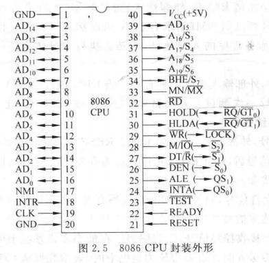
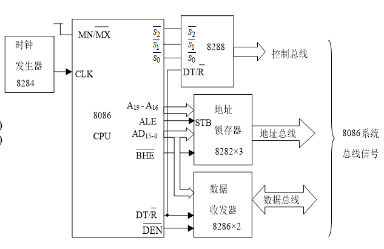

地址数据线：

- AD~0-15~：Address/Data，地址和数据复用线，使用**时分复用**方法
- A~16-19~/S~3-6~：Address/Status，地址和状态复用线，也使用分时复用方法，状态可以表示寻址方式或当前段寄存器位置等

中断、DMA技术：

- NMI：Non-Maskable Interrupt，非屏蔽中断
- INTR, INTA：INTerrupt Request, INTerrupt Acknowledge，中断请求和中断响应信号
- HOLD, HLDA：HOLD, HoLD Acknowledge，总线请求和总线响应信号，DMA中需要使用总线与内存交换数据，则需要请求总线控制权

输入输出控制信号：

- RD：ReaD，读内存或IO信号
- WR：WRite，写内存或IO信号
- M/IO：Memory/Input Output，内存/IO信号，决定访问内存还是IO设备
- DT/R：Data Transmit/Receive，数据传输/接收信号
- DEN：Data ENable：数据收发器使能
- ALE：Address Latch Enable，地址锁存器使能

特殊控制：

- BHE：Byte High Enable，高字节使能，由于每个地址表示一字节段首地址，但8086一字为2B，若字首地址为奇数，则需要分两次传输一个字，见存储器结构节
- MN/MX：MiNimum/MaXimum，最大工作模式与最小工作模式
- TEST：TEST，测试信号，无效时CPU处于WAIT状态，否则开始下一个周期
- READY：READY，外部I/O或内存是否准备好传输

### 内部结构

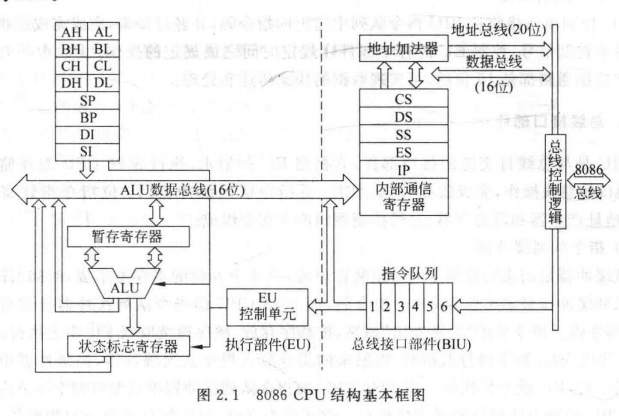

CPU分为EU（Execution Unit）**执行部件**和BIU（Bus Interface Unit）**总线接口部件**

#### 执行部件EU

主要分为

1. 算法逻辑运算器 (Algorithm Logic Unit, ALU)
2. 暂存寄存器（用于辅助 ALU 计算），通用寄存器（共8个），状态标志寄存器（用于表示 ALU 计算特征或放置一些控制标志）
3. 控制单元 (Control Unit, CU)，用于对指令译码并执行，控制 EU 的各个部件的操作

#### 总线接口部件BIU

主要分为

1. 指令队列Buffer，共 6B，先进先出；在队列内有 2B 为空时，BIU 会自动取指令（这就代表 EU 和 BIU 是独立的，可以并行工作，**取指和执行可以同时**，这与8位微处理器不同）
2. 寄存器和地址加法器
3. 总线控制逻辑

### 存储器结构

#### 标准存储结构

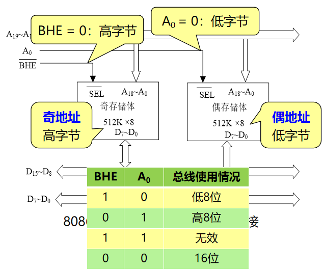

（SEL为SELect，注意此处为**CPU外**的**内存结构**）

正常字存储以奇地址存储器为高字节，偶地址存储器为低字节，称为**规则存放**；反之，称为**非规则存放**，在非规则存储情况下需要使用 BHE信号 和 A~0~ 控制输出数据（需要两个周期输出一个字）

**==为什么内存地址都是以字节为单位？==**：

运行速度相比以bit为单位更快，且一个ASCII编码占1Byte（最小的有意义字符占空间1个字节）

**==字节首地址指向的是数据的高位还是低位？==**：

低位（h为0x68），使用 **小端模式（Little-Endian）** 存放数据，低地址存储低位，高地址存储高位

栈段的变量创建时地址向低地址创建（如先后创建int型变量a和b，若&a=0x6f401c，则&b=0x6f4008，中间相差4Byte，中间存储的是**b**的内容）
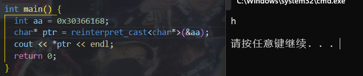

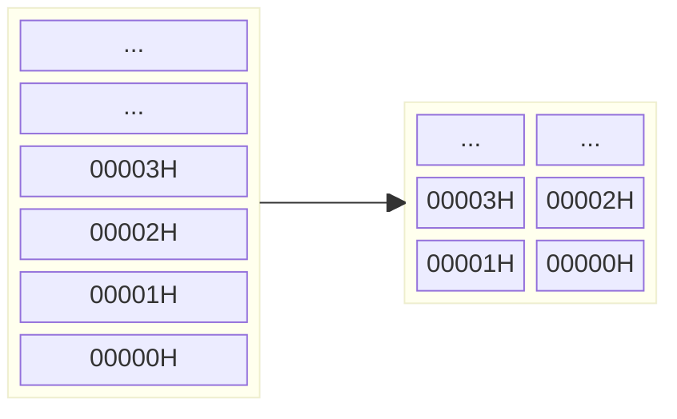

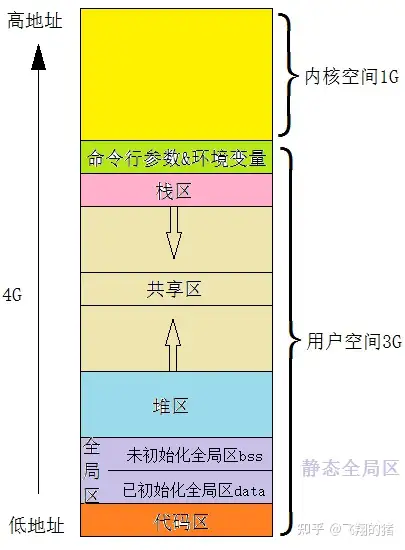

#### 寄存器类别

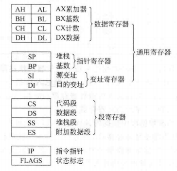

EU内：

- 8个通用寄存器
  - 数据寄存器（用户可用）
    - AX：Accumulator累加器
    - BX：Base基数
    - CX：Count计数
    - DX：Data数据
  - 指针寄存器
    - SP：Stack Pointer栈指针
    - BP：Base Pointer基指针（栈底）
  - 变址寄存器
    - SI：Source Index源索引
    - DI：Destination Index目的索引
- FLAGS：状态标志寄存器
  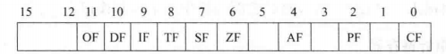
  具体有6个状态标志位和3个控制标志位
  - 状态标志位：
    - CF：Carry Flag，进位标志，**最高位**借位或进位时为1
    - PF：Parity Flag，奇偶标志，8086是**奇数校验**
    - AF：Auxiliary Carry Flag，辅助进位，**低半字节**进位或借位时为1
    - ZF：Zero Flag，零标志
    - SF：Sign Flag，符号标志，负为1
    - OF：Overflow Flag，溢出标志
  - 控制标志位：
    - DF：Direction Flag，方向标志，1为地址减少串操作，反之地址增加
    - IF：Interrupt Flag，中断标志，1为接受可屏蔽中断，反之屏蔽中断
    - TF：Track Flag，追踪标志/单步标志，1为单步调试，反之正常执行
  > ==为什么状态寄存器内部分配的格式是这样的？==

  <https://blog.csdn.net/jiajiayouba/article/details/8593905>

BIU内：

- 4个段寄存器
  - CS：Code Segment代码段
  - DS：Data Segment数据段
  - SS：Stack Segment栈段
  - ES：Extra Segment附加段
- IP：Instruction Pointer指令指针（类似8位处理器的程序计数器PC）

#### 存储分段

原因：实模式下可访问内存大小有1MB，需20条地址线，与16位字长不匹配
解决方法：

- 通过将内存分段，使每大段**最大内存位64KB（连续的物理分布）**，从而**大段内地址**（即**偏移值地址**）可用16位表示
- 将内存分成小段，每个小段**固定内存16B（连续的物理分布）**，**小段首地址**（即**段基值地址**）则可用16位表示
- 将以上两种分段方法结合，**物理地址 (Physical Address, PA)** 即**实际地址**（20位）可以用两个**逻辑地址**（段首地址和偏移值，均为16位）表示：**PA = 段基值地址 $*$ 16 + 偏移值地址**
  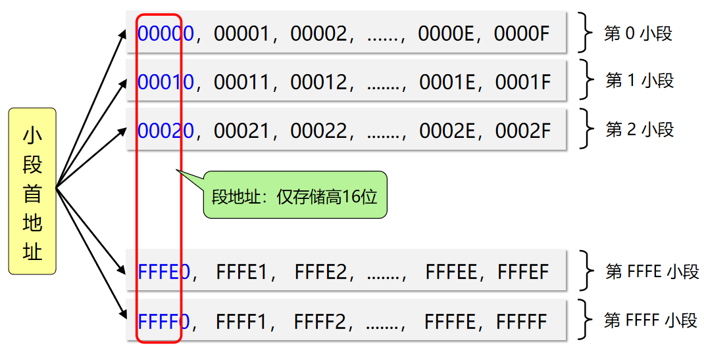
  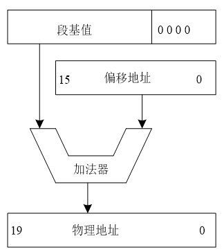

其中**段基地址只是用于表示和指示所处段/空间的用处**（CS用于存放代码, DS用于存放数据, SS栈空间, ES额外段），真实一段代码和数据**可能并不是**从 CS 和 DS 开始存放的，具体见指令系统的寻址方式

从而以上解决方法会出现：一个存储单元只有唯一对应的 PA，但可能对应多个逻辑地址，如 PA = 40F01H，可以是 4000H $*$ 16 + 0F01H，也可以是 4080H $*$ 16 + 0801H

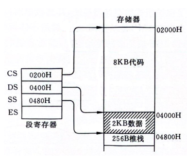  

## 80x86指令系统和寻址方式

### 指令系统概述

**指令**：计算机运行的**最小功能单位**
**寻址方式**：分为寻找操作数和程序转移

结构通常为：操作码 OP + 操作数 [+ 操作数 + ...]

### 数据寻址方式

80x86指令中数据有三个来源：

- **立即数**：操作数在**指令**中
- **寄存器操作数**：操作数在**CPU的某个内部寄存器**中
- **存储器操作数**：操作数在**存储器**中

#### 立即寻址

```nasm
MOV AX, 0A75H
MOV AL, 5H
```

其中 `0A75H` 为立即数，通常用于给寄存器或存储单元赋值

#### 寄存器寻址

```nasm
MOV AX, BX
MOV AH, AL
```

其中 `BX` 为寄存器操作数，操作数就在CPU内的寄存器内，速度快，通常用于寄存器之间的数据传递

#### 存储器寻址

操作数的物理地址 PA = 段基地址 \* 16 + 偏移地址 EA

- **段基地址**来自段寄存器 CS, DS, SS, ES.
- **偏移地址**又称**有效地址** (Effective Address, EA)，真实表示一段数据存放的地址，由 4 部分组成：
  1. **基址**，存放在基址寄存器 BP 或 BX 中，指向数据或字符串的**首地址**
  2. **变址**，存放在变址寄存器 SI 或 DI 中，通常用来访问数组中某个元素或字符串中的某个字符
  ==剩余的寄存器 AX, CX, DX, SP 呢？==
  3. **比例因子**：80386之后才有，仅与变址寄存器同时使用，值为 1, 2, 4 或 8. **8086中值为 1**. 例如整形数组，在 64 位型机中，一个数占 4Byte，则需要比例因子 4
  4. **位移量**：相对于某个存储单元的偏移量，可为负值

  **EA = 基址 + 变址 \* 比例因子 + 位移量**
  特殊的，8086中，**EA = 基址 + 变址 + 位移量**

于是，根据有效地址的不同构成情况，可以具体分成五种（基址/变址看作不选、选其中之一、都选，于是有 $3 \times 2 - 1 = 5$ 种）：

1. **直接寻址**：只选位移量，段基默认使用数据段 DS，EA = DS \* 16 + 位移量

    ```nasm
    MOV  AX, [1234H]   ; AX <- DS:[1234H]; 必须加 []，表示地址
    ```

    通常用于存取某个存储器单元

    汇编语言中可以用**符号地址**代替数值地址

    ```nasm
    MOV  AX, VALUE
    MOV  AX, [VALUE]
    ```

    其中 `VALUE` 和 `[VALUE]` 都是表示地址，两者等价

2. **寄存器间接寻址**：只选基址(BP, BX)/变址(SI, DI)寄存器其一，用其内部值作为存储器地址 PA 的偏移地址. BP 搭配段寄存器 SS 使用， BX, SI, DI 搭配段寄存器 DS 使用.

    ```nasm
    MOV  AX, [BX]   ; PA = DS×16+BX
    MOV  [DI], DX   ; PA = DS×16+DI
    MOV  [BP], BX   ; PA = SS×16+BP
    ```

    > ==为什么 BP 基指针搭配 SS 使用，在使用时 SS:[BP] 所指的存储器地址实际意义是什么？栈顶？栈底？SP 栈指针在什么时候使用？==

    也可以用**段超越前缀**（**段跨越前缀**, Segment Override Prefix, SOP）指定段寄存器

    ```nasm
    MOV  AX, ES:[BX]   ; PA = ES×16+BX
    MOV  DS:[BP], AX   ; PA = DS×16+BP
    ```

3. **相对寄存器寻址**：选基址/变址寄存器其一和偏移量.

    ```nasm
    MOV  AX, ARRAY[SI]      ; PA = DS×16+SI+ARRAY
    MOV  AX, [ARRAY + SI]   ; 等价
    MOV  AX, [1000H][DI]
    ```

4. **基址变址寻址**：基址和变址寄存器都选，

    ```nasm
    MOV  AX, [BX][DI]
    MOV  AX, [BX + DI]   ; 等价
    ```

    适合数组和表格处理，基址存放首地址，变址存放数组的下标

5. **相对基址变址寻址**：基址和变址寄存器及偏移量都选

    ```nasm
    MOV  AX, ARRAY[BX][SI]        ;
    MOV  AX, ARRAY[BX + SI]       ; 等价
    MOV  AX, [ARRAY + BX + SI]    ; 等价
    ```

> **==猜想：是否存储器寻址其实编译时并不关注寄存器的类别，通用 \[R1]\[R2]\[R3] 表示 [R1 + R2 + R3]，只不过符号地址可以去除括号，所以有 ARRAY\[R1]\[R2]==**
> 是的，在缺少段基地址时做的默认寻址不同而已

### 程序寻址方式

80x86内程序的转移按照转移的位置分为两种：

- **段内转移**：在同一段内转移程序, 只修改 IP 的值
- **段间转移**：在不同段间转移程序, 同时修改 CS 和 IP 的值

按照提供转移地址的方式分为两种：

- **直接寻址**：转移地址直接给出
- **间接寻址**：转移地址通过寄存器或存储器间接给出

由此可以将程序寻址方式分为四种：

- **段内直接寻址方式**/直接寻址方式/相对寻址方式
- **段内间接寻址方式**
- **段间直接寻址方式**
- **段间间接寻址方式**

#### 段内直接寻址方式

指令中提供位移量（可正可负）

有效地址 EA = (IP) + 位移量，编程时直接输入 EA, 汇编器会将其编码为位移量

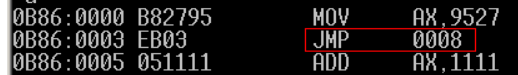

IP 在取 0B86:0003 的指令 EB03 后自增到了 0B86:0005, 因此 EA = 0B86:0005 + 03H = 0B86:0008

其中 `JMP 0008H` 指实际的偏移地址 EA，但指令的编码实际是用位移量表示的，因此 `JMP 0008H` 在 IP = 0005H 时实际上编码是 EB03

```nasm
JMP SHORT label    ; SHORT 代表8位位移量, 通过符号地址 label 跳转程序
JC  SHORT label    ; 条件转移时, 位移量只允许是8位, 只能用于段内直接寻址方式
JMP NEAR PTR 1000H ; 16位位移量, 近跳转, 在同一段内转移到 EA = 1000H 处
```

#### 段内间接寻址方式

**根据本教材, 这里的寻址则是直接从段基地址开始移位*

```nasm
JMP  BX                   ; 转移地址在 BX 中
CALL AX                   ; 调转地址在 AX 中
JMP WORD PTR [TABLE + BX] ; 转移地址由 DS*16 + TABLE + BX 指向的存储单元给出
                          ; WORD PTR 表明有效地址是一个字
```

#### 段间直接寻址方式

```nasm
JMP 0B86H:8008H   ; 跳转到段地址 0B86H, 偏移地址 8008H 处
JMP FAR PTR label ; 跳转到 label 所在的段地址和偏移地址处
```

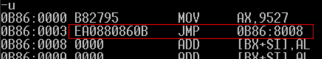

#### 段间间接寻址方式

```nasm
JMP DWORD PTR [BX] ; 转移地址由 TABLE 指向的存储单元给出
                   ; 顺序读出两个字, 低字节为IP, 高字节为CS
```

### 80x86指令系统

常用指令类别：

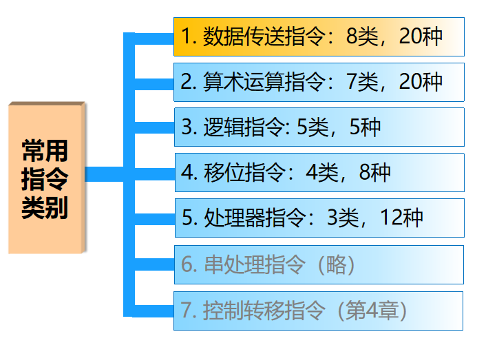

- 数据传送：`MOV` 等
- 算术运算：`ADD` 等
- 逻辑运算：`AND` 等
- 移位指令：`SHL` (逻辑左移) 等
- 处理器指令：`CLI` (清除中断标志) 等
- 串处理指令：`MOVS` (串传送) 等
- 控制转移指令：`JMP` 等

#### 数据传送指令

- 用于寄存器、存储器、I/O 端口之间的数据传送
- 除了 SAHF 和 POPF (弹出栈顶到FLAGS) 之外, 一般不改变 FLAGS 寄存器
- 源和目标操作数位数必须一致

**MOV指令** (**mov**e)：`MOV Dest, Src`

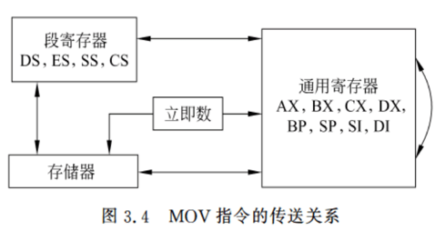

- IP 和 CS 不能作为目标 Dest（需要通过控制转移指令修改）

> **==为什么没有立即数传输到段寄存器的指令？==**
> 对于 16 位机的指令，加入段寄存器的指令格式将扩展，会占用比较大的内存，而但是内存价格较高，所以选择只保留通用寄存器的传输.

**XCHG指令** (e**xch**an**g**e)：`XCHG Dest, Src`

交换两个操作数（R-R 或 M-R）

- 操作数不能均为主存操作数（可以通过多次与寄存器交换，可能是为了避免一个指令占据过多 CPU 周期而设计的）
- 操作数不能是立即数或段寄存器

**LEA指令** (**l**oad **e**ffective **a**ddress)：`LEA r16, mem`

将存储单元的**有效地址 EA** 装入指定 16 位通用寄存器内

```nasm
LEA BX, DS:1000H      ; (BX) = 1000H
LEA AX, Table[BP][DI] ; (AX) = Table+(BP)+(DI)
```

与关键字 `OFFSET` 等价

```nasm
LEA BX, Buff        ; 装入Buff首地址
MOV BX, OFFSET Buff ; OFFSET获取存储器数据的偏移地址
```

上面两种方式等价，但使用 `OFFSET` 的速度更快，不过**只能与简单的符号地址**相连，不能与 `[SI]` 或 `LIST[SI]` 类似复杂操作数相连

**LDS/LES指令** (**l**oad **DS**/**ES**)：`LDS/LES r, mem`

将 `mem` 所指向内存中连续 4 字节的**内容**分别送个通用寄存器 `r` (低 16 位) 和 `DS/ES` (高 16 位) 段寄存器内

如 `LDS DI, [2130H]` 如下图，主存 2130H 后 4B 内容是 5678H:1234H

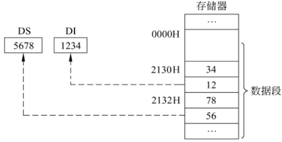

有点类似段间直接寻址的指令 `JMP FAR PTR 0B86H:8008H`，编码从低位到高位却是 `08 80 86 0B`, 后两个字节（高 16 位）是段地址，前两个字节（低 16 位）是偏移地址


**LAHF/SAHF指令** (**l**oad **AH** from **F**LAGS / **s**ave **AH** to **F**LAGS, 标志传送)：`LAHF/SANF`

- `LAHF`：将 FLAGS 的低 8 位（即状态标志除去OverFlow）加载在 AH
- `SAHF`：将 AH 保存在 FLAGS 的低 8 位

**XLAT指令** (table look-up tran**slat**ion, 查表转换)：`XLAT label`

等价于 `MOV AL, SHORT DS:[BX + AL]`，将 AL 指定的序号转化为表中对应的码值再存入 AL 中，转换表的首地址预先存入 DS:BX 中.

**PUSH/POP**：`PUSH src` 和 `POP dest`

将 `src` 压入栈 SS 段 SP 指向的位置，将栈 SS 段 SP 指向的内容弹出到 `dest` 中.

- `dest` 不能是 CS
- 在 8086 中 `PUSH/POP` 必须按字操作（不是字节），`src` 不能是立即数. 但这些在 80286 后均被允许
- 堆栈**向下**生成（`PUSH` 时地址减少, `POP` 时地址增加）

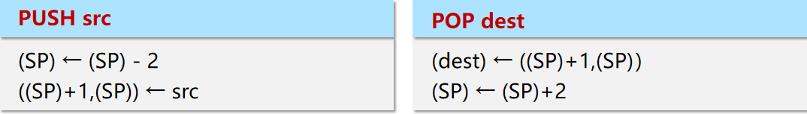

- `PUSH` 时，先 (SP) = (SP) - 2，再向 SS:SP 处写入数据
- `POP` 时，先从 SS:SP 处读出数据，再 (SP) = (SP) + 2

```nasm
MOV  AX, 1234H ; 8086中必须是字
PUSH AX
POP  BX        ; 不可为CS
```

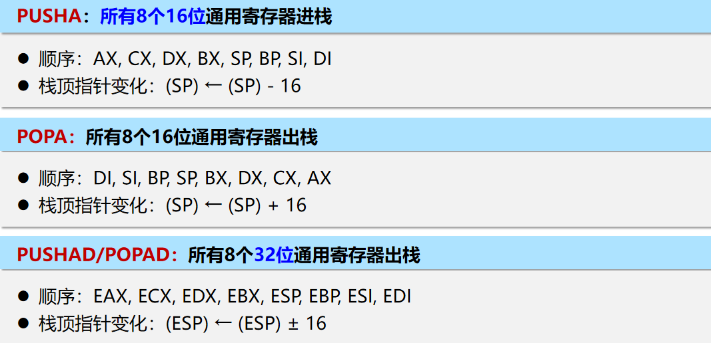
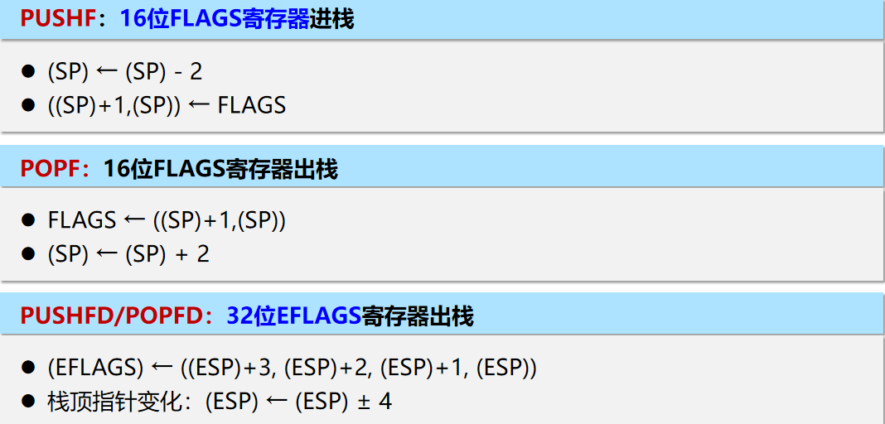
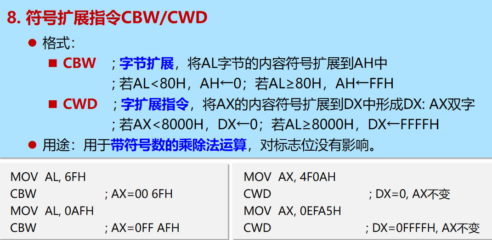

#### 算术运算指令

#### 逻辑指令

#### 移位指令

#### 处理器控制指令

## 80x86汇编语言

### 汇编程序概述

### 汇编语言程序格式

PPT2.1
> ==为什么一开始要定义 DATA 的位置并给 DS？默认的 DS, ES, SS, CS 是哪里？为什么其他段寄存器不用存？==

> ==DATA、STACK 等是否可以任意取名，只需要在 ASSUME 时对应上段寄存器即可？==

> ==START 是否可以不写？==

> ==代码最后需要 END 是用于表示代码开始运行的位置？==

### 汇编语言操作数

#### 常量、运算符、表达式

都在汇编过程中完成，程序运行前即确定，只能用在常数和符号地址上使用

常量：

- 数字
- 字符串
- 符号常量：`EQU`，`=`

常量不在内存内.

#### 变量

定义：

1. DB：字节
2. DW：字
3. DD：双字
4. DF,DQ,DT：三字、四字、五字（十字节）.

DUP：duplicate，重复，可嵌套，是以直接复制值的方式，而非复制表达式（例如 `DW 5 DUP($)` 和 `DW $, $, $, $, $` 是不同的）

可定义串（PPT41）

字长度：

临时强制改变类型的操作符：PTR

> ==通过一个变量改变的内存的值，在其它变量访问也是会变化的，如同指针？==

### 汇编语言伪指令

#### 段定义伪指令

```nasm
STACK SEGMENT STACK
  ...
STACK ENDS

DATA SEGMENT
  ...
DATA ENDS

CODE SEGMENT 'CODE'
     ASSUME CS:CODE, DS:DATA, SS:STACK ; 是 SegR:SegName 形式吗，对的.
START: ...
       ...
CODE ENDS
END START
```

> ==为什么示例中STACK在SEGMENT后还有STACK，而DATA没有，CODE后却是用串'CODE'？==

> ==ENDS 是不是代表 END Segment，还有 ENDP 代表 END Procedure？==

#### 地址计数器 $ 和对准伪指令 ORG/EVEN/ALIGN

当前地址, `JNE $+6`

> ==ORG 和 $ 公用时？PPT51==

### 汇编语言符号及运算符

1. 符号：常量、变量（数据段地址）、标号（代码段地址）、段名、子程序/子过程名
2. 变量和标号的属性：段属性、偏移属性、类型属性NEAR, FAR, WORD, SHORT
3. 变量和标号的操作符：SEG, OFFSET, 类型相关的操作符, 大小相关的操作符, PTR, 分离符号

## 80x86汇编语言程序设计

### 分支语句

1. 跳转指令 `JMP`（`SHORT`, `NEAR`, `FAR`）, `JE/JZ`, `JNE/JNZ` 等
2. 条件结构：if-then, if-then-else
3. 多分支结构：类 switch-case

### 循环语句

### 系统调用

> ==AH=02H, INT 21H 会输出 DL 的 ASCII 码字符，并返回到 AL 上？==.

## 80x86汇编子程序

<https://blog.csdn.net/qq_41730082/article/details/103194044>
<https://blog.csdn.net/m0_50525151/article/details/129668147>
<https://blog.csdn.net/Rong_Toa/article/details/119680419>

## BIOS 和 DOS 系统调用

1. 基本概念：BIOS (固件 ROM), DOS (操作系统 硬盘), 软中断和硬中断
2. DOS 系统调用：I/O 输入输出（6 号用于不等待检测，例如循环过程顺便检测是否有按键）
   > ==06H 和 0BH 号 I/O 系统调用有什么区别？==
3. BIOS 系统调用：BIOS 输入（16H）和输出（10H）
4. 综合使用

## 
