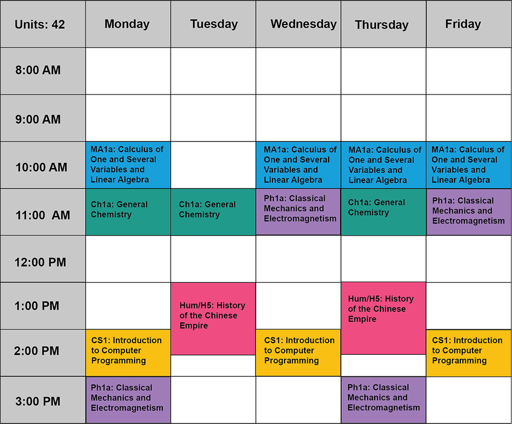
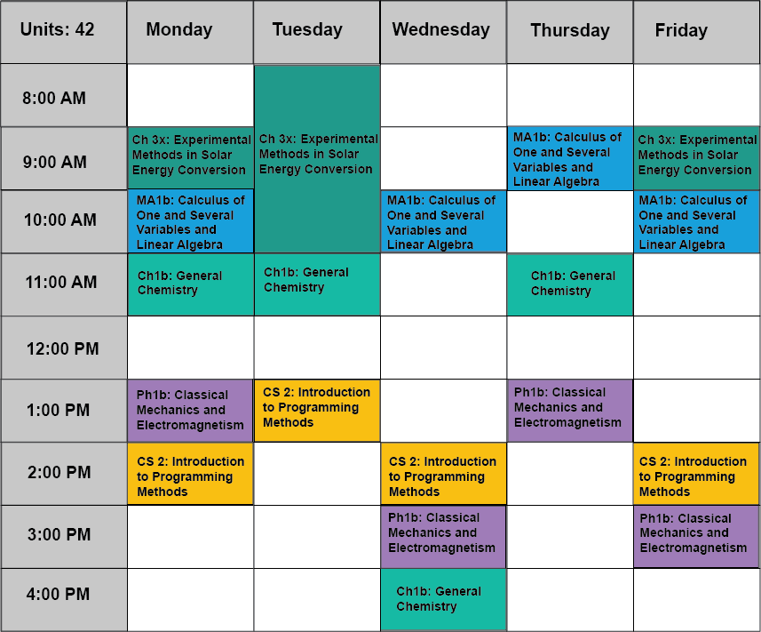
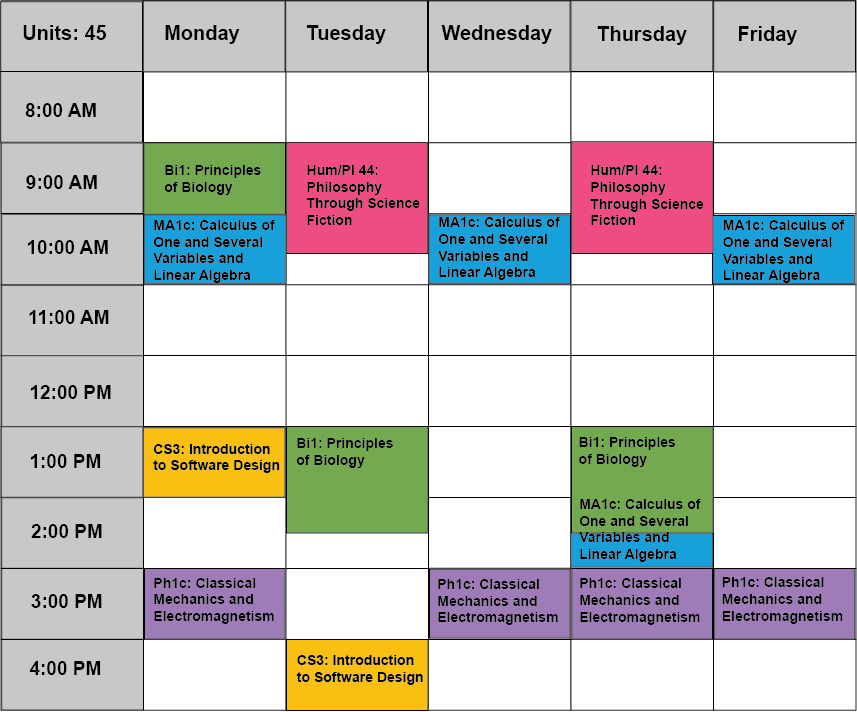

[toc]

### 1&emsp;About Caltech

#### 1.1&emsp;Core Curriculum

All Caltech students, regardless of their option, complete the same core curriculum. The core curriculum of Caltech consists of

所有加州理工学院的学生，不管他们的选修是什么，都要完成相同的核心课程. 核心课程包括

- **First Year Mathematics**: 27 units (covering Multivariable Calculus and Linear Algebra)
- **First Year Physics**: 27 units (yearlong course)
- **First Year Chemistry**: 15 units (classes) and 6 units (lab)
- **First Year Biology**: 9 units
- **Menu Class**: 9 units (subjects include **Astronomy**, **Environmental Science and Engineering**, **Energy Science**, **Geosciences**, **Information**, and **Logic**)
- **Additional Introductory Lab**: 6 units (multiple Courses)
- **Computer Science**: 9 units (Introduction to Programming)
- **Scientific Writing**: 3 units
- **Humanities and Social Sciences**: 36 units in Humanities, 27 units in Social Sciences, and 36 additional units in either
- **Physical Education**: 9 units

At Caltech, we measure courses in unit, roughly the number of hours we expect you'll devote to that subject *each week*. A typical nine-unit class means three hours of class time plus six hours of homework each week (labeled by "9 units (3-0-6)", which means 3 hours in lecture, 0 hours in lab, and 6 hours in homework each week). Caltech, in addition, has a trimester system without a summer term, and each term takes 10 weeks. Some courses are so rich in content that they are divided into three terms, numbered "a", "b", and "c", for example "Ma 1abc".

在加州理工学院，课程是以学生每周在对应学科上大致投入的学时数为单位衡量的. 一个典型的 9-unit 课程意味着每周会有 3 小时上课时间和 6 小时的课后作业（以 "9 units (3-0-6)" 标记，代表着讲座 3 h、实验室 0 h、课后作业 6 h）. 另外，加州理工学院是三学期制，没有暑期，每学期有 10 周. 有些课程内容非常丰富，因此划分到三个学期学习，并分别用 "a", "b", "c" 编号，例如 "Ma 1abc".

#### 1.2&emsp;The First Year

The first year focuses on Core requirements. Theses introductory core courses consist of:

第一年主要关注核心课程. 这些基础核心课程包括:

- **Core courses**
  - **Math 1 (Ma 1)**: Calculus of One and Several Variables and Linear Algebra
  - **Physics 1 (Ph 1)**: Classical Mechanics and Electromagnetism
  - **Chemistry 1 (Ch 1)**: General Chemistry
  - **Chemistry 3 (Ch 3)**: Fundamental Techniques of Experimental Chemistry
  - **Biology 1 (Bi 1)**: The Great Ideas of Biology
  - **Computer Science 1 (CS 1)**: Introduction to Computer Programming
  - **Writing 2 (Wr 2)**: Introduction to Academic Writing
  - **Introductory Lab**
  - **First Year Humanities**
  - **Intro Social Science**
- **Sample first year class schedule**

  | Fall | Winter | Spring |
  | ---- | ------- | ------- |
  | {width="857px",.height="711px"} |  |  |

---

### 2&emsp;Majors & Minors Requirements, All Courses

主修 & 辅修要求，所有选课情况

**Suggested Electives For Astrophysics Students**:

- **Computational skills**: ACM 11, ACM 106, CS 2, CS 11, CS 21, CS 38, CS 121, CMS 155, Ph 20, Ph 21, Ph 121.
- **Advanced mathematical methods**: ACM 95, Ph 129
- **Advanced statistical physics or thermodynamics**: Ph 127
- **Useful to astronomy and Astrophysics**: ACM 95, ACM 106, ACM 112, APh 17, APh/EE 23/24, APh/EE 117, APh 123, Ay/Ph 104, Ay 105, Ay 107, Ay 117, Ay 121–127, Ch 125 ab, EE 45, EE/Ae 157, Ge/Ay 11 c, Ge 103, Ge/Ch 128, Ge 131, Ge/Ay 132, 133, 137, Ge 141, Ma 4, Ma 112, ME 11, ME 12, Ph 20–22, Ph 77, 101, 121, 127, 129, 136, 137, 199, 236

#### 2.1&emsp;Mathematics (Ma)

|                                                                 *Ma Typical Course Schedule*                                                            |||||||||
| ---------------- | - | -------- | ----------------- | ------------------- | ------------------- | --------------- | -------------------- | -------------------- |
| *Number*         | > | *Course* | *Units per term*                                            ||| *Prerequisites* | *Major requirements* | *Minor requirements* |
|        ^         | > |    ^     | *1st term (fall)* | *2nd term (winter)* | *3rd term (spring)* |        ^        |           ^          |           ^          |
| ***Second Year***                                                                                                                                       |||||||||
| Ma 2/102         | > | Differential Equations 微分方程                       | 9 (4-0-5) | - | - | Ma 1            | √                                          ||
| Ma 3/103         | > | Introduction to Probability and Statistics 概率论与统计学导论 | - | 9 (4-0-5) | - | Ma 1     | ◯ Ma 3 or Ma 140 a                        ||
| Ph 2             | > | Quantum Mechanics, Statistical Physics 量子力学、统计物理                                                                            |||||||
|        ^         | b | Foundational Quantum Concepts, Quantum Harmonic Oscillator, Hydrogen Atom, Applications in Optical and Semiconductor Systems 基础量子概念、量子谐振子、氢原子、在光学和半导体系统中的应用 | - | 9 (3-0-6) | 9 (3-0-6) | Ma 1, Ph 1 | ◯ Ph 2 or Ph 12 | - |
|        ^         | c | Ensembles and Statistical Systems, Thermodynamic Laws, Applications in Energy Technology and etc. 系综和统计系统、热力学定律、在能源技术和其他领域的应用 | ^ | ^ | ^ | ^ | ^ | ^ |
| Ph 12            | > | Quantum Physics, Statistical Mechanics 量子物理、统计力学                                                                            |||||||
|        ^         | b | Wave Mechanics, Interpretation of Quantum Wave-Function, One-dimensional Bound States, Scattering, Tunneling 波动力学、量子波函数的解释、一维束缚态、散射、隧穿 | - | 9 (4-0-5) | 9 (4-0-5) | Ma 1, Ph 1 | ◯ Ph 2 or Ph 12 | - |
|        ^         | c | Thermodynamics, Introductory Kinetic Theory, Quantum Statistics 热力学、入门分子动理论、量子统计 | ^ | ^ | ^ | ^ | ^ | ^ |
| Ma 5/105         | > | Introduction to Abstract Algebra 抽象代数导论                                                                                       |||||||
|        ^         | a | Groups: Treatments of Semidirect Products, Sylow's theorem 群论: 半直积处理、西罗定理 | 9 (3-0-6) | 9 (3-0-6) | 9 (3-0-6) |-| √ | ◯ two of Ma 5, Ma 108, Ma 109 |
|        ^         | b | Rings & Modules: Unique Factorization of, and Classification of Finitely Generated Modules over Principal Ideal Domains 环论 & 模论: 主理想整环的唯一分解和有限生成模结构 | ^ | ^ | ^ | ^ | ^ | ^ |
|        ^         | c | Field Theory, Galois Theory, and Introduction to Character Theory for Finite Groups 域论、伽罗华理论、有限群特征标理论导论 | ^ | ^ | ^ | ^ | ^ | ^ |
| ***Third Year***                                                                                                                                        |||||||||
| Ma/CS 6/106      | > | Introduction to Discrete Mathematics 离散数学导论                                                                                   |||||||
|        ^         | a | Graph Theory, Algorithms, Applications of Algebraic, Enumeration Techniques, Formal Power Series, Combinatorial Interpretations, Coding and Cryptography 图论、算法、代数应用、枚举方法、形式幂级数、组合演绎、编码和密码学 | 9 (3-0-6) | - | 9 (3-0-6) | - | ◯ Ma/CS 6 a or Ma 121 a | - |
|        ^         | c | Syntax and Semantics of Propositional and First-order Logic, Introduction to Godel Completeness and Incompleteness Theorems, Elements of Computability Theory and Computational Complexity, Discussion of P=NP Problem 命题逻辑和一阶逻辑的语法和语义、哥德尔完备性定理和不完备性定理导论、可计算性理论和计算复杂度的要素、讨论 P=NP 问题 | ^ | ^ | ^ | Ma/CS 6 a or Ma 5 a | ◯ Ma/CS 6 c or Ma 116 a or Ma/CS 117 a | ^ |
| Ma 108           | > | Classical Analysis 经典/古典分析学                                                                                                  |||||||
|        ^         | a | Structure of Real Numbers, Topology of Metric Spaces, Rigorous Approach to Differentiation in R^n 实数组成结构、度量空间拓扑学、$\mathbb{R}^n$ 下的严格微分方法 | 9 (3-0-6) | 9 (3-0-6) | 9 (3-0-6) | Ma 1 | √ | ◯ two of Ma 5, Ma 108, Ma 109 |
|        ^         | b | Brief Introduction to Ordinary Differential Equations, Lebesgue Integration, Introduction to Fourier Analysis 常微分方程简介、勒贝格积分、傅里叶分析导论 | ^ | ^ | ^ | ^ | ^ | ^ |
|        ^         | c | Theory of Functions of One Complex Variable 单复变函数论 | ^ | ^ | ^ | ^ | ^ | ^ |
| ***Fourth Year***                                                                                                                                       |||||||||
| Ma 109           | > | Introduction to Geometry and Topology 几何学和拓扑学导论                                                                             |||||||
|        ^         | a | Point Set Topology, Introduction to Geometric and Algebraic Methods in Topology 点集拓扑学、介绍拓扑学中的集合与代数方法 | 9 (3-0-6) | 9 (3-0-6) | 9 (3-0-6) | Ma 2, recommend Ma 5 a and Ma 108  | √ | ◯ two of Ma 5, Ma 108, Ma 109 |
|        ^         | b | Differential Geometry of Curves and Surfaces in Two- and Three-dimensional Euclidean Space 二维和三维欧几里得空间中曲线和曲面的微分几何 | ^ | ^ | ^ | ^ | ^ | ^ |
|        ^         | c | Introduction to Differentiable Manifolds: Transversality, Differential Forms, and etc. 微分流形导论: 横截性、微分形式、其他内容 | ^ | ^ | ^ | ^ | ^ | ^ |
| ***Courses***                                                                                                                                           |||||||||
| Ma 2/102         | > | Differential Equations 微分方程                       | 9 (4-0-5) | - | - | Ma 1            | √                                          ||
| Ma 3/103         | > | Introduction to Probability and Statistics 概率论与统计学导论 | - | 9 (4-0-5) | - | Ma 1     | ◯ Ma 3 or Ma 140 a                        ||
| Ma 4/104         | > | Introduction to Mathematical Chaos 混沌数学导论       | - | - | 9 (3-0-6) |        -        |                      -                     ||
| Ma 5/105         | > | Introduction to Abstract Algebra 抽象代数导论                                                                                       |||||||
|        ^         | a | Groups: Treatments of Semidirect Products, Sylow's theorem 群论: 半直积处理、西罗定理 | 9 (3-0-6) | 9 (3-0-6) | 9 (3-0-6) |-| √ | ◯ two of Ma 5, Ma 108, Ma 109 |
|        ^         | b | Rings & Modules: Unique Factorization of, and Classification of Finitely Generated Modules over Principal Ideal Domains 环论 & 模论: 主理想整环的唯一分解和有限生成模结构 | ^ | ^ | ^ | ^ | ^ | ^ |
|        ^         | c | Field Theory, Galois Theory, and Introduction to Character Theory for Finite Groups 域论、伽罗华理论、有限群特征标理论导论 | ^ | ^ | ^ | ^ | ^ | ^ |
| Ma/CS 6/106      | > | Introduction to Discrete Mathematics 离散数学导论                                                                                   |||||||
|        ^         | a | Graph Theory, Algorithms, Applications of Algebraic, Enumeration Techniques, Formal Power Series, Combinatorial Interpretations, Coding and Cryptography 图论、算法、代数应用、枚举方法、形式幂级数、组合演绎、编码和密码学 | 9 (3-0-6) | - | 9 (3-0-6) | - | ◯ Ma/CS 6 a or Ma 121 a | - |
|        ^         | c | Syntax and Semantics of Propositional and First-order Logic, Introduction to Godel Completeness and Incompleteness Theorems, Elements of Computability Theory and Computational Complexity, Discussion of P=NP Problem 命题逻辑和一阶逻辑的语法和语义、哥德尔完备性定理和不完备性定理导论、可计算性理论和计算复杂度的要素、讨论 P=NP 问题 | ^ | ^ | ^ | Ma/CS 6 a or Ma 5 a | ◯ Ma/CS 6 c or Ma 116 a or Ma/CS 117 a | ^ |
| Ma 7/107         | > | Number Theory for Beginners 初等数论                  | - | - | 9 (3-0-6) |        -        |                      -                     ||
| Ma 108           | > | Classical Analysis 经典/古典分析学                                                                                                  |||||||
|        ^         | a | Structure of Real Numbers, Topology of Metric Spaces, Rigorous Approach to Differentiation in R^n 实数组成结构、度量空间拓扑学、$\mathbb{R}^n$ 下的严格微分方法 | 9 (3-0-6) | 9 (3-0-6) | 9 (3-0-6) | Ma 1 | √ | ◯ two of Ma 5, Ma 108, Ma 109 |
|        ^         | b | Brief Introduction to Ordinary Differential Equations, Lebesgue Integration, Introduction to Fourier Analysis 常微分方程简介、勒贝格积分、傅里叶分析导论 | ^ | ^ | ^ | ^ | ^ | ^ |
|        ^         | c | Theory of Functions of One Complex Variable 单复变函数论 | ^ | ^ | ^ | ^ | ^ | ^ |
| Ma 109           | > | Introduction to Geometry and Topology 几何学和拓扑学导论                                                                             |||||||
|        ^         | a | Point Set Topology, Introduction to Geometric and Algebraic Methods in Topology 点集拓扑学、介绍拓扑学中的集合与代数方法 | 9 (3-0-6) | 9 (3-0-6) | 9 (3-0-6) | Ma 2, recommend Ma 5 a and Ma 108  | √ | ◯ two of Ma 5, Ma 108, Ma 109 |
|        ^         | b | Differential Geometry of Curves and Surfaces in Two- and Three-dimensional Euclidean Space 二维和三维欧几里得空间中曲线和曲面的微分几何 | ^ | ^ | ^ | ^ | ^ | ^ |
|        ^         | c | Introduction to Differentiable Manifolds: Transversality, Differential Forms, and etc. 微分流形导论: 横截性、微分形式、其他内容 | ^ | ^ | ^ | ^ | ^ | ^ |

#### 2.2&emsp;Physics (Ph)

|                                                                 *Ph Typical Course Schedule*                                                             ||||||||
| ---------------- | - | -------- | ----------------- | ------------------- | ------------------- | --------------- | ------------------------------------------- |
| *Number*         | > | *Course* | *Units per term*                                            ||| *Prerequisites* |                *Requirements*               |
|        ^         | > |    ^     | *1st term (fall)* | *2nd term (winter)* | *3rd term (spring)* |        ^        |                      ^                      |
| ***Second Year***                                                                                                                                        ||||||||
| Ma 2/102         | > | Differential Equations 微分方程                       | 9 (4-0-5) | - | - | Ma 1            | √                                           |
| Ma 3/103         | > | Introduction to Probability and Statistics 概率论与统计学导论 | - | 9 (4-0-5) | - | Ma 1     | ◯ Ma 3 or Ma 140 a                         |
| Ph 12            | > | Waves, Quantum Physics, Statistical Mechanics 波动、量子物理、统计力学                                                                ||||||
|        ^         | a | Classical Waves 经典波 | 9 (4-0-5) | 9 (4-0-5) | 9 (4-0-5) | Ma 1, Ph 1 | √ |
|        ^         | b | Wave Mechanics, Interpretation of Quantum Wave-Function, One-dimensional Bound States, Scattering, Tunneling 波动力学、量子波函数的解释、一维束缚态、散射、隧穿 | ^ | ^ | ^ | ^ | ^ |
|        ^         | c | Thermodynamics, Introductory Kinetic Theory, Quantum Statistics 热力学、入门分子动理论、量子统计 | ^ | ^ | ^ | ^ | ^ |
| Ph 3             | > | Introductory Physics Laboratory 入门物理实验   | 6 (0-3-3) for one term ||| Ph 1            | √                                           |
| Ph 6             | > | Physics Laboratory 物理实验 | - | 9 (0-3-6) | - | Ma 2, Ma 3, Ph 2 ab or Ph 12 ab, Ph 3     | √                                           |
| Ph 7             | > | Physics Laboratory 物理实验 | - | - | 9 (0-3-6) | Ph 2 bc or Ph 12 bc, Ph 6                 | ◯ Ph 7 or APh/EE 24                        |
| ACM 95/100 ab    | > | Introductory Methods of Applied Mathematics for the Physical Sciences 数学物理方法导论 — Complex Analysis: Analyticity, Laurent Series, Contour Integration, Residue Calculus. 复分析: 解析性、洛朗级数、围道积分、留数定理. Ordinary Differential Equations: Linear Initial Value Problems, Linear Boundary Value Problems, Sturm-Liouville Theory, Eigenfunction Expansions, Transform Methods, Green's Functions. 常微分方程: 线性初值问题、线性边值问题、施图姆-刘维尔理论、特征函数展开、变换法、格林函数. Linear Partial Differential Equations: Heat Equation, Separation of Variables, Replace Equation, Transform Methods, Wave Equation, Method of Characteristics, Green's Functions 线性偏微分方程: 热方程、变量分离、拉普拉斯方程、变换法、波动方程、特征法、格林函数 | 12 (4-0-8) | 12 (4-0-8) | - | Ma 1, Ma 2 | ◯ |
| Ph 21            | > | Computational Physics Laboratory II 计算物理实验 II — Python for Data Analysis, Bayesian Techniques, Fourier Techniques, Image Manipulation with Python 用 Python 数据分析、贝叶斯方法、傅里叶方法、Python 作图 | - | 6 (0-6-0) | - | Ph 20 | ◯ Ph 21 or Ph 22 or one term of Ph 121 abc or Ay 190 or CS 155 |
| Ph 22            | > | Computational Physics Laboratory III 计算物理实验 III — Computational Tools and Numerical Techniques Solving Problems in Classical Mechanics, Numerical Solution of 3-body and N-body Systems, Monte Carlo Integration 使用计算工具和数值方法解决经典力学问题、三体和 N 体系统的数值解、蒙特卡洛积分 | - | - | 6 (0-6-0) | Ph 20 | ◯ Ph 21 or Ph 22 or one term of Ph 121 abc or Ay 190 or CS 155 |
| ***Third Year***                                                                                                                                         ||||||||
| Ph 106           | > | Topics in Classical Physics 经典物理主题                                                                                             ||||||
|        ^         | a | Mechanics: Lagrangian and Hamiltonian Formulations of Mechanics, Small Oscillations and Normal Mode, Central Forces, Rigid-body Motion 理论力学: 拉格朗日力学公式和哈密顿力学公式、小振动和正则模态、中心力、刚体运动 | 9 (4-0-5) | 9 (4-0-5) | 9 (4-0-5) | Ma 2, Ph 2 ab or Ph 12 | √ |
|        ^         | b | Fundamentals of Electrostatics and Magnetostatics: Boundary-Value Problems, Multipole Expansions, Electrostatics and Magnetostatics in Matter 电磁学基础: 边值问题、多级展开、物质中的电磁学 | ^ | ^ | ^ | ^ | ^ |
|        ^         | c | Electrodynamics: Conservation Laws, Potential Theory, Electromagnetic Waves, Radiation, Relationship between Special Relativity and Electrodynamics 电动力学: 守恒定律、势理论、电磁波、辐射、狭义相对论与电动力学的关系 | ^ | ^ | ^ | ^ | ^ |
| Ph 121 abc       | > | Computational Physics Lab 高等计算物理实验 — Working through Projects (such as Classical Mechanics and E, Statistical Mechanics, Quantum Mechanics, Quantum Many-body Physics) in Python and Mathematica 完成基于 Python 和 Mathematica 的项目 (例如经典力学和电磁学、统计力学、量子力学、量子多体物理) | 6 (0-6-0) | 6 (0-6-0) | 6 (0-6-0) | - | ◯ Ph 21 or Ph 22 or one term of Ph 121 abc or Ay 190 or CS 155 |
| Ph 125 ab        | > | Quantum Mechanics 量子力学 — Wave Mechanics in 3-D, Scattering Theory, Hilbert Spaces, Matrix Mechanics, Angular Momentum, Symmetries, Spin-1/2 Systems, Approximation Methods, Identical Particles 波动力学 (3D)、散射理论、希尔伯特空间、矩阵力学、角动量、对称性、自旋 1/2 系统、近似方法、全同粒子 | 9 (4-0-5) | 9 (4-0-5) | - | Ma 2, Ph 2 ab or Ph 12 | √ |
| ***Fourth Year***                                                                                                                                        ||||||||
| Ph 77 abc        | > | Advanced Physics Laboratory 高等物理实验 | 9 (0-5-4) | 9 (0-5-4) | 9 (0-5-4) | Ph 7         | √                                           |
| ***Courses***                                                                                                                                            ||||||||
| Ph 2             | > | Waves, Quantum Mechanics, Statistical Physics 波动、量子力学、统计物理                                                                ||||||
|        ^         | a | Discrete and Continuous Oscillatory Systems, Wave Mechanics, Applications in Telecommunications and etc. 离散和连续振荡系统、波动力学、在电信和其他领域的应用 | 9 (3-0-6) | 9 (3-0-6) | 9 (3-0-6) | Ma 1, Ph 1 | - |
|        ^         | b | Foundational Quantum Concepts, Quantum Harmonic Oscillator, Hydrogen Atom, Applications in Optical and Semiconductor Systems 基础量子概念、量子谐振子、氢原子、在光学和半导体系统中的应用 | ^ | ^ | ^ | ^ | ^ |
|        ^         | c | Ensembles and Statistical Systems, Thermodynamic Laws, Applications in Energy Technology and etc. 系综和统计系统、热力学定律、在能源技术和其他领域的应用 | ^ | ^ | ^ | ^ | ^ |
| Ph 3             | > | Introductory Physics Laboratory 入门物理实验 | 6 (0-3-3) for one term   ||| Ph 1            | √                                           |
| Ph 5             | > | Analog Electronics for Physicists 物理模拟电路 | 9 (0-5-4) | - | - | Ma 1, Ph 1, recommend Ma 2 |                    -                    |
| Ph 6             | > | Physics Laboratory 物理实验 | - | 9 (0-3-6) | - | Ma 2, Ma 3, Ph 2 ab or Ph 12 ab, Ph 3     | √                                           |
| Ph 7             | > | Physics Laboratory 物理实验 | - | - | 9 (0-3-6) | Ph 2 bc or Ph 12 bc, Ph 6                 | ◯ Ph 7 or APh/EE 24                        |
| Ph 12            | > | Waves, Quantum Physics, Statistical Mechanics 波动、量子物理、统计力学                                                                ||||||
|        ^         | a | Classical Waves 经典波 | 9 (4-0-5) | 9 (4-0-5) | 9 (4-0-5) | Ma 1, Ph 1 | √ |
|        ^         | b | Wave Mechanics, Interpretation of Quantum Wave-Function, One-dimensional Bound States, Scattering, Tunneling 波动力学、量子波函数的解释、一维束缚态、散射、隧穿 | ^ | ^ | ^ | ^ | ^ |
|        ^         | c | Thermodynamics, Introductory Kinetic Theory, Quantum Statistics 热力学、入门分子动理论、量子统计 | ^ | ^ | ^ | ^ | ^ |
| Ph 20            | > | Computational Physics Laboratory I 计算物理实验 I — Introduction to Python for Scientific Programming, Mathematica for Symbolic Manipulation, Unix Tools for Software Development 介绍 Python 用于科学编程、Mathematica 用于符号操作、Unix 工具用于软件开发 | 6 (0-6-0) | - | - | CS 1 | - |
| Ph 21            | > | Computational Physics Laboratory II 计算物理实验 II — Python for Data Analysis, Bayesian Techniques, Fourier Techniques, Image Manipulation with Python 用 Python 数据分析、贝叶斯方法、傅里叶方法、Python 作图 | - | 6 (0-6-0) | - | Ph 20 | ◯ Ph 21 or Ph 22 or one term of Ph 121 abc or Ay 190 or CS 155 |
| Ph 22            | > | Computational Physics Laboratory III 计算物理实验 III — Computational Tools and Numerical Techniques Solving Problems in Classical Mechanics, Numerical Solution of 3-body and N-body Systems, Monte Carlo Integration 使用计算工具和数值方法解决经典力学问题、三体和 N 体系统的数值解、蒙特卡洛积分 | - | - | 6 (0-6-0) | Ph 20 | ◯ Ph 21 or Ph 22 or one term of Ph 121 abc or Ay 190 or CS 155 |
| Ph 77 abc        | > | Advanced Physics Laboratory 高等物理实验 | 9 (0-5-4) | 9 (0-5-4) | 9 (0-5-4) | Ph 7         | √                                           |
| Ay/Ph 104        | > | Relativistic Astrophysics 相对论天体物理              | - | - | 9 (3-0-6) | Ph 1, Ph 2 ab   | - |
| Ph 106           | > | Topics in Classical Physics 经典物理主题                                                                                             ||||||
|        ^         | a | Mechanics: Lagrangian and Hamiltonian Formulations of Mechanics, Small Oscillations and Normal Mode, Central Forces, Rigid-body Motion 理论力学: 拉格朗日力学公式和哈密顿力学公式、小振动和正则模态、中心力、刚体运动 | 9 (4-0-5) | 9 (4-0-5) | 9 (4-0-5) | Ma 2, Ph 2 ab or Ph 12 | √ |
|        ^         | b | Fundamentals of Electrostatics and Magnetostatics: Boundary-Value Problems, Multipole Expansions, Electrostatics and Magnetostatics in Matter 电磁学基础: 边值问题、多级展开、物质中的电磁学 | ^ | ^ | ^ | ^ | ^ |
|        ^         | c | Electrodynamics: Conservation Laws, Potential Theory, Electromagnetic Waves, Radiation, Relationship between Special Relativity and Electrodynamics 电动力学: 守恒定律、势理论、电磁波、辐射、狭义相对论与电动力学的关系 | ^ | ^ | ^ | ^ | ^ |
| Ph 121 abc       | > | Computational Physics Lab 高等计算物理实验 — Working through Projects (such as Classical Mechanics and E, Statistical Mechanics, Quantum Mechanics, Quantum Many-body Physics) in Python and Mathematica 完成基于 Python 和 Mathematica 的项目 (例如经典力学和电磁学、统计力学、量子力学、量子多体物理) | 6 (0-6-0) | 6 (0-6-0) | 6 (0-6-0) | - | ◯ Ph 21 or Ph 22 or one term of Ph 121 abc or Ay 190 or CS 155 |
| Ph 125 abc       | > | Quantum Mechanics 量子力学 — Wave Mechanics in 3-D, Scattering Theory, Hilbert Spaces, Matrix Mechanics, Angular Momentum, Symmetries, Spin-1/2 Systems, Approximation Methods, Identical Particles, and selected topics in Atomic, Solid-state, Nuclear, Particle Physics 波动力学 (3D)、散射理论、希尔伯特空间、矩阵力学、角动量、对称性、自旋 1/2 系统、近似方法、全同粒子，以及原子物理、固态物理、核物理、粒子物理学中的主题 | 9 (4-0-5) | 9 (4-0-5) | 9 (4-0-5) | Ma 2, Ph 2 ab or Ph 12 | √ Ph 125 ab |
| Ph 127           | > | Statistical Physics of Interacting Systems, Phases, and Phase Transitions 相互作用系统、相和相变中的统计物理                           ||||||
|        ^         | a | Interacting Gases and Spin Models of Magnetism, Phase Transitions and Broken Symmetries, Classical Field Theories, Renormalization Group Approach to Collective Phenomena 相互作用气体和顺磁自旋模型、相变和对称性破缺、经典场论、集体现象的重整化群方法 | 9 (4-0-5) | 9 (4-0-5) | - | Ph 12 c | - |
|        ^         | b | the Path-integral Based Quantum to Classical Statistical Mechanics Mapping, Dualities and Topological-defects Descriptions, Applications to Magnets, Superfluids, and Guage Field Theories 基于路径积分的量子到经典统计力学的映射、对称性和拓扑缺陷的描述、对磁体、超流体和规范场论的应用 | ^ | ^ | ^ | Ph 12 c, Ph 125 | ^ |
| Ph 136           | > | Applications of Classical Physics 经典物理学的应用                                                                                   ||||||
|        ^         | a | Thermodynamics, Statistical Mechanics, Random processes, Optics 热动力学、统计力学、随机过程、光学 | 9 (3-0-6) | 9 (3-0-6) | 9 (3-0-6) | Ph 106 ab | - |
|        ^         | b | Fluid Dynamics, MHD, Turbulence, Plasma Physics 流体力学、磁流体力学、湍流、等离子体物理学 | ^ | ^ | ^ | ^ | ^ |
|        ^         | c | Introduction to General Relativity 广义相对论导论 | ^ | ^ | ^ | ^ | ^ |

#### 2.3&emsp;Astrophysics (Ay)

|                                                                 *Ay Typical Course Schedule*                                                            |||||||||
| ---------------- | - | -------- | ----------------- | ------------------- | ------------------- | --------------- | -------------------- | -------------------- |
| *Number*         | > | *Course* | *Units per term*                                            ||| *Prerequisites* | *Major requirements* | *Minor requirements* |
|        ^         | > |    ^     | *1st term (fall)* | *2nd term (winter)* | *3rd term (spring)* |        ^        |           ^          |           ^          |
| ***Second Year***                                                                                                                                       |||||||||
| Ma 2/102         | > | Differential Equations 微分方程                       | 9 (4-0-5) | - | - | Ma 1            | √                                          ||
| Ma 3/103         | > | Introduction to Probability and Statistics 概率论与统计学导论 | - | 9 (4-0-5) | - | Ma 1     | √                                          ||
| Ph 2             | > | Quantum Mechanics, Statistical Physics 量子力学、统计物理                                                                            |||||||
|        ^         | a | Discrete and Continuous Oscillatory Systems, Wave Mechanics, Applications in Telecommunications and etc. 离散和连续振荡系统、波动力学、在电信和其他领域的应用 | 9 (3-0-6) | 9 (3-0-6) | 9 (3-0-6) | Ma 1, Ph 1 | ◯ Ph 2 or Ph 12 | ◯ Ph 2 ab or Ph 12 ab |
|        ^         | b | Foundational Quantum Concepts, Quantum Harmonic Oscillator, Hydrogen Atom, Applications in Optical and Semiconductor Systems 基础量子概念、量子谐振子、氢原子、在光学和半导体系统中的应用 | ^ | ^ | ^ | ^ | ^ | ^ |
|        ^         | c | Ensembles and Statistical Systems, Thermodynamic Laws, Applications in Energy Technology and etc. 系综和统计系统、热力学定律、在能源技术和其他领域的应用 | ^ | ^ | ^ | ^ | ^ | - |
| Ph 12            | > | Waves, Quantum Physics, Statistical Mechanics 波动、量子物理、统计力学                                                                            |||||||
|        ^         | a | Classical Waves 经典波 | 9 (4-0-5) | 9 (4-0-5) | 9 (4-0-5) | Ma 1, Ph 1 | ◯ Ph 2 or Ph 12 | ◯ Ph 2 ab or Ph 12 ab |
|        ^         | b | Wave Mechanics, Interpretation of Quantum Wave-Function, One-dimensional Bound States, Scattering, Tunneling 波动力学、量子波函数的解释、一维束缚态、散射、隧穿 | ^ | ^ | ^ | ^ | ^ | ^ |
|        ^         | c | Thermodynamics, Introductory Kinetic Theory, Quantum Statistics 热力学、入门分子动理论、量子统计 | ^ | ^ | ^ | ^ | ^ | - |
| Ay 20            | > | Basic Astronomy and the Galaxy 基础天文学和银河系 | 9 (3-1-5) | - | -      | Ma, Ph 1        | √       | ◯ two of Ge/Ay 11 c, Ay 20, Ay 21|
| Ay 21            | > | Galaxies and Cosmology 星系与宇宙学 | - | 9 (3-0-6) | -                   | Ma, Ph 1        | √       | ◯ two of Ge/Ay 11 c, Ay 20, Ay 21|
| Ph 3             | > | Introductory Physics Laboratory 入门物理实验 | 6 (0-3-3) for one term   ||| Ph 1            | ◯ three of Ph 3 or Ph 8 bc, Ph 5, Ph 6, Ph 7, Ph 77, Ay 105, APh 23 plus APh 24 or 123 | - |
| Ph 5             | > | Analog Electronics for Physicists 物理模拟电路 | 9 (0-5-4) | - | - | Ma 1, Ph 1, recommend Ma 2 | ◯ three of Ph 3 or Ph 8 bc, Ph 5, Ph 6, Ph 7, Ph 77, Ay 105, APh 23 plus APh 24 or 123 | - |
| ACM 95/100 ab    | > | Introductory Methods of Applied Mathematics for the Physical Sciences 数学物理方法导论 — Complex Analysis: Analyticity, Laurent Series, Contour Integration, Residue Calculus. 复分析: 解析性、洛朗级数、围道积分、留数定理. Ordinary Differential Equations: Linear Initial Value Problems, Linear Boundary Value Problems, Sturm-Liouville Theory, Eigenfunction Expansions, Transform Methods, Green's Functions. 常微分方程: 线性初值问题、线性边值问题、施图姆-刘维尔理论、特征函数展开、变换法、格林函数. Linear Partial Differential Equations: Heat Equation, Separation of Variables, Replace Equation, Transform Methods, Wave Equation, Method of Characteristics, Green's Functions 线性偏微分方程: 热方程、变量分离、拉普拉斯方程、变换法、波动方程、特征法、格林函数 | 12 (4-0-8) | 12 (4-0-8) | - | Ma 1, Ma 2 | ◯ | - |
| Ph 21            | > | Computational Physics Laboratory II 计算物理实验 II — Python for Data Analysis, Bayesian Techniques, Fourier Techniques, Image Manipulation with Python 用 Python 数据分析、贝叶斯方法、傅里叶方法、Python 作图 | - | 6 (0-6-0) | - | Ph 20 | ◯ | - |
| Ph 22            | > | Computational Physics Laboratory III 计算物理实验 III — Computational Tools and Numerical Techniques Solving Problems in Classical Mechanics, Numerical Solution of 3-body and N-body Systems, Monte Carlo Integration 使用计算工具和数值方法解决经典力学问题、三体和 N 体系统的数值解、蒙特卡洛积分 | - | - | 6 (0-6-0) | Ph 20 | ◯ | - |
| ***Third Year***                                                                                                                                        |||||||||
| Ph 106           | > | Topics in Classical Physics 经典物理主题                                                                                            |||||||
|        ^         | a | Mechanics: Lagrangian and Hamiltonian Formulations of Mechanics, Small Oscillations and Normal Mode, Central Forces, Rigid-body Motion 理论力学: 拉格朗日力学公式和哈密顿力学公式、小振动和正则模态、中心力、刚体运动 | 9 (4-0-5) | 9 (4-0-5) | 9 (4-0-5) | Ma 2, Ph 2 ab or Ph 12 | √ | - |
|        ^         | b | Fundamentals of Electrostatics and Magnetostatics: Boundary-Value Problems, Multipole Expansions, Electrostatics and Magnetostatics in Matter 电磁学基础: 边值问题、多级展开、物质中的电磁学 | ^ | ^ | ^ | ^ | ^ | ^ |
|        ^         | c | Electrodynamics: Conservation Laws, Potential Theory, Electromagnetic Waves, Radiation, Relationship between Special Relativity and Electrodynamics 电动力学: 守恒定律、势理论、电磁波、辐射、狭义相对论与电动力学的关系 | ^ | ^ | ^ | ^ | ◯ Ph 106 c or Ph 107 | ^ |
| Ph 125 abc       | > | Quantum Mechanics 量子力学 — Wave Mechanics in 3-D, Scattering Theory, Hilbert Spaces, Matrix Mechanics, Angular Momentum, Symmetries, Spin-1/2 Systems, Approximation Methods, Identical Particles, and selected topics in Atomic, Solid-state, Nuclear, Particle Physics 波动力学 (3D)、散射理论、希尔伯特空间、矩阵力学、角动量、对称性、自旋 1/2 系统、近似方法、全同粒子，以及原子物理、固态物理、核物理、粒子物理学中的主题 | 9 (4-0-5) | 9 (4-0-5) | 9 (4-0-5) | Ma 2, Ph 2 ab or Ph 12 | √ Ph 125 ab; ◯ Ph 125 c | - |
| Ay 101           | > | Physics of Stars 恒星物理学                           | 9 (3-0-6) | - | - | recommend Ay 20 | √ | ◯ two of Ay 101, Ay 102, Ay/Ph 104, Ay 105, Ay/Ge 107, Ay 122, Ge/Ay 133 |
| Ay 102           | > | Physics of the Interstellar Medium 星际介质物理学     | - | 9 (3-0-6) | - | recommend Ay 20 | √ | ◯ two of Ay 101, Ay 102, Ay/Ph 104, Ay 105, Ay/Ge 107, Ay 122, Ge/Ay 133 |
| Ay/Ph 104           | > | Relativistic Astrophysics 相对论天体物理              | - | - | 9 (3-0-6) | Ph              | ◯ | ◯ two of Ay 101, Ay 102, Ay/Ph 104, Ay 105, Ay/Ge 107, Ay 122, Ge/Ay 133 |
| Ph 127           | > | Statistical Physics of Interacting Systems, Phases, and Phase Transitions 相互作用系统、相和相变中的统计物理                          |||||||
|        ^         | a | Interacting Gases and Spin Models of Magnetism, Phase Transitions and Broken Symmetries, Classical Field Theories, Renormalization Group Approach to Collective Phenomena 相互作用气体和顺磁自旋模型、相变和对称性破缺、经典场论、集体现象的重整化群方法 | 9 (4-0-5) | - | - | Ph 12 c | ◯ | - |
| Ph 6             | > | Physics Laboratory 物理实验 | - | 9 (0-3-6) | - | Ma 2, Ma 3, Ph 2 ab or Ph 12 ab, Ph 3     | ◯ three of Ph 3 or Ph 8 bc, Ph 5, Ph 6, Ph 7, Ph 77, Ay 105, APh 23 plus APh 24 or 123 | - |
| Ph 7             | > | Physics Laboratory 物理实验 | - | - | 9 (0-3-6) | Ph 2 bc or Ph 12 bc, Ph 6                 | ◯ three of Ph 3 or Ph 8 bc, Ph 5, Ph 6, Ph 7, Ph 77, Ay 105, APh 23 plus APh 24 or 123 | - |
| APh/EE 23        | > | Demonstration Lectures in Classical and Quantum Photonics 经典和量子光子学示范讲座 | - |  9 (3-0-6) | - | Ph 1, recommend Ph 2 a or Ph 12 a | ◯ three of Ph 3 or Ph 8 bc, Ph 5, Ph 6, Ph 7, Ph 77, Ay 105, APh 23 plus APh 24 or 123 | - |
| APh/EE 24        | > | Introductory Optics and Photonics Laboratory 入门光学与光子实验 | - | - | 9 (1-3-5) | Ph 1, APh 23, recommend Ph 2 a or Ph 12 a | ◯ three of Ph 3 or Ph 8 bc, Ph 5, Ph 6, Ph 7, Ph 77, Ay 105, APh 23 plus APh 24 or 123 | - |
| APh/EE 123       | > | Advanced Lasers and Photonics Laboratory 高等射线与光子实验 | 9 (1-3-5) | - | - |     -      | ◯ three of Ph 3 or Ph 8 bc, Ph 5, Ph 6, Ph 7, Ph 77, Ay 105, APh 23 plus APh 24 or 123 | - |
| ***Fourth Year***                                                                                                                                       |||||||||
| Ay 105           | > | Optical Astronomy Instrumentation Lab 光学天文学      | - | - | 9 (1-5-3) | Ay 20           | ◯ three of Ph 3 or Ph 8 bc, Ph 5, Ph 6, Ph 7, Ph 77, Ay 105, APh 23 plus APh 24 or 123 | ◯ two of Ay 101, Ay 102, Ay/Ph 104, Ay 105, Ay/Ge 107, Ay 122, Ge/Ay 133 |
| Ph 121 abc       | > | Computational Physics Lab 高等计算物理实验 — Working through Projects (such as Classical Mechanics and E, Statistical Mechanics, Quantum Mechanics, Quantum Many-body Physics) in Python and Mathematica 完成基于 Python 和 Mathematica 的项目 (例如经典力学和电磁学、统计力学、量子力学、量子多体物理) | 6 (0-6-0) | 6 (0-6-0) | 6 (0-6-0) | - | ◯ | - |
| Ge/Ay 117        | > | Bayesian Statistics and Data Analysis 贝叶斯统计与数据分析 —  Based Case Studies from the Astrophysical and Planetary Science Literature, Developing the Tool Set Applied to students' OWN Research, Exploring Strategies for Data Analysis, Selecting the Best Model, Learn the Level of Confidence in Conclusions 基于天体物理学和行星科学文献中的案例研究，开发应用于自己研究的工具集，探索数据分析的决策，选择最佳的模型，学习结论的可信度 | - | 9 (3-0-6) | - | CS 1 | - ||
| ***Courses***                                                                                                                                           |||||||||
| Ay 1             | > | The Evolving Universe 不断进化的宇宙                   | - | - | 9 (3-1-5) |        -        |                     -                      ||
| Ge/Ay 11 c       | > | Introduction to Earth and Planetary Sciences: Planetary Sciences 地球与行星科学导论: 行星科学 | - | 9 (3-0-6) | - | Ma 1 ab, Ph 1 ab| - | ◯ two of Ge/Ay 11 c, Ay 20, Ay 21 |
| Ay 20            | > | Basic Astronomy and the Galaxy 基础天文学和银河系      | 9 (3-1-5) | - | - | Ma, Ph 1        | √      | ◯ two of Ge/Ay 11 c, Ay 20, Ay 21 |
| Ay 21            | > | Galaxies and Cosmology 星系与宇宙学                   | - | 9 (3-0-6) | - | Ma, Ph 1        | √      | ◯ two of Ge/Ay 11 c, Ay 20, Ay 21 |
| Ay 101           | > | Physics of Stars 恒星物理学                           | 9 (3-0-6) | - | - | recommend Ay 20 | √ | ◯ two of Ay 101, Ay 102, Ay/Ph 104, Ay 105, Ay/Ge 107, Ay 122, Ge/Ay 133 |
| Ay 102           | > | Physics of the Interstellar Medium 星际介质物理学     | - | 9 (3-0-6) | - | recommend Ay 20 | √ | ◯ two of Ay 101, Ay 102, Ay/Ph 104, Ay 105, Ay/Ge 107, Ay 122, Ge/Ay 133 |
| Ay/Ph 104        | > | Relativistic Astrophysics 相对论天体物理              | - | - | 9 (3-0-6) | Ph 1, Ph 2 ab   | ◯ | ◯ two of Ay 101, Ay 102, Ay/Ph 104, Ay 105, Ay/Ge 107, Ay 122, Ge/Ay 133 |
| Ay 105           | > | Optical Astronomy Instrumentation Lab 光学天文学      | - | - | 9 (1-5-3) | Ay 20           | ◯ three of Ph 3 or Ph 8 bc, Ph 5, Ph 6, Ph 7, Ph 77, Ay 105, APh 23 plus APh 24 or 123 | ◯ two of Ay 101, Ay 102, Ay/Ph 104, Ay 105, Ay/Ge 107, Ay 122, Ge/Ay 133 |
| Ay 107           | > | Introduction to Astronomical Observation 天体观测导论 | - | - | 12 (2-2-8) | CS 1            | - | ◯ two of Ay 101, Ay 102, Ay/Ph 104, Ay 105, Ay/Ge 107, Ay 122, Ge/Ay 133 |
| Ge/Ay 117        | > | Bayesian Statistics and Data Analysis 贝叶斯统计与数据分析 —  Based Case Studies from the Astrophysical and Planetary Science Literature, Developing the Tool Set Applied to students' OWN Research, Exploring Strategies for Data Analysis, Selecting the Best Model, Learn the Level of Confidence in Conclusions 基于天体物理学和行星科学文献中的案例研究，开发应用于自己研究的工具集，探索数据分析的决策，选择最佳的模型，学习结论的可信度 | - | 9 (3-0-6) | - | CS 1 | - ||
| Ay 122           | > | Astronomical Measurements and Instrumentation 天体测量与仪器                                                                        |||||||
|        ^         | a | Infrared, Optical, and Ultraviolet Techniques: Telescopes, Optics, Detectors, Photometry, Spectroscopy, Active/Adaptive Optics, Coronography. 红外、光学和紫外技术: 望远镜、光学、探测器、光度测定、光谱学、主动/自适应光学、日冕仪. Imaging Devices and Image Processing 成像设备和图片处理 | 9 (3-0-6) | 9 (3-0-6) | - | Ph 106 bc | - | ◯ two of Ay 101, Ay 102, Ay/Ph 104, Ay 105, Ay/Ge 107, Ay 122, Ge/Ay 133 |
|        ^         | b | Radio Through Submillimeter Techniques: Antennae, Receivers, Mixers, Amplifiers. 无线电到亚毫米波技术: 天线、接收器、混频仪、放大器. Interferometers and Aperture Synthesis Arrays. 干涉仪和孔径合成阵列. Signal Analysis Techniques and Probability and Statistics, as relevant to Astronomical Measurement 信号分析技术以及与天文测量相关的概率论与统计学 | ^ | ^ | ^ | ^ | ^ | ^ |
| Ge/Ay 133        | > | The Formation and Evolution of Planetary Systems 行星系统的形成和演化 | 9 (3-0-6) | - | - | - | - | ◯ two of Ay 101, Ay 102, Ay/Ph 104, Ay 105, Ay/Ge 107, Ay 122, Ge/Ay 133 |

#### 2.4&emsp;Computer Science (CS)

|                                                                 *CS Typical Course Schedule*                                                            |||||||||
| ---------------- | - | -------- | ----------------- | ------------------- | ------------------- | --------------- | -------------------- | -------------------- |
| *Number*         | > | *Course* | *Units per term*                                            ||| *Prerequisites* | *Major requirements* | *Minor requirements* |
|        ^         | > |    ^     | *1st term (fall)* | *2nd term (winter)* | *3rd term (spring)* |        ^        |           ^          |           ^          |
| ***Second Year***                                                                                                                                       |||||||||
| Ma 2/102         | > | Differential Equations 微分方程                       | 9 (4-0-5) | - | - | Ma 1            | √                                          ||
| Ma 3/103         | > | Introduction to Probability and Statistics 概率论与统计学导论 | - | 9 (4-0-5) | - | Ma 1     | ◯ Ma 3 or Ma 140 a                        ||
| Ph 2             | > | Quantum Mechanics, Statistical Physics 量子力学、统计物理                                                                            |||||||
|        ^         | b | Foundational Quantum Concepts, Quantum Harmonic Oscillator, Hydrogen Atom, Applications in Optical and Semiconductor Systems 基础量子概念、量子谐振子、氢原子、在光学和半导体系统中的应用 | - | 9 (3-0-6) | 9 (3-0-6) | Ma 1, Ph 1 | ◯ Ph 2 or Ph 12 | - |
|        ^         | c | Ensembles and Statistical Systems, Thermodynamic Laws, Applications in Energy Technology and etc. 系综和统计系统、热力学定律、在能源技术和其他领域的应用 | ^ | ^ | ^ | ^ | ^ | ^ |
| Ph 12            | > | Quantum Physics, Statistical Mechanics 量子物理、统计力学                                                                            |||||||
|        ^         | b | Wave Mechanics, Interpretation of Quantum Wave-Function, One-dimensional Bound States, Scattering, Tunneling 波动力学、量子波函数的解释、一维束缚态、散射、隧穿 | - | 9 (4-0-5) | 9 (4-0-5) | Ma 1, Ph 1 | ◯ Ph 2 or Ph 12 | - |
|        ^         | c | Thermodynamics, Introductory Kinetic Theory, Quantum Statistics 热力学、入门分子动理论、量子统计 | ^ | ^ | ^ | ^ | ^ | ^ |
| ***Third Year***                                                                                                                                        |||||||||
| Ma/CS 6/106      | > | Introduction to Discrete Mathematics 离散数学导论                                                                                   |||||||
|        ^         | a | Graph Theory, Algorithms, Applications of Algebraic, Enumeration Techniques, Formal Power Series, Combinatorial Interpretations, Coding and Cryptography 图论、算法、代数应用、枚举方法、形式幂级数、组合演绎、编码和密码学 | 9 (3-0-6) | - | 9 (3-0-6) | - | ◯ Ma/CS 6 a or Ma 121 a | - |
|        ^         | c | Syntax and Semantics of Propositional and First-order Logic, Introduction to Godel Completeness and Incompleteness Theorems, Elements of Computability Theory and Computational Complexity, Discussion of P=NP Problem 命题逻辑和一阶逻辑的语法和语义、哥德尔完备性定理和不完备性定理导论、可计算性理论和计算复杂度的要素、讨论 P=NP 问题 | ^ | ^ | ^ | Ma/CS 6 a or Ma 5 a | ◯ Ma/CS 6 c or Ma 116 a or Ma/CS 117 a | ^ |
| ***Fourth Year***                                                                                                                                       |||||||||
| ***Courses***                                                                                                                                           |||||||||

#### 2.5&emsp;Others Mentioned

|                                      *Others Mentioned Course Schedule*                                     |||||||
| ---------------- | - | -------- | ----------------- | ------------------- | ------------------- | --------------- |
| *Number*         | > | *Course* | *Units per term*                                            ||| *Prerequisites* |
|        ^         | > |    ^     | *1st term (fall)* | *2nd term (winter)* | *3rd term (spring)* |        ^        |
| ***ACM***                                                                                                   |||||||
| ACM 95/100 ab    | > | Introductory Methods of Applied Mathematics for the Physical Sciences 数学物理方法导论 — Complex Analysis: Analyticity, Laurent Series, Contour Integration, Residue Calculus. 复分析: 解析性、洛朗级数、围道积分、留数定理. Ordinary Differential Equations: Linear Initial Value Problems, Linear Boundary Value Problems, Sturm-Liouville Theory, Eigenfunction Expansions, Transform Methods, Green's Functions. 常微分方程: 线性初值问题、线性边值问题、施图姆-刘维尔理论、特征函数展开、变换法、格林函数. Linear Partial Differential Equations: Heat Equation, Separation of Variables, Replace Equation, Transform Methods, Wave Equation, Method of Characteristics, Green's Functions 线性偏微分方程: 热方程、变量分离、拉普拉斯方程、变换法、波动方程、特征法、格林函数 | 12 (4-0-8) | 12 (4-0-8) | - | Ma 1, Ma 2 |
| ***APh***                                                                                                   |||||||
| APh/EE 23        | > | Demonstration Lectures in Classical and Quantum Photonics 经典和量子光子学示范讲座 | - |  9 (3-0-6) | - | Ph 1, recommend Ph 2 a or Ph 12 a |
| APh/EE 24        | > | Introductory Optics and Photonics Laboratory 入门光学与光子实验 | - | - | 9 (1-3-5) | Ph 1, APh 23, recommend Ph 2 a or Ph 12 a |
| APh/EE 123       | > | Advanced Lasers and Photonics Laboratory 高等射线与光子实验 | 9 (1-3-5) | - | - |     -      |
| ***EE***                                                                                                    |||||||
| APh/EE 23        | > | Demonstration Lectures in Classical and Quantum Photonics 经典和量子光子学示范讲座 | - |  9 (3-0-6) | - | Ph 1, recommend Ph 2 a or Ph 12 a |
| APh/EE 24        | > | Introductory Optics and Photonics Laboratory 入门光学与光子实验 | - | - | 9 (1-3-5) | Ph 1, APh 23, recommend Ph 2 a or Ph 12 a |
| APh/EE 123       | > | Advanced Lasers and Photonics Laboratory 高等射线与光子实验 | 9 (1-3-5) | - | - |     -      |
