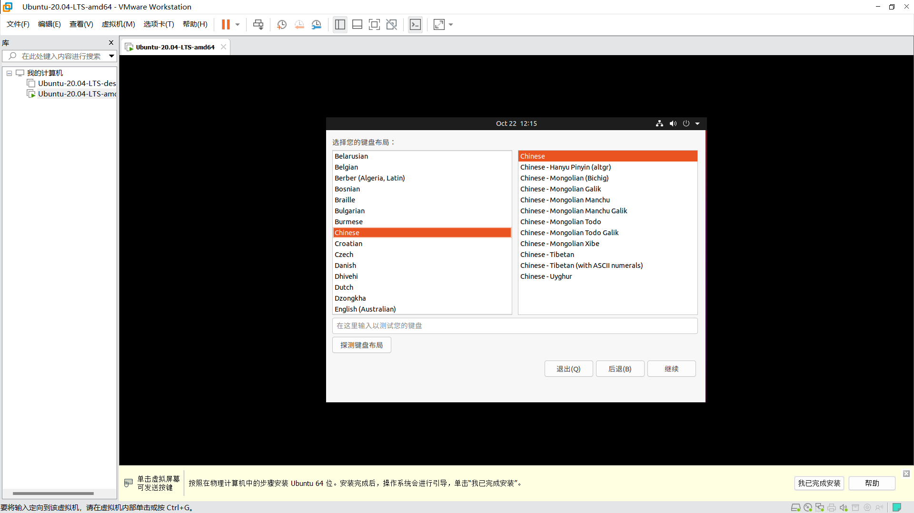

## <center> 实验一&emsp;Linux 系统安装与简单配置

### 一、实验目的

1. 学会在操作系统安装之前，根据硬件配置情况，指定安装计划。
2. 掌握 Linux 操作系统在虚拟机 VMware 上的安装步骤。
3. 掌握 Linux 系统的简单配置方法。
4. 掌握 Linux 系统的启动、关闭步骤。
5. 熟悉虚拟机 VMware 的基本操作。

### 二、实验内容

1. 安装 VMware，下载 Linux 镜像 ISO 文件。
2. 在 VMware 上安装 Linux 系统（如 Ubuntu 20.03 LTS）。
3. 配置 Linux 系统的运行环境。
4. 正确地启动、关闭系统。

### 三、主要实验步骤

#### 3.1. 安装 VMware 和 下载 Linux 镜像 ISO 文件

1. 从 VMware 官网链接或者其它第三方资源支持网站下载 VMware Workstation Pro，本实验所使用的版本是 VMware Workstation Pro 16.2.3。
2. 进入 Linux 发行版的官网，我使用的是 Ubuntu。现在的 LTS 最新版本是 [24.04 desktop 版本](<https://ubuntu.com/download/desktop>)，桌面系统比较新，但是 Ubuntu 24.04 版本做服务器或长时间的并不是特别稳定，且部分设备的驱动并不成熟，我选用的是 [20.04 desktop 版本](<https://releases.ubuntu.com/focal/>)。
    
    可以选择桌面版 desktop 或者服务器版 server，我选择的是桌面版 desktop，点击下载并记住下载路径。

#### 3.2. 在 VMware 上创建新虚拟机

1. 打开 VMware，打开 “文件” -> “新建虚拟机”，或者用 快捷键 Ctrl+N，或者在 “库” 界面 右键 -> “新建虚拟机”.
    
2. 之后按照以下步骤建立一个空虚拟机。
    
    
3. 选择所下载的 Linux 版本，我选择的是 Ubuntu 64 位。之后可以修改虚拟机的名称，推荐修改虚拟机位置，方便管理其文件。
    
    
4. 虚拟机磁盘大小按照需求设置，虚拟机的磁盘占用并非直接分配，而是根据当前虚拟机存储大小按需分配，这里设置的只是最大磁盘大小，建议修改为 40-100 GB。点击 “下一步” 和 “完成” 之后创建好虚拟机，也可以此时设置虚拟机硬件信息，见下一节。
    

#### 3.3. 配置合适的硬件并导入 Linux 镜像

1. 创建好空虚拟机后点击 “编辑虚拟机设置”，或者 右键虚拟机 -> “设置”，进入虚拟机设置界面。
    
2. 配置虚拟机的硬件信息，默认配置是内存 4GB，2 个处理器各 1 核，可以根据需求和修改为合适的配置。
    我由于需要学习机器学习、数字图像处理、深度学习，宿主机是 16GB + 1CPU,4core,8logic core + 512GB，修改为内存 6GB，2 个处理器 各 2 核，硬盘 50GB。
    若是虚拟机运行比较繁琐的作业，建议是内存不超过宿主机的一半，处理器设置成宿主机的一半或适当超过。
3. 点击 CD/DVD 选项卡，使用 ISO 映像文件并选择刚才下载的 Linux 镜像文件的路径。
    *使用物理驱动器则是直接选择宿主机原有的以及下载好的操作系统，进行连接，这样的方式可以与宿主机共享文件，但是需要宿主机安装有操作系统。
    
4. 对于网络适配器和其它设备信息，默认即可，网络默认是 NAT 即与主机共享 IP，可以访问互联网，但是外部网络访问不到虚拟机，需要通过主机 IP + 虚拟机占用的端口号访问。之后选择确定即可。
    *桥接模式是指虚拟机独占一个 IP, 但是在主机局域网变动时，由于虚拟机使用的是静态 IP，需要手动修改 IP，否则无法连接网络。
    *仅主机模式是指虚拟机在主机网卡内网下，可以通过主机与其它仅主机模式的虚拟机通信，但是无法访问互联网。

#### 3.4. 在空虚拟机内安装 Linux

1. 点击 “开启虚拟机”，进入虚拟机安装界面。
    .png)
2. 等待 Linux 系统启动安装向导，以下是 Ubuntu 的安装例子，其它 Linux 版本的安装可能会有不同。可以选择安装语言为简体中文或是 English，之后点击安装
    
    
3. 这个版本的 Ubuntu 在虚拟机下安装可能会有屏幕不全的 bug，如上，会发现屏幕下方找不到继续安装的按钮，可以通过快捷键 win+鼠标左键 拖动安装界面。如何点击继续。
    
4. 之后根据自己的需求选择是否安装拓展应用软件，我是选择正常安装否则没有中文输入法等应用，不过使用最小安装可以避免多余的应用占据内存，当然也可以正常安装后卸载。注意取消安装 Ubuntu 时下载更新的选项，避免版本更新。
    
5. 然后按照默认一直点击继续按键。（有经验的可以选择其它选项自定义磁盘分区，不过我第一次安装并未选择）
    
    
    
6. 设置初始用户账号，按照自己需求填写
    
7. 点击 “继续” 然后等待 Ubuntu 安装即可。
    
8. 安装完成后，点击 “现在重启” 即可。(这里我没有等待安装，因为 Ubuntu 桌面版安装太慢了，我之前安装过所以后面内容是基于之前安装好的 Ubuntu 描述和网上的资源，希望老师见谅)
    
9. 重启后，会进入 Ubuntu 的登录界面，输入刚才设置的账号密码即可登录。
    
10. VMware 下的 Ubuntu 可能会出现屏幕拉伸不全，是vmware-tools 的问题，先打开终端，设置超级用户 `root` 的密码，初始是未知密码，通过创建用户时的用户密码设置新密码，否则之后的 `sudo` 或 `su root` 等命令会出现密码错误的信息。
    
    之后通过以下命令更新包管理器并下载 vmware-tools 工具，激活后即可解决屏幕拉伸的问题。

    ```bash
    sudo apt-get update
    sudo apt-get install open-vm-tools-desktop
    sudo reboot
    ```

    
    其中 `open-vm-tools-desktop` 是桌面 desktop 版，`open-vm-tools` 是服务器 server 版，根据需求选择安装，或者可以用命令 `sudo apt-get install -y open-vm*` 直接安装所有工具，其中包含了 tools，之后重新启动即可。

#### 3.5 关闭虚拟机下的 Linux 系统

直接在当前虚拟机界面下用快捷键 alt+E，或是点击关闭客户机就能关闭当前系统虚拟机。


