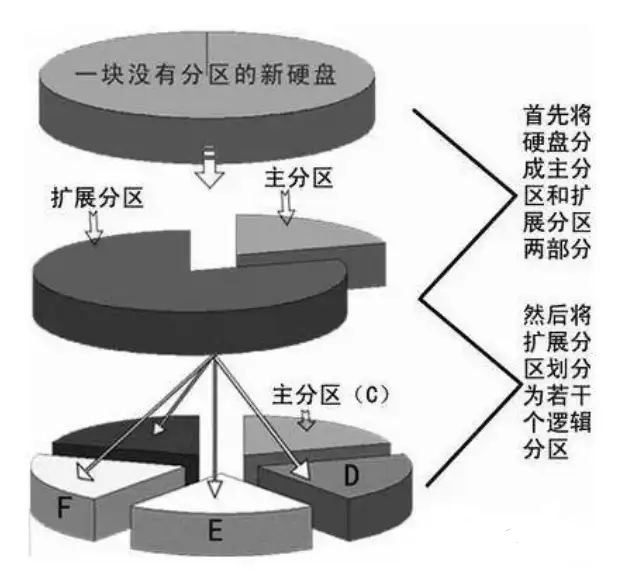

#### T1.2

**解**&emsp;从定义上，操作系统 (Operator System, OS) 是管理计算机硬件与软件资源的系统软件，提供用户接口和资源分配。重要的是 OS 是能够抽象化底层计算机硬件（CPU, 内存, 硬盘）并互相沟通结合起来的软件，将软件层面也分割成内核态和用户态，提供接口既保证了内核态的安全又使用户使用不失灵活性。

#### T1.3

**解**&emsp;操作系统的功能主要有：控制硬件、管理资源、提供用户接口、处理输入/输出、监控系统、通信

#### T1.5

**解**&emsp;Linux 是一种免费开源的类 Unix 操作系统，用户多社区活跃，所以有更广泛的硬件和设备支持，并且 Linux 是基于微内核的操作系统，具有模块化设计，易于移植和扩展，服务器版本安全且稳定。

#### T1.6

**解**&emsp;

核心版本是 Linux 操作系统的内核版本，版本的不同主要在于底层硬件支持和基本功能的不同，比如 5.10.0-8-amd64 是基于 5.10.0 内核版本，并且是 amd64 架构的 Linux 操作系统；

发行版本是社区或公司基于 Linux 内核进行定制和优化之后的版本，提供的功能不只是内核的基本功能，还有各种设备的驱动程序、一些系统软件和应用软件，比如 Ubuntu、Debian、Fedora、CentOS 等。

Linux 2.0 之后有小版本号偶数是稳定版本的规律，所以 2.2.1 是稳定的版本。

#### T1.10

**解**&emsp;

硬盘分区是指在同一块硬盘上进行划分成多个逻辑分区，每个分区可以独立进行格式化、挂载等操作，分区可以方便管理硬盘，并且分区可以防止数据丢失。

一块硬盘上有 3 种分区：主分区（Primary Partition）、拓展分区（Extended Partition）、逻辑分区（Logical Partition）。一块硬盘上最多有 4 个主分区/拓展分区（MBR 分区表），拓展分区不能实质存储数据，主要功能是在其中建立逻辑分区，只能建立 20 多个。

主分区和逻辑分区上都可以安装 Linux 系统，只要这个分区被设置为活动分区（Active Partition），因为系统启动需要从活动分区寻找操作系统应用。

#### T1.11

**解**&emsp;

多启动系统是所谓的多个“宿主机”，在这里就是指直接运行在物理硬件上的操作系统，多个系统安装在磁盘的不同分区上，共同或独立享用磁盘资源，但多个系统不能同时运行，只能在机器启动时选择指定的操作系统。

而虚拟机则是运行在宿主机之上，所以当运行一个虚拟机的时候，实际上是在同时运行多个系统（一个宿主一个/多个虚拟机），这对我们的物理硬件要求比较高（主要是内存）。

使用 VMware 下载 Linux 可以分成以下几个步骤：

1. 准备工作：下载 VMware 和 Linux 镜像 ISO 文件；
2. 创建虚拟机：启动 VMware，创建新的虚拟机；
3. Linux 虚拟硬件支持：为该虚拟机选择合适的硬件配置，将 Linux 镜像文件导入虚拟机内；
4. 安装 Linux：启动虚拟机，按照提示完成 Linux 的安装；
5. 配置 Linux：安装完成后，对虚拟机进行必要的配置，如网络、用户、软件等；

#### T1.12

**解**&emsp;X Windows 的体系结构分为：客户-服务器模型（用于分隔用户和硬件）、X 协议（远程连接协议）

