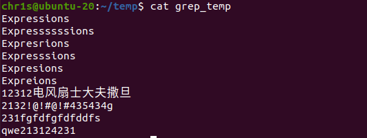

#### T2.1

**解**&emsp;Linux 内的命令基本构成是 `cmd opt arg`，一般是以

```shell
<cmd> [<opt1>] [<arg1> [<arg2>...]] [<opt2>...]
```

的形式出现，其中 `cmd` 为命令名，`opt` 是命令选项，`arg` 是命令参数. 例如 `mysql -u root` 中 `mysql` 是命令名，`-u` 是选项，`root` 是参数.

1. 选项有不同的风格
   1. UNIX 风格的是选项前带一个连字符，如 `ls -v` 表示 `ls` 命令的 version 版本；多个选项可以连在一起使用，例如 `ls -a -l` 等价于 `ls -al`.
   2. GNU 风格的是选项前带两个连字符，如 `ls --version`，效果同上；部分长选项会以单个连字符连接单词，例如 `ls --group-directories-first`.

   还有 BSD 的不带连字符、JAVA 等.
2. 参数通常是在选项后用空格分隔，但在不同操作系统下有不同的简写形式
   1. UNIX 风格下可以直接跟在选项后，如 `mysql -u root` 等价于 `mysql -uroot`.
   2. GNU 风格下参数可以用等号 `=` 连接，如 `ls --format long` 等价于 `ls --format=long`. 但对于有默认参数的选项则必须要用等号连接，例如 `ls --color never` 则会把 `never` 识别为目录名，因为 `color` 选项有默认参数 `auto`，这等价于 `ls --color=auto never`.
3. 同一个目录在一个系统下可能兼容多个风格，例如命令 `ls --format long` 等价于 `ls --format=long` 等价于 `ls -l`.

#### T2.2

**解**&emsp;

1. `date` - print or set the system date and time. 打印或设置系统日期和时间.
2. `cd` - change the shell working directory. 改变 shell 工作目录.
3. `cp` - copy files and directories. 复制文件和目录.
4. `pwd` - print name of current/working directory. 打印当前/工作目录的名称.
5. `rm` - remove files or directories. 删除文件或目录.
6. `mkdir` - make directories. 创建目录.
7. `echo` - display a line of text. 显示一行文本.
8. `who` - show who is logged on. 显示谁登录了.
9. `ls` - list directory contents. 列出目录内容.
10. `cat` - concatenate files and print on the standard output. 连接文件并打印到标准输出.
11. `more` - file perusal filter for crt viewing. 用于分页显示文件内容.
12. `man` - an interface to the on-line reference manuals. 在线参考手册的接口.

#### T2.3

**解**&emsp;通过 `date -d "2049-1-1"` 可以输出当天信息，或者可以加上格式化参数 `date -d "2049-1-1" +%A` 指定输出星期，也可以用 `cal 1 2049` 打印 2049 年 1 月的日历. 得知是周五.


#### T2.4

**解**&emsp;一切皆文件 (Everything is a file). 文件就是对一切 IO 的抽象，目录、文本、设备、软件、套接字等都是文件，按照《UNIX编程艺术》的说法，有 “UNIX文件本质上就是一大袋字节。” 所有会通过 IO 操作的信息都是文件，或者说，文件是 Linux 操纵系统处理信息的基本单位。

在 Linux 系统下，文件分为：普通文件、目录文件（在 win 下称为文件夹）、设备文件（鼠标、键盘等）、符号链接文件这四类。

#### 附加题1

**解**&emsp;创建一个新文件并输入以下内容：



1. 搜索前面 4 个数字的行并显示行号

    ```shell
    grep -n "^[0-9]\{4\}" grep_temp
    ```

    

2. 搜索 Expre..ions，省略号表示 0 个或多个 's' 字符

    ```shell
    grep -n "Expre[s]*ions" grep_temp
    ```

    

3. 搜索 Expre..ions，省略号表示 1 个或多个 's' 字符

    ```shell
    grep -n "Expre[s]\+ions" grep_temp
    ```

    

4. 搜索 Expre..ions，省略号表示任意个字符

    ```shell
    grep -n "Expre.*ions" grep_temp
    ```

    

5. 搜索 Expre..ions，省略号表示 1-3 个 's' 字符

    ```shell
    grep -n "Expre[s]\{1,3\}ions" grep_temp
    ```

    

6. 搜索前面 4 个字母开头的行并显示行号

    ```shell
    grep -n "^[a-zA-Z]\{4\}" grep_temp
    ```

    
