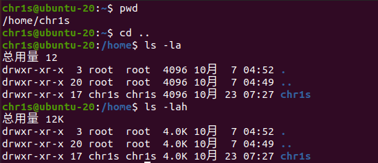
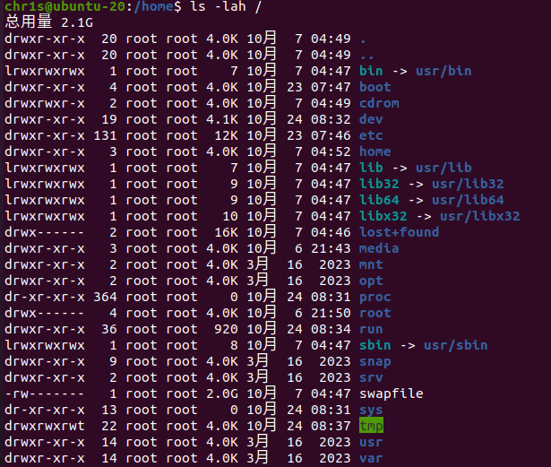
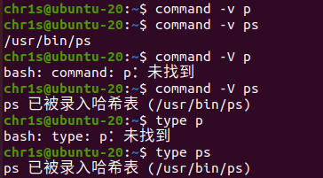
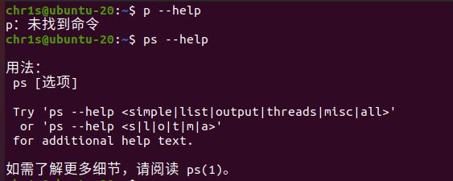
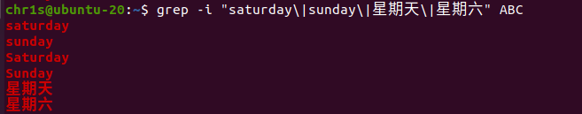

#### T2.5

**解**&emsp;完整指令如下：

```shell
pwd    # 查看当前目录
cd ..  # 返回父级目录
ls -la # 长格式列出所有内容 若用 ls -lah 则会将内存用 K,M 等单位表示
```



#### T2.6

**解**&emsp;通过 `ls -lah /` 可以列出根目录下所有内容



目录文件：

1. `.` 和 `..` 分别是当前目录和父级目录，在根目录下均指向根目录本身；

系统引导：

1. `boot` 包含启动系统所需的文件，如内核文件和引导加载程序（例如GRUB, EFI）配置文件，计算机启动时会从这里加载系统；
2. `lost+found` 是文件系统故障后恢复的文件，用于存放文件系统检查过程中找到的损坏文件，通常在每个文件系统上都会有此目录；

CPU 进程与系统信息：

1. `proc` 是一个虚拟文件系统，提供关于系统和进程的信息，基本是只可读的，访问该目录的文件相当于读取系统信息和内核参数，如 `/proc/cpuinfo`, `/proc/meminfo`；
2. `sys` 也是一个虚拟文件系统，包含了系统中可写的信息和硬件设备的驱动信息；

可执行文件库：

1. `bin` 是符号链接，指向 `usr/bin`，包含系统的基本命令（可执行文件），如 `ls`, `cp`, `mv`, `mkdir` 等；
2. `sbin` 是符号链接，指向 `usr/sbin`，包含系统管理命令，这些命令通常只有超级用户（root）可以运行；
3. `lib` 是符号链接，指向 `usr/lib`，包含共享函数和代码库，供系统和应用程序使用；
4. `lib32`, `lib64`, `libx32` 是符号指令，分别指向 `usr/lib32` 等目录，包含 32 位和 64 位库文件，实际内容也链接到 `usr/lib` 内的内容；

设备文件：

1. `dev` 包含设备文件，用于与硬件设备和外部设备进行交互。在 Linux 中，一切皆文件，所以设备也以文件形式存在于该目录下，比如硬盘 `sda` 和终端 `tty`；
2. `cdrom` 是光盘文件的挂载点. 通常用于挂载光盘驱动器。虽然现代系统多用 USB，但仍保留此目录；
3. `media` 用于挂载可移动设备，如 USB 闪存驱动器、光盘等，例如 `/media/chr1s/'Ubuntu 20.04.6 LTS amd64'`；

数据文件：

1. `etc` 包含系统的配置文件，如网络配置、用户账户信息、服务启动脚本等，如 `apt`, `xml` 等的配置情况；
2. `var` 存放经常变化的数据文件，例如日志文件 `log`、邮件、数据库等；
3. `srv` 用于存储系统提供的服务数据，如网站数据、FTP 数据等。

缓存文件：

1. `swapfile` 交换空间的临时文件，物理内存不足时系统会将数据写入此文件；
2. `tmp` 用于存储临时文件，系统和用户的临时数据通常存放在这里；
3. `mnt` 用于临时挂载其他文件系统，如网络共享文件夹等；
4. `run` 包含运行时临时文件和进程信息，如套接字

用户和第三方软件：

1. `home` 是用户的主目录，每个用户都有一个以用户名命名的子目录，用于存储个人文件和配置；
2. `root` 是超级用户的家目录；
3. `usr` 包含用户应用程序和文件，如用户安装的软件、文档等；
4. `opt` 用于安装第三方软件包的目录，通常，软件的安装目录可以选择在此处，再把运行命令链接到 `/usr/local/bin` ；

#### T2.7

**解**&emsp;

1. `drwxr-xr-x`: 目录文件；
2. `/bin`: 链接文件，指向 `/usr/bin`；
3. `/etc/passwd`: 普通文件；
4. `brw-rw-rw-`: 块设备文件；
5. `/dev/fd0`: 找不到该文件，若是 `/dev/fd/0` 则是链接文件，指向 `/dev/pts/0`；若是 `/dev/fb0` 则是字符设备文件；
6. `/usr/lib`: 目录文件；
7. `-rwx--x--x`: 普通文件；

#### T2.8

**解**&emsp;

1. 修改文件权限：`chmod <mode> filename`, 例如 `chmod 777 ···ABC` 使得该文件权限变为 `-rwxrwxrwx`；
2. 修改文件的硬链接数，无法直接修改值，只能将该文件通过 `ln` 命令创建硬链接，或通过 `rm` 删除，例如 `ln ···ABC /temp/ABC` 将增加一个硬链接数，`rm /temp/ABC` 将减少一个硬链接数；
3. 修改文件名：`mv filename newname`，例如 `mv ···ABC ABC` 将文件名改为 `ABC`；

#### T2.9

**解**&emsp;

1. `cd`: 等价于 `cd ~` 回到当前用户的家目录，如用户 `chr1s` 会回到 `/home/chr1s`；
2. `cd ..`: 回到当前目录的父级目录；
3. `cd ../..`: 回到当前目录的父级目录的父级目录；
4. `cd /`: 回到根目录；

#### T2.10

**解**&emsp;

1. `cp` 是 Linux 内的复制文件的命令，能保留源文件；
2. `copy` 是 Windows 系统下的复制命令，相当于 `cp`；
3. `mv` 是 Linux 内的移动文件的命令，类似于 “剪切”，源文件会删除，也可以用作修改文件名（删除源文件创建同内容同属性的新文件）.

#### T2.11

**解**&emsp;利用 `cat` 和重定向符 `>` 能将多个文件合并在一个文件内，例如 `cat file1 file2 > merged_file`；

#### T2.12

**解**&emsp;有很多命令可以查看系统内有无该命令：

1. `which ps`. (对于外部命令) 若有则输出命令路径，若无则无输出; （此方法不适用于内建指令如 `cd`）
   
2. `command -v ps` / `command -V ps` / `type ps`.
   
3. `man ps` / `info ps`. 若有则输出帮助信息，若无则找不到命令.
4. `--help` 选项. 也能输出帮助信息.
   

`ps` 能查看当前系统内进程的信息.


#### T2.13

**解**&emsp;使用 `grep` 命令能查找.

```shell
grep -i "saturday\|sunday\|星期六\|星期日\|星期天" ABC
```



#### T2.15

**解**&emsp;可以用 `rm -rf ABC` 命令删除 ABC 目录文件，其中 `-r` 为迭代删除，以删除目录内的文件；`-f` 为强制删除，不提示确认，若要提示则用 `-i` 选项.

#### T2.16

**解**&emsp;用命令 `find <directory_path> -type d` 可以查找某个目录路径下的所有子目录（`d` 类型），该输出通过管道命令符 `|` 传给命令 `wc -l` 统计行数，即统计子目录的个数.

```shell
find . -type d | wc -l # 查看当前路径下子目录的个数
```


#### T2.17

**解**&emsp;

1. `dir` - 显示文件和目录 - `ls`
2. `del` - 删除文件 - `rm`
3. `type` - 显示文件内容 - `cat`

#### T2.18

**解**&emsp;

1. `find` - 用于在文件系统中搜索文件和目录，例如 `find . -name "*.txt"` 搜索当前目录及其子目录下所有 `.txt` 文件；
2. `tee` - 读取标准输入并写入到标准输出和文件中，例如 `ls | tee file.txt` 将 `ls` 命令的输出同时写入到 `file.txt` 文件中；
3. `gzip` - 用于压缩文件，例如 `gzip file.txt` 将 `file.txt` 压缩为 `file.txt.gz`；
