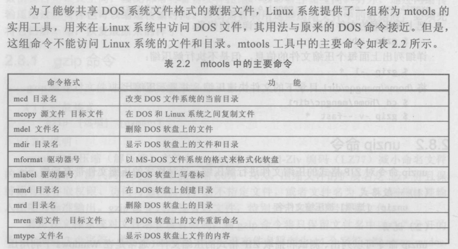
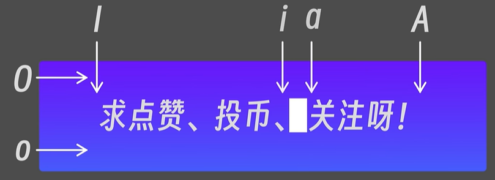
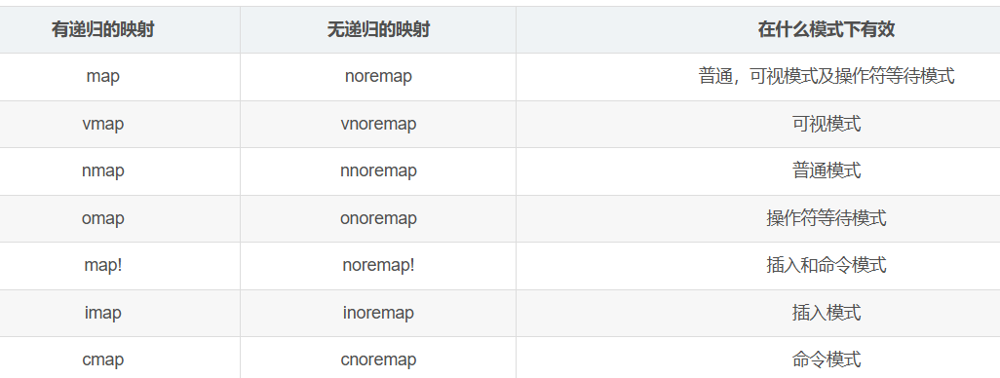
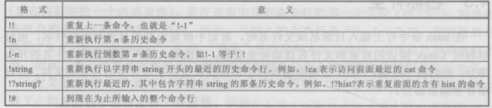
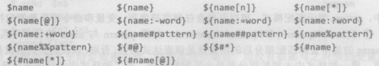
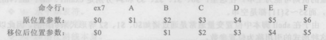

[toc]

### 0 序言

期末考试闭卷（50%）

平时（50%）分为四次课内实验（20%）、课后作业（20%）、课堂表现（10%）

### 1 常用命令

#### 1.1 系统和简单命令

1. 命令格式：大小写、命令、选项、参数
2. 输入命令：提示符、多行、空格
3. 命令返回：成功、错误信息
4. 命令技巧：例如 `^D` (Ctrl + D) 能退出终端，或是代表 EOF，用 `exit` 命令也能退出终端，用 `^C` 能终止当前进程.
5. 简单命令：`who`, `echo`, `date`, `cal`, `clear`, `passwd`.
6. 帮助命令 P62.：`man`, `help`, `info`.

##### 1.1.1 输入命令格式

- 格式为 `command_name [opt1] [arg1[ arg2 ...]] [opt2 ...]`
- shell 严格区分大小写，所有命令都是以**小写字母**出现
- 多个连续空格会视为一个空格

!! Note 选项中有 -\<option> 和 --\<option>，区别是什么？例如 -v 和 --version 是否是相同的？
    - Unix 风格选项（UNIX options）
      - 前面加单连字符 `-`. 例如 `ls -l`, `rm -rf` (等价于 `rm -r -f`).
      - 参数可以直接接在选项后，例如 `clear -T<arg>` (等价于 `clear -T <arg>`).
    - GNU 风格选项（GNU long options）
      - 前面加双连字符 `--`. 例如 `ls --help` (等价于 `ls -h`), `ls --all` (等价于 `ls -a`).
      - 参数有时候可以用等号连接，例如 `ls --format=long` (等价于 `ls --format long`)
      - 但是要注意**选项带默认参数的不能使用**，例如 `ls --color[=WHEN] (default WHEN=auto)`，此时 `ls --color never` 会被识别成 `ls --color=auto never`，其中 `never` 识别为目录.
    - BSD 风格选项（BSD options）
      - 不加连字符. 例如 `ps aux`, `tar cjvf what.tar.bz2` (等价于 `tar -cjvf what.tar.bz2`).
    - 同一 Linux 系统内的命令风格**可能有多种**. 例如 `ls` 命令有等价的 Unix 风格和 GNU 风格选项，例如 `ls -l` 和 `ls --format=long` 和 `ls --format long` 是等价的.

##### 1.1.2 命令示例

!! Example 简单命令
    1. `date` - print or set the system date and time. 打印或设置系统日期和时间.
    2. `cd` - change the shell working directory. 改变 shell 工作目录.
    3. `cp` - copy files and directories. 复制文件和目录.
    4. `pwd` - print name of current/working directory. 打印当前/工作目录的名称.
    5. `rm` - remove files or directories. 删除文件或目录.
    6. `mkdir` - make directories. 创建目录.
    7. `echo` - display a line of text. 显示一行文本.
    8. `who` - show who is logged on. 显示谁登录了.
    9. `ls` - list directory contents. 列出目录内容.
    10. `cat` - concatenate files and print on the standard output. 连接文件并打印到标准输出.
    11. `more` - file perusal filter for crt viewing. 用于分页显示文件内容.
    12. `man` - an interface to the on-line reference manuals. 在线参考手册的接口.

#### 1.2 文件操作命令

1. 文件系统：文件、目录、路径、文件命名、`.` 开头的文件是隐含文件

    !! Note Ubuntu 系统下根目录下默认的目录都是什么意思？
        
        - 目录文件：
          1. `.` 和 `..` 分别是当前目录和父级目录，在根目录下均指向根目录本身，是硬链接文件；
        - 系统引导：
          1. `boot` 包含启动系统所需的文件，如内核文件和引导加载程序（例如GRUB, EFI）配置文件，计算机启动时会从这里加载系统；
          2. `lost+found` 是文件系统故障后恢复的文件，用于存放文件系统检查过程中找到的损坏文件，通常在每个文件系统上都会有此目录；
        - CPU 进程与系统信息：
          1. `proc` 是一个虚拟文件系统，提供关于系统和进程的信息，基本是只可读的，访问该目录的文件相当于读取系统信息和内核参数，如 `/proc/cpuinfo`, `/proc/meminfo`；
          2. `sys` 也是一个虚拟文件系统，包含了系统中可写的信息和硬件设备的驱动信息；
        - 可执行文件库：
          1. `bin` 是符号链接，指向 `usr/bin`，包含系统的基本命令（可执行文件），如 `ls`, `cp`, `mv`, `mkdir` 等；
          2. `sbin` 是符号链接，指向 `usr/sbin`，包含系统管理命令，这些命令通常只有超级用户（root）可以运行；
          3. `lib` 是符号链接，指向 `usr/lib`，包含共享函数和代码库，供系统和应用程序使用；
          4. `lib32`, `lib64`, `libx32` 是符号指令，分别指向 `usr/lib32` 等目录，包含 32 位和 64 位库文件，实际内容也链接到 `usr/lib` 内的内容；
        - 设备文件：
          1. `dev` 包含设备文件，用于与硬件设备和外部设备进行交互。在 Linux 中，一切皆文件，所以设备也以文件形式存在于该目录下，比如硬盘 `sda` 和终端 `tty`；
          2. `cdrom` 是光盘文件的挂载点. 通常用于挂载光盘驱动器。虽然现代系统多用 USB，但仍保留此目录；
          3. `media` 用于挂载可移动设备，如 USB 闪存驱动器、光盘等，例如 `/media/chr1s/'Ubuntu 20.04.6 LTS amd64'`；
        - 数据文件：
          1. `etc` 包含系统的配置文件，如网络配置、用户账户信息、服务启动脚本等，如 `apt`, `xml` 等的配置情况；
          2. `var` 存放经常变化的数据文件，例如日志文件 `log`、 邮件、数据库等；
          3. `srv` 用于存储系统提供的服务数据，如网站数据、FTP数据等。
        - 缓存文件：
          1. `swapfile` 交换空间的临时文件，物理内存不足时系统会将数据写入此文件；
          2. `tmp` 用于存储临时文件，系统和用户的临时数据通常存放在这里；
          3. `mnt` 用于临时挂载其他文件系统，如网络共享文件夹等；
          4. `run` 包含运行时临时文件和进程信息，如套接字
        - 用户和第三方软件：
          1. `home` 是用户的主目录，每个用户都有一个以用户名命名的子目录，用于存储个人文件和配置；
          2. `root` 是超级用户的家目录；
          3. `usr` 包含用户应用程序和文件，如用户安装的软件、文档等，缩写是 unix software resource；
          4. `opt` 用于安装第三方软件包的目录，通常，软件的安装目录可以选择在此处，再把运行命令链接到 `/usr/local/bin` ；

2. 文件类型：普通文件、目录文件、设备文件、链接文件

    !! Question P36-37. 普通文件是指平时接触的所有文件？可设备文件能是指所有 IO 外围设备文件？

3. 文件显示命令：`cat`, `more`, `less`, `head`, `tail`, `touch`.

    !! Question 重定向符 > 是都可以用的吗？有其它类似的符号吗？管道命令？cat file1.txt file2.txt > merged.txt

4. 匹配、排序及显示 *指定内容* ：`grep`, `sort`, `uniq`
5. 查找和比较文件：`comm`, `diff`, `cmp`, `find`.
6. 复制、删除和移动文件：`cp`, `rm`, `mv`
7. 文件内容统计：`wc`

!! Question 如何创建文件？文件拓展名呢？
    可以 `vi` 文件名，然后保存退出.

#### 1.3 目录操作命令

1. 目录结构：树形、路径、访问目录（上级目录、用户主目录、根目录、当前目录）

    !! Question /home 和 /usr 区别是？
    !! Question 刚下载系统后的根目录下的内容都有什么作用？

2. 创建和删除目录：`mkdir`, `rmdir`
3. 改变工作目录和显示目录内容：`cd` (`cd -`), `pwd`, `ls`
4. 链接文件：硬链接、符号链接、`ln`

    !! Question 和挂载有关系吗？\home 算不算链接在不同分区的目录文件？
    !! Question 链接文件的作用是什么？

5. 改变文件或目录存取权限：文件主与超级用户、`chown`, 用户组（文件主、同组用户、其他用户、超级用户）、存取权限P58、`chmod`, `umask`

    !! Question 文件主、用户组、超级用户、系统管理员、普通用户的关系？
    !! Question 文件的掩码是什么？

6. 改变用户组和文件主：`chgrp`, `chown`

#### 1.4 进程管理命令

1. `ps` 查看当前进程信息
2. `nice` 修改进程优先级
3. `kill` 终止进程
4. `sleep` 暂停进程一段时间

#### 1.5 文件压缩和解压命令

1. `gzip`/`bzip2`: 压缩文件
2. `unzip` 解压缩

!! Question gzip 压缩后成 GZ 文件，unzip 是解压 ZIP 文件？

#### 1.6 DOS 命令



### 2 文本编辑 vi

Linux 有多种文本编辑器，如行编辑器（ed、ex、edit）和屏幕编辑器（vi、emacs、nano），其中 vi 是最常用的 UNIX/Linux 编译器，是 visual interface 的简称，汇集了行编辑和全屏幕编辑的特点.

vim 是在 vi 的基础上拓展了多种功能的增强版（vi improved），在 vim 发展过程中 fork 出的还有多种 vi 版本，如 neovim、gvim 等.

通过在命令行输入 `vi` 就可以打开 vi 编辑器.

!! Tip `vi` 命令
    ```bash
    Usage: vim [Options] [file ...]

    Options:
      --      在这以后只有文件名
      -v      Vi 模式 (同 "vi")
      -e      Ex 模式 (同 "ex")
    ```

#### 2.1 vi/vim 工作方式

vi 有六种工作模式：

1. **正常模式 (Normal Mode)**
2. **命令模式 / 尾行模式 (Command Mode)**
3. **插入模式 (Insert Mode)**
4. **操作符等待模式 (Operation-pending Mode)**
5. **可视模式 (Visual Mode)**
6. **ex 转义模式 (Ex mode)**.

##### 2.1.1 模式切换

打开 vi 编辑器时就处于 vi 正常命令模式.

输入以下这些命令都会使得 vi **进入插入模式**，此时可以输入文本内容，按 `Esc` 键可以退出插入模式，回到正常命令模式.：

- `a`/`A`: append，表示附加命令. 会在当前当前光标或当前行后开始插入.
- `i`/`I`: insert，表示插入命令. 会在当前光标或当前行前开始插入
- `o`/`O`: open，表示打开命令. 会在当前行下面或上面新建一行空行.
- `R`: replace，表示替换命令. 会在当前光标位置开始替换，相当于 `INS` 按键



输入以下这些命令都会使得 vi **进入尾行模式**，

- `:`: 表示**进入尾行命令模式**. 会在文件最下方出现 `:` 和光标，此时输入内容都是对文件整体的操作.
- `/`: 表示**进入搜索模式**. 会在文件中从光标之后的位置搜索输入的内容，并高亮显示
- `?`: 表示**进入反向搜索模式**. 会在文件中光标之前的位置反向搜索输入的内容，并高亮显示

在输入类似于 `g` 的命令时，vi 会进入**操作符等待模式**，由于 `g` 本身不代表任何命令，所以需要输入 `g` 后再输入其他命令，如 `gg` 表示跳转到文件开头，vi 在这个阶段也可以使用 `omap` 单独设置键盘映射.

输入 `v` 可以进入**可视模式**，此时可以选中文件中的内容，然后进行复制、删除等操作.

##### 2.1.2 vi 正常模式

vim 内的操作都是以 `<operation>[<motion>]` 的形式使用的：

`motion` 有：

- 光标移动
  - `h`/`←`/`<BS>`: 向左
  - `l`/`→`/`<Enter>`: 向右
  - `j`/`↓`/`<C-N>`/`+`: 向下
  - `k`/`↑`/`<C-P>`/`-`: 向上
- 查找翻阅
  - `0`/`^`/`$`: 分别表示移动到当前行的整行开头、第一个非空字符、整行结尾.
  - `w|W`/`e|E`/`b|B`: 分别表示移动到下一个**单词**开头、单词结尾、上一个单词开头. 大写对应**连续非空字符串**
  - `(`/`)`: 分别表示移动到上一个段落开头、下一个段落开头.
  - `f|F<char>`: 查找**当前行**下一个或上一个 `<char>`.
- 页面翻动
  - `<C-f>`: front, 向前/下翻一页.
  - `<C-b>`: back, 向后/上翻一页.
  - `<C-u>`: up, 向上翻半页.
  - `<C-d>`: down, 向下翻半页.
  - `<C-←>`/`<C-→>`/`<C-↑>`/`<C-↓>`: 分别等同于 `B`/`W`/`<C-b>`/`<C-f>`.
- 修改
  - `r<char>`: replace, 替换当前光标位置字符为 `<char>`.
  - `x`: delete, 删除当前光标位置字符.
- 粘贴
  - `p`: put, 粘贴到光标之后.
- 撤销与重做
  - `u`: undo, 撤销上一次操作.
  - `ctrl + r`: redo, 重做上一次撤销的操作.
  - `.`: repeat, 重复上一次操作（插入或删除）.

`operation` 有（通常来说 `operation` 对应大写就是单个 `motion`）：

- 重复及特殊 `motion`
  - `<num>`: 通过输入一个数字，再接上 `motion` 可以多次重复该操作.
  - `i`: 当输入 `operation` 后，通过 `i` 可以指定操作范围，例如
    - `diw`: 剪切光标所在单词
    - `yi"`: 复制光标所在引号内部所有内容
  - `f<char>`: 当输入 `operation` 后，通过 `f` 可以指定操作范围为光标到当前行找到的第一个 `<char>`
- 页面翻动
  - `gg`: go, 移动到文件开头.
  - `G`: go, 移动到文件末尾.
- 复制粘贴：
  - `y`: 复制，例如
    - `yy`: 复制当前行
    - `Y`: 复制当前行
    - `y4→`: 复制当前行右侧共 4 个字符
  - `d`: 删除 (剪切) 当前行，把删除内容保存在剪贴板，例如
    - `dd`: 剪切当前行
    - `D`: 剪切当前行光标及之后的内容
    - `d4↓`: 剪切当前行及下 3 行.
  - `c`: 剪切操作后进入插入模式，同 `d` + `i`

##### 2.1.3 vi 命令模式

- `:`: 尾行命令.
- `/`/`?`: 搜索命令.
  - `/` 表示从光标之后开始搜索，`?` 表示从光标之前开始反向搜索.
  - `n` 表示向搜索方向查找，`N` 表示反向查找. 例如 `/` 查找下 `n` 是向下查找，而 `?` 查找下 `N` 才是向下查找.
  - 默认是大小写敏感的，通过在结尾输入 `\c` 可以忽略大小写.

##### 2.1.4 vi 插入模式

#### 2.2 vim 配置

在用户家目录底下通过配置 `.vimrc` 文件可以设置 vim 的键盘映射、开局设置等.

- 键盘映射
  

  !! Question `map` 与 `:map`
      前者设置后对其他文件也会影响，后者设置支队当前文件受影响.

### 3 Linux Shell 程序设计

1. 开头注释 `#!` 指定解释器路径，使用 `.` 执行 `.sh` 脚本需要有执行权限，使用 `bash`/`sh` 等则无需权限直接执行
2. 历史命令 `history`，使用 `!` 可以调用历史命令. ，命令历史在用户目录下的 `.bash_history` 文件中，环境变量（`HISTFILE`, `HISTSIZE`） 
3. 别名：`alias` 定义别名，赋值变量或别名等等号左右不能有空格. `alias ..='cd ..'`；取消别名 `unalias ..`

   !! Question 命令 `ll` 就是 `ls -alF` 的别名吗？

4. 特殊字符：
   1. 通配符（`*`, `?`, `[chars]`, `[!chars]`），模式表达式（`<operation>(pattern)`，操作符 `<operation>` 除了通配符之外还有 `+`, `@` (表示必须有)，模式表 `pattern` 中用 `|` 分隔）
   2. 引号
      - 双引号 `"`：除了 `$`, `` ` ``, `\` 之外都正常显示，需要加转义字符 `\` 才能显示这些特殊字符
      - 单引号 `'`：除了 `'` 之外都正常显示.
      - 倒引号 `` ` ``： 表示命令替换，例如 ``echo "Today is `date`"``，`date` 会被执行并输出结果.

        !!! Example 嵌套使用

            ```bash
            user=`echo The number of users is \`who | wc-l\``
            ```

   3. 重定向符号（输入 `<` (`sum.exe < input.txt`)，即时输入 `<<` (`命令 << 标记符`)， 覆盖输出 `>` (`ls > output.txt`)，添加输出 `>>`）；管道符（`|`）；后台运行（`&` (`gcc m1.c&`)）；注释（`#`）
   4. 命令执行操作符（`&&`: 顺序执行直到全部成功或有一个出错，`||` 全部执行跳过出错）
   5. 成组命令（`{}`: 大括号内前后需要有空格，命令用 `;` **结尾**；`()`: 小括号内不需要空格，命令用 `;` **分隔**，内部命令是**通过创建子进程完成**，不影响当前文件/父进程）
5. 变量：变量可以直接赋值，也可以赋值变量为命令表：``<var>=`<cmd_list>` `` 或 `<var>=$(<cmd_list>)`（`` dir=`pwd; cd ..; pwd` `` 或 `dir=$(pwd; cd ..; pwd)`），赋值为数组 `declare -a <arr_var_name>`，或者直接赋值 `city[0]=Beijing`.
6. 变量引用：
   - `${#..}`: 返回个数
   - `@` / `*`: 执行时输入的参数或表示所有数组元素
   - `${name[#%]{1,2}pattern}` : 删除匹配字符串，`#` 表示开头匹配，`%` 表示结尾匹配，一个使用最小匹配，两个使用最大匹配
7. 位置参数：`${<num>}`, 用 `set` 可以设置 (从 `$1` 开始)，用 `shift` 移动参数
8. 特殊变量：
   - `$#`: 参数个数
   - `$@` / `$*`: 参数列表
   - `$?`: 上一个命令的返回值
   - `$!`: 上一个后台命令对应的进程号
   - `$$`: 当前进程号
   - `$-`: 当前 shell 设置的执行标志名组成的字符串

### 4 常用开发工具

### 5 Linux 内核

### 6 Linux 环境编程

### 7 Linux 系统管理

### 8 网络应用及管理
