学习链接：

- VSCode 官方文档[^docs]
  [^docs]: [VSCode 官方文档](https://code.visualstudio.com/docs)
  
目录：

[toc]

<!-- ---

### 1&emsp;安装 Setup

应用软件默认安装在 `C:\Users\<Username>\AppData\Local\Programs\Microsoft VS Code`.

可以通过 `code [options] [paths...]` 命令行启动 VSCode

VSCode 是建立在 Electron 和 Chromium 的网络栈功能之上的，因此 VSCode 用户可以获得 Google Chrome 中可用的许多网络支持.

VSCode 提供 [VSCode 在线网站](https://vscode.dev/)，可以直接通过在网站进行编辑.

---

### 2&emsp;入门 Start

#### 2.1&emsp;教程 Tutorial

##### 2.1.1&emsp;用户界面 User Interface

当第一次打开 VSCode 时，基本上会呈现以下的界面布局

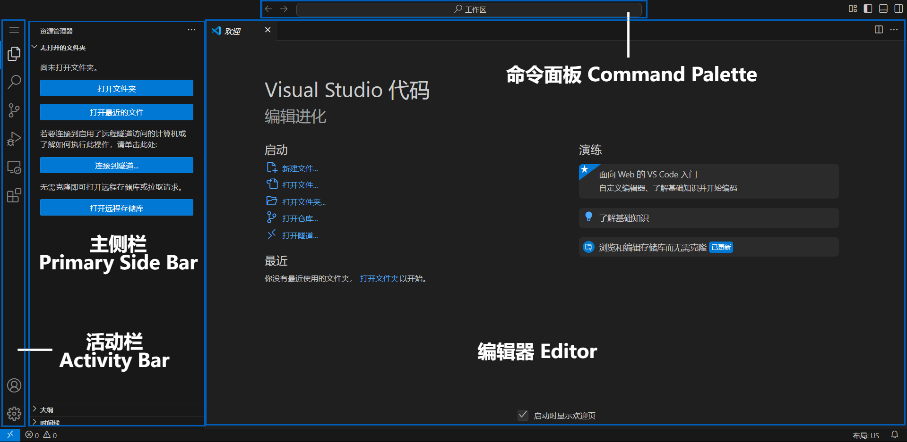

主要分成下面几部分：

- **活动栏 (Activity Bar)**：默认处于最左侧，用于在不同**视图 (View)** 之间切换，鼠标悬浮时能看到视图名称以及快捷键 (keyboard shortcut).
  默认会拥有以下几个视图：
  - **资源管理器 (Explorer)(`Ctrl+Shift+E`)**：用于查看和管理项目中的文件和文件夹
  - **搜索 (Search)(`Ctrl+Shift+F`)**：用于通过名称或内容搜索文件和文件夹
  - **源代码管理 (Source Control)(`Ctrl+Shift+G`)**：用于查看和管理版本控制
  - **运行和调试 (Run and Debug)(`Ctrl+Shift+D`)**：用于运行和调试代码
  - **拓展 (Extensions)(`Ctrl+Shift+X`)**：用于安装和管理 VSCode 拓展插件 (plugin)
- **主侧栏 (Primary Side Bar)(`Ctrl+B`)**：紧挨着活动栏，当选择了活动栏的一个视图时，主侧栏上就会显示其具体信息.
- **编辑器 (Editor)**：用户界面的主要界面，用于编写代码. 一个文件对于一个**编辑器选项卡 (Editor tab)**，例如新打开 VSCode 都会显示的 *欢迎 (Welcome)* 编辑器.
- **面板 (Panel)(`Ctrl+J`)**：默认是隐藏在下侧，与活动栏和主侧栏作用类似，也是用于显示视图的信息.
  默认会拥有以下几个视图：
  - **问题 (Problems)(`Ctrl+Shift+M`)**：用于显示问题信息，会以不同级别显示，如提示 (hint)、信息 (info)、警告 (warning)、错误 (error).
  - **输出 (Output)(`Ctrl+Shift+U`)**：用于显示输出信息，例如运行和调试的输出信息.
  - **调试控制台 (Debug Console)(`Ctrl+Shift+Y`)**：用于通过调试对话窗显示调试信息.
  - **终端 (Terminal)(`` Ctrl+` ``)**：用于运行命令行命令，可以通过快捷键 `` Ctrl+Shift` `` 快速新建和打开 VSCode 的集成终端 (integrated terminal)，支持创建以及切换不同类型的 shell.
  
  
- **命令面板 (Command Palette)(`Ctrl+Shift+P`)**：最上方的搜索栏，可以用于访问命令；
  命令面板支持不同的操作模式，将开头的 `>` 删除则进入搜索模式.

  

  !!! todo 命令面板的所有操作模式

##### 2.1.2&emsp;在 VSCode 内打开项目

VSCode 支持三种打开编辑的方式，在 *文件 (File)* 选项卡中可以找到：

1. 打开文件 (file) (`Ctrl+O`)：直接打开一个文件并放入编辑器视图，但资源管理器视图中不会显示其路径位置等信息
2. 打开文件夹 (folder) (`Ctrl+K Ctrl+O`)：会将文件夹作为暂时的工作区，在资源管理器视图中会显示该文件夹的具体内容.
3. 打开工作区 (workspace)：工作区是可以同时包含多个根目录作为项目的 VSCode 文件，以 `.code-workspace` 为后缀名，通过该特殊的结构，可以记录工作区独自的设置、插件等.

!!! warning 信任工作区 (Workspace Trust)
    当 VSCode 从外部打开资源时会弹出信任工作区窗口询问是否许该工作区在 VSCode 上运行，这在保护

##### 2.1.3&emsp;编写代码

在文件中编写时会有智能提示补全 (IntelliSense)，使用 `↑`/`↓` 可以上下选择建议，使用 `tab`/`enter` 接受建议

对于出错或可改进的代码，会有特殊的代码操作 (Code Action)，会以灯泡图标 (lightbulb) 显示，可以使用 `Ctrl+.` 打开灯泡菜单，选择建议的代码操作.

VSCode 内置了 HTML, CSS, JavaScript, TypeScript 等语言的支持，会有智能提示、语法突出、建议等功能.

!!! todo VSCode 的所有内置语言

##### 2.1.4&emsp;运行和调试代码

在 *运行 (Run)* 选项卡中可以找到运行和调试的选项，或者使用快捷键 `F5` 调试，`Ctrl+F5` 运行，可以在运行和调试视图中查看调试信息，还有监视变量、条件断点和启动配置

对于调试，有以下功能及其快捷键可以使用：

- 在光标所在行设置或取消断点 (Toggle Breakpoint)(`F9`)，另外，在行数的左侧可以点击设置或取消断点
- 在行内设置断点 (Inline Breakpoint)(`Shift+F9`)，另外，可以在调试时在行内点击加入断点
- 继续调试 (Continue)(`F5`)

##### 2.1.5&emsp;配置 VSCode 设置

VSCode 的设置默认在活动栏的最下方 *管理 (Manage)* 选项卡，其中 *设置 (Setting)* 选项使用 *设置编辑器 (Setting Editor)* 页面来管理设置，可以通过 `Ctrl+,` 快捷键打开.

VSCode 内的设置都是以 `settings.json` 文件保存的，有三种设置范围，从大到小为：

- 用户设置 (User Settings)：全局的设置，存储在 `C:\Users\<Username>\AppData\Roaming\Code\User\settings.json` 内.
- 工作区设置 (Workspace Settings)：当前工作区的设置，直接存储在工作区文件 `<Workspace>.code-workspace` 内.
- 文件夹设置 (Folder Settings)：当前打开文件夹的设置，存储在当前打开文件夹根目录的下的 `.vscode\settings.json` 文件内.
  
  !!! note 文件夹设置只有根目录下的 `.vscode` 文件夹有效
      值得注意的是，当想要对打开文件夹下的子目录单独设置是无法使用 `.vscode\settings.json` 实现的，VSCode 只会识别打开文件夹根目录下的 `.vscode\settings.json`，包括其他设置文件如 `launch.json` 等.
      要想对子目录也单独设置，需要使用 VSCode 工作区，将子目录添加到工作区文件 `<workspace>.code-workspace` 中的 `folder.path` 属性，可以在同一工作区内相对独立的设置多个文件夹.

当打开设置编辑器时，可以通过搜索筛选设置选项，或通过特殊符号如 `@modified` 查看修改过的设置选项.

!!! todo 其他筛选设置的方式和功能以及设置选项的搜索路径.

##### 2.1.6&emsp;使用源代码管理

VSCode 集成了**源代码控制管理 (Source Control Management, SCM)**，默认在活动栏的源代码控制视图.

在安装了 Git 之后就可以使用，VSCode 支持各种 git 操作的可视化，例如基本的 *暂存 (stage changes)* + *提交 (commit)* [+ *拉取 (pull)* + *推送 (push)*].

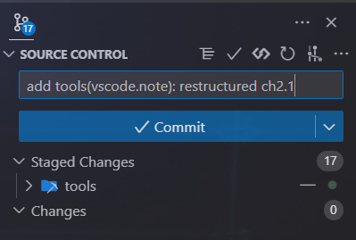

##### 2.1.7&emsp;安装拓展

在活动栏的拓展视图中可以浏览 Visual Studio Marketplace 并安装插件.

!!! tip 常用的插件
    - [Chinese (Simplified) (简体中文) Language Pack for Visual Studio Code](https://marketplace.visualstudio.com/items?itemName=MS-CEINTL.vscode-language-pack-zh-hans)：为 VSCode 提供中文界面
      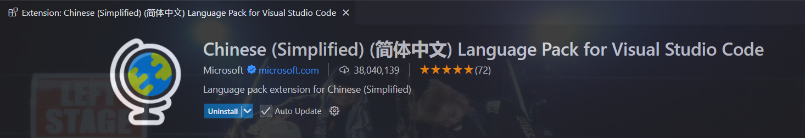
    - [Code Runner](https://marketplace.visualstudio.com/items?itemName=formulahendry.code-runner)：支持多种语言的运行，可以直接运行文件或选中的代码（在有语言解释器、编译器的前提下）
      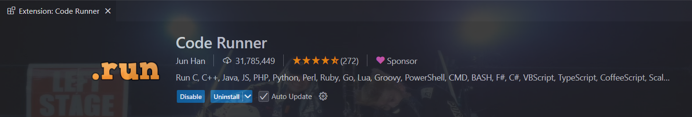
    - [Code Spell Checker](https://marketplace.visualstudio.com/items?itemName=streetsidesoftware.code-spell-checker)：检测英文拼写
      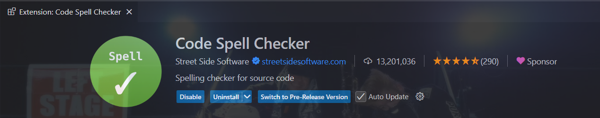
    - [Error Lens](https://marketplace.visualstudio.com/items?itemName=usernamehw.errorlens)：在编辑器中高亮显示错误和警告
      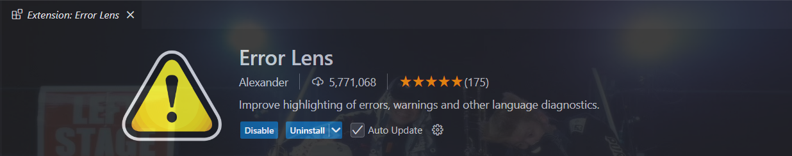
    - [Git Graph](https://marketplace.visualstudio.com/items?itemName=mhutchie.git-graph)：提供可视化 git 历史的视图
      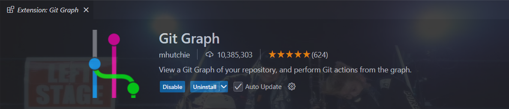
    - [HyperScopes Booster](https://marketplace.visualstudio.com/items?itemName=yfzhao.hscopes-booster)：可定制化选中括号对内的高亮
      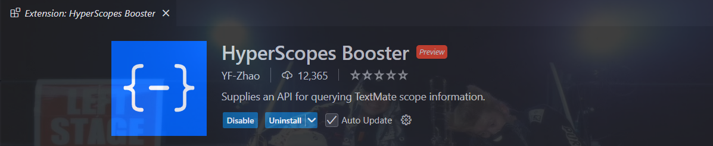
    - [Material Icon Theme](https://marketplace.visualstudio.com/items?itemName=PKief.material-icon-theme)：提供了多种文件夹图标主题，能更好分清项目结构
      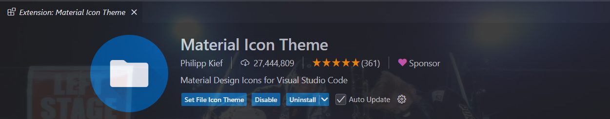
    - [vscode-pdf](https://marketplace.visualstudio.com/items?itemName=tomoki1207.pdf)：支持在 VSCode 内查看 pdf 文件
      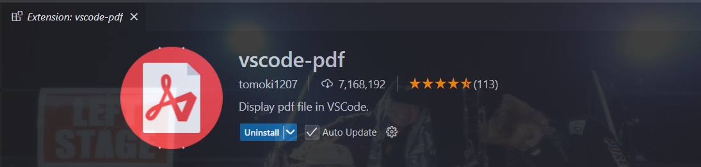
    - [Remote - SSH](https://marketplace.visualstudio.com/items?itemName=ms-vscode-remote.remote-ssh)：为 VSCode 的远程开发提供更好的 SSH 支持
      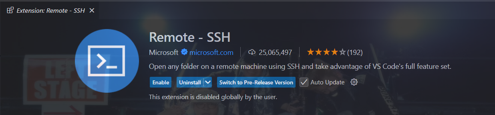
    - [CodeGeeX: AI Coding Assistant](https://marketplace.visualstudio.com/items?itemName=AMiner.codegeex)：AI 编程助手，Github Copilot 的免费平替版
      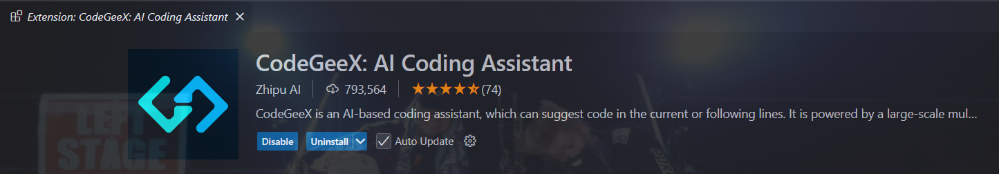
    >
    VSCode 对插件有几个命令行界面的命令，通过
    - `code --list-extensions` 可以列出所有已安装的插件，列出的信息被称为拓展的 ID (ext-id)
    - `code --install-extension <ext-id | path>` 可以安装插件. -->

#### 2.2&emsp;用户界面 User Interface

<!-- ---

### 3&emsp;用户指南

---

### 4&emsp;源控制 Source Control

---

### 5&emsp;终端 Terminal

---

### 6&emsp;语言 Languages

---

### 7&emsp;开发容器 Dev Containers

---

### 8&emsp;远程 Remote

---

### 9&emsp;数据科学 Data Science -->
